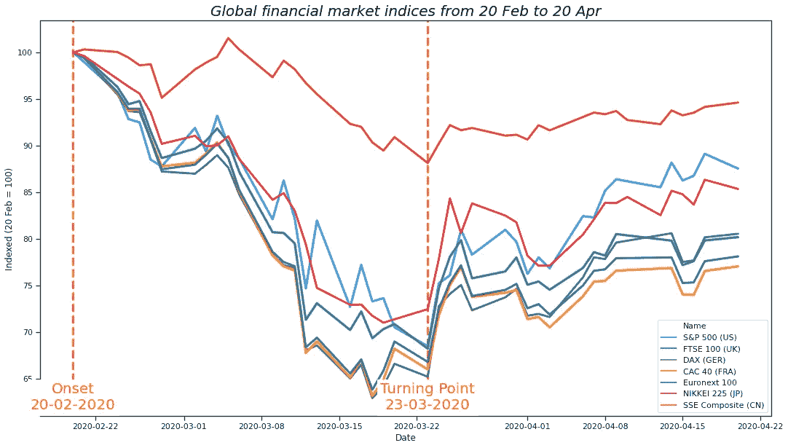
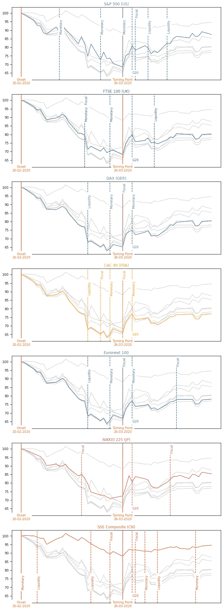

# 是什么拯救了新冠肺炎的全球金融市场？

> 原文：<https://medium.datadriveninvestor.com/how-covid-19-infected-financial-markets-turning-point-1128e94d3f7f?source=collection_archive---------8----------------------->

新冠肺炎金融恐慌爆发后，全球股票市场于 3 月 23 日达到转折点。发生了什么事？

另外，本文的内容仅是一种观点，仅供参考。它无意成为投资建议。找一个有正式执照的专业人士寻求投资建议。

Calculations by [riskl.io](http://www.riskl.io)

我在这里概述了[2 月 20 日标志着一段市场动荡时期的开始，见证了两个*黑色星期一*和一个*黑色星期四。它影响了所有行业的股票。美国东部时间 3 月 23 日上午 8 点，情况发生了变化。*](https://medium.com/@wernersd4/how-covid-19-infected-financial-markets-897f226bb0d0)

# **2020 年 3 月 23 日，美国东部时间上午 8 点**

此时，美联储宣布将释放三个字母缩写词的全部力量，以确保金融市场不会进一步恶化。实质上，美联储实际上已经承诺不限制其公开市场购买活动，通常被称为[量化宽松](https://www.investopedia.com/terms/q/quantitative-easing.asp)。它将视需要向金融市场直接投入尽可能多的资金。虽然实体经济继续受到新冠肺炎感染和死亡人数不断增加以及数十亿人被封锁的影响，但金融市场的担忧得到了缓解。

# 真的是美联储吗？

然而，这是否也是其它金融市场发生转变的原因？为此，我们将看看 2 月 20 日至 4 月 20 日期间，美国、英国、欧元区(尤其是德国和法国)、日本和中国还发生了什么。

Colour specific to country, yellow marker lines annotate important events, marker annotations in country colour indicate the relevant country-specific event. Calculations by [riskl.io](http://www.riskl.io)

数据显示，我们还看到 3 月 23 日发生了另外两件事:德国宣布 7500 亿欧元的刺激方案，欧盟财长同意放宽政府债务上限。从其他刺激方案对市场指数表现的有限影响来看，我们可以假设第一个事件的相关性较小。第二件事与意大利和西班牙等南欧国家尤其相关，但我不会认为这一事件会对日本股市等产生任何影响。您可以在文章末尾找到一个带注释的事件列表。

 [## 如果资本主义失败了，那么还有什么选择呢？数据驱动的投资者

### 在当前政治领域的修辞之旅中，我们都可以面对面地接触到流行词汇，如…

www.datadriveninvestor.com](https://www.datadriveninvestor.com/2020/03/16/if-capitalism-is-a-failure-then-what-is-the-alternative/) 

# 结论:金融市场超过了实体经济

美联储承诺，如有必要，将在金融市场无限制地购买资产，这是一个强有力的承诺。想象一下，一个政府做出(可信的)承诺，购买尽可能多的国产汽车，以维持市场运转。这样的承诺对预期有着强大的影响，正如字面上的意思，“停止看跌，一切都在上涨”。

Photo by [John Matychuk](https://unsplash.com/@john_matychuk?utm_source=medium&utm_medium=referral) on [Unsplash](https://unsplash.com?utm_source=medium&utm_medium=referral)

那么我们能从中得到什么呢？首先，没有哪一项类似的财政措施能够产生同样的效果。第二，金融市场在情绪方面的表现超过了实体经济，在提供了强大的安全网方面也超过了实体经济。

*补遗事件列表*

如果你发现错误或不一致的地方(或者如果你认为我错过了一个重要的事件),请让我知道。

**G20**

*   3 月 26 日，财政: 5 万亿美元刺激计划

***美国***

*   03 月 03 日，*货币:*降息 50 个基点
*   3 月 15 日，*货币:*降息 100 个基点，7000 亿美元 QE
*   **3 月 23 日，*货币:*开放式 QE**
*   3 月 27 日，*财政:* 2.2 万亿美元刺激
*   3 月 31 日，*流动性:*放宽了外国央行获得美元的渠道
*   4 月 9 日，*流动性:*贷款购买计划超过 2.3 万亿美元

***英国***

*   3 月 11 日，*财政:*300 亿英镑刺激方案+3300 亿英镑贷款担保+其他
*   3 月 11 日，*货币:*降息 50 个基点
*   3 月 19 日，*货币:*降息 15 个基点

***欧元区***

*   3 月 12 日，*流动性:下调定向长期再融资操作利率*
*   3 月 12 日，*货币:*1200 亿欧元 QE
*   3 月 19 日，*货币:*7500 亿欧元 QE
*   *3 月 23 日财政:*暂停欧盟政府债务水平上限
*   4 月 9 日，财政:5000 亿欧元刺激计划

***德国***

*   3 月 23 日，财政:7500 亿欧元的刺激计划

***法国***

*   3 月 17 日，财政:450 亿欧元刺激计划

***日本***

*   3 月 10 日，财政:4308 亿日元的额外政府支出
*   3 月 16 日，*货币:*增加了在 QE 购买的金融产品种类
*   (3 月 24 日，杂项:东京 2020 年夏季奥运会延期)
*   07 年 4 月，*财政:* 108 万亿日元刺激计划

***中国***

*   3 月 13 日，流动性:降低商业银行现金储备要求，释放 5500 亿元资金
*   *3 月 19 日财政:*地方政府专项债券计划 2.8 万亿元
*   3 月 27 日，*财政:*各种低水平的财政措施
*   3 月 30 日，*货币:*逆回购利率下调 20 个基点
*   4 月 15 日，*货币:*降息 50 个基点