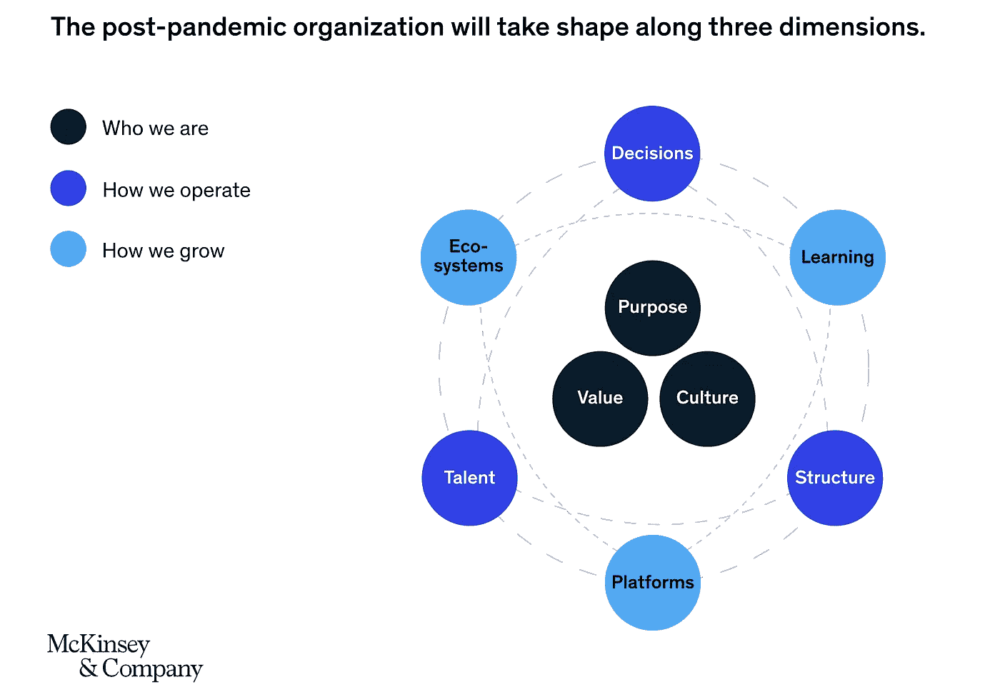

# 新冠肺炎如何刺激未来的工作

> 原文：<https://medium.datadriveninvestor.com/how-covid-19-is-spurring-the-future-of-work-e6013918615a?source=collection_archive---------10----------------------->

随着远程工作的增加，许多公司已经转移到远程工作，直到 Q1 2021 年底，在某些情况下，无限期。随着远程工作员工的增加，许多企业被迫做出艰难的决定，这将影响日常运营和工作的未来。在疫情期间，像纽约、芝加哥和洛杉矶这样的城市见证了大量专业人士逃离城市——不续签租约，搬到郊区，在新冠肺炎顺其自然的时候，在父母的房子里存钱。虽然远程工作已经影响了美国人日常工作的方式，但它证明了一件事:员工可以在办公室之外工作，同时仍然可以产生结果。

## 重新评估增长战略和物理办公空间

随着员工工作时间的延长、通勤时间的减少以及使用 Zoom 电话，我们在这种偏远环境中的运营方式已经促使企业重新评估位置和扩张策略。在最近来自[商务便装](https://www.businesscasual.fm/is-silicon-valley-losing-its-luster/)的播客中，美国在线联合创始人史蒂夫·凯斯探讨了公司要想获得成功，离创新城市最近的需求。凯斯认为，公司可以并且*应该*检查他们开设总部的地点——鼓励新的创业公司在[新兴城市](https://richmond.com/business/investment/personal-finance/50-small-towns-that-are-home-to-big-businesses/collection_34b00d1c-689e-57f4-9157-e22051d2f93b.html#20)扎根，因为在硅谷这样的科技中心设立总部的需求正在减少。有些人可能会问，像硅谷这样的科技生态系统的“下一步是什么”……它们已经失去光彩了吗？为了被科技巨头和有才华的劳动力包围，搬到沿海地区仍然是一个必要条件吗？虽然疫情终将结束，但我相信我们将看到新兴城市的经济发展，这些城市为那些寻求在新市场扎根的组织提供激励。我也相信我们会看到人们回到大城市。不可避免的是，不是所有离开的人都会回来，但新冠肺炎给了企业一个独特的机会来重新评估他们的增长战略，因为它涉及到财务影响、扩张、人才获取和技术需求。

## 混合模式的案例

Nicholas Bloom 是斯坦福大学的经济学教授，擅长远程工作，他认为一旦疫情消退，[每周在家工作两天将是平衡协作和安静工作的最佳方式，同时受益于减少通勤带来的压力，这使得](https://siepr.stanford.edu/research/publications/how-working-home-works-out)[混合模式](https://www.bbc.com/worklife/article/20200824-why-the-future-of-work-might-be-hybrid)完美地平衡了员工想要的一切。

一些人认为，由于工作时间更长，工作与家庭没有分离，疫情恶化了工作与生活的平衡，混合模式可能是提供一个快乐中间点的解决方案。理想情况下，混合工作是两全其美的，既提供了结构和社交性，又有足够的独立性和灵活性。虽然转换到混合工作模式听起来相当简单，但它对组织的影响要深远得多。根据麦肯锡进行的一项研究，大流行后的组织将受到三个方面的影响— **使命/价值观、运营战略和增长。**

Source: [McKinsey & Company](https://www.mckinsey.com/business-functions/organization/our-insights/reimagining-the-post-pandemic-organization)

参考麦肯锡的混合模型图，作为疫情的结果，必须考虑的一些关键值如下:

## 1.在现场团队和远程团队之间建立[信任](https://www.forbes.com/sites/shaheenajanjuhajivrajeurope/2020/10/05/the-new-hybrid-model-of-working-requires-three-key-elements-to-succeed/?sh=38232cc77123)。

创造信任和凝聚力的文化是一个组织成功的关键。与麦肯锡模型相关的是，价值观、文化和目标仍然是一个组织的核心。随着完全远程工作模式的引入，沟通和共鸣可能会在这个过程中丢失。作为一个远程入职并在疫情中开始职业生涯的人，我理解与同事保持联系有多困难。在休息室偶遇新面孔、在同事桌前驻足、或与导师共进午餐的能力不再是一种选择。虽然虚拟职业导航有时可能会很困难，但像我这样的公司鼓励与我们的团队进行例行检查，参与业务资源小组，以及与其他业务线进行虚拟网络会话。随着我们对重返办公室的预期，不可避免地会有一个分阶段的方法——允许员工选择混合时间表。这肯定是员工可以期待的，但随着“害怕错过”办公室发生的事情进入那些在家的人的脑海中，对简化沟通和会议协调的需求变得明显。

## 2.为全国的候选人和雇员提供公平的竞争环境。

因为它关系到一个组织的位置战略，所以人才获取受到影响是有道理的。许多公司目前提供永久性的远程工作，而不是在候选人居住的城市中受到限制。此外，为了在知名机构获得行业经验，进入更大市场的需求也变得可选。像亚马逊、脸书和其他公司已经宣布了长期远程条件，这对于那些想在没有相关成本的大型组织中工作的人来说是最佳选择。

## 3.优化技术以鼓励[创造性](https://www.themuse.com/advice/team-culture-relationships-remote-work)协作和连接。

你可能已经感受到了疫情对你与朋友、家人和同事联系能力的损害。当我们迈向未来的工作时，组织优先考虑社区是很关键的。组织在统一和协作的网络中表现更强——人是公司的心脏和灵魂。无论公司的规模有多大，它都会影响公司运营的结构和生态系统。

重要的是不要忽视邻近的力量。公司必须通过投资和利用现有技术来适应。在《华尔街日报》的一篇文章中，陈强调了那些正在创造性地将工作场所文化转移到网络环境中的科技创业公司，他们正在努力缩小电脑屏幕上的差距。虽然许多高层领导都认为，面对面的创新和协作总是更容易实现，但通过模仿面对面的创造力来保持持续的沟通是团结团队和促进发展的一种好方法。

有兴趣了解更多有关组织和员工如何适应疫情的信息吗？看看这份 [***清单***](https://www.entrepreneur.com/article/351157) 了解新冠肺炎影响未来工作的其他方式。