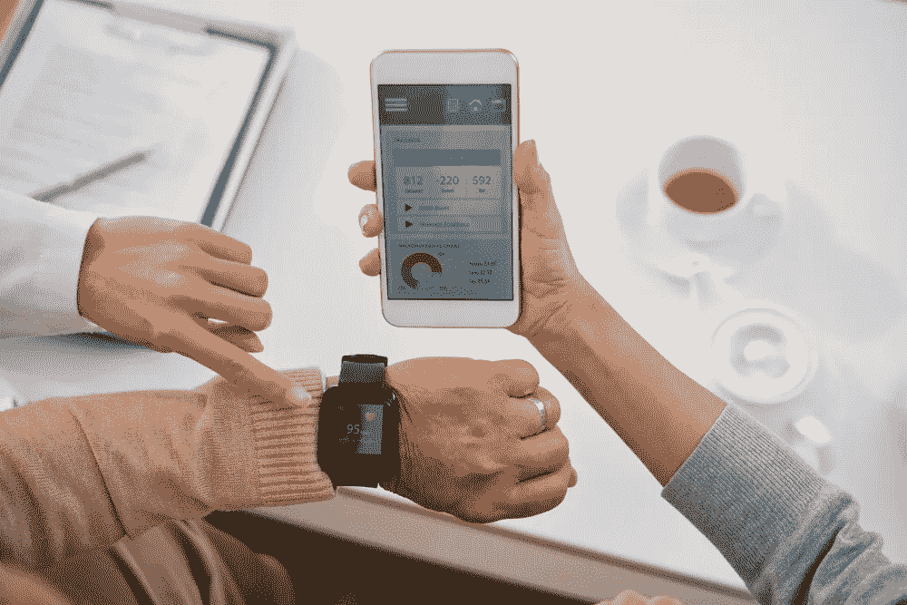

# 定制医疗保健软件开发如何帮助医院

> 原文：<https://medium.datadriveninvestor.com/how-custom-healthcare-software-development-can-help-hospitals-547845f94a86?source=collection_archive---------23----------------------->

越来越多的医院转向定制医疗保健软件开发的力量，以节省时间，避免错误，并挽救更多的生命。

医疗保健比以往任何时候都更加重要。医院经常利用技术为病人提供护理。然而，每天都有新的健康问题出现，使得医护人员的工作更加困难。正因为如此，软件公司正在努力创建定制的医疗保健软件开发产品。但不是任何产品，这些定制软件开发必须提供特定的功能和服务，以适当地服务于医疗保健提供商——因为当某人的生命处于危险之中时，没有时间可以浪费。请继续阅读，了解定制软件如何帮助医院节省时间、避免错误、实现可扩展性、保持安全以及提供移动护理。

# 定制医疗保健软件开发的重要性

面对现实吧，这个世界已经今非昔比了。我们生活在一个即时满足的时代。更不用说我们面临的所有新的健康问题。定制医疗保健软件开发通过为传统医疗保健运营提供方便、可靠、安全和便捷的解决方案，具有将医疗保健行业过渡到 21 世纪及以后的能力和可扩展性。最终，定制医疗保健软件开发的重要性是让努力保持我们健康的护士和医生的生活更加轻松。

# 节省时间

医院工作人员浪费了大量时间来完成物理文书工作和搜索文件。随着定制医疗保健软件的开发，患者表格和其他文书工作都存储在应用程序中。此外，医护人员可以利用搜索功能轻松导航到他们想要的文件。定制软件使医院员工能够随时随地管理信息，而不是局限于工作站或文件柜。一份报告显示，与没有科技的 12 小时轮班相比，有科技的 8 小时轮班医生可以照顾更多的病人。当每时每刻都很重要时，请依赖专为医疗保健行业设计的定制软件。

# 更少的错误

我们都喜欢好的“医生签名”，但当涉及到破译病人有什么症状和治疗建议时，手写笔记可能会在医院产生许多问题。医生在线写医嘱的过程(计算机化医嘱输入)从定制医疗保健软件开发中获益最大；在一项研究中，严重错误率下降了 [55%;在另一项研究](https://www.ncbi.nlm.nih.gov/pmc/articles/PMC1117776/#B9)中，所有错误率下降了 [83%。这一过程的计算机化从四个方面降低了用药错误的可能性:](https://www.ncbi.nlm.nih.gov/pmc/articles/PMC1117776/#B10)

1.  所有订单都遵循一个模板，并且必须填写所有字段
2.  因为它们是数字的，所以总是清晰可辨
3.  所有订单都根据保存在软件数据库中的信息进行检查，包括过敏、药物相互作用等。

这里有一个例子:一项[研究](https://www.ncbi.nlm.nih.gov/pmc/articles/PMC1117776/)显示，如果没有定制的软件，过敏检测过程存在严重缺陷。令人震惊的是，研究人员发现，由于不正确的手写笔记和不正确的归档，患者已知过敏的药物订单中约有三分之一被遗漏。犯错是因为我们是人。实施信息技术可以帮助消除这些错误。

# 可量测性

世界每天都在变化，随之而来的是新的健康问题。定制医疗保健软件开发就是定制。随着医疗机构的扩大或缩小，软件可以被改变以适应。随着行业的变化，新的特征和功能可以添加到计算机化的解决方案中。当然，[商业化的现成解决方案](https://searchdatacenter.techtarget.com/definition/COTS-MOTS-GOTS-and-NOTS)可能看起来很诱人。但是，它们缺乏可伸缩性、适应性和定制性。医院的使命太重要了，不能妥协于一刀切的解决方案。

# 安全性

随着定制医疗保健软件开发的出现，医院比以往更多地在线共享、存储和检索信息。为了保护医院及其患者，嵌入最强大的安全性至关重要。这些安全措施可以采取多因素认证的形式。反垃圾邮件和强大的防火墙也是防止黑客获取患者机密信息的关键。[云计算](https://www.thesunflowerlab.com/blog/industrial-cloud-computing/)也是一种存储敏感数据的可靠方式。

# 用于可穿戴定制医疗保健软件开发的应用

定制医疗保健软件开发对医疗服务提供者来说更聪明而不是更困难。可穿戴应用为医院、疗养院等领域带来了越来越多的机会。这些智能工具已经成为医疗保健专业人员值得信赖的助手。

1.  鼓励锻炼
    据估计，20%的医疗费用来自缺乏持续锻炼和睡眠不足。通过使用可穿戴技术来鼓励更多的锻炼和更好的睡眠模式，这将有助于患者变得更健康，并减轻医疗系统的压力。
2.  细菌的缓慢传播
    医疗保健提供者佩戴的可穿戴设备可以监测健康和活动水平。这些信息可以防止员工在完全恢复之前返回工作岗位，同时也为他们何时能够返回工作岗位提供了更现实的见解。
3.  更少的病假
    健康保险公司 [Humana](https://www.humana.com/) 开始向员工提供可穿戴设备，以获得实现健身活动目标的奖励。一项对参与该计划的员工进行的为期三年的研究显示，病假天数减少了 44%。医院里的病假越少，就意味着有更多的医护人员来照顾病人。

# 定制医疗保健软件开发，共创美好明天

当时间至关重要时，医生需要他们可以依赖的支持。定制医疗保健软件开发可以提供无与伦比的好处，从节省时间到挽救生命。在医院中实施软件的目标不是让人们变得过时，而是利用它的力量，让医生和护士回到人类最擅长做的事情上，如决策和沟通。医疗服务提供者和定制软件一起可以创建一个如此强大的纽带，任何健康问题都没有机会。