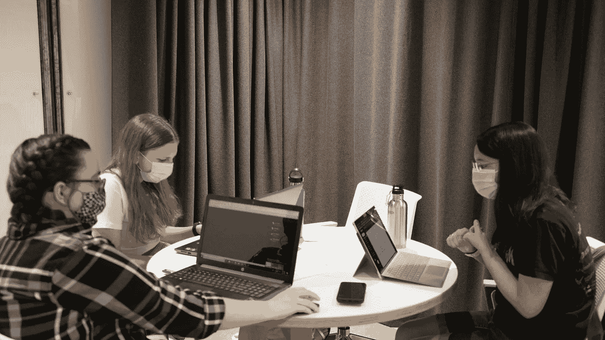

# 网络安全教育如何改变世界

> 原文：<https://medium.datadriveninvestor.com/how-cybersecurity-education-can-transform-the-world-9d4d546f7537?source=collection_archive---------18----------------------->

在我们日益数字化的世界中，缺乏网络安全专业人员可能会非常危险。此时此刻，这种不受欢迎的情景就是我们的现实。全球大约缺少 400 万网络安全人员，对这些专业人员的需求每天都在增加。

一旦我们承认存在差距，那么对话就会转向为什么我们对此无所作为。要解决这个问题，我们可以从教育开始。各级学习机构都在努力为网络安全行业提供专业人员，他们很难为那些积极从事这一领域职业的人提供足够的培训。

此外，我们的教育体系没有描绘出网络安全专业人员的准确形象。几乎每本书、每部电视节目和每部电影都延续了典型的程序员都很笨拙的刻板印象，他们是穿着帽衫、弓着腰坐在电脑前、回避社交的“IT 极客”。

与警匪剧类似，大众媒体未能提供这些专业人士的多维表现。算法编写者和数据挖掘者没有很好地满足媒体消费者期望的兴奋感，这意味着我们很少看到他们网络安全工作的准确描述。

也就是说，教育工作者以及私营和公共部门有责任让每个人更好地了解网络安全需要什么。如果我们不做这项工作来扩大对该领域的兴趣，技能差距带来的威胁只会继续增长——给成为网络攻击受害者的个人和企业带来可怕的后果。

**网络安全人员短缺的后果**

如果公司不能胜任网络安全的角色，他们将无法获得必要的保护来执行他们的授权任务。现有网络安全专业人员的工资将继续上涨，但随着公司急于填补空缺职位，工人的质量将下降——随着时间的推移，这种做法最终将使他们处于更糟糕的境地。

企业已经在将员工外包到海外，这是不可接受的，因为我们有资源和知识来培养我们需要的所有网络安全专业人员。但是我们没有很好地利用这些资源——或者在某些情况下根本没有利用。

短期来看，这个问题会让企业陷入停滞。如果没有足够数量的网络安全专业人员，企业将难以发展，对他们服务的需求将远远超过他们的供给。从长远来看，由于面临越来越多的黑客攻击和数据泄露威胁，公司将开始倒闭。

客户数据将面临被泄露的危险，他们可能会采取措施停止共享任何个人信息。合格的、准备充分的网络安全专业人员形式的保障措施可以帮助缓解一些紧张情绪。

**如何反击网络攻击**

了解了所有这些，网络安全专业人员需要扮演的最关键的角色是什么？它始于教学，但不是传统意义上的教学。我说的是让公司付钱给训练有素的专业人员，让他们教其他人网络保护的基础知识，并与公立学校的学生分享这些知识。

这为网络安全教育奠定了坚实而可持续的基础。当然，这些网络安全工作者不会是训练有素的教师——他们不可能愿意接受大幅减薪来做这件事。然而，通过将这种知识共享和培训作为工作描述的一部分，公司将为网络安全教育创造一个稳定的平台，不会让专家离开他们的重要角色。

然而，在我们建立这个基础之前，我们必须首先广泛地认识到这个问题，并有解决它的愿望。如果我们不这样做，我们就不会建立基础设施和使用必要的资源来结束短缺。

在重大灾难发生之前，我们不能一直躲在后面。现在是让网络安全教育成为我们所做的一切的关键部分的时候了。要了解这个紧迫问题的更多信息，您可以从国家网络安全中心学生联盟获得更多信息。

*原载于 2020 年 8 月 13 日*[*【https://cyber-center.org】*](https://cyber-center.org/how-cybersecurity-education-can-transform-the-world/)*。*