# 机器学习中的决策树

> 原文：<https://medium.datadriveninvestor.com/how-decision-tree-model-works-ce681cae10a6?source=collection_archive---------0----------------------->

## 决策树背后的数学原理及其 Python 实现

本博客涵盖以下主题:

1.什么是决策树？

2.特征选择

3.树代

4.树木修剪

5.用 Python 实现

**1。** **什么是决策树？**

决策树是一种监督学习，可以解决机器学习领域中的分类和回归问题。基本上，决策树将特征空间划分为一组矩形，然后通过拟合简单的模型(如组均值或模式)进行预测。一个典型的树模型由内部节点和叶节点组成。内部节点包含决策树分成的两个分支。叶节点位于分支的末端，不再分裂。

树模型是白盒模型的一种，因此它简单且有助于解释。但是，在某些情况下，它可能无法与线性模型竞争。因此，引入 bagging 和 boosting 来提高模型性能。通过这两种方法，我们可以看到，一束树的组合可以导致预测的显著改善，但代价是解释方面的损失。

决策树的**优势**:

树可以生成可理解的规则，可以图形化显示。

树清楚地表明了哪些特征对预测最重要。

树没有关于数据分布的假设。

树有效地处理共线性。

决策树的**弱点**:

树有很高的方差，可以创建过于复杂的模型。

树对异常值很敏感。

树在分类问题中容易出现错误，类别很多，训练样本相对较少。

**2。功能选择**

生长决策树包括决定选择哪些特征以及使用哪种标准来分割节点。让我们关注一下经典算法 ID3，它被广泛用于建立树模型。

在信息论中，熵用于度量随机变量的不确定性。熵越高，随机变量的不确定性越大。

假设我们有一个离散随机变量 *Y* ，概率为:

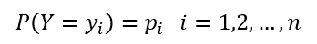

那么熵可以写成:

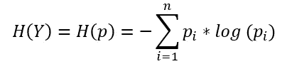

假设 *i* =2，是二进制情况，公式可以写成:

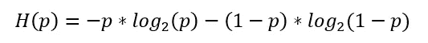

熵 *H(p)* 随着概率 *p* 的变化如何表现，如下图所示。我们可以观察到当 *p* 等于 0.5 时熵达到最大，当 *p* 等于 0 或 1 时熵达到最小。注意，我们定义 0*log(0)=0。

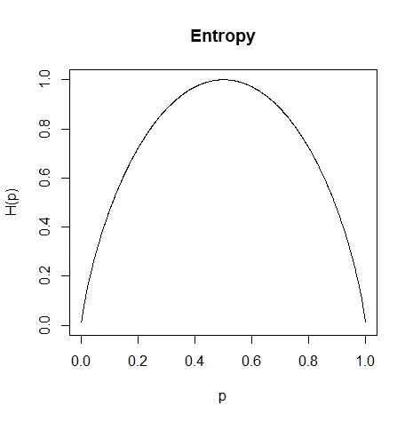

Figure: Generated by R

条件熵 *H(Y|X)* 度量随机变量 *Y* 给定 *X.* 的不确定性，可以写成:

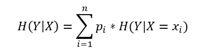

公式中，*π*为:

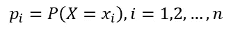

信息增益的公式是:

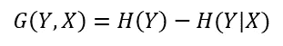

一个随机变量( *Y* )的信息增益量是从其他现有变量( *X)* 观察到的不确定性的减少。

决策树**选择最大化信息增益的特征**来分割节点。使用一个例子来解释树模型如何使用信息增益工作。假设我们有 15 个申请人的信息，包括年龄、工作、公寓和信用记录。根据这些信息，我们想找出哪个变量是决定申请人是否成功申请贷款的最重要的变量( *Y* )。

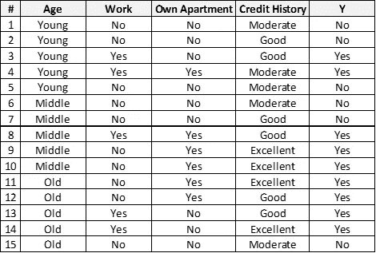

根据定义，我们可以为 *Y* 计算熵:

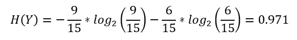

给定可变年龄的 *Y* 的条件熵为:

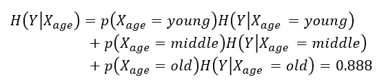

然后，我们可以计算给定可变年龄的 *Y* 的信息增益:

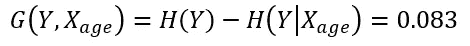

类似地，我们从可变工作、自有公寓和信用记录中获得信息增益。结果如下表所示。我们选择信息增益最大化的变量 own apartment 作为第一个分裂的节点。

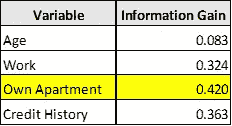

确定第一个节点后，创建两个数据子集。第一个子集包含自己公寓为“是”的所有观察结果，另一个子集包含自己公寓为“否”的所有观察结果。然后，该算法将在每个子集的剩余变量上循环，以探索进一步的分割。

在 CART 算法中，选择基尼系数最小的特征作为分割节点。基尼系数的公式是:

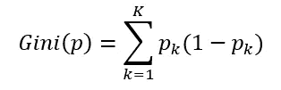

假设 *k* =2，则为二进制情况，公式可写成:

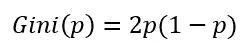

下图显示了 0.5 *熵、基尼系数和错误分类率的差异。所有标准在 *p* 等于 0.5 时达到最大，在 *p* 等于 0 或 1 时达到最小。

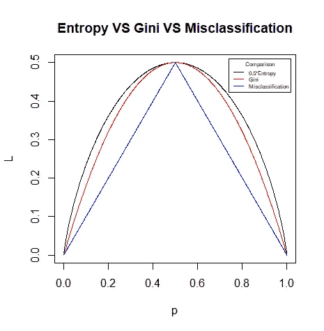

Figure: Generated by R

对于回归问题，树模型的目标是找到子空间 R1，…Rj 以最小化残差平方和(RSS)，由下式给出:

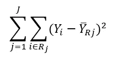

**3。树生成**

决策树采用自上而下的贪婪方法，这就是所谓的递归二进制分裂。递归二进制分裂方法是自顶向下的，因为它从树的顶部开始，然后连续分裂特征空间；每一次分裂都通过树中更下方的两个新分支来表示。它是贪婪的，因为在树构建过程的每一步，最好的分裂都是在那个特定的步骤进行的，而不是向前看，选择一个会在未来的某个步骤中导致更好的树的分裂。因此，树模型为每个分裂寻找局部最优分支，因此它不能保证返回全局最优模型。

**4。树木修剪**

为了处理决策树的高变化，引入了剪枝。修剪是一种通过删除不太重要的分支来减小树模型大小的技术。因此，我们可以通过降低模型的复杂性来避免过拟合问题。

修剪一棵树的第一个方法是在我们种树的时候早点停下来。例如，我们可以设置一个阈值来分割节点。假设一个节点的信息增益低于阈值，我们请求树不要分裂该节点，因为这样的分裂只带来有限的好处。

另一种修剪树的方法是在树完全长大后剪去树枝。我们如何决定修剪一棵树的方法？从离开节点开始，每个内部节点都被替换为其最流行的类。如果预测精度不受影响，则保持该变化。我们可以使用交叉验证来选择具有最佳预测的最佳树模型。理论上是可行的。然而，这在实践中很麻烦，因为要考虑的子树太多了。

另一个直观的解决方案是当树长得太大时增加惩罚，这被称为成本复杂性修剪。以回归树为例。成本函数可以修改为:

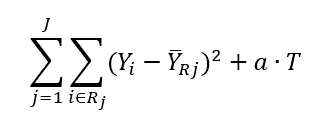

*T* 表示模型中终端节点的数量。我们在成本函数中加入一个非负的调整参数 *a* 。调整参数控制模型复杂性及其对训练数据的拟合优度之间的权衡。 *a* 越高，分配给模型复杂度的惩罚就越大。基本上，我们可以使用交叉验证来选择最佳的调整参数。

**5。用 Python 实现**

我使用 Python 来执行使用 ID3 的特性选择，并在本节中使用 NumPy 和 scikit-learn 包生成一个树模型。

**5.1 功能选择**

生成第 2 节中所示的数据集。

第一步是计算响应 *Y* 的熵。

熵测试的结果是 0.971。然后计算条件熵。

cond_entropy_test1 的返回是 0.888，这是就可变年龄而言的 *Y* 的条件熵。下一步是计算信息增益。

info_gain_test1 的返回是 0.083。最后，将所有函数堆叠在一起，以便算法可以循环所有变量，并返回最大化信息增益的最佳函数。

best_feature_test 的回报是 Own_Apartment，其对应的信息增益是 0.420。

**5.2 树生成**

我将 0.1 定义为提前停止的阈值，以避免过拟合问题。

算法的返回是一个字典:{'label': None，' feature': 'Own_Apartment '，' tree ':{ ' label ':None，' feature': 'Work '，' tree ':{ ' label ':' No '，' feature': None，' tree': {}，' Yes': {'label': 'Yes '，' feature': None，' tree': {}}}，' Yes ':{ ' label ':' Yes ':' feature ':' Yes ':' Yes ':' feature ':' Yes ':' Yes ':' Yes ':None '，' feature ':{ ' tree '这棵树的形象化是。

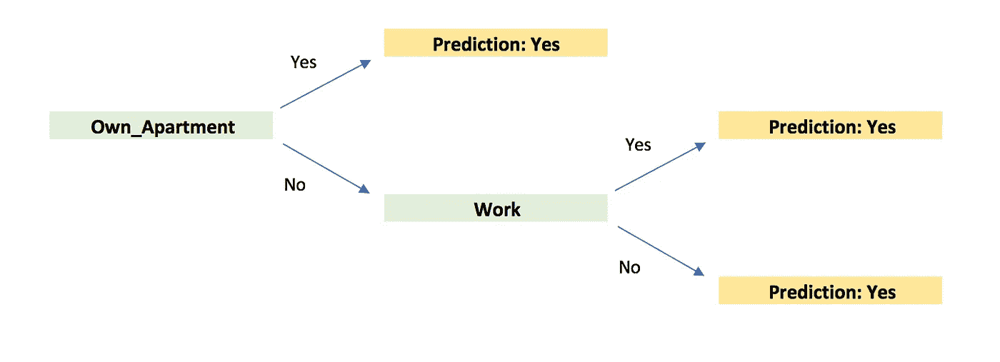

**5.3 sci kit 中的决策树-学习**

我们也可以使用完善的软件包 scikit-learn 来生长一个树模型。这里有一个例子。

该树模型的可视化结果如下:

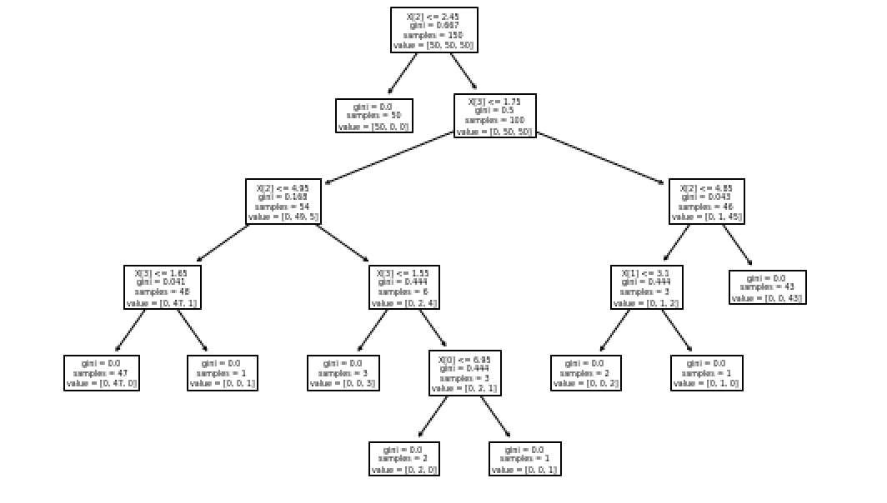

可以查看 Scikit-Learn 的更多详细信息:

 [## 1.10.决策树-scikit-了解 0.23.0 文档

### 决策树(DTs)是一种用于分类和回归的非参数监督学习方法。目标是…

scikit-learn.org](https://scikit-learn.org/stable/modules/tree.html) 

**结论**

在这篇博客中，我解释了决策树背后的理论和数学，举例说明了执行特征选择的模型和用 Python 实现的算法。希望看完这篇博客，你能对这个经典算法有更好的理解。如果您对其他博客感兴趣，请点击以下链接:

 [## 机器学习和深度学习之旅

### 这一系列博客将从理论和实现两个方面对深度学习进行介绍。

towardsdatascience.com](https://towardsdatascience.com/table-of-contents-689c8af0c731) 

**参考:**

[1] Gareth James，Daniela Witten，Trevor Hastie，Robert Tibshirani，(2017) *统计学习介绍*

[2] Christopher M. Bishop，(2009)，*模式识别和机器学习*

[3]特雷弗·哈斯蒂，罗伯特·蒂布拉尼，杰罗姆·弗里德曼，(2008)，*统计学习的要素*

[4]https://en.wikipedia.org/wiki/ID3_algorithm

[5]https://en.wikipedia.org/wiki/C4.5_algorithm

[6]https://en . Wikipedia . org/wiki/Information _ gain _ in _ decision _ trees

[7]https://scikit-learn.org/stable/modules/tree.html