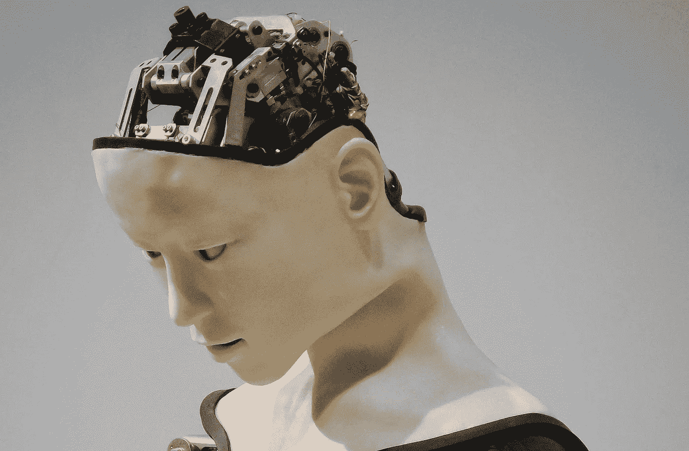
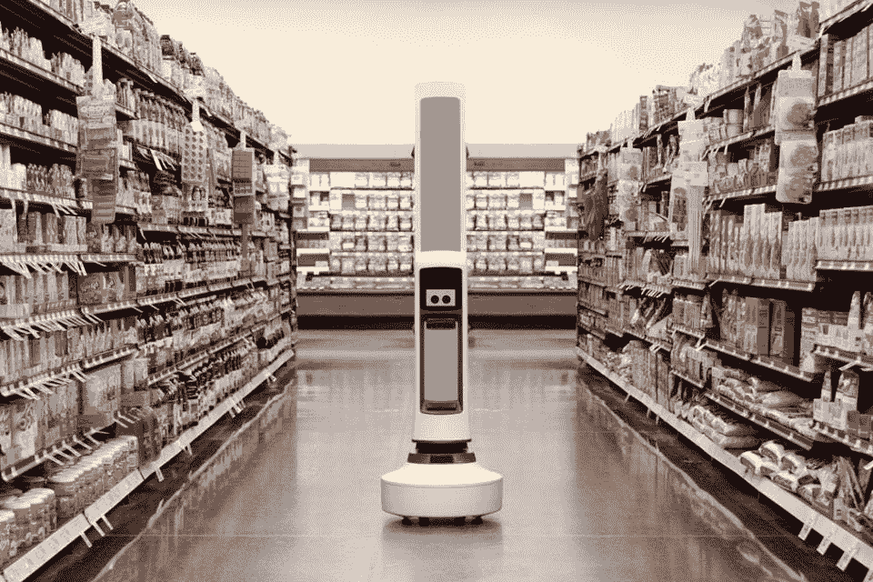
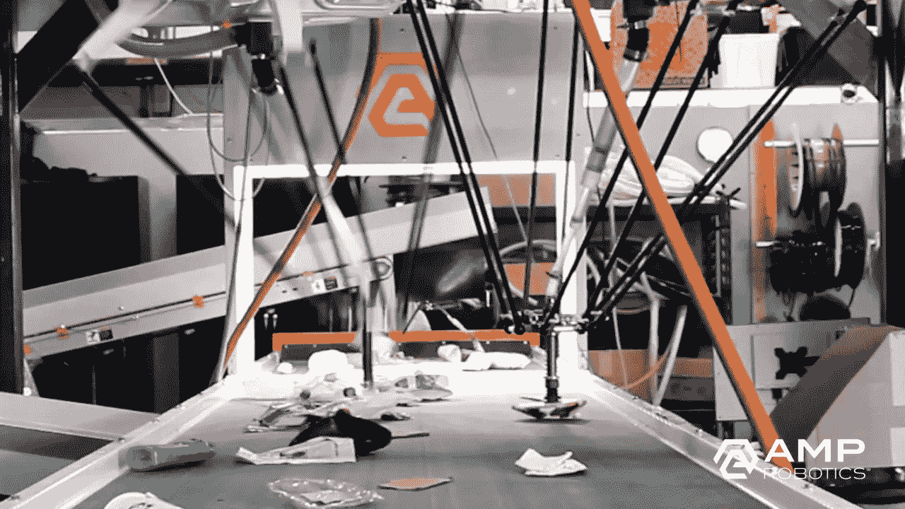
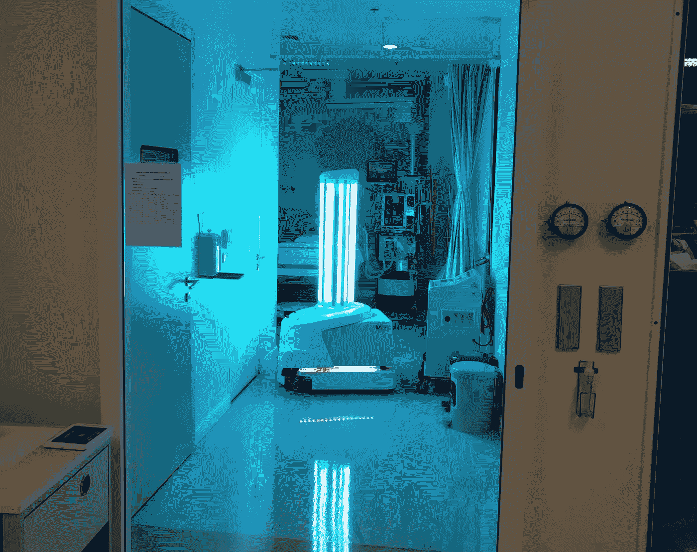
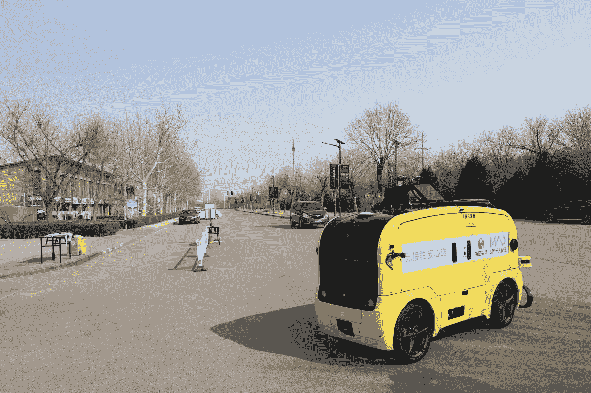

# 疫情期间对机器人和自动化的需求是如何加速的

> 原文：<https://medium.datadriveninvestor.com/how-demand-for-robots-and-automation-accelerated-during-the-pandemic-c2c2d7245c97?source=collection_archive---------9----------------------->

> 疫情加速了对机器人和自动化的需求。机器人已被规范为营销工作、接待员职责和陪伴老人。但是它们真的开始有了自己的价值并有了实际用途。让我们来看看是如何做到的。

## **首先，零售和电子商务正在用机器人补充工人以满足需求**

S 超级市场开始采用机器人来解放员工，他们以前花时间清点库存，专注于表面消毒和杀菌，并处理交付以保持货架库存。

这些零售商坚持认为，机器人正在增加员工的工作，而不是取代他们。但是随着经济衰退中恐慌性购买的停止和销售的下降，公司可能不再需要这些工人。

## 其次，服务有时由机器人来做比人做得更好

在鼓励物理距离的时代，美国路易斯维尔的回收服务被暂停，直到像 AMP 机器人系统这样的机器人被训练来分拣回收物品。有人担心，当工人们与分拣物品的其他工人近距离工作时，他们会感染 COVID19。

## **第三，机器人正在帮助医疗机构拯救生命**

在感染高度机器人在多个国家被采用，用于:医院登记、体温检查、入院时检查其他生命体征、向患者运送食物、毯子和药物，以及净化医院空间和地板。

丹麦科技公司 UVD Robots 向意大利的医院派遣了消毒机器人。这些机器人发射紫外线，撕裂病毒 DNA 链。首先绘制环境地图，然后他们可以使用激光雷达传感器自主移动。

 [## 自动化已准备好带领我们走出危机，并赋予人们权力-以下是|数据驱动…

### 随着我们准备进入 2020 年下半年，并试图在全球预防性关闭后重新开启经济…

www.datadriveninvestor.com](https://www.datadriveninvestor.com/2020/06/23/automation-is-poised-to-lead-us-out-of-the-crisis-and-empower-people-here-is-how/) 

中国政府与中国移动和达闼科技合作，在一个足球场建立了临时智能野战医院，旨在广泛使用机器人治疗病人，以防止传播给医护人员。

在医院外面，机器人警告人们在公园里保持物理距离。例如，新加坡政府部署了波士顿动力公司的机器狗 Spot。

## **第四，放宽了自动驾驶汽车的规则，加快了现实世界的采用速度**

运送乘客是许多早期制造商的首要任务。但越来越多的自动驾驶汽车正被用于长途运输和最后一英里物流。

中国在食品、杂货、信件和包裹的自动交付方面处于领先地位。像美团这样可以被视为消费者服务亚马逊的公司开始向消费者提供杂货。他们从两辆无人驾驶汽车开始，在距离取货站 5 公里半径范围内的三个社区为顾客运送食品杂货。虽然不需要人类司机，但仍然需要人类员工将货物放入车辆。他们有一个优势，因为美团在 2016 年开始了无人驾驶送货的工作。

JD.com 和阿里巴巴等大型电子商务巨头也一直在使用无人驾驶物流服务。亚马逊可能希望他们配备更多的拣货、包装和送货机器人。因为他们需要雇用 175，000 多名员工来处理增加的在线订单，以及增加的不得不请病假的员工。

初创公司 Unity Drive Innovation 在中国疫情最严重的时候部署了无人驾驶的送餐车。他们在深圳和苏州等城市运营，没有一名司机。幸运的是，他们已经在疫情之前收集了大量的数据，因为他们的车辆在富士康园区使用。富士康当然是 iPhone 的制造商。

另一件需要流通的东西是信件和包裹，Starship Technologies 部署了他们的本地递送机器人，能够在 3 公里半径内递送。

其中一些技术已经被其他国家采用。

## **所有这些带来的好处是，采用的速度加快了，许多发展将会持续下去。**

E 雇主们意识到自动化带来的好处超过了人工劳动，尤其是在客户不需要或不重视人际交往技能的地方。当谈到纯经济学时，医院面临着越来越大的压力，要为更多的人提供医疗保健，但预算却更少，其他行业也是如此。机器人似乎真的渗透到了人们认为不会像人类互动那样迅速发展的领域。

**如果你热爱超人类科技，关注我的 Medium 或者**[**Youtube**](https://www.youtube.com/channel/UCo5tHD0JqZGMPLfPZ9LswgA/)**。**

**访问专家视图—** [**订阅 DDI 英特尔**](https://datadriveninvestor.com/ddi-intel)