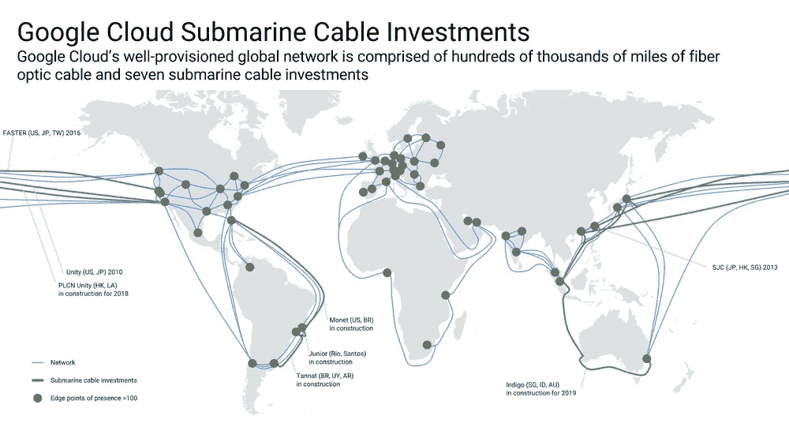

# 我们有多依赖谷歌？

> 原文：<https://medium.datadriveninvestor.com/how-dependent-are-we-on-google-218a294a4a1?source=collection_archive---------26----------------------->

## 谷歌应用程序在全球范围内崩溃

Google’s apps crash in a worldwide outage

由于大量的疫情遍布全球，全世界都开始在家工作。2020 年 12 月 14 日这一天，谷歌应用突然一片漆黑。这家科技巨头提供的包括谷歌搜索、Drive、Gmail、Meet、Home 和其他各种平台在内的服务都下线了。停电持续了大约一个小时，但这段时间足以让每个人意识到我们是多么依赖这个科技巨头。它的影响遍及全球，大多数连接到互联网的人都受到了影响。据各种新闻出版物报道，由于这些应用程序使用的认证系统失败，这些平台离线了。

谷歌宕机发生在亚马逊去年 11 月下旬的一次重大故障之后。在那里，该公司的弗吉尼亚数据中心故障了近 90 分钟，不仅为大多数美国用户关闭了亚马逊本身，还关闭了许多依赖该公司云计算部门 AWS 的其他服务和网站。照片分享网站 Flickr、播客服务 Anchor、流媒体服务 Roku 和物流企业 Shipt 等公司都受到了此次中断的影响。许多智能家居服务也是如此，包括 Roomba，这使得一些人在等待工作恢复正常时甚至无法用吸尘器打扫房间。

# 互联网基础设施的历史

由于生态系统中的单点故障，整个系统陷入黑暗。在 20 世纪 20 年代初，随着新思想的出现和互联网开始进入欧洲和美洲次大陆国家的普通家庭，产品中断对于成长中的互联网公司来说曾经是相当常见的。数据中心的概念并不常见。这些公司过去常常购买自己的网络设备和服务器产品来建立内部服务器基础设施，以托管他们的 web 应用程序，供人们使用 web 来访问它们。

Google undersea cable network layout connecting Data Centers

回到最近，随着云计算的概念对人们来说变得相当普遍，谷歌和脸书等组织一直在世界各地建立互联数据中心的复杂网络。事故已经变得不那么常见，谷歌一直在私人资助海底电缆，以在各大洲之间移动数据，并提高在某个地点发生问题时的性能。

系统的可靠性变得越来越重要，因为个人和企业都依赖于这些服务，无论是在线搜索信息、寻找方向、发送电子邮件，还是访问存储在谷歌服务器上的私人文件。

# 最近一连串事件的影响

> “如果不在谷歌上，它就不存在。”

人们越来越依赖大型科技公司提供的服务。行业中的每个主要参与者都通过他们的平台为数百万用户提供服务。我们将弹性外包给云服务和第三方提供商。但是，尽管它们富有弹性，但没有人能完全免疫。可能会有影响数百万人的单点故障。

成千上万的企业依靠谷歌的工具网络进行电子邮件、内部通信和视频通话。YouTube 拥有超过 20 亿活跃用户。人们已经开始接受智能家居的概念，数十亿台有源设备正在家庭中使用。谷歌是智能家居物联网行业的主要参与者之一，由于最近的事件，人们受到了很大影响。从恒温器到智能灯泡的设备都通过谷歌家庭网络控制。随着停电的继续，人们被留在黑暗中，无法开灯。在寒冷的冬天，随着谷歌服务器离线，Nest 恒温器停止工作，室温下降。由于服务中断，许多学校给通过谷歌视频聊天和聚会上课的孩子们放假。想象一下，如果人们把所有数据都存储在谷歌硬盘上会发生什么。许多第三方服务，如 Slack，依赖于谷歌的认证服务(登录谷歌)，因为这些服务受到影响。

# 我们能从中学到什么？

停电凸显了世界数字网络的脆弱性。这一事件可能会为那些认为大型科技公司已经变得过于强大，应该受到更多监管的人提供素材。在美国，谷歌和脸书正面临反垄断诉讼。在欧盟，将引入新的法规来限制该行业的权力。

点击订阅 DIntel [。](https://ddintel.datadriveninvestor.com/)

在这里加入我们的网络:【https://datadriveninvestor.com/collaborate 