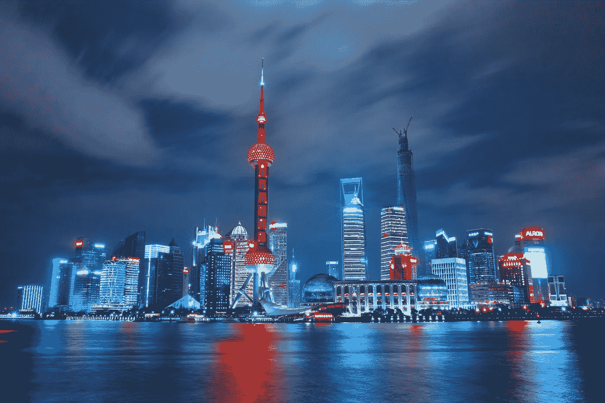

# 中国是如何成为投资的香饽饽的？

> 原文：<https://medium.datadriveninvestor.com/how-did-china-become-a-sweet-pastry-for-investment-a1277f31b8a4?source=collection_archive---------17----------------------->

## 中国不仅正在成为最大的，而且几乎是唯一的投资目的地

Photo by [Li Yang](https://unsplash.com/@ly0ns?utm_source=unsplash&utm_medium=referral&utm_content=creditCopyText) on [Unsplash](https://unsplash.com/s/photos/china?utm_source=unsplash&utm_medium=referral&utm_content=creditCopyText)

> 俄罗斯自由媒体网发表了题为《包括美国投资者在内的世界各国投资者正在走向中国》的报道

11 月 23 日，在所有主要国家中，中国不仅正在成为最大的，而且几乎是唯一的投资目的地。这在很大程度上是由于其在新冠肺炎在世界其他国家蔓延的整体不确定性的背景下成功抗击了疫情。

俄罗斯科学院远东研究所副所长安德烈·奥斯特罗夫斯基(Andrei Ostrovsky)认为，区域全面经济伙伴关系(RCEP)的签署实际上意味着中国从美国手中夺走了亚太冠军的头衔。

> **未来，美国将无法指望保持领导地位**

中国商务部数据显示，10 月份，全国实际使用外资同比增长 18.4%，达到 118.3 亿美元，连续 7 个月实现同比增长。

引人注目的是什么？是高技术服务业实际利用外资快速增长？今年 1-10 月，该数据同比增长 27.8%，其中 R&D 和设计服务同比增长 82.1%。

这不仅反映了中国经济对外国公司的吸引力，也反映了高科技流向中国的趋势。中国似乎正在逐渐获得技术独立，这为该国提供了真正无限的可能性。

俄罗斯科学院*远东研究所副所长安德烈·奥斯特洛夫斯基认为，在未来，大多数大型投资者将把注意力集中在中国。*

Photo by [Hanson Lu](https://unsplash.com/@hansonluu?utm_source=unsplash&utm_medium=referral&utm_content=creditCopyText) on [Unsplash](https://unsplash.com/s/photos/china-economy?utm_source=unsplash&utm_medium=referral&utm_content=creditCopyText)

> **说实话，这样的情况完全正常。为什么这么说？**

首先，我们需要明白，中国现在很有可能成为世界上唯一一个正增长的经济体。

11 月 13 日，国际货币基金组织公布最新《世界经济展望》，预测今年世界经济将萎缩 4.4%，比今年 6 月的预测高出 0.8 个百分点，2021 年增速有望反弹至 5.2。%，比 6 月份的预测低 0.2 个百分点。

中国将是世界主要经济体中唯一保持正增长的国家。预计今年增长 1.9%，明年增长 8.2%。在全球面临巨大经济压力的情况下，中国实现了整体经济的稳步复苏。

我们不仅取得了良好的防治效果，而且实现了全面复产、复工和经济全面发展。

 [## 中国最新专利系统:PAO |数据驱动的投资者

### 美国总统唐纳德·特朗普和……之间最近的经济和贸易协定以及政治协定

www.datadriveninvestor.com](https://www.datadriveninvestor.com/2020/02/03/updated-patent-system-in-china-the-pao/) 

复苏甚至开始了国民经济的内外双循环。在这种情况下，中国成为全世界投资者关注的热点已经变得非常正常。

Photo by [Alexander Ramsey](https://unsplash.com/@alexanderramsey?utm_source=unsplash&utm_medium=referral&utm_content=creditCopyText) on [Unsplash](https://unsplash.com/s/photos/china-economy?utm_source=unsplash&utm_medium=referral&utm_content=creditCopyText)

**其次**，我们需要知道的是，中国目前正处于一个整体经济发展的阶段。

这不仅是因为我们在预防和控制方面取得了成功，而且是因为经过多年的开放和经济增长，中国正在逐步形成。属于自身内生的经济动力。

从国际贸易的角度来看，最近 RCEP 的签署实际上正在形成世界上最大的自由贸易区之一。这种全面独立的自由贸易协定可以帮助区内经济体快速发展，也可以带动整个资本市场。

与工业市场有机结合。在这方面，中国无疑正在发挥越来越重要的作用。同时，我们也知道，中国的消费市场正在全面启动。

我们看到，改革开放 40 年来，中国人逐渐富裕起来。我们钱包鼓起来的同时，是对中国消费市场和消费升级的全面推动。

所以，在这样的情况下，中国完全有可能成为世界上最具活力的消费市场，也自然会成为世界关注的重要对象。

Photo by [Hanny Naibaho](https://unsplash.com/@hannynaibaho?utm_source=unsplash&utm_medium=referral&utm_content=creditCopyText) on [Unsplash](https://unsplash.com/s/photos/shanghai?utm_source=unsplash&utm_medium=referral&utm_content=creditCopyText)

**第三**，我们必须明白，中国已经成为世界投资的热点。这不是一件坏事，但我们也必须从两个方面做好准备。

一方面，中国必须有足够的经济制度安排来拥抱全球投资浪潮，通过全球资本投资促进中国经济增长，特别是中国长期发展基础设施如新基础设施的增长。，真正把这些外部资金用在中国需要的地方。

另一方面，也要考虑外部投资者的进入。某种意义上也是热钱的进入。大量资本涌入中国，可能带来外部金融风险的输入。在这种情况下，中国还应该进一步防止金融风险的出现。

*因此，我们必须明白，中国成为投资界的粉丝是正常的，但我们也必须警惕可能出现的金融风险。*

## 访问专家视图— [订阅 DDI 英特尔](https://datadriveninvestor.com/ddi-intel)