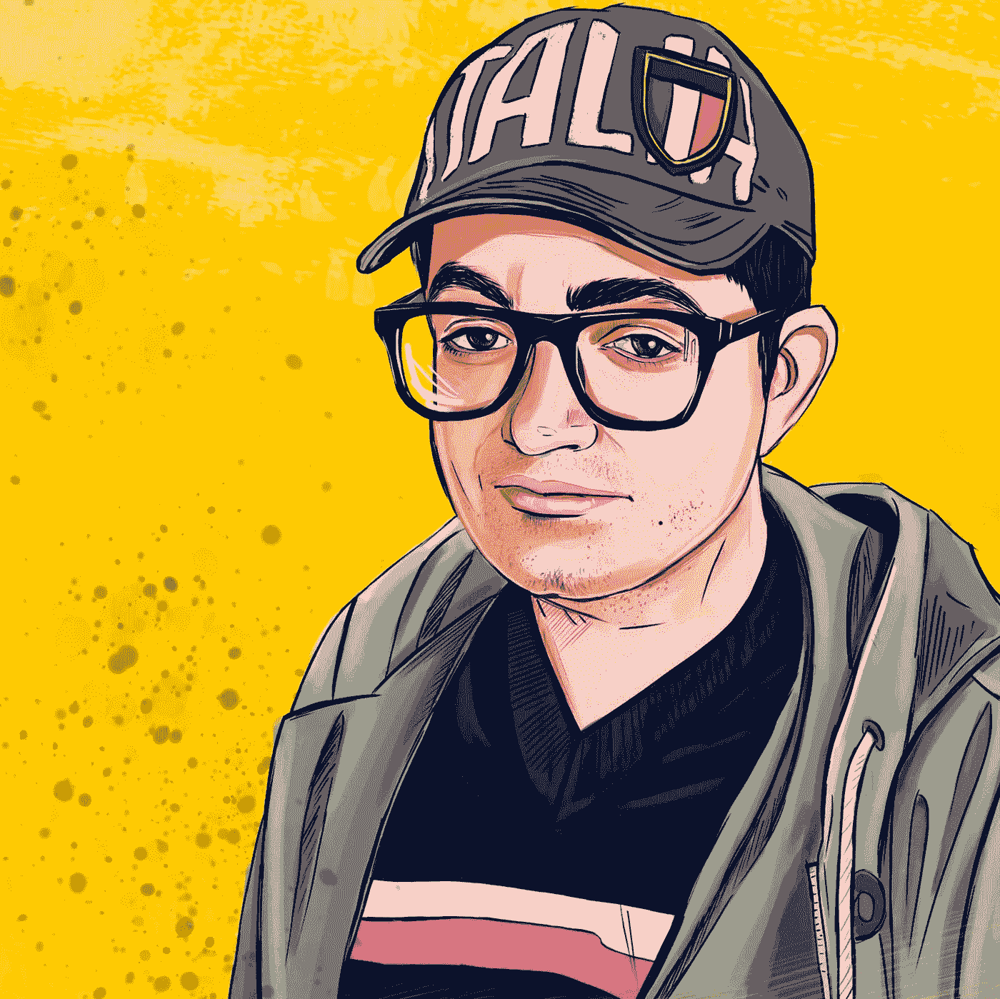

# 我是如何在 32 岁时决定成为数据科学专家的？

> 原文：<https://medium.datadriveninvestor.com/how-did-i-decided-to-become-specialist-of-data-science-in-32-age-4a8e5ce76334?source=collection_archive---------16----------------------->

这很难。当我 30 岁的时候，我一直想改变我的生活。我是律师。我有一份好工作。但是我觉得我已经达到了作为律师的最高境界。我有关于立法的书，杂志上的文章。我创造了几个成功的项目，帮助了很多人。是时候向前看了。去哪里？我不想只是一名律师。但是选什么呢？

想到这里，我想起了我在学校时热爱数学。15 年过去了，我彻底忘记了一些基本的事情，比如解方程。但这怎么能阻止我呢？此外，我对一些问题很感兴趣。我的爱好是哲学。尤其是我喜欢阅读和思考未来。进展加快了，必须发生什么？我认为需要减少获取知识的时间，但不要减少知识。

 [## 成为数据科学家所需的 8 项技能|数据驱动型投资者

### 数字吓不倒你？没有什么比一张漂亮的 excel 表更令人满意的了？你会说几种语言…

www.datadriveninvestor.com](https://www.datadriveninvestor.com/2019/02/07/8-skills-you-need-to-become-a-data-scientist/) 

所以我得出结论，我应该成为数据科学专家。这将让我加入数学和愿望，以帮助进步。但是我该怎么办呢？从哪里开始？我的计划是这样。

我开始在数据营学习。在那里，我学习 Python 编程。在那之前，我从未编程。但是我也需要知道数学，概率论，统计学。于是我买了书，开始解数学题。我也看课程，比如组合学。

我觉得很难。但是有什么选择呢？不改变生活中的任何事情？我不想要。也只有没有其他办法的想法支撑着我。