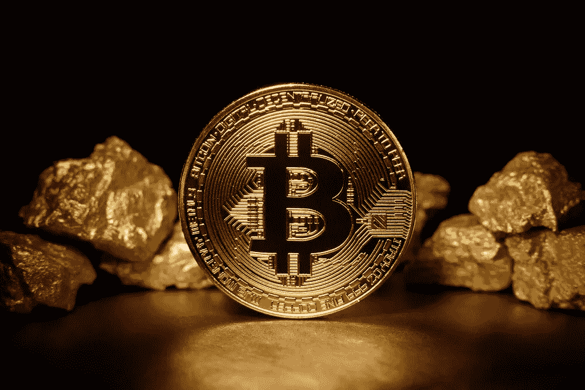

# 3 位经验丰富的黄金专家如何给比特币评级？

> 原文：<https://medium.datadriveninvestor.com/how-do-3-experienced-gold-experts-rate-bitcoin-af824cf0ff31?source=collection_archive---------16----------------------->

最近几周，三位知名、成功、经验丰富的投资者对比特币发表了评论:**斯坦利·德鲁肯米勒**、**、**和**比尔·米勒**。他们都预测央行政策将引发通货膨胀，并推荐比特币作为价值储存手段。

如果有人需要知道，那就是在股票市场成功了几十年的人。最近几周，已经有三位这样的“投资传奇”对比特币发表了评论。虽然过去经验丰富的投资者通常会将比特币视为“猫的黄金”、“金字塔游戏”或类似的东西，但他们现在要乐观得多。

 [## 比特币为何称霸排行榜？

### 数字是伟大的东西:它们让世界变得可测量、可计算。

medium.com](https://medium.com/datadriveninvestor/why-bitcoin-dominates-the-charts-18ca80fc36fe) 

比如斯坦利·德鲁肯米勒。这位投资者是一位亿万富翁，在乔治·索罗斯(George Soros)反对英镑的战争中担任他的左右手，并且作为对冲基金经理几十年来一直赚取高额回报。

昨天，德鲁肯米勒就当前的市场形势接受了美国消费者新闻与商业频道的采访。他解释说，一方面，美联储的措施很可能会导致更高的通胀，最迟在五六年内，一些公司将从中受益，但不是所有公司。

然后他解释说

> “我对比特币的热情不能被高估”。

他有“一点”比特币，但更多的是黄金，但他认为比特币是千禧一代和西海岸新首都的一种美丽的价值储存手段。“它已经存在了 13 年，而且随着时间的推移，它越来越强大”。如果“黄金赌注成功了，那么比特币赌注就更成功了。

# “你现在能做的最好的防御性交易”

德鲁肯米勒并不是业内唯一有这些乐观预测的公司。此前不久,“传奇”投资人比尔·米勒也在《美国消费者新闻与商业频道》上评论说，比特币已经跃升超过 15k 美元。

他表示，“每一家主要的投资银行和每一家高价值公司最终都会买入比特币或黄金等大宗商品。他早就进入了比特币:他创立的一只基金存储了不少于一半的加密货币投资。

最后，仅在 10 月底，著名投资者保罗·都铎·琼斯公开对比特币赞不绝口。这位亿万富翁在 5 月份已经透露，他已经将大约 2%的资产投资于比特币。现在他正在增加投资:

今年 3 月和 4 月，美联储的货币政策表明，美联储和其他央行正在发生什么，这是前所未有的。寻找抵御通胀的价值储存手段比以往任何时候都更有必要。他重视黄金、铜和其他大宗商品，但“得出结论，比特币是最好的通胀交易，是目前能做的最好的防御性交易。

他对比特币的两个方面特别热心:一是它的核心属性。它是便携式的，液态的，并且具有“各种各样的特性，使它成为一种很好的防止通货膨胀的保护物。”另一方面，是“背后的智力资本”——即其他投资者和使用比特币的人。他还强调，随着时间的推移，比特币正变得越来越强大。“它赢得了信誉和诚信。

# 比黄金更有潜力的价值储存手段

最终，德鲁肯米勒、米勒和琼斯提出了大致相同的观点:美国和世界各国央行的政策正在推动通胀，特别是自科罗纳危机以来，如果通胀今年没有到来，它将在未来几年冲击我们。

股票价格可能会因通货膨胀而上涨，但这并不是必须的，因为许多公司也会受到损害。因此，任何有资产需要保护的人都应该购买“防御性资产”。其中最经典的是黄金，这三大投资传奇都离不开黄金。但他们都承认，比特币已经成功地将自己确立为一种价值储存手段和通胀保护手段——他们确信比特币比黄金有更大的潜力。

我在每月一期的 [**简讯中分享了更多私密的想法，你可以在这里**](https://mailchi.mp/bf8f8e8ed697/keep-in-touch-with-lukas) 查看。请在评论中告诉我，并在各种社交媒体平台上加入我:

[**推特**](https://twitter.com/WiesfleckerL)●[**insta gram**](https://www.instagram.com/lukaswiesflecker/)●[**脸书**](https://www.facebook.com/lukaswiesfleckerr)●[**Snapchat**](https://www.snapchat.com/add/luggooo)**●[**LinkedIn**](https://www.linkedin.com/in/lukas-wiesflecker-1b11251a5/)**

**无论你做什么，都要带着爱和激情去做！**