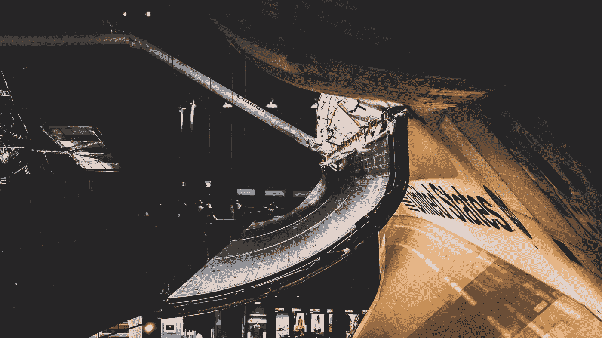

# 航天发射出现问题，宇航员如何逃生？

> 原文：<https://medium.datadriveninvestor.com/how-do-astronauts-escape-when-a-space-launch-goes-wrong-f3b38b853493?source=collection_archive---------20----------------------->

## 如果飞船乘员发射失败，飞船上的宇航员还有机会逃生吗？其他商业航天器用的是什么样的发射逃逸系统？

Image by [enriquelopezgarre](https://pixabay.com/users/enriquelopezgarre-3764790/?utm_source=link-attribution&utm_medium=referral&utm_campaign=image&utm_content=5105730) from [Pixabay](https://pixabay.com/?utm_source=link-attribution&utm_medium=referral&utm_campaign=image&utm_content=5105730)

去年5 月，由 SpaceX 公司设计制造的 Crew Dragon 飞船搭载猎鹰 9 号火箭发射升空，搭载道格·赫尔利(Doug Hurley)和鲍勃·本肯(Bob Benken)两名宇航员奔赴国际空间站。一时间，全球媒体争相报道。但是，一些观众可能已经注意到，当飞船发射时，载人龙飞船的鼻锥顶部没有传统的发射逃逸塔(LES)。

发射逃逸塔最初由美国机械工程师马克西姆·法吉特设计，从 1959 年开始使用。逃逸塔的发射需要借助逃逸火箭(通常使用固体推进剂)快速将飞船推离即将爆炸的运载火箭。随后，逃逸火箭将飞船带到可以降落伞着陆的安全高度，最终分离载人舱。

双子座项目[美国宇航局的](http://nasa.gov)第二次人类太空飞行计划没有使用发射逃逸塔，而是采用了一种更具争议的弹射座椅系统。该系统会在紧急情况下将宇航员弹出推进器。

然而，水星计划、阿波罗、俄罗斯联盟和中国神舟系列的宇航员都更多地依靠发射逃逸塔。

# **SpaceX 公司的龙飞船逃生系统**

埃隆·马斯克的 SpaceX 拥有令人印象深刻的创新能力。在意识到载人飞船必须有逃生系统后，SpaceX 决定用另一种方式发射逃生系统。

Crew Dragon 飞船的船体配备了八个 SuperDraco 引擎，这八个引擎都没有使用外部塔架。

**另一项创新**是 SuperDraco 发动机使用液体推进剂，比固体推进剂更可控。这些可储存的稳定液体推进剂实际上是化学化合物(引火剂一甲基肼和四氧化二氮)，后者起氧化剂的作用。这些推进剂不需要外部点火源。

这两种自燃燃料在接触时会自动点燃，这进一步简化了发动机的设计，最重要的是，允许发动机自行重启。

事实证明，使用自燃燃料的发动机是非常可靠的。证明该燃料也可用于载人龙飞船的载人飞行。SpaceX 在 2020 年 1 月 19 日对他们的飞船进行了全面的发射中止测试。

[http://gph.is/1frHYit](http://gph.is/1frHYit)

# **蓝色起源:新谢泼德和新格伦逃生系统**

蓝色起源是亚马逊创始人杰夫·贝索斯投资的另一家私人太空公司。虽然发展不如 SpaceX，但蓝色起源取得的进步也不容忽视。该公司目前有两个航天器正在开发中:

1.  *亚轨道运载火箭新谢泼德*
2.  *轨道运载火箭新格伦*

**如果发射期间发生紧急情况**，新谢泼德号将使用一个小型固体火箭发动机推动载人太空舱远离火箭推进器。这个小型固体火箭发动机位于载人舱下方，由 [Aerojet Rocketdyne](http://www.rocket.com/) 设计并测试成功。

载人舱可以由推力矢量控制系统操纵。一旦威胁被清除，载人舱将打开降落伞，以确保安全着陆。新格伦航天器仍在开发中，但预计它将使用类似于新谢泼德号上的逃生系统。

# CST-100 Starliner —波音公司

世界上最大的民用和军用飞机制造商之一的波音公司在过去几年中一直在开发自己的商业航天器系统。虽然 SpaceX 和蓝色起源开发了一些新的设计思路，但新设计的外观似乎是复古风格的，有点类似阿波罗飞船指令舱。

> 阿波罗指令舱的设计已经得到验证

但波音的逃生系统没有使用传统的发射逃生塔，这与 SpaceX 和蓝色起源是一致的。与这种方案相反，星际航线的船体使用四个液体燃料发射停止发动机。这四台发动机协同工作，可以产生 16 万磅的推力。

它们与航天器的轨道控制和姿态控制(OMAC)推进器一起工作，帮助载人太空舱正确定位，并在发射失败期间保持稳定。一旦脱离推进器，服务舱和载人舱将分离，降落伞将打开。

软着陆前，飞船还会释放隔热罩，给外部气囊充气。

维珍银河由英国亿万富翁理查德·布兰森创建。这家公司把人类送上太空的方式非常不同。

这是一个全新的系统:一艘地面发射的母舰(白骑士二号)将子飞船(太空船二号)送到大约 15000 米的高空，然后释放；释放的太空船二号随后点火，用自己的火箭发动机，它继续爬升到亚轨道空间，最高飞行高度约为 110 公里。

Photo by [Marcus Urbenz](https://unsplash.com/@marcusurbenz?utm_source=unsplash&utm_medium=referral&utm_content=creditCopyText) on [Unsplash](https://unsplash.com/s/photos/space-ship?utm_source=unsplash&utm_medium=referral&utm_content=creditCopyText)

然而，2014 年 10 月 31 日，维珍银河第二代飞船 VSS Enterprise 在离开母舰并点燃自己的火箭发动机后突然解体。

事故原因是制动系统过早展开，最终导致飞船在飞行过程中解体。

宇航员彼得·西博尔德在不低于 15000 米的高度从解体的航天器中被弹出。被弹射出来时，西博尔德只穿着一件飞行服。幸运的是，在超音速自由落体一段时间后，他成功打开降落伞，返回地面。

尽管受了重伤，西博尔德还是活了下来。他的副驾驶迈克尔·阿尔斯伯里就没那么幸运了。

目前，维珍银河还没有公开披露未来商业太空旅行的紧急逃生计划。

# 追梦人发射逃生系统

美国商业航天内华达山脉目前正在开发追梦人太空飞机。这是一种可重复使用的升力体空天飞机，有点类似于著名的波音 X-20 Dyna Soar。根据工程师的设计，追梦人可以在 Atlas V 或 Vulcan-Centaur 火箭的顶部垂直起飞。

目前，空天飞机使用的发射逃逸系统的具体信息尚未确定。然而，一些人推测，逃生系统可能类似于美国宇航局 HL-20 太空飞机上使用的系统。

**HL-20** 使用集成固体火箭发动机，在紧急情况下快速逃离危险的火箭推进器。但是追梦人的逃生系统不同于基于降落伞的系统。追梦人的逃生系统利用自身的空气动力学外形在附近的跑道上滑行着陆。

# **一个多方案**

值得一提的是，塔式发射逃逸系统通常需要在载人舱顶部安装一个所谓的推进防护罩。然而，这种保护罩会限制宇航员在发射过程中的视线，直到保护罩被释放。

一般在确认发射安全、拆塔后，会解除保护罩。SpaceX、蓝色起源和波音公司等公司使用的集成逃生系统不需要在航天器顶部安装这种保护罩。

这些不同的发射逃逸系统表明，航天器紧急逃逸系统的设计不存在所谓的最佳方案。所有这些设计的想法都很简单。让宇航员尽快逃离坠落的火箭推进器，然后安全返回地面。

需要注意的是，文章中提到的所有商业飞船都还处于测试阶段——尽管 Crew Dragon 飞船即将开始 NASA 的首次正式任务。

在任何发射过程中，尤其是在载人试验飞船发射期间，可靠的逃生计划至关重要。

2018 年美国宇航局宇航员尼克·哈格和俄罗斯宇航员亚历克西·奥夫金宁的亲身经历就能充分证明这一点。当时，由于火箭的二级推进器在飞行过程中解体，他们乘坐的俄罗斯 MS-10 不得不暂停发射。

幸运的是，他们舱内的发射逃逸系统及时启动，完成了他们的任务，挽救了宇航员的生命。

**进入专家视角—** [**订阅 DDI 英特尔**](https://datadriveninvestor.com/ddi-intel)