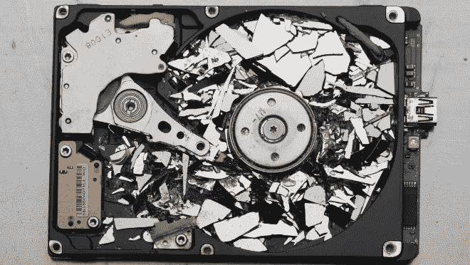

# 云驱动器是如何工作的？|您的数据是如何存储在云中的？

> 原文：<https://medium.datadriveninvestor.com/how-do-cloud-drives-work-how-is-your-data-stored-in-cloud-145eced20757?source=collection_archive---------5----------------------->


您是否曾想过云服务如何能够理所当然地为您提供存储？你以为是无限的吗？为什么提供商要向您收取额外存储费用？你可以在这里找到答案。

让我打消你认为互联网是海量数据的想法。互联网只是通往云端的一个门户，云端存储着你在互联网上看到的所有数据。

# 云存在于哪里？

发送到所谓“云”的大量数据存储在被称为“T0”服务器场或“T2”数据中心的地方。这些并不相同，但可以互换使用。我们可以称它们为世界数据的**仓库**或**互联网的大脑**。


Photo of a Data Center by [Danny Grizzle](https://unsplash.com/@dgrizzle?utm_source=medium&utm_medium=referral) on [Unsplash](https://unsplash.com?utm_source=medium&utm_medium=referral)

这些比你想象的要大得多。有些数据中心甚至比足球场还大！你每天下载、观看、欣赏的所有数据都只存储在这些地方。

这些包含大量巨大的存储设备，它们相互连接，不停地工作。这些从未关闭，并不断工作，以便为客户提供不间断的服务。数据由速度最快的处理器处理，以确保实时记录每一位高度虚构的数据。


Photo inside a Data Center by [Tanner Boriack](https://unsplash.com/@tannerboriack?utm_source=medium&utm_medium=referral) on [Unsplash](https://unsplash.com?utm_source=medium&utm_medium=referral)

# 我的数据也存储在那里吗？

是的。你所有的脸书、Instagram 照片、你上传的作业、你的 WhatsApp 聊天记录、你的邮件等等？所有的数据都在那里。

一旦你上传一些东西到云端，数据中心会立即下载并记录下来。它们会为你保存，直到你删除它们，你可以在需要的时候重新下载。

[](https://www.datadriveninvestor.com/2020/07/15/aws-for-enterprise-transformation-secrets-of-top-cloud-architects/) [## 面向企业转型的 AWS:顶级云架构师的秘密|数据驱动型投资者

### “您使用云实现企业转型的方法是什么？”是人们一直问我的问题，自从我…

www.datadriveninvestor.com](https://www.datadriveninvestor.com/2020/07/15/aws-for-enterprise-transformation-secrets-of-top-cloud-architects/) 

# 我们的数据是如何得到保护的？

为您的数据提供最大的安全性。由于他们掌握着全世界的数据，这些公司不会把这当成笑话。不欢迎未经授权的进入。IT 专业人员全天候工作以保护数据。高级加密算法用于防止中间人或任何其他安全漏洞。


# 数据中心是如何维护的？

由于处理器和内部存储驱动器的不间断工作，设备容易过热。因此，提供空调和冷却剂来冷却它们。数据中心的温度不应超过 27°C。保持 20–22°C 的最佳状态。指定的员工总是警惕地检查磁盘中的错误。如果出现错误，它们会立即修复磁盘。如果任何一个磁盘停止工作，它将被损坏，无法恢复，并被出售给废品，因此没有人能够恢复数据。



Picture from [Recovery-Estonia](https://www.recovery-estonia.ee/eng/24/data-recovery-hdd) under Creative Commons License

# 如果数据中心发生灾难，我们的数据丢失了，该怎么办？

没什么可担心的。世界上有许多数据中心，每个公司都拥有多个数据中心。提供商将您的数据存储在多个数据中心，以确保如果他的其中一个数据中心发生灾难性事件，您的数据不会丢失。出于安全原因，云服务提供商不会透露你的文件存储在哪里。

# 没有数据中心的公司怎么办？他们如何存储我的数据？

像谷歌、微软、IBM、亚马逊、脸书这样的大公司都有自己的数据中心，而其他公司付钱给他们来存储自己的数据。人们需要为他们的业务目的支付额外的存储费用，这样他们就可以升级他们的驱动器来为您提供服务。

# 数据创建时间间隔---!

这使您能够正确理解数据涌入数据中心的速度，以及数据中心实时处理数据的能力。

```
•Snapchat users share 527,760 photos every minute.
•456,000 tweets are sent on Twitter in a minute's time.
•Instagram users post 46,740 photos every minute.
•More than 300 million photos get uploaded per day.
•Every minute there are 510,000 comments posted and 293,000 statuses updated.
•Each day 95 million photos and videos are shared on Instagram.
•We send 16 million text messages every minute.
•There are 990,000 Tinder swipes in a minute.
•156 million emails are sent every minute.
•15,000 GIFs are sent via Facebook messenger every minute.
•Every minute there are 103,447,520 spam emails sent.
•There are 154,200 calls on Skype each minute.
•100 million people use the Instagram “stories” feature daily.
•Spotify adds 13 new songs per minute.
•There are 600 new page edits to Wikipedia in a minute.
[***Source***](https://www.forbes.com/sites/bernardmarr/2018/05/21/how-much-data-do-we-create-every-day-the-mind-blowing-stats-everyone-should-read/#31c8c12760ba) ***(As of May 21, 2018)***
```

# 我能免费获得无限存储空间吗？–我的建议；-)

一般来说，你需要为公司默认提供的额外存储空间付费。不过截至目前，如果你想免费无限存储，可以使用 Telegram。


这是一个基于云的消息应用，所以你不需要像在 WhatsApp 那样定期备份你的聊天记录和文件。您可以上传无限数量的文件(<1.5GB each). Come after a long gap, and you still find it safe there. You can be assured your data is absolutely safe and secured in Telegram

# Conclusion

The data centers, without our knowledge, help us a lot in our daily life. Without these, we wouldn’t be able to store our data, recover our old memories, store important documents in the cloud without collywobbels! The data centers too are obeying the Moore’s Law, with each trying to shrink their size with advanced enhancements every year!

Who knows? A data center in 2045 might fit in your pocket, and might be sold for the price of today’s SD card!

## Gain Access to Expert View — [订阅 DDI Intel](https://datadriveninvestor.com/ddi-intel)

**我的相关故事:**

*   [Vertu:最昂贵的手机品牌。有什么特别的？](https://medium.com/swlh/vertu-the-costliest-mobile-brand-whats-so-special-8d205c362ce2?source=friends_link&sk=d120db74e4c4f9f143901a45e6b83b5c)
*   [eSIM——不是实体卡的 SIM 卡](/esim-the-sim-that-isnt-a-physical-card-955f78a26403?source=friends_link&sk=8d5c322d2ba9878dc0e9aad7e38f2caf)
*   谷歌广受欢迎的免费服务现在停止了。原因如下。