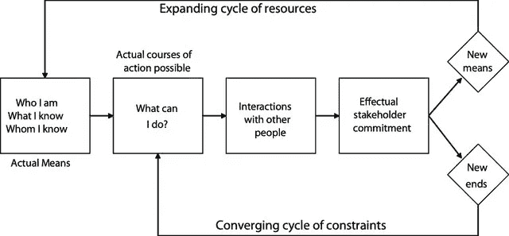

# 创业者如何长期成功，你又能如何？

> 原文：<https://medium.datadriveninvestor.com/how-do-entrepreneurs-succeed-in-the-long-run-and-how-can-you-27a3dfd62702?source=collection_archive---------8----------------------->

## 实施周期的最终指南

Photo by [Estée Janssens](https://unsplash.com/@esteejanssens?utm_source=medium&utm_medium=referral) on [Unsplash](https://unsplash.com?utm_source=medium&utm_medium=referral)

企业家不是超级英雄。 *只是说说而已。*他们依靠行之有效的方法，努力工作。

那他们到底是怎么成功的？**他们怎么能坚持下去呢？** *他们的秘诀是什么？*

我的意思是**必须有一个解释。必须有一项研究描述企业家思考、决策和利用机会的方式。**

的确，有一个！萨拉斯瓦西教授发现了 [**实现**](https://www.effectuation.org/) **的过程。放轻松，我不会用枯燥的研究细节来烦你…**

我将用一个适用的例子来向你展示实现的过程。

整个故事从实施周期开始。比方说，有一个人，他会经历这个过程。

*坚持住！*

简单来说，那个人就是你。你是那个将走过实现圈非凡道路的人。 ***你准备好体验一次创业者的旅程了吗？***

Fig. 1 Effectual Process (Sarasvathy and Dew 2005:543).

# 自电位

第一个里程碑是自我发现。有意识地定义*你是谁*、*你知道什么*、*你认识哪些人*。

这些是你最重要的资源。到了这一步，你不用移山， ***你已经有手段了。***

如果是你，我会从这一点开始记笔记……

所以发掘你的自我潜力吧！创建一个列表，开始用要点写下你是谁。该列表应该是透明的，易于调整。随着时间的推移，你会成长并改变列表。

用关于**你的技能和知识**的要点进一步扩展列表。你的每一个小技巧都很重要。你有驾驶执照吗？*写下来！*你种了一棵鳄梨树，照顾了它很久吗？*把它列入清单！*

最后，添加关于你的网络的信息。这些人不仅仅是你的家人和朋友。他们是你的导师、老师和第一批顾客。

# 你能做什么？

第二步是思考你能做什么。以你的知识、资源和时间。**你有哪些可能性？**

我希望你会觉得我的例子很有趣。*如果没有，就继续向下滚动，不用担心……*

当我 20 岁的时候，我决定开始我的第一次创业。我不想学习新的技巧。我也没有钱投资。于是我就在想，什么**我能做什么？在这个人生阶段，我能用我的能力做些什么呢？**

* [## 为什么那个创业者筹的比我多那么多？数据驱动的投资者

### 养多少既是一门艺术，也是一门科学，这个话题在许多其他帖子中有详细讨论。这篇文章将…

www.datadriveninvestor.com](https://www.datadriveninvestor.com/2020/06/14/why-is-that-entrepreneur-raising-so-much-more-than-me/) 

*旁注:*我输不起。我是一个崩溃的学生。所以我几乎没有下注。建议:**只投资你能承受损失的金额！**

*回到例子，我一直喜欢画画。我做得很好。作为一项实验，我开始提供绘画工作坊，遵循“按需付费”的原则。我在大学群中宣传我的产品。令人惊讶的是，许多人对我的绘画课感兴趣！他们甚至为我付钱。我简直不敢相信……*

*我还上传了一些我的肖像的高质量图片，并发送给了几家网店。我开始卖印刷品。*

现在回到你身上。

你现在能做什么？反思一下，要有创意！写下你的想法！

这比你想象的要容易。

例如，如果你的母语是英语，你已经可以教英语了。这是一个非常基本的建议。

我们周围有如此多的机会。其中一些正等着你去发现和捕捉…* 

# *与其他人的互动*

*你周围的人是你的第一批顾客。与他们互动！分享你的想法，提供你的产品或服务，并依靠他们的反馈。*

*我长期低估了这一步的重要性。不要犯那个错误。你周围的人是你最重要的资产。他们会帮助你提高。*

*如果不发展互利的关系，你就无法经营一家企业。此外，正如我已经强调的，你认识的人是你的第一批潜在客户。他们会帮助你决定你的想法是否适合上市。他们也可以拒绝你的想法，然后你可以重新开始这个循环。*

*人们拒绝你的第一个产品或服务不应该阻止你。这个旅程是关于不断探索的。*和实验。*有些想法会褪色，而有些会保留下来。*

# *有效的利益相关者承诺*

*比方说，你周围的人对你的产品表现出了承诺。他们把你推荐给其他人，你也认识了新的利益相关者。你将变得更大！*

*有些人对你的想法表现出强烈的支持。他们甚至可能想加入你。你建立了自己的企业，并进一步完善了自己的想法。*

*你开始和更多的人互动。他们中的一些人将会成为你的关系网的一部分，而其他人将会留在你的关系网中。*

*这个里程碑将最终导致“周期的结束”。*

**

*Fig. 1 Effectual Process (Sarasvathy and Dew 2005:543).*

# *闭环:新手段还是新目标*

*在这个过程中，你可能发展了新的技能，获得了额外的知识。这些技能和知识现在是你的一部分。我们回到了起点，做了一些改动和扩展。你在旅途中学到的东西属于你。你的经历把你带到了一个更高的层次。*

*该回路也可以从相反的方向闭合。利益相关者的承诺可能会带来全新的想法和目标。在这种情况下，你回到**我能做什么？**要点。*

*任何环境因素也会影响你的圈子。外部事件可能会把你推得更远，或者带你回到起点。*

*无论如何，不断学习的旅程是我们生活的一部分。*那么，为什么不有意识地利用这种循环呢？**

***访问专家视图—** [**订阅 DDI 英特尔**](https://datadriveninvestor.com/ddi-intel)*