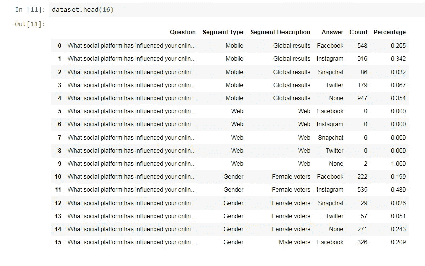
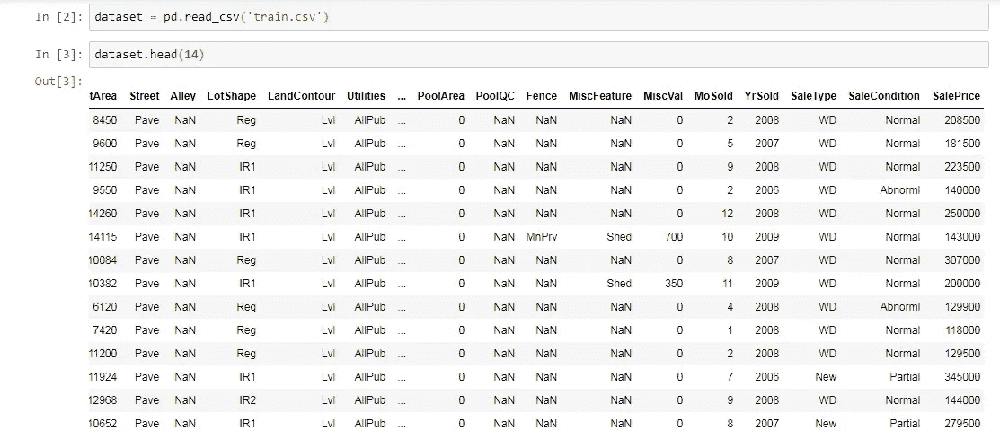
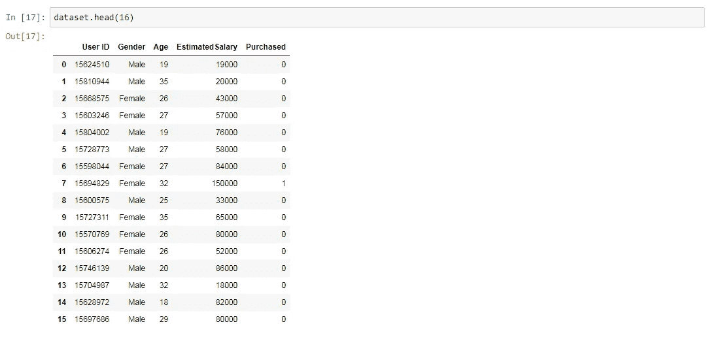
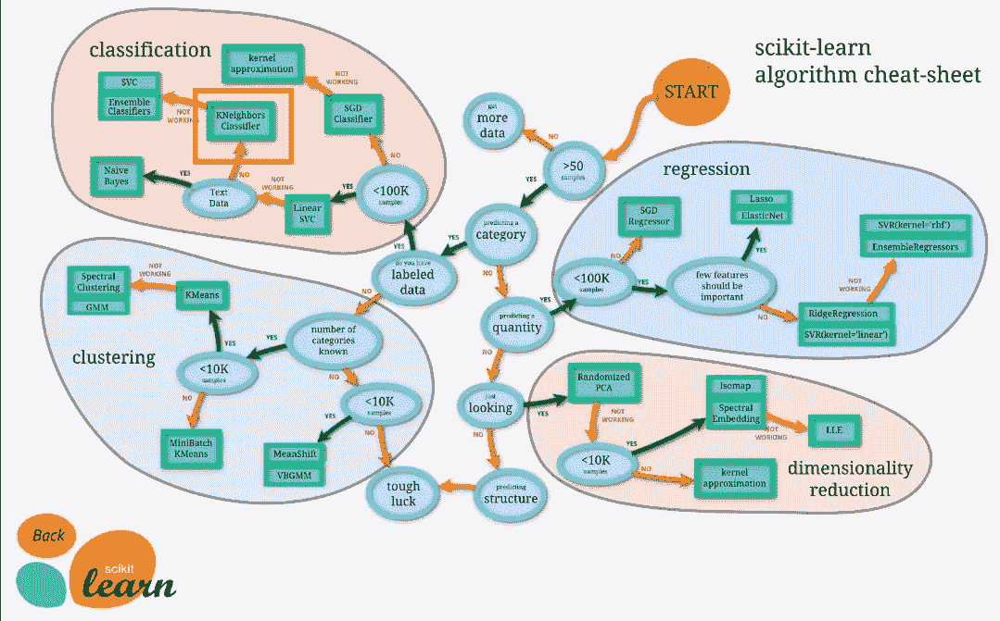

# 我怎么知道我的机器学习问题选哪个模型？作者:M. Sharma

> 原文：<https://medium.datadriveninvestor.com/how-do-i-know-which-model-to-choose-for-my-machine-learning-problem-by-m-sharma-74d04932cc3?source=collection_archive---------18----------------------->

# "数据正在成为商业的新原料."

朋友们好，今天我要告诉你的是，通过查看数据集，你如何知道我必须选择哪个模型。

那么，让我们开始吧…！

什么是数据集？

一个**数据集**(或**数据集**)是数据的集合。最常见的是，**数据集**对应于单个数据库表或单个统计数据矩阵的内容，其中表的每一列代表一个特定变量，每一行对应于所讨论的**数据集**的一个给定成员。
让我们来看一些数据集，它们是一个。 **csv** 文件的形式。

Jupyter Notebook

假设我们必须处理这个包含许多列和行的数据集。您的第一步是在**数据集中确定您的**独立变量和因变量**。**

**因变量(通常指数据集中的最后一列，即这里的最后一列是销售价格**)是在科学实验中测试和测量的**变量**。一个**独立变量(其余所有其他变量都是独立变量，如街道、地段、销售条件等。)**是在科学实验中改变或控制的**变量**，以测试对**因变量**的影响。

现在，我们已经看到了数据集的样子

你需要知道的是，你的问题是**回归问题**还是**分类问题**还是**聚类问题**。

为此，你需要看看因变量，我们现在已经知道什么是因变量了？
**【注意:如果你没有因变量，那就说明是聚类问题。】**

# 让我们看看没有 DV(因变量)的数据集是什么样子

这些数据是在我们的社会调查移动平台**what good 上收集的。我们拥有 300，000 名千禧一代和 Z 世代成员，迄今为止已经收集了 150，000，000 份调查反馈。**

**现在，如果你的数据集包含一个因变量，那么你必须看看它是否有连续结果或分类结果。**

如果这是一个连续的结果，那么你的问题就是一个**回归问题。**

如果这是一个分类结果，那么你的问题就是一个**分类问题。**

# **回归案例:**

**这是一个房价数据集，在这个数据集中，有很多行和列。你必须预测销售价格，它是因变量，然而，其余的都是自变量。你可以很容易地看到这是一个回归问题，我们必须使用一些回归模型，如随机森林，支持向量回归机等。**

********

**Jupyter Notebook**

# **分类案例:**

**现在，看看这个数据集，其中你给了**用户 ID、性别、年龄、预计工资**，这些都是**自变量**，你必须预测如果有新人来，他们是否会购买新的 **SUV** 汽车。【**注:**很容易看出这是分类问题，因为被购买的因变量只有二进制输出 0 或 1，其中 1 表示会购买 SUV，0 表示不会购买 **SUV。** ]**

****

**因此，到目前为止，我们已经有了足够的想法，通过查看数据集，我们可以将我们的问题分为回归、分类或聚类。**

**现在，我如何知道哪一个模型是最好的，例如，你正在进行房价预测，你必须根据几个参数来预测房子的价格。但是，**我应该使用哪个模型或者我应该将什么参数插入到那个**中。你所能做的就是使用网格搜索来找到最适合你的模型的参数。**

****网格搜索是做什么的？****

**它会为你的模型找到最佳值，比如应该选择哪些参数。你需要做的就是从 S **klearn 库中导入这个类。****

> *****从 sklearn.model_selection 导入 GridSearchCV*****

**在这个世界上，仅仅通过查看数据集，没有人能告诉你哪个模型能给你最好的性能或准确性。你所能做的就是通过查看数据集来对你的问题进行分类，不管数据集是线性的还是非线性的 T21，模型问题是分类、回归还是聚类问题。**

****不要难过，因为你会有** [**小抄**](https://storage.googleapis.com/kaggle-forum-message-attachments/355256/9845/1179dcJrQl0HvPpW-GIPCWQ.png) **，帮你检测型号。****

********

**Scikit Learn**

**如果您发现阅读备忘单有任何困难，请转到此链接 [**备忘单**](https://storage.googleapis.com/kaggle-forum-message-attachments/355256/9845/1179dcJrQl0HvPpW-GIPCWQ.png) **。****

**希望你喜欢这篇文章！！如果您对任何与数据科学相关的主题有任何问题或疑问，请在评论区告诉我！！我将很快在**LinkedIn.com 文章专栏**以及**媒体**上分享更多概念。**

**也给点爱吧！​**