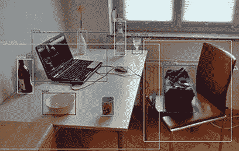
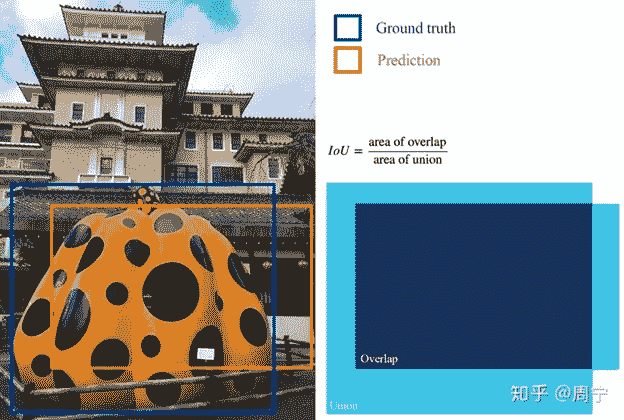
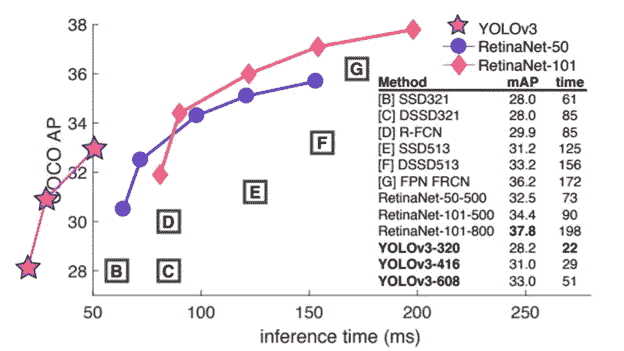

# 如何在对象检测中使用 Azure API？

> 原文：<https://medium.datadriveninvestor.com/how-do-i-use-azure-api-in-object-detection-ac8b6d34c7d8?source=collection_archive---------2----------------------->

这篇博客是系列文章的第一篇。我们将在每个博客中讨论物体检测的一些部分。其他零件请点击此处:

想知道这些关于深度学习的大肆宣传是关于什么的吗？作为一名从业者，您如何利用它来为您的组织增加价值？这一系列的博客文章将帮助你理解什么是物体检测。需要关注的关键绩效指标是什么？如何利用最先进的方法在更短的时间内简洁地完成工作。

# 大纲:

1.理解问题
2。使用 Azure API 进行对象检测
3。深度学习模型概述

# 先决条件:

1.[机器学习服务知识](https://www.aegissofttech.com/machine-learning-development-services.html)
2。关于 Web APIs 及其工作的知识
3。关于绩效指标的介绍性知识

# 什么是物体检测？

简而言之，对象检测就是输出包围盒以及表示包围在这些包围盒中的对象的类别标签。单个图像中可以有多个对象，如椅子、手提包、桌子、笔记本电脑等。多个对象可以是相同类型的，比如两个瓶子或不同类型的。它们也可以彼此重叠。



*Image URL:* [*https://upload.wikimedia.org/wikipedia/commons/thumb/3/38/Detected-with-YOLO--Schreibtisch-mit-Objekten.jpg/330px-Detected-with-YOLO--Schreibtisch-mit-Objekten.jpg*](https://upload.wikimedia.org/wikipedia/commons/thumb/3/38/Detected-with-YOLO--Schreibtisch-mit-Objekten.jpg/330px-Detected-with-YOLO--Schreibtisch-mit-Objekten.jpg)

# 对象检测与图像分割:

目标检测不同于图像分割，因为在图像分割中，我们试图获得或标记精确的像素。通常，我们想要标记每个像素，这表示它是对象的一部分，比如手提包。因此，在对象检测中，我们更关心边界框，而在图像分割中，我们更关心像素。像 UNets 这样在像素级上工作的算法本质上是耗时的。这种算法试图构建一个像素图，比如说所有这些像素都属于笔记本电脑。因为我们希望物体检测更快，所以我们在这里使用边界框。

现在，我们知道什么是输入，什么是输出，对吗？简单地说，图像是输入，输出是边界框。有多种方式来表示一个边界框:比如使用高度和宽度。对于每个包围盒，我们想知道它里面的物体是什么。

# **使用 Azure API 进行对象检测:**

我们将在 Azure API 的帮助下以自己的方式工作，因为它不会向你收取一个周末的费用，而 Google Compute 会向你收取信用卡费用，而许多读者可能没有信用卡。请记住，这里我假设您了解 Web-API 的基础知识以及它们是如何工作的。我不打算从底层细节来解释它们是如何工作的。

如果你只是在谷歌上搜索“azure object detection python”。你得到的第一个搜索结果是关于如何做的[代码集](https://docs.microsoft.com/en-us/azure/cognitive-services/computer-vision/concept-object-detection)。


图片网址:[https://docs . Microsoft . com/en-us/azure/cognitive-services/computer-vision/images/windows-kitchen . jpg](https://docs.microsoft.com/en-us/azure/cognitive-services/computer-vision/images/windows-kitchen.jpg)

如果你通读文档，你会看到，有一个图像作为输入，JSON 作为输出返回，这是目前每个 API 使用的几乎相同的格式。

```

 <代码> 
 { 
【物体】:
 { 
【矩形】:{
【x】:730，
【y】:66，
【w】:135，
【h】:85
}，
【物体】:【厨房用具】，
【置信度】:0.501 
 }，
{

{
" rectangle ":{
" x ":654，
 "y":0，
 "w":584，
 "h":473 
 }，
 "object":"person "，
" confidence ":0.855
}
，
" request id ":" a 7 FDE 8 FD-cc18–4f5f-99d 3–899
```

让我们试着理解 JSON 的输出:我们可以看到返回的对象实际上是一个数组，其中包含几个子对象。这些部分表示模型从输入图片中检测到的可能对象。我们可以看到，对于边界框(大多是矩形)，我们返回中心坐标、高度和宽度。此外，对于正在进行的预测，它将返回置信度值，该值是解释模型对该预测正确的置信度的概率。置信度值的范围是从 0 到 1。你甚至可以看到，物体的层次结构，比如一台笔记本电脑，也被预测为一台计算机，这在现实世界中是真实的。

# **Azure API 的局限性:**

如果你经历一些限制:

1)它不能检测小于图像总面积 5%的物体。

2)此外，堆叠在一起的物体有点难以识别。

3)不能区分品牌或产品名称。

最后一点，有一个与[微软
dynamics 365 consultants](https://www.aegissofttech.com/en-au/microsoft-crm-development-services.html) 完全不同的 API，让我们去参观一下。

[](https://www.datadriveninvestor.com/2020/03/29/microsoft-having-an-edge-over-chrome/) [## 数据驱动的投资者|微软比 Chrome 有“优势”

### 简史我从来不是浏览器的粉丝，确切地说，我只是一个浏览器的粉丝，Chrome。这是我的…

www.datadriveninvestor.com](https://www.datadriveninvestor.com/2020/03/29/microsoft-having-an-edge-over-chrome/) 

# **计算机视觉 API-2.0**

我们的对象检测功能是分析图像 API 的一部分。现在，假设您了解基于 Web 的 API，以及 localhost 如何向服务器发送一些请求，并根据一些请求变量/参数返回一些输出。如果你只要求一个对象，当没有指定时，它将只给你其他的，其他有效的特征类型，如成人内容、品牌、颜色、面孔、名人、地标等。也会被归还。您还可以指定希望输出使用的语言。比如说英语、汉语、日语、西班牙语等。

你也可以看看下面给出的 JSON，可以看到类似于我们上面看到的，这个描述了输入图像中存在的几种类型的对象，并以一定的置信度对其进行预测。此外，我们可以看到最终出现在输入图像中的对象的边界框。

```

 <代码> 
 { 
【类别】:【
 { 
【姓名】:【摘要 _】，
【分数】:0.00390625 
 }，
 { 
【姓名】:【人物 _】，
【分数】:0.83984375，
【详细】:{ 
【名人】:
 { 
。 
"置信度":0.9978346
}
]
}
}
，
"成人":{ 
 "isAdultContent": false，
 "isRacyContent": false，
" adultScore ":0.0934349000453949，
" racyScore ":0.06868649195 
【描述】:{ 
【标签】:[ 
【人】，
【人】，
【户外】，
【窗】，
，【眼镜】，
，
【字幕】:[ 
 { 
【正文】:《坐在长椅上的塞特亚·纳德拉》，
【信心】:0.48293603002174444 
【高度】:250 
 } 
 } 
，
【颜色】:{
" dominantcolorsforeground ":"棕色"，
" dominantcolorbeground ":"棕色"，
 "dominantColors": [ 
"棕色"，
"黑色"
 ]，
"重音颜色":" 873B59 "，

```

像 FAANG 这样的巨头在他们的文档中提供代码。您可以在 Python 语言的代码部分看到，我们将订阅密钥作为请求头的一部分提供。您还可以看到我们讨论过的作为请求一部分的几个参数。你必须在视觉特征部分指定它是一个物体，一张脸，还是别的什么东西。然后是另一段代码，说我们首先建立一个 HTTPS 连接。您将返回字节流数据。如果你想打印它，你可以使用:**print(JSON . dumps(response . JSON()))**

```
 # # # # # # # # # # # # # # Python 2.7 # # # # # # # # # # # #
导入 httplib，urllib，base64 

 headers = { 
 #请求头
' Content-Type ':' application/JSON '，
' Ocp-Apim-Subscription-Key ':' { Subscription Key } '，
}

params = urllib . urlenode({
#请求参数
' vishttps connection(' westcentralus . API . cognitive . Microsoft . com ')
conn . request(" POST "，"/vision/v2.0/analyze？%s" % params，" {body} "，headers)
response = conn . getresponse()
data = response . read()
print(data)
conn . close()
Exception as e:
print("[Errno { 0 }]{ 1 }"。format(e.errno，e . strerror))

# # # # # # # # # # # # # # # # # # # # # # # # #

# # # # # # # # # # # # # # Python 3.2 # # # # # # # # # # # #导入 http.client，urllib.request，urllib.parse，urllib.error，base64

headers = {
# Request headers
【Content-Type】:‘application/JSON’，【T38%s" % params，" {body} "，headers)
response = conn . getresponse()
data = response . read()
print(data)
conn . close()
Exception as e:
print("[Errno { 0 }]{ 1 }"。format(e.errno，e . strerror))

# # # # # # # # # # # # # # # # # # # # #
/code>
</pre>
```

如果你有兴趣看完整的代码，请访问[这个](https://docs.microsoft.com/en-us/azure/cognitive-services/computer-vision/quickstarts/python-analyze)。

# **绩效指标:**

我们如何衡量一个算法好不好？有几个术语你应该可以轻松使用:

1) **地面真理:**是绝对真理；通常由人类标记或给予。它将是一个由人在被要求时画出的有边界的盒子。在机器学习行话中，用…

2) **预测:**是机器/模型做出的预测。在机器学习行话中，用…

您想知道机器预测与人工注释的接近程度。你会做什么？我们将把这两个矩形也称为包围盒，并会计算一些所谓的交集或 IoU。



那么，理想的情况应该是怎样的呢？当两个边界框彼此完全重叠时，的值将为 1。最坏的情况是什么？当两个边界框完全不重叠时，即交叉点= 0。结果，IoU 将为 0。使用的常见阈值是，如果，那么您的预测被称为阳性(在二元分类设置的情况下)。它有时也被称为 50%。现在，这是一个边界框的表现。当我们在同一个图像中有多个对象时，也会有许多边界框。那又怎样？

我们说的是预测矩形是否与地面真实矩形重叠 50%或更多。矩形重叠问题转化为[二元分类问题](https://en.wikipedia.org/wiki/Binary_classification)。但是对于多个对象，我们有一个[多类分类问题](https://en.wikipedia.org/wiki/Multiclass_classification)。现在，对于每个班级(椅子，人，..)，我们将计算所有同类对象的平均精度，这可以使用精度曲线下的[区域来计算。](http://pages.cs.wisc.edu/~boyd/aucpr_final.pdf)

计算出每个类的平均精度后，取所有类的平均值，就会得到 mean-average-precision()。许多研究论文都有符号表示我们正在计算。不要把它和统计学中的[图](https://en.wikipedia.org/wiki/Maximum_a_posteriori_estimation)(最大后验概率)混淆。

# **深度学习模型概述:**

到目前为止，我们已经介绍了一个非深度学习的人如何利用可用的 API，而不用担心算法的东西来执行对象检测。现在，我们将转向算法部分。如您所见，我们的输入是图像或视频。我们可以将视频分解成一系列图像，然后交给模特，这样就完全没问题了。现在，输出是多少？我们需要边界框和相关的对象类标签。我们将利用 [COCO](http://cocodataset.org/) 数据集进行理解。它包含 80 个类别标签和几千张图片。因此，这是一个相当大的数据集，非常适合于图像分割和对象检测等任务。

现在，主要的权衡是速度与速度，这里的速度基本上是指给定一个输入算法的图像，它能以多快的速度输出。它可以用毫秒或每秒帧数来衡量。因此，如果算法处理图像的速度为 50 毫秒，大约等于 20 帧/秒。因为，1 秒= 1000 毫秒，因此每秒 20 幅图像。人类以 24 fps 看世界。对于无人驾驶汽车这样的系统，只有一点时间来识别其他车辆和车道，实时人脸检测系统只有一点时间来识别进入者，速度非常关键。在其他地方，平均精度非常重要。比如，医疗诊断和光学字符识别(OCR ),在这些领域，我们不能以牺牲更快的结果为代价犯太多的错误。

为了更好，像 R-CNN，快速 R-CNN 和更快 R-CNN 这样的算法，以基于金字塔网络的 FRCN 为特色。这些算法的更快版本可以更快地完成任务，因为从根本上说，它们不是为此而设计的。然后，我们有像单镜头检测和 RetinaNet 这样的算法。此外，像 [YOLO v1 (2015)、YOLO v2/ YOLO 9000](https://medium.com/@amrokamal_47691/yolo-yolov2-and-yolov3-all-you-want-to-know-7e3e92dc4899) (之所以这么叫是因为它可以识别 Imagenet 数据集上的 9000 个对象)和最近一个在阵容中的算法是 YOLO v3(2018 年 4 月)。出于同样的目的，还有其他 30 多种算法。



*Source:* [*https://pjreddie.com/media/files/papers/YOLOv3.pdf*](https://pjreddie.com/media/files/papers/YOLOv3.pdf)

现在，查看基准测试映像，我们可以看到 YOLO v3 根据它所处理的映像的大小有三种变体。YOLO-320-基本上说输入图像的大小是 320x320。我们的目标是获得更高和更少的时间。我们可以看到，YOLO v3 的速度非常快，性能非常好。输入图像越小，处理时间就越短。而当输入图像的尺寸较大时，需要更多的时间，但是有更多的机会正确检测较小的对象。因此，在 YOLO v3 提供的变体中进行选择，取决于您希望检测多小的物体。YOLO v3 是一个真正伟大的架构，它集合了各种其他模型的优点。

在下一篇博文中，我们将看看 YOLOv3 成为物体检测领域最佳模型之一的架构和调整。直到那时，**快乐学习**！

**访问专家视图—** [**订阅 DDI 英特尔**](https://datadriveninvestor.com/ddi-intel)