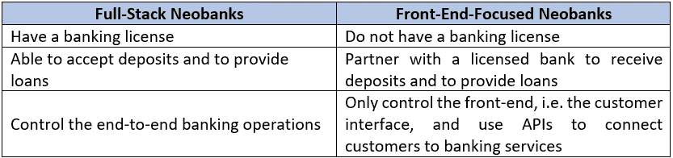
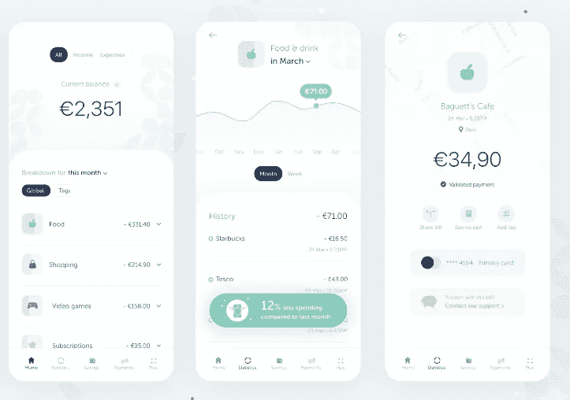
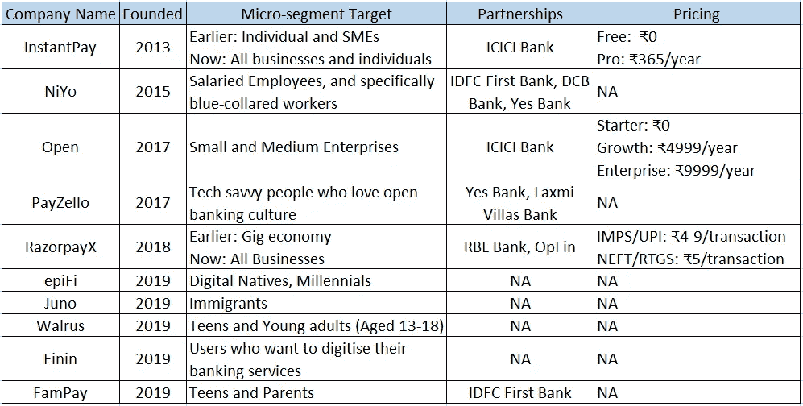

# 新银行如何成功以及印度的发展

> 原文：<https://medium.datadriveninvestor.com/how-do-neobanks-succeed-and-the-indian-developments-457e7d0864c7?source=collection_archive---------0----------------------->

新银行是 100%的数字银行。也就是说，它们没有任何物理分支，也没有相关的基础架构和员工成本。为了区分新银行和传统银行，这一点区别似乎就足够了。

但如今，我们越来越多地看到，传统银行在某些国家没有任何分支机构(例如，荷兰国际集团在澳大利亚没有实体分支机构)，这使得线变得更细。只有当我们深入了解活跃的新银行的商业模式时，差异才会显现出来。

本着同样的精神，本文旨在强调定义新银行的核心要素，提供一些关于其战略的见解，并简要介绍印度新银行是如何发展的。

# 所有新银行都是银行吗？

我查阅了银行的正确定义，在 Investopedia 上找到了一个，它将银行定义为*一个被许可接受存款和发放贷款的金融机构。*这个定义有三个要素:

*   持牌金融机构
*   接受存款的能力
*   贷款能力

如果我们假设这是真的，那么并不是所有的新银行都可以说是*银行*。相反，我们可以将它们分为两类:全栈型和前端型。

我们看到，专注于前端的新银行并不是真正的*银行。他们更像是技术公司，为他们合作的银行控制客户的数字银行体验。尽管他们更希望获得银行执照，但一些最成功的新银行( [Chime](https://www.chime.com/) 、 [Revolut](https://www.revolut.com/) 等。)没有银行牌照。所以，银行执照不是必须的。但问题仍然存在——这些新银行做了什么不同的事情来对抗巨人？*

# **成功的策略**

*提示:把新银行想象成普通的初创企业——面临同样的挑战——而不是金融机构。事实上，与大银行竞争与与大型科技公司竞争没有任何不同。如果你走得离他们太近，总有被压扁的可能。但如果你能创造出一些更优越、更差异化的东西，而不与之正面竞争——就有生存的可能。Doist 的创始人 Amir 在他的 twitter 帖子[中精彩地解释了这个想法，讲述了初创企业如何与谷歌、微软和苹果这样的公司竞争。](https://twitter.com/amix3k/status/1286665358053646336)*

新银行也遵循类似的方法。他们瞄准了一个微小的细分市场，并为他们提供数字体验所包含的功能，这些功能优于花旗、德意志银行或汇丰银行等银行所提供的功能。不是说大银行做不到这一点，但为一小部分客户创造这种体验并不是他们的首要任务。他们没有把最好的资源放在工作上。另一方面，对于新银行来说，创造这种体验才是最重要的。

那么新银行是如何做到这一点的呢？

一般新银行的战略有五个主要部分，每一步都可以使新银行与竞争对手拉开一步距离:

## **一、识别服务不足的市场**

在初始阶段，每家新银行都瞄准一个利基客户群或一个微观细分市场。这个细分市场通常是传统银行产品所基于的更广泛客户群的一个子集。一些例子:

*   Revolut(英国)以针对常旅客的解决方案起家，此后不断扩张，今年初估值超过 50 亿美元
*   Fampay (IND)正在为青少年做同样的事情，最近从 YC、红杉等公司筹集了超过 470 万美元
*   Qonto (FRA)的目标是自由职业者和中小企业，2019 年全年管理的交易额为 100 亿€

这个名单还可以继续下去。每个新银行最初都会将所有注意力转向这一组用户群。因此，即使这个领域变得拥挤，我们也可以期待看到一个新的数字银行出现在不同的领域。

## **二世。提供解决棘手问题的功能**

下一阶段是 neobanks 开始为他们的移动应用构建框架——通过聚焦于单一细分市场的相似性和痛点。这些痛点引导着产品的特性。例如，对于以中小企业为基础的新银行，费用和账户管理将具有更高的优先级。但对于围绕常旅客的产品，低外汇费用和高旅游奖励的排名会更高。无论如何，这个阶段的想法是提供针对特定用户群的功能。

研究表明，大多数功能对于 80 多家新银行来说都很常见，可以在较高层次上进行组合:

*   免费账户和低费用:大多数新银行提供基本账户，没有月费或账户维护费。有些还允许免费透支(Chime，Varo Money 等。)并且对账户没有最低余额要求。所有这些都是当今常见的客户获取策略，但提供此类服务成本高昂，并对银行的资产负债表造成沉重打击。这是建设大型网络的成本，在今天相当普遍。
*   **轻松的资金流动:**费用上的利他主义甚至影响到资金转移和汇率。如果你碰巧浏览了 neobanks 的网站，几乎所有银行都承诺节省外汇。neobanks 的另一个新增功能是应用内多货币(有时甚至包括加密货币)支付支持，即允许使用默认货币以外的货币进行支付，并进行实时转换。
*   **高收益储蓄账户:**第三，银行账户储蓄利率始终是消费者的重要决策变量。新银行意识到了这一点，有些银行提供的年收益率比传统银行的平均储蓄 APY 高出 1 至 1.5 个百分点。这再次侵蚀了新银行的利润。但与此同时，这也是获得客户并将他们的钱长期保留在银行账户中的一个好方法。毫不奇怪，如今更多的新银行正在使用这种策略，这与通常的价格战没有太大区别。
*   **预算工具:**这可能是新银行最具创新性的功能。基于过去支出的现金流预测，用于支出分类的“储蓄罐”(比如，食品和燃料支出在不同的标签中自动分类)，为泰国之旅设定储蓄目标，这个列表是无穷无尽的。对于争夺同一客户的新银行来说，支出分析的质量通常是一个差异化点。
*   **奖励:**不像传统的卡上奖励那样复杂，有许多隐藏的 T&c，neobanks 的卡奖励试图通过更透明地传达返现利益和其他奖励来弥合这一差距。此外，由于客户的体验完全是在智能手机上进行的，一些新银行还允许基于消费的奖励等级，或者提供定制的商户名单，供客户选择返现和折扣。
*   **附加功能:**除了上述功能，neobanks 还提出了几个创新的解决方案来获得客户并脱颖而出。一个这样的例子是 bunq，如果用户花了一定的钱，它就代表用户种树。事实上，大银行并不是最具创造力的实体，它们通常会向金融科技寻求创新。第二阶段的这一步是新的数字银行形成自己身份的机会——通过对功能的创新。

上述许多功能被业内称为个人财务管理(PFM)工具，对于数字优先的客户来说，这些工具约占当今新银行应用程序总功能集的 60%。但随着银行牌照在新银行中变得越来越普遍，我们应该会看到银行产品将注意力从分析工具上转移开。

## **三。打造卓越的 UX**

上述两个阶段对于构想新银行将如何存在至关重要——它将为谁服务以及如何服务。但出色的用户界面和体验是将 neobanks 推向主流的助推器。从比主要传统银行更快地开立银行账户 [18X](https://builtformars.co.uk/banks/opening/) 到以 10 倍的速度接收支付通知并在应用程序中控制对借记卡的访问，通过用户友好的界面在移动设备上进行银行业务的便利性为银行业务体验树立了新的标杆。实际上，如今新银行不断推动传统银行改进其移动应用和消费者功能。

Credits: A UX prototype for a Neobank via [Juliette Lagache](https://dribbble.com/juliettelagache)/Dribbble

所有应用程序的共同点是界面干净、简洁、用户友好。不仅易于使用，而且它们的应用内客户支持和客户友好的常见问题解答响应速度非常快。一旦 neobank 的想法和 UX 成型，产品的 MVP 就可以发布了。

[*专为火星打造*](https://builtformars.co.uk/banks/) *对 Monzo、Starling、Revolut 等新银行相对于更大银行设立的用户体验做了令人难以置信的深入分析。如果你有时间，并且想了解 UX 是如何产生巨大影响的，我强烈建议你看一看他们的分析。*

## **四。扩大合作伙伴关系**

一旦新银行凭借自己的功能和用户体验发现并占领了一个服务不足的市场，它们总是会扩大规模。第一次尝试是涉足独特的营销策略，如早期获取高级功能，或像 plant-a-tree initiate 这样的 bunq。但要想快速扩大规模，与银行和专业金融科技公司的合作是主要的催化剂。

合作伙伴关系对于扩大产品组合至关重要，即提供保险、财富管理、养老金和储蓄以外的其他解决方案，以及将服务扩展到更多地区。作为 neobanks 的合作伙伴，他们可以使用 API 在其平台上提供第三方服务。这些 API 中转使他们能够访问财务数据，赚取佣金，增加产品供应，并以相对较少的努力扩大用户群。例如，Revolut 或 Starling 银行与 PensionBee 合作，以获得难以置信的养老金系统。通过专业的金融科技提供财富管理服务，通过不同国家的不同银行接受本币存款。无论产品计划如何，合作伙伴关系为从 X 到 10X 铺平了道路。

## **五、盈利价格**

和往常一样，最后一个问题是关于盈利能力。新银行的优势在于，它们完全数字化，比传统银行更精简。这些数字证实了这些优势。Finnovate 表示，新银行的运营效率更高，成本效率约为 46%,而传统银行的成本效率为 50 %- 60%。此外，总资产的高增长也让新银行保持了较低的成本收入比。

值得注意的是，新银行的平均客户获取成本约为 1-38 美元，而传统银行约为 200 美元，分销成本约占总成本的 6%,而零售银行业约为 27%。这些数字和高速增长的用户群无疑是新银行的优势。

尽管如此，根据埃森哲的数据，如今每名用户平均损失约 11 美元。这在很大程度上是因为银行账户的慷慨特性。幸运的是，有很多盈利的新银行的例子(Revolut、Kakao、Nickel 等)，银行业以吸引非常有粘性的客户而闻名，你总是可以向他们追加销售或交叉销售高利润的产品。

就盈利能力而言，新银行最常用的两种策略是定价和增值服务。

*   **免费增值定价策略:**尽管大多数新银行免费提供他们的标准服务——账户、转账、取款和借记卡，但他们对额外功能收费，如分析用户财务或帮助他们投资。
*   **多层高级订阅费:**类似于免费增值定价，但不是功能，订阅是跨帐户层安排的。虽然标准帐户通常是免费的，但其他帐户要求按月或按年收费，并提供一系列高级功能。最著名的是，Revolut 遵循[这种](https://www.revolut.com/our-pricing-plans)策略，提供免费的基本账户、6.99/m 的高级账户和 12.99/m 的金属账户。

# 印度新银行怎么样？

看到印度新银行业的发展令人兴奋。我之所以说发展，是因为这个国家已经有了一系列多样化的、有前途的(资金雄厚的)新银行。它的大部分是在最近几年才被填满的，我们可以预期在我们说话的时候，地下会有许多其他的气泡和形成。

这位企业家的乐观并非没有道理。毫无疑问，通过手机为没有银行账户的人或年轻人提供银行服务有着巨大的潜力。印度以外有足够多的新银行模式可供我们借鉴。此外，合众国际社的爆发和 Jio 的加入有助于让数字支付和互联网变得司空见惯——这是比我们更先进的国家也会羡慕的。

在这个问题上，我只保守地介绍了一些新银行是如何在印度建设的，下面的表格应该会给我们一个很好的描述。

Source: Company websites and YourStory

我们看到相当多的新银行瞄准了中小企业和千禧一代——既受到传统银行业务复杂性的困扰，也越来越习惯于数字生活方式。此外，对大型银行的不信任也为较小的特定用例银行提供了一个机会。

也就是说，对新银行来说，零售银行业务面临的挑战仍然很少。随着 UPI 交换费(MDR)降至零，金融科技公司的一个重要收入来源已经被浇灭。此外，印度落后的监管规定，使得大多数新银行获得银行牌照还需要数年时间，而且它们将不得不依靠合伙制来提供银行服务。

无论哪种方式，这都是数字银行充满希望的时代，想象一下未来 3-5 年印度银行业的格局会很有趣，因为更多的银行会挑战现有的银行。但在我结束之前，有几个预测是合适的:

1.  预计千禧一代的新银行空间将很快变得拥挤，围绕现金返还和折扣展开了战斗
2.  与网飞、Slack、Byju's、Teams 等商业和消费者平台合作，在数字账户和消费上获得回报将变得非常普遍
3.  在接下来的三到五年内，新银行将会看到更多来自科技公司如 Jio、Paytm 和 CRED 的收购，而不是来自大银行的收购

据我们所知，我可能在这三个问题上都是错的，但是我们将不得不等待，看看这一切是如何展开的！

希望这篇文章是信息性的。如果你有任何想法要分享，请在回复中或通过 [*LinkedIn*](https://www.linkedin.com/in/princejain191/) *告诉我。祝您愉快！*