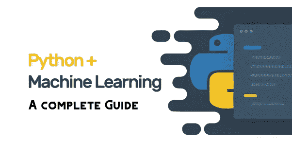
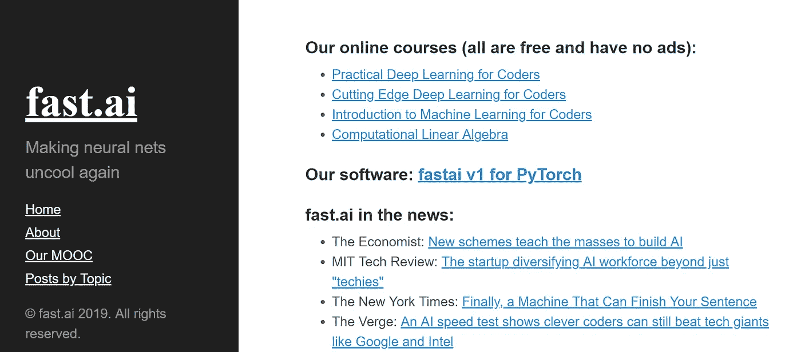
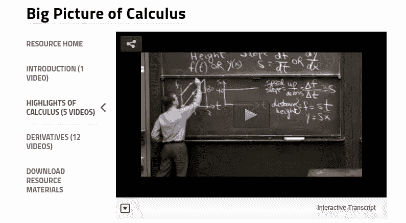

# 非计算机专业如何转行 AI，在机器学习方面做出一番事业？2021 年完整指南

> 原文：<https://medium.datadriveninvestor.com/how-do-non-computer-majors-switch-to-ai-and-make-career-in-machine-learning-a-complete-guide-2020-df88a9a0b98b?source=collection_archive---------10----------------------->

AI 时代即将到来，现在是学习 AI 的重要时机。

可能要 6 个月才能转行引入 AI。

我写了这个指南带你去深度学习半年。

在本指南中，我先给大家介绍一下零基础入门深度学习可行的材料和学习方法。当然，虽然是零基础，但是门槛很小。您需要满足以下条件:

*   在接下来的 6 个月里，每周花 10-20 个小时学习
*   已经具备一定的编程技能，了解一些编程的基础知识。
*   有一定的数学基础(代数和几何等。)
*   有一台电脑和工作互联网连接

# 第一阶段

想学车，应该坐在车里，通过模拟真实驾驶环境来学习，而不是先了解内燃机和离合器的工作原理。深度学习也是如此。我们需要遵循这种自上而下的方法。

 [## 2019 年最值得学习的编码语言|数据驱动的投资者

### 在我读大学的那几年，我跳过了很多次夜游去学习 Java，希望有一天它能帮助我在…

www.datadriveninvestor.com](https://www.datadriveninvestor.com/2019/02/21/best-coding-languages-to-learn-in-2019/) 

推荐 Fast.ai 的教程《程序员实用深度学习—第一部分》。本课程需要 4 到 6 周时间，包括在云中运行代码的课程。

让我们从这门课开始。

当然，还有一些其他好的服务平台供你选择，包括 Paperspace、亚马逊 AWS、谷歌云平台(GCP)、Crestle 和 Floydhub。

但是请记住，现在还不是开始构建模型的时候。

程序员实用深度学习地址: [Fast.ai](http://www.fast.ai)

 [## 主页

### 这篇论文是关于 fastai v2 的。arXiv 上有这篇论文的 PDF 版本；它已经过同行评审，并且…

www.fast.ai](http://www.fast.ai/) 

# 第二级

是时候学习一些基础知识了。在这个阶段，你需要学习微积分和线性代数。

麻省理工学院的微积分大图课程可以给你一个微积分基础的快速概览。

对于线性代数，麻省理工知名教授 Gilbert Strang 的公开课 Ware 是个不错的选择。

学完以上两门课，推荐你去读深度学习的矩阵微积分(Matrix Calculus For Deep Learning)，三藩市大学科学家，fast.ai 联合创始人杰瑞米·霍华德。

微积分大图地址:

[https://ocw.mit.edu/resources/r es-18–005-2010 年春季微积分集锦/微积分集锦/微积分大图/](https://ocw.mit.edu/resources/res-18–005-highlights-of-calculus-spring-2010/highlights_of_calculus/big-picture-of-calculus /)

开放式课程地址:

[https://ocw.mit.edu/courses/mat 数学/18–06-线性代数-春季-2010 /](https://ocw.mit.edu/courses/mathematics/18–06-linear-algebra-spring-2010/)

深度学习的矩阵演算地址:

【parrt.cs.usfca.edu/doc/矩阵-微积分/index.html http://T3

# 第三阶段

经过前两个阶段的基础巩固，我们现在有时间实施上面提到的自下而上的学习方法。

现阶段推荐你上 Coursera 上的深度学习课程，里面有吴恩达创办的 deeplearning.ai 的 5 门课程。

Coursera 上“微专业”的获取方式和大学会展行业很像。学完课程后，需要完成相关作业。但实际上你应该得到一个专业。

理想情况下，根据你目前的基础，完成一门课程需要一周时间。

deeplearning.ai 课程地址:

[https: // www。coursera.org/specializa 选项/深度学习](https://www.coursera.org/specializations/deep-learning)

# 第四阶段

> 光学不会玩，聪明的孩子也会变傻。

是时候了解一下深度学习库了。TensorFlow，PyTorch，MXNet 都需要学习一下，你可以针对自己喜欢的问题，从零开始搭建一个架构。

至此我们可以发现，前三步是为了理解什么是深度学习。从第四步开始，你需要学习从零开始实现一个项目，学习使用各种工具建立模型。

# 第五阶段

现在，你可以看看刚才提到的 fast.ai 课程的第二部分，这是面向编码人员的课程《前沿深度学习》。这里包含的问题更高级，你将学会阅读最新的研究论文，并学会理解它们。

以上每个阶段都需要 4 到 6 周的时间去理解它们。经过如上 26 周的学习，你将为深度学习打下坚实的基础。

面向程序员的前沿深度学习课程地址:

[http://course.fast.ai/part2.ht ml](http://course.fast.ai/part2.ht ml)

# 下一站

之后可以学习斯坦福的 CS231n:用于视觉识别的卷积神经网络和 CS224d:用于自然语言处理的深度学习。他们对视觉和 NLP 有深入透彻的解释。

如果你有时间，我也推荐你看一下这个深度学习，对巩固理解很有帮助。

CS231n 课程地址:

[http://cs231n.stanford.edu/](http://cs231n.stanford.edu/)

CS224d 课程地址

[http://cs224d.stanford.edu/](http://cs224d.stanford.edu/)

深度学习电子书地址:

[。deeplearningbook.org/](http://www.deeplearningbook.org/)

学习深度学习是一种快乐，快乐的学习！