# 回归树是如何工作的？

> 原文：<https://medium.datadriveninvestor.com/how-do-regression-trees-work-94999c5105d?source=collection_archive---------4----------------------->

之前我们谈到了决策树以及如何在分类问题中使用它们。现在我们把注意力转移到回归树上。回归树的不同之处在于，它们旨在预测一个可以被认为是实数的结果(例如，房子的价格或个人的身高)。“回归”这个词对你来说可能听起来很熟悉，也应该如此。我们看到这个术语出现在一个非常流行的叫做线性回归的统计技术中。尽管线性回归和回归并不相似，但是“回归”部分背后的基本思想是相同的。回归试图确定一个因变量和一系列自变量之间的关系。

在本文中，我们希望说明线性回归和回归树在有用性上的区别，构建我们自己的回归树，并用 Python 实例化一个回归树。

# **问题**

假设我们是科学家，已经开发出一种全新的药物来治疗普通流感。

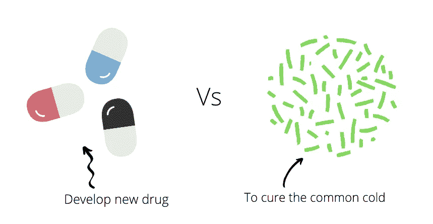

然而，我们不知道患者的最佳剂量。为了研究这个问题，我们进行了一个不同剂量的临床试验，并测量每个剂量的有效性。最终，我们希望准确预测药物在某一剂量水平下的疗效。

## 线性回归

如果我们在一些假设的场景中绘制临床试验的结果，数据点可能看起来类似于下图。

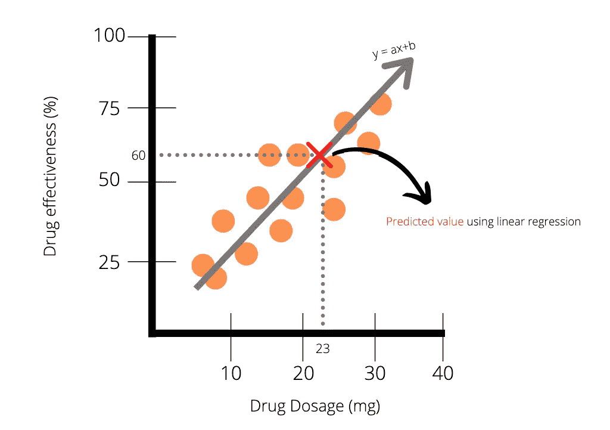

Plot A

上图(图 A)中的数据点表明药物剂量和药物效率之间存在某种正相关。这意味着一般来说，剂量越高，效率越高。我们可以很容易地用线性回归拟合出该数据的直线，并使用最佳拟合线来绘制预测。例如，23 毫克的药物剂量具有 63%效率的预测值。不幸的是，数据似乎并不总是表现得那么好。更现实的情况是，我们最终得到的数据点可能会更加嘈杂。这在下面的情节中可以看到。

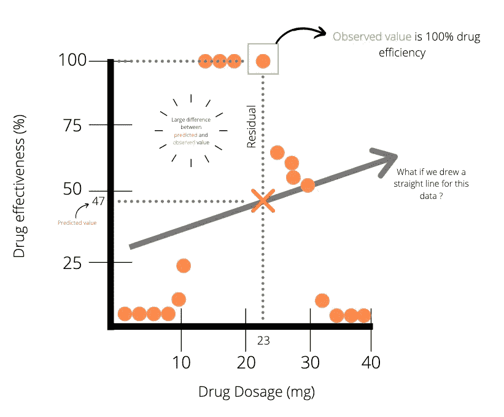

Plot B

将线性回归应用于上述数据点(图 B ),我们注意到，对于 23 mg 的药物剂量，预测值和实际值之间存在很大差异。显然，线性回归可能不是对数据建模的最佳方法。好吧，我们还能用什么方法呢？是的，你猜对了，就在标题里:**回归树。**

[](https://www.datadriveninvestor.com/2020/03/24/encoder-decoder-sequences-how-long-is-too-long/) [## 编码器解码器序列:多长是太长？数据驱动的投资者

### 在机器学习中，很多时候我们处理的输入是序列，输出也是序列。我们称这样的一个…

www.datadriveninvestor.com](https://www.datadriveninvestor.com/2020/03/24/encoder-decoder-sequences-how-long-is-too-long/) 

## 回归树

回归树类似于决策树，但是有代表真实值的叶节点。为了说明回归树，我们将从一个简单的例子开始。不要担心，我们将很快进入细节。对于我们树的*根节点*，我们问:“剂量小于 14 mg 吗？”。然后使用图 B 中的数据点，我们应该得到一个类似下图的树。

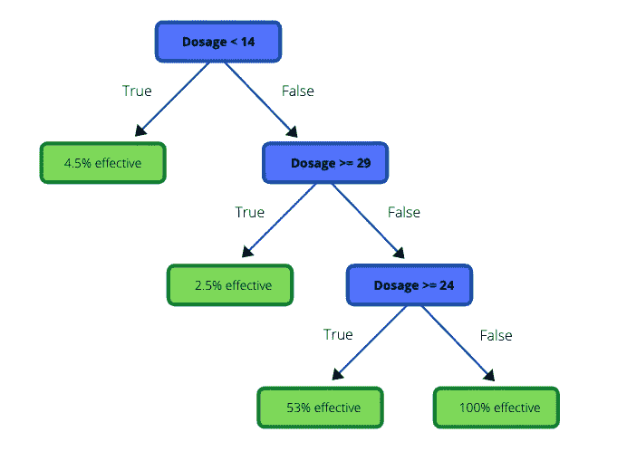

Example of a regression tree

如果根节点中问题的答案是“真”，那么我们被定向到左边的节点，否则，我们被定向到右边的节点，这样继续下去。

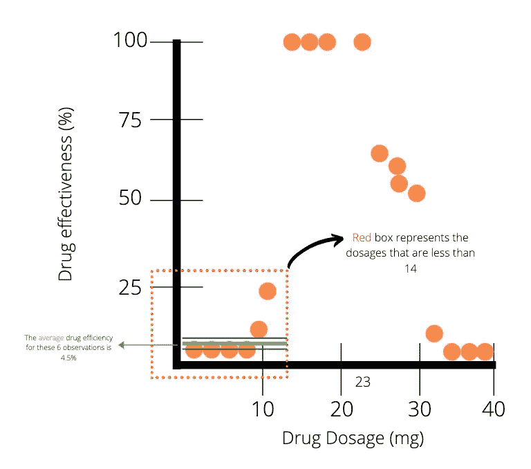

现在让我们关注左边的第一个叶节点:我们是如何得到 4.5%这个值的？因为我们在根节点中有一个阈值 14，我们查看比 14 少**的观察值，并计算它们的**平均值**。在我们的例子中，前 6 次观察的平均值是 4.5%(效率)。**

**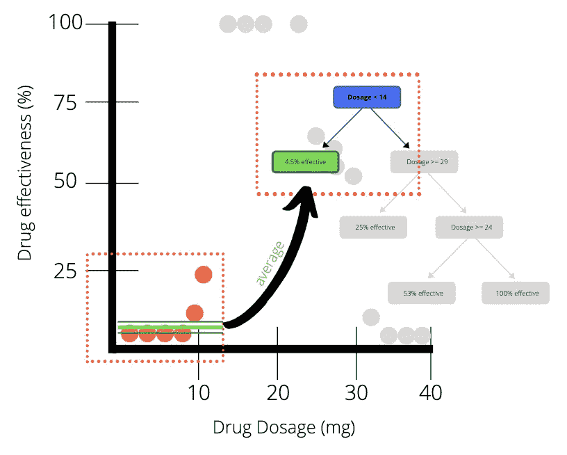**

**一旦第一个叶节点完成，我们可以对右侧的节点应用相同的过程。下图中的每个红色块代表一个叶节点。**

**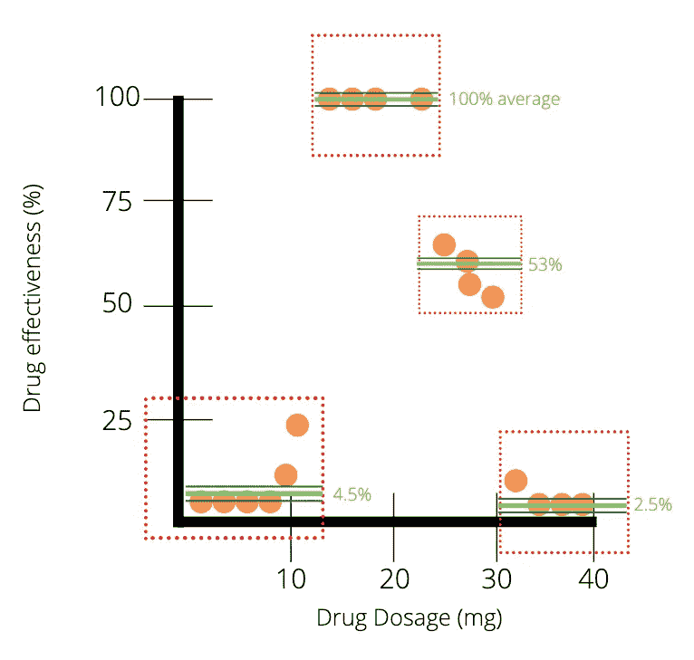**

> ***让我们看看如何得到*****(效率为 100%的叶节点)******

****通过遵循节点设定的条件直到最后，我们得到右边的最后一个叶节点。如果剂量大于 14 但小于 29 和 24，我们将剩下一个间隔，在下图中突出显示。红框中 4 次观察的平均药物有效性为 100%。****

****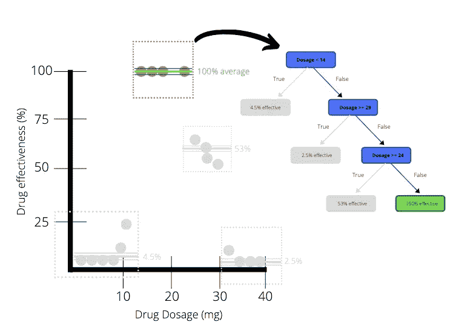****

****因此，该树使用平均值(100%)作为 14.5 到 23.5 之间剂量的预测值。****

# ****构建我们自己的回归树****

****既然我们已经完成了回归树的示例，让我们使用图 b 中相同的非结构化数据从头开始开发一个。构建回归树的第一部分是**决定根节点**中的阈值。你还记得博客中关于决策树的类似问题吗？****

****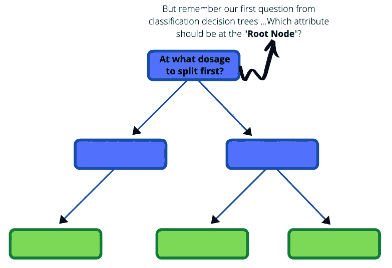****

****为了帮助我们做出决定，我们将首先关注两个最小剂量**的观察结果**。这两名患者之间的平均剂量为 **3 毫克**。我们在点 3 处画了一条垂直线来表示我们数据中的分裂。****

****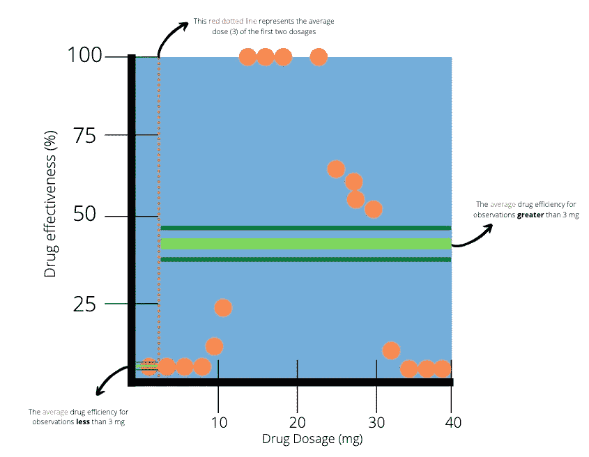****

****突出显示为红色的两个点代表两个最小的剂量。红色虚线将数据分为两部分。下一步是计算红色虚线左侧和右侧观察值的平均效率。在左侧(小于 3 mg)，只有一个观察值，其平均值为 0%。右手边(大于 3mg)观察多，平均值 38.8。****

****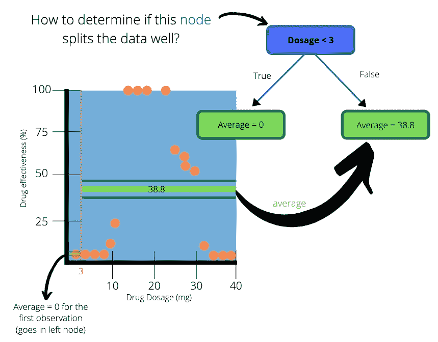****

****我们用“剂量< 3” as the root node and two subsequent leaf nodes. The average on the left-hand side of the dotted line goes into the left leaf node and the average on the right-hand side goes to the right leaf node. The values in the leaf nodes are the predictions that this simple tree will make for drug effectiveness.****

> *******创建一个简单的树如何确定我们的简单树拆分数据*** *有多好？*****

****左叶节点完美地预测了结果。剂量小于 3 毫克的实际效率是 0%，我们的树也是这样预测的。但是，当有这么多的观测值需要考虑时，我们如何检查右侧的准确性呢？****

****我们可以使用线性回归中常用的一种方法:****

> ****残差平方和****

****残差是从数据点到回归线的距离的度量。SSR 测量我们的数据和回归树预测的值之间的总体差异。一般来说，较低的 SSR 表明回归模型可以更好地解释数据，而较高的 SSR 表明模型不能很好地解释数据。SSR 的公式:****

****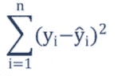****

****Formula for SSR****

****我们可以通过构造从观察值到预测值的直线来显示简单树的残差。请再次注意，在左侧，预测值等于观察值。****

****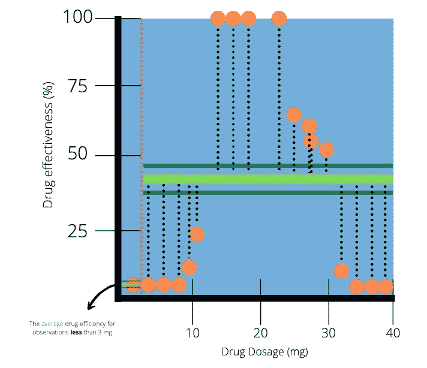****

****我们可以使用残差来量化简单树所做预测的质量。接下来，我们通过添加左右叶节点的 SSR 来计算树的 SSR。****

****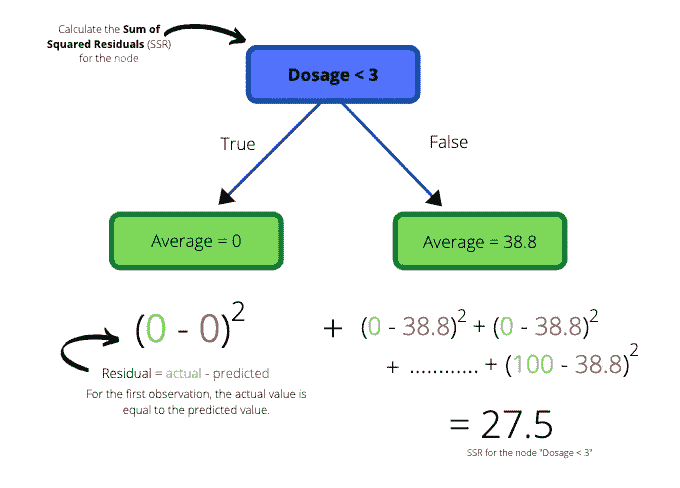****

****我们得到该树的总 SSR 值为 27.5。然后将整个过程应用于第二个和第三个最低的观察值、第三和第四个最低的观察值，依此类推...****

****一旦我们计算了由成对的观察得到的树的所有 SSR 值，我们可以将 SSR 值绘制成剂量阈值的函数。****

****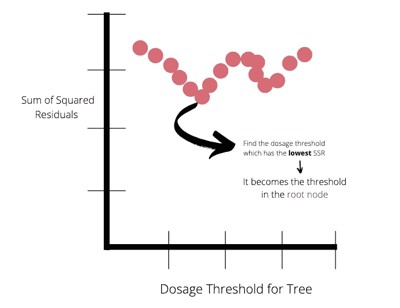****

******最低的 SSR 值代表剂量阈值，它将位于树的根节点。**在这种情况下，最低的 SSR 值是 14。****

****一旦决定了根节点，数据将被分成左右两个节点。这些节点还需要一个最佳阈值来进一步分割数据。我们如何着手选择这些阈值？用于获得根节点的相同过程现在被应用于树的剩余节点。每个节点应该有一个代表可用的最低 SSR 值的阈值。一旦数据不能被进一步分割(在训练数据中只有一个观测值)或者分割是多余的(如果所有观测值具有相同的值)，节点本身就成为叶节点。****

# ******用 Python 构建回归树******

****在这里，我们将快速浏览一下用 Sklearn 包在 Python 中构建回归树****

********

****Photo by [Safar Safarov](https://unsplash.com/@codestorm?utm_source=unsplash&utm_medium=referral&utm_content=creditCopyText) on [Unsplash](https://unsplash.com/s/photos/code?utm_source=unsplash&utm_medium=referral&utm_content=creditCopyText)****

******关于数据集******

****我们将生成一个随机数据集来代表前面讨论的临床试验示例。****

*****注意*:在笔记本中，我们不清理数据。这样做的原因是博客的目的是说明如何运行回归树分类器，而不是展示数据清理技术。正确清理数据的责任在读者身上。数据清理和准备是数据科学领域中极其重要的阶段，不容忽视。****

******导入必要的库******

```
**import pandas as pd
import numpy as np
from sklearn.tree import DecisionTreeRegressor
from sklearn.model_selection import train_test_split
import matplotlib.pyplot as plt**
```

******创建随机数据集******

```
**rng = np.random.RandomState(1)
X = np.sort(5 * rng.rand(80, 1), axis=0)
y = np.sin(X).ravel()
y[::5] += 3 * (0.5 - rng.rand(16))**
```

****使用上面的代码生成 x 和 Y 数组。用户可以选择自己的重现性参数。****

******查看数据集******

```
**plt.figure()
plt.xlabel("Dosage (mg)")
plt.ylabel("Efficiency")
plt.scatter(X, y)
plt.show()**
```

****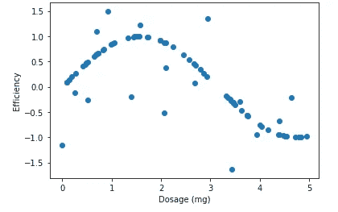****

****与例子中的因变量不同，我们将考虑一些任意的药物剂量效率的度量。注意图中的趋势。最佳剂量似乎是 1.8 毫克左右。我们的目标是在给定剂量的情况下预测药物的疗效，所有这些都要借助回归树。****

******创建培训和测试数据集******

****下一步是将我们的数据分成**训练**和**测试**数据集。训练数据集用于训练/创建回归树。然后在我们的测试数据集上测试回归树，看看它在看不见的数据上表现如何。我们使用 Sklearn.model_selection 中的 train_test_split 函数来实现这一点。****

```
**# Create the training and test sets
X_train, X_test, y_train, y_test = train_test_split(X, y, test_size=0.2, random_state=123)**
```

******实例化回归树分类器******

****这里我们实例化回归树分类器并设置参数。所有参数在[这里](https://scikit-learn.org/stable/modules/generated/sklearn.tree.DecisionTreeRegressor.html)都有详细说明。我们将只讨论其中的几个:****

****1)**criteria*{ " MSE "，" friedman_mse "，" mae"}，default="mse"* :** 衡量一个拆分质量的函数。支持的标准是均方误差的“mse ”,其等同于作为特征选择标准的方差减少，并使用每个终端节点的平均值最小化 L2 损失，“friedman_mse ”,其使用具有 friedman 改进分数的均方误差用于潜在分裂，以及平均绝对误差的“mae ”,其使用每个终端节点的中值最小化 L1 损失。****

****2) **max_depth: *int，default=None:*** 树的最大深度。如果没有，则扩展节点，直到所有叶子都是纯的，或者直到所有叶子包含少于 min_samples_split 样本。****

****3)**min _ samples _ split:*int 或 float，default=2* :** 拆分内部节点所需的最小样本数****

****可以调整参数，以便根据一些选择的标准找到最佳回归树。网格搜索是一种用于返回最佳参数的常用方法。****

```
**clf = DecisionTreeRegressor(max_depth=2)**
```

******使分类器适合训练集******

```
**clf.fit(X_train, y_train)**
```

******预测测试集的目标变量:y_pred******

****在我们的情况下，这是药物效率。****

```
**y_pred = clf.predict(X_test)**
```

******查看测试数据集中的预测值和观察值。******

```
**plt.figure()
plt.scatter(X_test, y_pred, s=20, edgecolor="black",
            c="darkorange", label="Observed values")
plt.scatter(X_test, y_test, s=20, edgecolor="black",
            c="blue", label="Predicted values")plt.xlabel("Dosage (mg)")
plt.ylabel("Efficiency")
plt.title("Decision Tree Regression")
plt.legend()
plt.show()**
```

****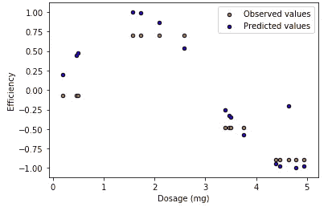****

****Regression tree on test data****

******警告******

****深度值较大的回归树很有可能过度拟合训练数据集。当这种情况发生时，当暴露于新的和看不见的数据时，模型不太可能表现良好。为了克服这个障碍，可以减小树的最大深度，或者增加分裂内部节点所需的最小样本数。另一种流行的技术是修剪回归树。修剪是一种通过删除树中对实例分类没有什么帮助的部分来减小回归规模的技术。****

*****参考文献*****

****[](https://corporatefinanceinstitute.com/resources/knowledge/other/sum-of-squares/) [## 平方和-定义、公式、回归分析

### 平方和(SS)是一种统计工具，用于确定数据的离差以及数据的好坏

corporatefinanceinstitute.com](https://corporatefinanceinstitute.com/resources/knowledge/other/sum-of-squares/) 

[Josh Starmer 的 stat quest](https://www.youtube.com/watch?v=g9c66TUylZ4&t=493s)

[](https://scikit-learn.org/stable/auto_examples/tree/plot_tree_regression.html) [## 决策树回归-sci kit-了解 0.22.2 文档

### 基于决策树的 1D 回归。决策树用于拟合带有附加噪声观测值的正弦曲线。作为…

scikit-learn.org](https://scikit-learn.org/stable/auto_examples/tree/plot_tree_regression.html)****