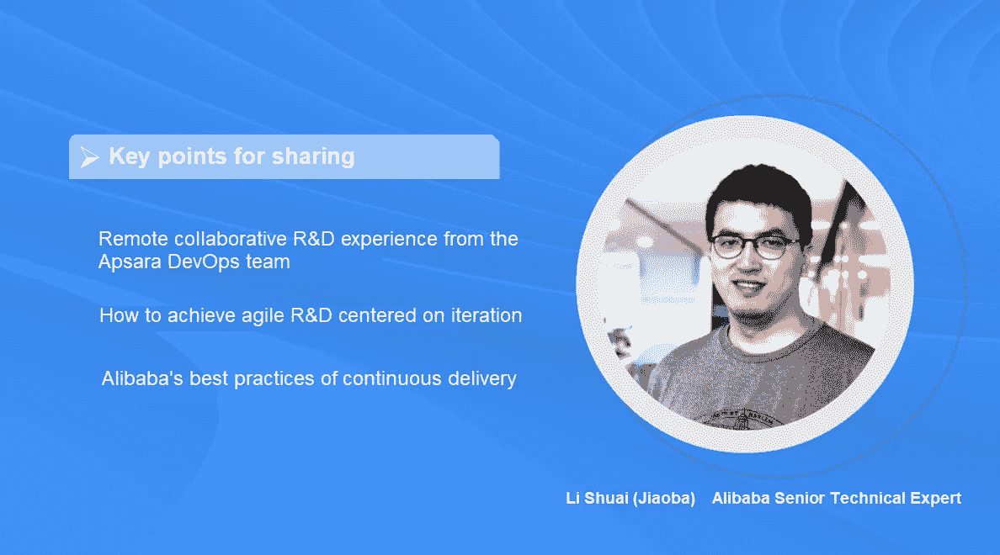
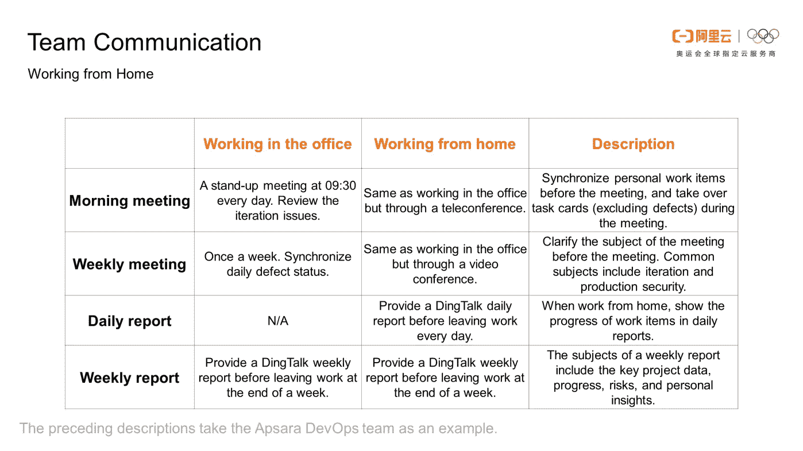
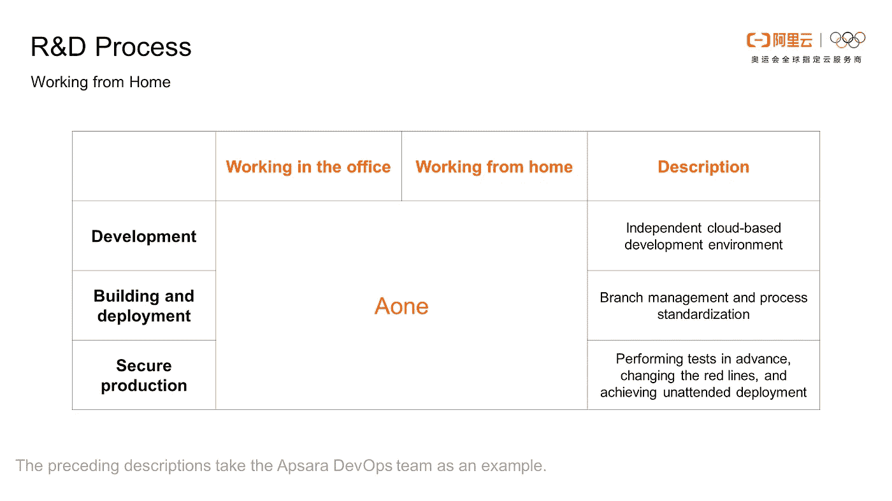
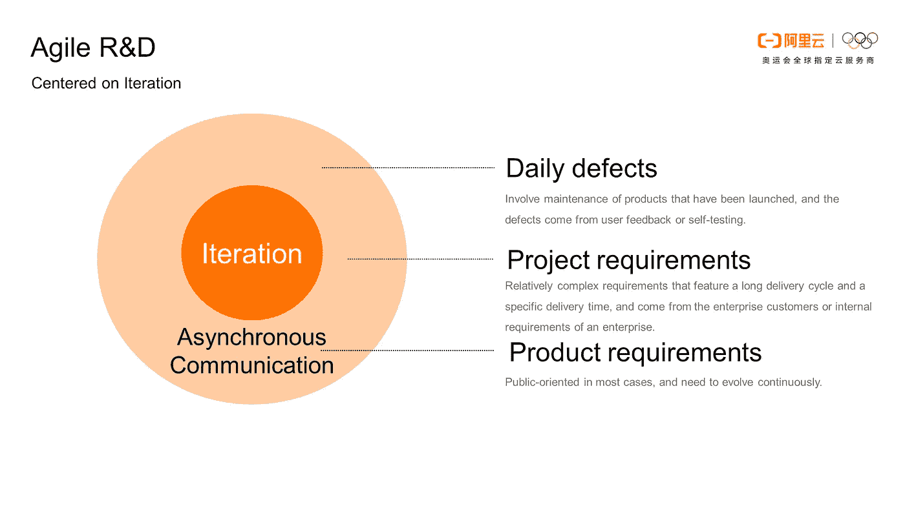
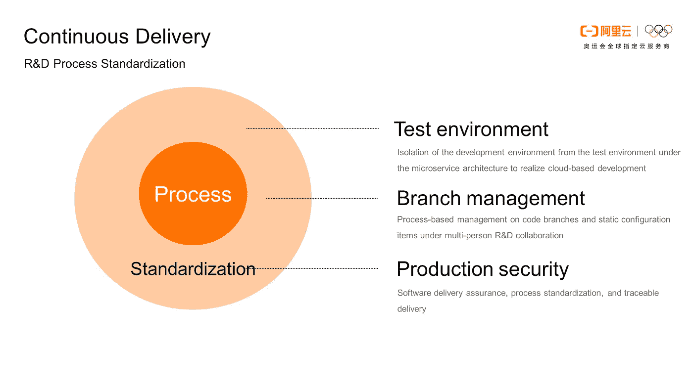
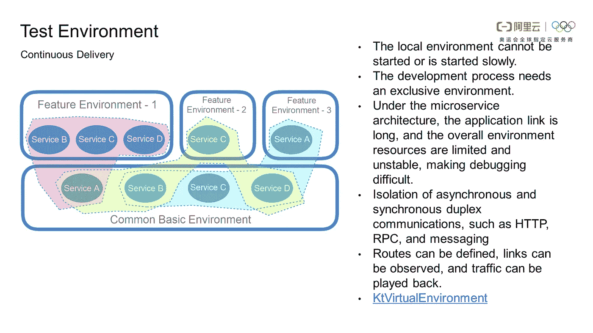
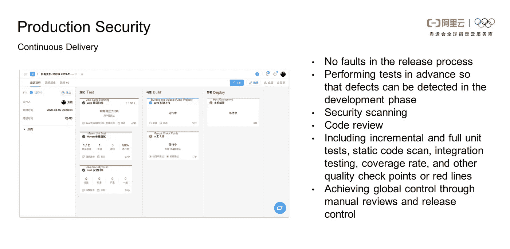
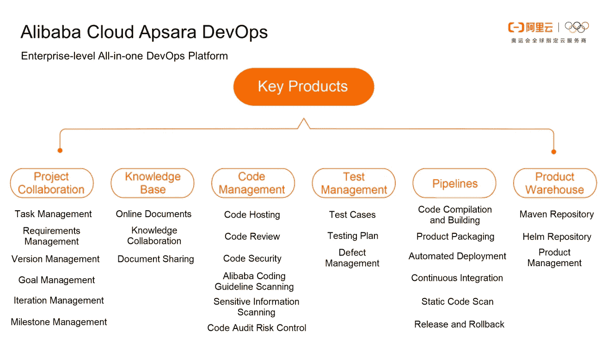

# 中小企业如何在家中高效开发软件

> 原文：<https://medium.datadriveninvestor.com/how-do-smes-efficiently-develop-software-at-home-3139250b221c?source=collection_archive---------16----------------------->

*通过* [*反新冠肺炎中小企业支持计划*](https://www.alibabacloud.com/campaign/anti-covid-19-sme-enablement-program) *，在爆发中支持您企业的增长和数字化转型。为所有新的中小企业客户提供 300 美元的优惠券，为付费客户提供 500 美元的优惠券。*

*阿里巴巴高级技术专家焦霸*

*以下为分享实录，内容有删节。*

# 在家办公如何解决团队沟通和 R&D 流程的问题

软件 R&D 团队在家工作时遇到了两个核心问题:团队沟通和 R&D 过程。Apsara DevOps 团队的成员分布在多个城市，他们曾经举行在线会议进行交流。因此，当团队成员开始在家工作时，他们之间的沟通和协调受到的影响较小。然而，小组成员之间仍然存在沟通问题。平时，子团队成员在办公室工作时，可以通过面对面的沟通高效处理问题。但是这对于远程通信是不可能的。经过 10 多天的调整，我们逐渐解决了这个问题，提高了沟通的效率。本文以 Apsara DevOps 团队为例，展示了在办公室工作和在家工作的区别。

晨会和周会期间交流的问题基本没有变化，只是会议的形式有所不同。在办公室工作时，我们都是面对面交流，而在家工作时，我们通过电话会议和视频会议交流。此外，为了提高沟通效率，我们需要同步个人工作项目，并提前明确会议主题。在家办公时，除了周报，每天下班前还用日报披露个人工作进展和可能存在的风险。

就 R&D 过程而言，如果您的团队不采用标准的在线或基于 GUI 的 R&D 过程，团队可能会面临挑战。一旦你在发布过程中遇到问题或失败，问题可能会被放大，因为当你在家工作时，找别人来帮助你就不那么方便了。阿里巴巴在 R&D 进程中一直做得很好。我们使用 Aone(Apsara devo PS 的内部名称)平台来承载整个 R&D 流程，包括开发、构建、部署和安全生产。

当在家工作时，我们使用敏捷 R&D 和连续交付来解决团队沟通和 R&D 过程的核心问题。接下来，我们将详细介绍我们是如何解决问题的。

# 以迭代为中心的敏捷 R&D

敏捷 R&D 实际上是一种成熟的方法论。俗话说，一千个人眼里有一千个哈姆雷特。每个 R&D 团队都要把理论和自己的实践结合起来，找到一套最适合团队的方法和机制。基于 Apsara DevOps 团队的实践，我们认为敏捷 R&D 应该专注于迭代，迭代的关键是异步通信。

那么，这是什么意思呢？迭代是对长期或最终目标的分解。当一个大目标被分解成小目标时，我们的团队会更加意识到这些小目标。当迭代集中时，我们进一步将这些小目标分解成看板上的工作项目或卡片，并将它们分发给特定的任务所有者。这构成了异步通信的基础。

异步通信比同步通信有什么优势？首先，上下文可以在异步通信中积累。在异步通信中，我们的通信内容将被记录在每个具体的工作项上。然而，这样的内容只是在同步通信中口头传达。其次，异步沟通还可以让团队成员明确目标，保持专注，减少打断，从而提高效率。

Apsara DevOps 团队将工作项目分为三类:日常缺陷、项目需求和产品需求。日常的缺陷涉及到已经上线的产品的维护，缺陷来自于用户的反馈或者自测。项目需求相对复杂。它们具有较长的交付周期和特定的交付时间，来自企业客户或企业的内部需求。产品需求在大多数情况下是面向公众的，并且需要不断发展。下面描述了 Apsara DevOps 团队如何处理这三类工作项目。

我们如何处理日常缺陷？首先，Apsara DevOps 团队将日常缺陷分为四个子类别:必须立即修复的紧急缺陷、必须在一周内修复的缺陷、必须在两周内修复的缺陷和不需要修复的缺陷。为什么我们使用这些子类别？这是因为缺陷比需求更具体，变化更少。当我们被指派处理缺陷时，我们基本上可以确认修复缺陷所需的时间。

第二，缺陷不占用故事点，也就是说希望你在业余时间修复缺陷，修复缺陷所需的时间不会计入你的正常工作时间。这实际上建立了一个正向激励机制。像任务和需求这样的工作项目会带来一定的缺陷。如果你的工作项目以更高的质量完成，你就会有更少的缺陷，反之亦然。这种机制鼓励每个人尽最大努力完成自己的工作项目。

第三，早上的会议没有审查缺陷。然而，在每周的会议上，缺陷处理进度将被回顾，新的缺陷将被分类和分配。

这种机制很简单，也更容易实现。在 Apsara DevOps 团队实现了这种机制来处理日常缺陷之后，我们的产品质量有了很大的提高，也有了更好的保证。

我们如何处理项目需求？一般来说，一个项目需求有一个指定的截止日期，并且有明确的定义。基于指定的截止日期，我们可以确定关键时间点并定义里程碑，这使我们可以更好地控制风险。请注意，里程碑的内容必须是可量化和可观察的。然后，我们基于里程碑进行迭代，阐明需求，并在每次迭代开始之前评估故事点。这与敏捷 R&D 方法是一致的。需要注意的是，一个团队要尽可能培养成员的全面技能。这样，我们从迭代中分解出来的工作项或卡片就可以分配给任何开发人员，而不是绑定到某个特定的人。这样就防止了由于某个开发者的不称职而导致的技术瓶颈。

我们如何处理产品需求？产品需求的处理方式与项目需求类似。对于产品需求和项目需求，我们需要澄清需求，评估故事点，然后在站立会议上接管任务卡并提供风险警告。主要区别是一个产品需求的迭代周期相对固定，有利于产品的长期稳定。如果迭代周期的长度变化很大，这意味着开发人员在同一个 R&D 周期中处理的卡片数量差异很大，这可能会导致交付质量的差异。另一个区别是，产品需求的迭代目标通常基于来自用户、市场和数据的反馈，这导致了一些不确定性。因此，我们需要澄清需求，并以更详细的方式对其进行审查。

Apsara DevOps 团队在实践敏捷 R&D 中取得了很好的效果，团队成员也获得了很大的成就感。在我们的经验中，找到球队的节奏非常重要。我们希望你在实践敏捷 R&D 的时候找到自己团队的节奏，找到最适合你团队的敏捷 R&D 机制。

# 如何通过持续交付标准化 R&D 流程

本节描述了 Apsara DevOps 团队如何通过持续交付来标准化 R&D 过程。通过管道实现持续集成和持续交付。除了管道之外，我们将介绍 Apsara DevOps 团队采用的一些有特色的实践，包括测试环境(微服务架构下开发环境与测试环境的隔离，实现基于云的开发)、分支管理(多人 R&D 协作下对代码分支和静态配置项的基于流程的管理)、生产安全(软件交付保证、流程标准化、可追溯交付)。

首先是测试环境。我们先来看看这个解决方案的背景。过去，我们常常开发大型应用程序。随着微服务架构的演进，巨型应用开始被拆分成许多小应用。微服务架构给我们带来好处的同时，也给开发过程带来了新的挑战。随着申请数量的不断增加，申请环节会变得很长。整体开发资源有限且不稳定，增加了整个开发和调试过程的难度。但是，你在开发过程中需要一个专属的环境。怎么才能解决这个问题？

第一种方法是在独占环境中调出所有应用程序。这种方法有一些缺点。第一，随着应用数量的增加，在开发资源有限的情况下，不可能每个应用开发者都拉起整个环境中的所有应用。第二，随着应用数量的增加，整个微服务架构变得难以描述，甚至很难一次拉起所有的应用。

第二种方法现在被广泛使用。我们先建立一些常用的基础环境，比如测试环境和预发布环境。当我们需要开发软件时，我们可以在本地启动服务或应用程序，并与公共基础环境进行联合调试。这种方法也有缺点。首先，当开发一个特性时，您可能需要修改不止一个应用程序，并将这些应用程序部署在公共基础环境中。然而，服务或应用程序在开发过程中是不稳定的，这反过来又导致了公共基础环境的不稳定。此外，该操作导致对公共基本环境的抢占。这种抢占使得通用基础环境成为开发过程中的瓶颈，极大地影响了开发效率。

基于我们之前的经验和实践，阿里巴巴设计了一个隔离环境解决方案。如上图所示，当您需要开发某些功能时，您不必在公共基础环境中部署应用程序或服务。相反，您只需要为您的功能开发和部署提取一些资源，将这个功能环境与公共基础环境连接起来，并将两个环境适当地隔离开来。相同的资源可以共享，但是请求是相互隔离的。这种设计有两个优点。第一，你不会占用很多开发资源。第二，共同基础环境的稳定性不受影响。

特征环境是虚拟环境。看起来每个特性环境都是一个独立完整的测试环境，由一个服务集群组成。事实上，除了当前用户想要测试的服务之外，其他服务都是通过路由系统和面向消息的中间件被虚拟化，并被定向到公共基础环境中的相应服务。

这种测试技术在阿里巴巴已经发展了好几代。在开始时，使用的中间件，如微服务和消息队列，需要进行转换以支持这种类型的隔离机制。后来，随着云原生技术的发展，我们一直使用服务网格的功能进行隔离。此外，我们开发了一个产品，KT 虚拟环境，现在是开源的。我们欢迎您对本产品可能存在的任何缺陷提出反馈。

接下来是分公司管理。Apsara DevOps 团队和阿里巴巴内部的 R&D 团队基本上采用了名为 AoneFlow 的分支管理模式。这种分支管理模式是通过多年的实际应用经验积累而产生的。它通过改变模型来管理特征分支和静态配置项。代码分支和静态配置项之间的合并和冲突都通过 GUI 处理。与常见的固定分支管理模型不同，AoneFlow 提供了动态发布分支，允许灵活组合功能以及快速添加和删除功能。

为什么要使用动态发布分支？首先，与传统的巨型应用相比，微服务架构下的整个集成验证变得极其困难。您需要在一个公共环境中执行与其他应用程序的集成验证。即使您的代码在独立验证期间正确运行，当它与其他应用程序一起经历集成验证时，也很难确保您的功能分支是可靠的。如果出现问题，您的特性分支必须从发布分支中删除。第二，当多人合作开发一个代码分支时，很难确保在您的代码与其他人的代码集成时不会出现问题。另外，释放频率越高，不稳定性越大。特别是互联网企业，迭代速度快，开发频率高，相应的，冲突的可能性也很大。在这种情况下，您很难确保您的代码分支在集成验证期间是可靠的。这两种情况都要求代码分支可以快速添加或删除。

我们想分享的最后一个是生产安全。在测试环境和分支管理中，我们专注于提高连续交付的效率。更重要的任务是确保交付质量，以便发布过程没有错误。

首先，我们需要建立一系列安全机制，如安全扫描和代码审查，以提前执行测试，以便在开发阶段发现缺陷。第二，这些机制不能仅仅是口头约定，我们需要有效的工具来管理它们。Apsara DevOps 团队将所有这些机制转变为检查点或红线，将它们整合到 R&D 进程中，并通过 Apsara DevOps 管道来实施。此外，为了平衡效率，Apsara DevOps 团队通过设置单元测试、静态代码扫描、集成测试、覆盖率和其他质量检查点或增量红线，对增量施加质量要求。第三，目标是通过人工审查和发布控制实现全局控制。人的参与和前面提到的技术措施可以相辅相成，保证生产的安全性。

# 新版本的 Apsara DevOps 即将推出

不久，阿里云 Apsara DevOps 的新版本将推出，并将带来全新的产品功能和用户体验。这是我们在听取了各种渠道开发者的反馈后，与众多中小企业开发者共同开发的产品。

# 关于阿普萨拉·德沃普斯

Apsara DevOps 是基于阿里巴巴先进管理理念和工程实践的企业级一体化 DevOps 平台。它的目标是成为数字企业的 R&D 效率引擎。Apsara DevOps 提供端到端的在线协作服务和 R&D 工具，涵盖从需求收集到产品开发、测试、发布、维护和运营的整个生命周期。使用人工智能和云原生技术，开发人员可以提高他们的 R&D 效率，并继续向客户提供有价值的产品。

在继续与全球爆发的疾病进行斗争的同时，阿里云将发挥自己的作用，并尽其所能帮助其他人与冠状病毒进行斗争。在 [*了解我们如何支持您的业务连续性 https://www . Alibaba cloud . com/campaign/fight-coronavirus-新冠肺炎*](https://www.alibabacloud.com/campaign/fight-coronavirus-covid-19)

# 原始来源:

 [## 中小企业如何在家中高效开发软件

### 阿里巴巴云 2020 年 5 月 7 日 356 在爆发中支持您业务的增长和数字化转型…

www.alibabacloud.com](https://www.alibabacloud.com/blog/596196)