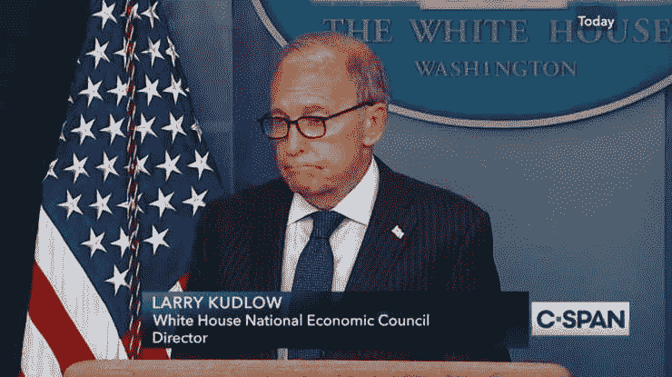

# 这些人是怎么保住工作的？

> 原文：<https://medium.datadriveninvestor.com/how-do-these-people-keep-their-jobs-ea2594d6c612?source=collection_archive---------3----------------------->

Chief Trump economic advisor, who vociferously encouraged governors to reopen their states, now blames local officials for being “overexuberant” (Click on the photo above for a clip)

## 转念一想，他们可能正在做总统喜欢的事情…

不过，请容忍我们，考虑一下对特朗普首席经济顾问拉里·库德洛的特别谴责。因为你知道，我们对那些一次又一次搞砸的人没有多少耐心，但他们似乎总是能浮到顶端。

因此，库德洛宣布美国创下有史以来最高的新新冠肺炎病例记录尤其令人愤怒。那就是:

> *有些地方可能过于夸张了*

**因为没有人比库德洛本人更“过分自信”。是他在 2 月/3 月说，科尔那病毒已被控制:**

> **[*相当接近密闭*](https://www.c-span.org/video/?c4868501/larry-kudlow-regrets-coronavirus-control) **。”****

**最近:**

> **我们现在知道如何处理这种事情，自去年冬天以来，我们已经走了很长一段路，不会有第二波浪潮到来。**

**所以现在他有胆量推卸责任，指责别人做错了？！**

**而且不仅仅是带着一点自大和自以为是的神气说的一句可爱的话。(尽管这确实符合总统现在仅仅是“扑灭余火”的说法)。这是生死攸关的事情。**

** [## 领导力。赢得|数据驱动型投资者需要更广阔的视角

### 不管他们愿不愿意，领导者都是快速运转的机器中的齿轮，这就要求他们夹住自己的爪子…

www.datadriveninvestor.com](https://www.datadriveninvestor.com/2020/02/07/leadership-it-takes-a-wider-perspective-to-win/) 

那为什么库德洛还在？简单。可能是因为总统自己也经常拉同样的垃圾。就像当[特朗普告诉福克斯](https://video.foxbusiness.com/v/6168640717001/#sp=show-clips)“我完全支持面具”，并得到关于他的[变调](https://www.bbc.com/news/world-us-canada-53258792)的尖叫头条，尽管他没有改变他的语气，同时说:

> 如果人们对此感觉良好，他们应该去做。

他很清楚地指的是一群不包括他自己的人。所以，和他一直说的一模一样。特朗普说他穿一件“没问题”:

> *如果我与人关系紧张*

**所以只有在他不可能亲身经历的情况下。这根本不是重点。关键是总统也许应该考虑树立一个榜样。尤其是如果川普激发了 10%的选民[，那就意味着数百万戴面具的人](https://link.medium.com/sXX4jowmO7)。**

**尤其是德克萨斯州州长现在刚刚授权使用口罩。(同样是这位州长，Greg Abbott，此前曾阻止市长和其他地方官员在他们的城镇强制佩戴口罩，还起诉阻止 65 岁以下的德州人以新冠肺炎为借口获得缺席投票。无论如何，德州 65 岁以上的人都可以获得缺席选票。在此期间，他还试图让最高法院推翻奥巴马医改。)**

**尤其是因为目前还没有针对新冠肺炎的疫苗和标准有效的治疗方法。所以我们只有面具了。**

**无论如何，总统的首席经济顾问甚至不是经济学家。库德洛的专长是公共关系。他以给华尔街拉拉队为职业:劝人买股票，政客减税。**

**现在特朗普得到了他。又一个模棱两可和推卸责任的人。鹦鹉学舌总统说的话并不是在总统领导下保住工作的坏方法。但是它真正为美国人民提供了什么服务呢？同样，当你对任何事情不负责任时，你也不必做任何事情。这包括努力改正你的错误，因为在你眼里你什么也没犯。除非我们猜测至少在这种情况下，你仍然可以说些小俏皮话，把你自己的完全无能转移给那些可能会冒失地追随你和你老板大声鼓吹的东西的人。他们，就像德克萨斯州州长阿博特一样，可能现在自己也不是完全无罪的，远非如此，但是*正挣扎在第一线。***

**与此同时，库德洛拍了拍他们的后背，让他们加入了这场争斗，并援引了总统的意愿。现在他继续他的快乐的谈话，而坚决挂回来。**

****访问专家视图—** [**订阅 DDI 英特尔**](https://datadriveninvestor.com/ddi-intel)****