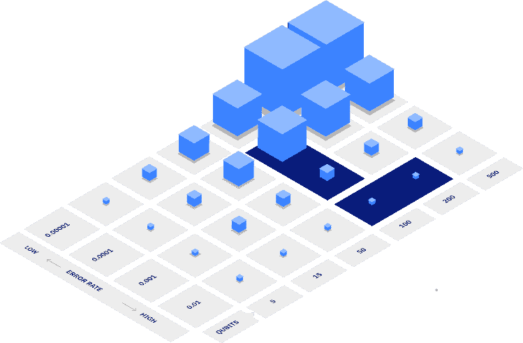
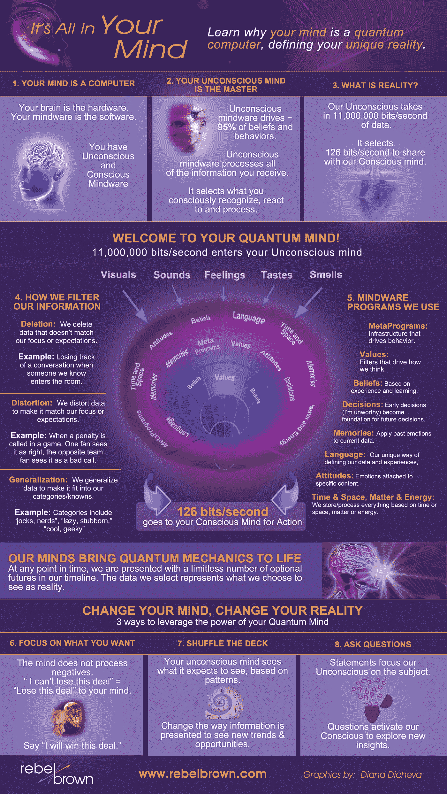

# 我们如何计算善？量子计算对非营利组织的影响

> 原文：<https://medium.datadriveninvestor.com/how-do-we-calculate-goodness-quantum-computings-implications-for-nonprofit-impact-6712793ef187?source=collection_archive---------13----------------------->

Photo by Taylor Vick on Unsplash

多年来，非营利组织最令人垂涎的情报之一是真实社会影响测量(SIM ),即一个组织在实现预期项目成果方面的努力有多有效。

例如，在服务不足的地区建一所学校，100%可量化的影响是什么？修建一口井并为之前饱受霍乱折磨的人群提供干净的饮用水的真正价值是什么？

到目前为止，此类评估一直受到数据收集策略不佳、数据来源不可靠等问题的困扰，最关键的是，无法正确收集所有可能受到组织影响的数据点。

如果没有这些基本要素，就几乎不可能实现真正影响衡量所需的数据可靠性，而真正影响衡量最终可能成为革命性的报告来源。

然而，一种新的无与伦比的数据分析形式——量子计算——的兴起可能是解决非营利智能“圣杯”的关键，同时为非营利筹款人和捐赠者提供了巨大的潜力，以真正评估产生社会影响的最佳机会。

## **量子计算简介**

随着人工智能(AI)及其相关工具现在在营利性部门中被广泛采用，以及[在非营利性领域中迅速增长的牵引力，](http://linkedin.com/pulse/why-jump-ai-revolutionize-nonprofit-tech-alexander-jivov/)的目光现在开始转向遥远未来的技术:无论是[控制论](https://www.bbc.com/news/world-us-canada-53956683)、[无处不在的互联网](https://www.express.co.uk/news/science/1346242/spacex-news-starlink-internet-ready-public-use-elon-musk-latest-evg)，还是量子。

简而言之，量子计算使用量子力学来执行某些类型的计算，比普通计算机要高效得多。

具体来说，量子计算利用量子力学的两个方面——叠加和纠缠——来改变计算机传统的存储和操纵信息的方式。

我们今天所知的计算机以二进制状态存储信息，操纵被指定为 0 和 1 的单个比特，而量子计算机则利用被称为量子比特的东西。

量子位同时存在于两种无法用经典逻辑解释的状态中，同时充当二进制状态中的 0 和 1，而不是独立的。举个例子，我推荐观看 Shohini Ghose 关于这个主题的精彩 TED 演讲。

 [## 语音没有死亡——人工智能如何改变呼叫技术游戏|数据驱动的投资者

### 语音死了吗？这是一个公平的问题。关于流程数字化、新应用和增强型移动银行的讨论…

www.datadriveninvestor.com](https://www.datadriveninvestor.com/2020/10/08/voice-isnt-dead-how-ai-is-changing-the-call-tech-game/) 

可以说，由于这种能够同时处理数据的能力，量子计算机可以吸收更多的数据，并执行比传统计算机更复杂的指数级计算。

> *据报道，谷歌的量子计算机能够在 3 分 20 秒内解决一个计算——证明随机数生成器产生的数字的随机性——这将需要世界上最快的传统超级计算机* [*Summit*](https://www.theverge.com/circuitbreaker/2018/6/12/17453918/ibm-summit-worlds-fastest-supercomputer-america-department-of-energy) *大约 10，000 年。这实际上意味着传统的计算机无法进行计算。*

## 量子对非营利组织的影响

多年来，非营利部门的天文数字增长加剧了捐赠者的信任危机——有这么多组织可供选择，非营利组织越来越被迫向潜在捐赠者展示可量化的影响，否则就有失去资金的风险。

随着这场危机的恶化，非营利组织越来越多地转向如何展示他们的影响力以及如何讲述他们的故事(这就是我们[充满希望的](https://www.hopefulinc.me/)团队的作用)。然而，正如 [Donorbox](https://donorbox.org/nonprofit-blog/measuring-nonprofit-social-impact/) 所言，由于多种原因，确定组织如何衡量 it 影响仍然很困难:

1.  **它包括测量复杂的概念，如“个人自尊的增加”或“整体福祉的增加”。**
2.  **衡量社会影响也意味着考虑可能影响你试图衡量的元素的其他因素，即变化在多大程度上归因于你的非营利组织的活动。**
3.  这是一项长期任务，需要在几年的时间里持续不懈地努力。
4.  它需要相关的系统/框架和强大的工具，这可能很难开发，尤其是对于较小的非营利组织。
5.  甚至更大更成熟的非营利组织也很难评估他们的影响测量过程的质量。
6.  没有固定的规则，所以不同非营利组织的方法和术语可能会有很大不同，这使得沟通和合作更加困难。
7.  “社会影响”这个词越来越模糊，经常被误用来暗示微小的变化。

利用 Quantum 处理大规模数据集的能力，非营利智能问题第一次可以得到合理的解决。尽管以前数据收集和管理的瓶颈被证明是一个不可逾越的障碍，但现在“暴力破解”系统变得可能——根据需要收集尽可能多的原始定性和定量数据，以创建我们所谓的量子动力数据关联(QPDA)。

这种关联并不完美，但在通往真正的社会影响衡量的道路上迈出了切实的一步。然而，关键是 QPDA 在理论上也能够计算通常被认为不可量化的数据集，例如人类的非理性以及最初是什么导致我们做出长期决策。

**量子利他主义计算器**

[量子思维或量子意识](https://www.livescience.com/quantum-like-model-of-decision-making-proposed.html)是一组假设，提出我们所知的经典力学无法解释人类如何或为什么以他们的方式做出决定，但量子概念和人类思维的功能之间存在相关性。

中国科学技术大学的生物物理学家和神经科学家张(音译)表示:“认知科学家发现，人类有许多‘非理性’行为。”经典的决策理论试图预测一个人在给定某些参数的情况下会做出什么选择，但我们人类并不总是按照预期行事，包括做出非理性的选择和寻找以前不存在的选择选项。张说，最近的研究表明，这些逻辑上的失误“可以用量子概率论很好地解释”。

Credit: [Rebel Brown](https://www.pinterest.ca/pin/60165344994868359/)

本质上，Quantum 的数据能力真正令人兴奋的是，不仅要确定影响，还要完成*为什么*人们首先给予的等式。

我提议的是第一个**量子利他主义计算器**——利用量子计算来识别、解析和收集关于人类为什么、在哪里、何时以及如何识别和支持他们最支持的事业的见解。

在宏观层面上，这种计算器可以利用联合国 17 可持续发展目标(UNSDG17)作为框架迅速进行试点。该框架中提出的原因，包括消除贫困、减少饥饿等，允许在全球范围内快速确定哪些原因与人们最相关，并从那里向下定位。

这篇文章是一个关于量子计算为社会公益的全新应用的提议，并将在未来的几天、几个月、几年里进一步发展。

***免责声明:*** *我是* [*希望公司*](https://www.hopefulinc.me/) *的首席执行官和联合创始人，这是一家高增长的初创公司，它让非营利组织能够利用人工智能在正确的时间向正确的人讲述更多引人注目的故事。我们自己目前正在筹集种子资金。如需了解更多信息，请发送电子邮件至*[*ajivov @ hopeflinc . me*](http://ajivo@hopefulinc.me/)

## 访问专家视图— [订阅 DDI 英特尔](https://datadriveninvestor.com/ddi-intel)