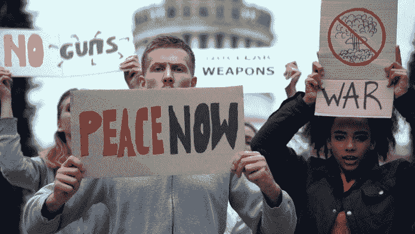
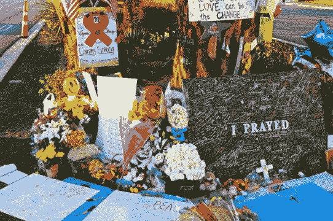
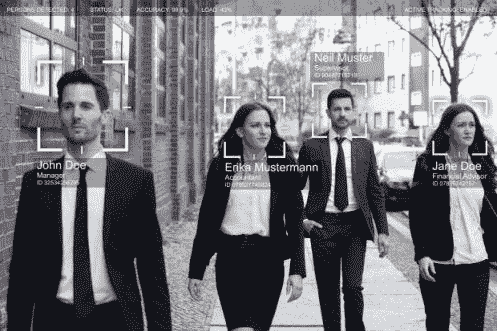

# 我们如何监管一项既能结束大规模枪击又能让它们更致命的技术？

> 原文：<https://medium.datadriveninvestor.com/how-do-we-regulate-a-technology-that-can-both-put-an-end-to-mass-shootings-and-make-them-more-fad0b7ee34b8?source=collection_archive---------8----------------------->

随着人工智能背后的技术继续进步并扩展到更多的市场和应用，这一科学突破背后的伦理分歧变得更加复杂。近日，《纽约时报》发布了一部名为《人工智能正在让杀死(你)变得更容易》的纪录片短片。以下是方法。”一旦你过了危言耸听的标题，视频提出了关于改善这种技术的严重困境，主要大国正在武器化，以在现代战争中获得优势。黑仔机器人和自动无人驾驶无人机今天已经在世界各地使用，以提高拥有该技术的军队的效率，同时成倍地增加敌人的死亡人数。这部纪录片让我思考:如果我们已经在军队中使用这些技术，我们离民用还有多远？

美国西点军校研究和战略主任戈登·库克博士也有类似的想法。在美国陆军网站上发表的一篇文章中，他概述了自动化武器在战场上的利弊以及落入平民手中的风险。“各种指令、操作视频甚至现成的、训练有素的人工智能软件都可以在网上轻松获得，可以很容易地适应现有的武器。彩弹和气枪爱好者使用的自动炮塔已经证明能够击中 70%以上的移动目标。他补充说，“陆军步枪资格课程只要求士兵击中 58%的固定目标，就有资格成为他们武器上的神枪手”，“击中 75%的固定目标的士兵将获得[神枪手资格](https://www.army.mil/article/223026/magic_bullets_the_future_of_artificial_intelligence_in_weapons_systems)”这意味着，对于美军来说，自动化炮塔有可能比训练有素的神枪手甚至神枪手更准确、更致命。

 [## 保护主义、政治和经济动荡|数据驱动的投资者

### 美国股市昨日出现 400 多点的大幅反转，为未来的事情发出了警告信号。市场…

www.datadriveninvestor.com](https://www.datadriveninvestor.com/2018/06/28/protectionism-politics-economic-turmoil/) 

这也不仅仅是关于枪支的准确性。配备人工智能和机器人的武器也可以帮助士兵进行补给和运输工作——甚至在士兵自己做这些之前预测他们的需求。库克博士解释说，人工智能可以根据交通状况和战场需要，让装有物资的卡车改道，而 [AI](https://www.datadriveninvestor.com/glossary/artificial-intelligence/) 可以协助小型机器人或无人机将弹药[直接运送到部队](https://www.army.mil/article/223026/magic_bullets_the_future_of_artificial_intelligence_in_weapons_systems)。现在，想象一下这项技术被用于大规模枪击事件。射手可以利用人工智能在他们用完子弹并试图重新装弹之前向他们运送物资，这是旁观者经常试图干预并打倒射手的关键时刻。有了这些新的技术能力，枪手甚至不需要亲自去袭击现场——而不是派出一架配备自动武器、摄像头和人工智能的无人机——同时从一个安全的秘密地点进行监控。射手不仅可以使用人工智能在保护自己生命和身份的同时使他们的射击狂欢更加致命，而且射手还可以将他们希望无人机瞄准的具体目标和参数编程到人工智能中，使仇恨犯罪更有可能发生，也更容易实施。

我们已经确定，人工智能在错误的人手里有可能使大规模枪击事件更加致命，但在正确的人手里，有人认为人工智能可以帮助在大规模枪击事件发生之前阻止它们，并拯救生命。安全领域的最新趋势之一是配备人工智能的监控摄像头，这些摄像头经过训练可以识别可疑的人、行为和物体。他们收集和分析数据，然后将其传递给人类进行审查。配备人工智能的监控，也称为智能视频或实时视频分析，最大的市场之一是学校。2018 年，据估计，该国视频监控的最大市场是学校，价值超过 4 . 5 亿美元。包括 ZeroEyes 和 Athena Security 在内的几家私营公司已经与全国各地的学区合作。然而，两家公司都“声称他们的系统可以以超过 90%的准确率检测武器，但承认他们的产品还没有在[的真实场景](https://apnews.com/eca5dcff514b49eb8edaaf301d0a3a3d)中测试过。”除了缺少跟踪记录，该系统的另一个缺点是无法检测隐藏的武器，这可能是在射手拔出武器开始射击的关键时刻之前停止射击的关键。然而，该系统的支持者认为，至少，这些系统能够为执法部门提供更多的信息，可以[给人们更多的时间寻求庇护。](https://apnews.com/eca5dcff514b49eb8edaaf301d0a3a3d)

另一个最近受益于 Athena Security 配备人工智能的监控摄像头的机构是新西兰克赖斯特彻奇的 Al Noor 清真寺。今年 3 月，这里发生了该国最致命的大规模枪击事件，一名专门针对穆斯林的枪手冲进清真寺，在礼拜期间打死 51 人，打伤 49 人。袭击发生后，雅典娜安保公司宣布，他们将安装一个系统，以保护未来的崇拜者。每个摄像头每月花费 100 美元，通过人工智能来探测枪支。当检测到枪支时，系统立即向当局发出警报，并试图通过警告他们[当局正在路上](https://fortune.com/2019/05/03/mosque-christchurch-athena-security/)来阻止枪手。到目前为止，该系统似乎运行良好，因为它通过了最近的枪支测试，能够识别在它面前挥舞的每一种枪。Athena Security 正在努力解决的唯一缺点是对人工智能进行编程，使其能够识别其他较小的武器，如刀片、刀子，甚至像[与](https://fortune.com/2019/09/26/ai-security-cameras-prevent-mass-shooting/)战斗这样的暴力行为。

不仅仅是学校或宗教机构在利用这些实时视频分析——在美国各地的警察部队中也有广泛的使用。亚特兰大、新奥尔良和纽约等城市都使用配备人工智能的摄像头。康涅狄格州的哈特福德警方有一个由 500 多个摄像头和几个配备人工智能的装置组成的广泛网络，他们用它来搜索[数小时的视频](https://fortune.com/2019/09/26/ai-security-cameras-prevent-mass-shooting/)，以找到人或车辆。虽然有助于解决犯罪问题，但批评者认为这侵犯了人们的隐私，并有可能带有种族偏见。马里兰大学 2018 年进行的一项研究发现了人工智能中的种族偏见，因为一些人工智能认为黑人比白人看起来更愤怒。人类(通常是白人和/或男性)是人工智能的创造者和程序员，人类是不完美的，有偏见的。因此，可以假设人工智能也将分享这些人类偏见，这可能导致系统不公平地针对少数群体。

随着人工智能被用于大规模枪击事件的双方——既用于执法，试图在袭击发生前阻止袭击，也可能被枪手自己用来增强武器的能力，同时保护自己——立法者如何有效地监管这项技术，同时继续允许创新，以改善其预期用途？在《纽约时报》的纪录片中，他们报道了立法者如何落后于技术创新的快速步伐，并专注于国际层面。展示了几个联合国会议的镜头，很明显，美国、以色列、韩国和俄罗斯等军事强国都坚决反对对自动化武器进行监管，所有这些国家都已经在这些技术上投资了数百万美元以提高其武装部队的效力。与此同时，无法负担这些技术的发展中国家表达了他们的担忧，他们的人民是这些武器的另一端，被视为潜在的目标或平民伤亡。由活动人士、非营利组织和民间服务组织组成的“阻止黑仔机器人运动”已经写了一份请愿书，要求禁止自主武器，其中 30 个国家(几乎都是发展中国家)、100 个非政府组织、欧洲议会、21 位诺贝尔和平奖得主、联合国秘书长和 4500 多名人工智能研究人员都签名支持。然而，联合国旨在就决议的通过达成共识，由于发展中国家和发达国家在军队中使用[自动化武器](https://nyti.ms/2PUeyRZ)的问题上存在分歧，因此未能在这一问题上取得进展。与此同时，技术继续超过联合国的缓慢外交，联合国在自主武器的定义上陷入僵局。世界经济人工智能和机器人论坛副主席、联合国军备控制顾问斯图尔特·拉塞尔解释了这个难题:“在他们(联合国)决定自主武器的定义之前，可能还需要 10 年时间。到那时可能就太晚了。我认为[对某些国家来说](https://nyti.ms/2PUeyRZ)这才是重点。”

虽然美国军方继续投资于自主武器和杀手机器人技术，但特朗普总统呼吁科技界使用分析和检测软件“在大规模谋杀开始前阻止它们”，并指出几乎每起大规模枪击事件都有人工智能可以识别的警告信号。公司肯定已经在使用这些技术，包括 PayPal 的联合创始人、特朗普的狂热支持者彼得·泰尔经营的 Palantir 公司。有报告显示，Palantir 正在使用[在线跟踪](https://www.newsweek.com/trump-mass-shooter-detection-software-social-media-1452612)“类似于少数报告，如‘预测’或‘犯罪前’能力。”2017 年，一项研究发现，人工智能能够使用 Instagram 识别抑郁症的[预测标记，人工智能的表现超过了它的人类同事——它甚至正确地分析了患者被诊断患有抑郁症之前的图像。尽管这确实令人印象深刻，进展也很有希望，但仅凭社交媒体上的图像或面部表情来识别大规模枪击事件可能会更加困难。并不是每个大众射手都有精神疾病，即使是那些有精神疾病的人也不一定面临抑郁。正如美国心理学协会首席执行官亚瑟·c·埃文斯解释的那样:“没有一个单一的性格特征可以可靠地预测谁会诉诸枪支暴力。基于这项研究，我们只知道暴力史是预测谁会在未来](https://epjdatascience.springeropen.com/articles/10.1140/epjds/s13688-017-0110-z)[实施暴力](https://bigthink.com/politics-current-affairs/ai-mass-shooter?rebelltitem=1#rebelltitem1)的唯一最佳指标埃文斯在他的新闻稿中继续说，结束大规模枪击事件的唯一解决方案不是增加我们预测这些事件的技术进步，而是首先限制获取致命武器。他不是唯一有这种想法的人，因为许多专家一致认为更严格的枪支法律会减少大规模枪击事件的发生频率。公众似乎也这么认为，根据最近的 2019 年盖洛普民意调查[显示，约 60%的美国人已经支持更严格的枪支法律。](https://news.gallup.com/poll/243797/six-americans-support-stricter-gun-laws.aspx)

尽管专家和美国公众都支持改变政策，而不是推进实验性技术，为什么每天仍有一百多名美国人被枪杀？一个答案可能是这场斗争中的三个主要参与者:科技公司、全国步枪协会和我们的政府。这三个人都不愿意承担他们在这场危机中的责任，也不愿意努力改变现实，而是相互指责。脸书等科技公司允许白人至上主义者在他们的平台上直播枪击事件，就像在新西兰克赖斯特彻奇的努尔清真寺发生的那样，这给了他们勇气。然后，这些病毒式的视频和帖子耸人听闻地渲染暴力，并鼓励模仿。全国步枪协会坚持认为枪支不是罪魁祸首，而是人，并游说他们的议程，以至于一些立法者将其与第二修正案混淆。最后，我们有自己的政府。我们的民主代表应该为人民的利益而行动，但却接受了全国步枪协会等团体的贿赂和礼物，然后在下一次枪击事件发生时，除了他们的“想法和祈祷”之外，什么也不提供。当然，对于他们来说，幻想人工智能完全解决这个问题，甚至在枪击发生之前就停止射击是很自然的。但是科技界表示，由于人类偏见和不完美机器的存在，我们还远远没有准备好。

在美国，我们的立法者几乎没有触及人工智能技术初期的话题。现在，他们正试图迎头赶上，并尽最大努力起草立法来监管算法和人工智能。然而，一些人认为这太少，太晚了。政府官僚机构的缓慢步伐总是难以跟上技术的创新，但这并不意味着他们应该让技术世界自由支配他们正在建立的数字帝国。国会面临的问题之一是劳动力和人工智能之间的冲突。随着[机器学习](https://www.datadriveninvestor.com/glossary/machine-learning/)和算法的出现，由于算法偏差或自动化，工人们发现很难与人工智能并肩工作甚至竞争，导致失业和流离失所。Littler Mendelson 的工作场所政策研究所的联合主席迈克尔·洛蒂托解释说:“国会并没有认真地推动这个球。没有[国家行动号召](https://news.bloomberglaw.com/daily-labor-report/congress-plays-catch-up-on-artificial-intelligence-at-work)立法者对监管人工智能漠不关心的一个例子可以在对算法问责法案的回应中看到(H. [R](https://www.datadriveninvestor.com/glossary/r/) )。2231，S. 1108)，由参议员科里·布克(D-N.J .)、参议员罗恩·怀登(D-OR)和众议员伊薇特·克拉克(D-N.Y .)于 2019 年 4 月 10 日推出。这项法案可以帮助监管许多使用人工智能、数据分析和先进算法的行业，“将要求大公司审计他们的算法是否存在潜在的偏见和歧视，并向美国联邦贸易委员会官员提交[影响评估](https://news.bloomberglaw.com/daily-labor-report/congress-plays-catch-up-on-artificial-intelligence-at-work)就在起草的同一个月，该法案被提交到能源和商业委员会，至今仍然有效。公众对该法案持积极态度，它已经得到了许多科技和民权组织的支持，包括黑人生活数据、乔治敦法律隐私和技术中心以及全国西班牙裔媒体联盟。尽管如此，正如由“人工智能研究人员、数据科学家、数据工程师、软件工程师、领域专家和金融专业人士”组成的公司 Skopos Lab 所预测的那样，它只有 3%的机会得以实现具有讽刺意味的是，[目的实验室](https://www.skoposlabs.com/about)创造了一种叫做自动预测智能的方法，他们用这种方法来预测一项法案颁布的可能性。

那么，当人工智能既可用于善也可用于恶时，解决方案是什么？没有一个演员对大规模枪击事件负责，也没有人承担责任。当立法者试图采取行动，但我们的机构官僚主义失败。这是立法者和社会需要找到的一种平衡。我能说的是，创新不是科技行业的专有概念。创新也可以存在于我们的政府中。当我们看到好的法案和提案在委员会中没有被认真对待，或者像全国步枪协会这样的团体推动我们的政治家而不是人民的声音，我们知道是时候改变了。让我们改革我们的政府机构，跟上技术创新的步伐，然后我们可能会有能力制定适当的法规，以便人类和技术能够和平共处。

*原载于 2020 年 1 月 9 日*[*【https://www.datadriveninvestor.com】*](https://www.datadriveninvestor.com/2020/01/09/how-do-we-regulate-a-technology-that-can-both-put-an-end-to-mass-shootings-and-make-them-more-deadly/?fbclid=IwAR3Uag4icl3Nwp-jU3JMpiN7T5Fl7DyK1Xd2VAfggcpAs4d_VuYmVDm1D2A)*。*