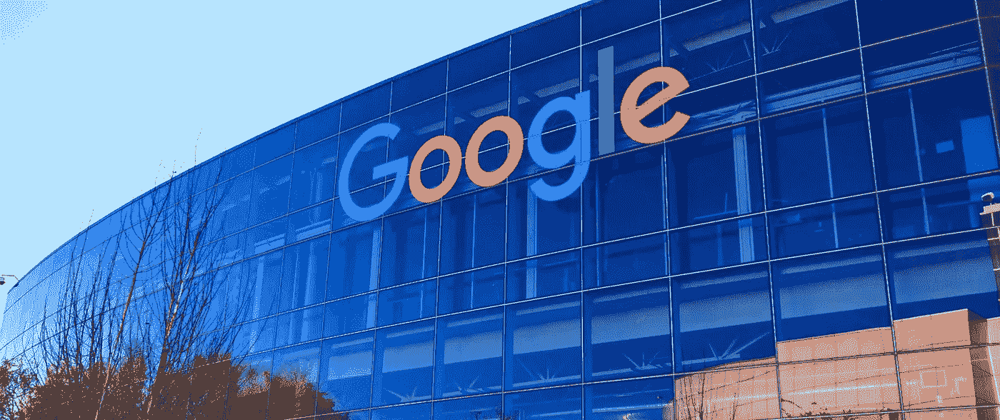

# 你如何破解一个人工智能工程师在谷歌和亚马逊这样的公司的面试？

> 原文：<https://medium.datadriveninvestor.com/how-do-you-crack-an-ai-engineers-interview-at-companies-like-google-and-amazon-56c6e5d1b513?source=collection_archive---------0----------------------->

> 谷歌和亚马逊！

这些科技巨头是每个崭露头角的人工智能工程师的梦想成真。

每个刚走出大学校门的工程学毕业生都梦想在谷歌或亚马逊工作——“完美的工作环境。”

但是你有没有想过每个人是怎么到那里的？

当 Alphabet 现任首席执行官[桑德尔·皮帅](https://en.wikipedia.org/wiki/Sundar_Pichai)被一家公司的产品管理副总裁职位邀请参加面试时，面试官问他对 Gmail 的看法。就在同一天，2004 年 4 月 1 日，谷歌宣布了 T4 电子邮件服务。对此他回答说他不能回答这个问题，因为他不能使用这个产品。第四轮面试，有人问他一个问题，你见过 Gmail 吗？他的回答是，没有。面试官给他看了。接着，当第五位面试官问他对 Gmail 的看法时。皮查伊可以回答所有的问题。

在这种情况下，大多数人试图编造故事来回答下一个问题。Sundar 反其道而行之，最终给人留下深刻印象。

他表现出知识分子的谦逊。

现在你可能想知道为什么所有的大话，对不对？

嗯，你看，有时告诉雇主或招聘经理你对这个问题没有头绪可能会扣掉一些分数，但这仍然比提出不确定的事实或可能完全错误的答案要好。

> 成功、聪明的人很少经历失败，所以他们不知道如何从失败中学习——拉兹洛·博克，前谷歌人力运营高级副总裁

拉兹洛还说，这是他期望在候选人身上发现的最高品质之一。

如果你想知道如何在谷歌或亚马逊面试，你可能需要像皮查伊一样表现出智慧的谦逊。

你有能力进入这些科技巨头吗？

下次你发现自己在这些公司中的任何一家面试时，一定要找到你内心的*Pichai*。

# 亚马逊如何招聘人工智能工程师:流程

让我们来分解一下人工智能工程师面试的主要组成部分:

# 初步筛选

电话筛选最好由招聘经理或招聘人员来处理。这是招聘人员更好地了解候选人的第一步，也是最重要的一步。这通电话是向您简要介绍工作角色，并谈论面试流程。对你过去的工作经历和你在以前单位的职责进行了一次预演。他们还需要清楚地了解你对为公司工作的兴趣，以及你是否有勇气和能力胜任给定的工作角色。

# 技术筛选

第二轮是技术筛选，这通常发生在人工智能工程管理或机器学习工程管理中。问技术问题只是为了检验你是否足够胜任，以及你是否很好地适应了公司的文化。你会被问到关于机器学习概念和人工智能概念等问题。你需要保持头脑清醒，自信地回答所有的问题。无论你是新手还是有经验的人工智能专家，你都需要准备好回答面试官问你的每一个问题。

在解析成许多问题后，这里列出了一个 [**人工智能工程师**](https://medium.com/@albertchristopherr/a-complete-guide-to-strengthen-your-career-as-an-ai-engineer-33e834d1744) 可能需要回答的最常见的技术问题:

*   AI 是什么？
*   人工智能、机器学习和深度学习的区别是什么
*   说出[不同类型的 AI](http://brainstormingbox.org/7-types-of-artificial-intelligence/) ？
*   什么是智能代理？
*   AI 使用的最流行的[编程语言是什么？或者说出五种 AI 用的最好的语言？](https://www.artiba.org/blog/choosing-your-first-programming-language-python-and-ruby)
*   你能定义什么是神经网络以及它们是如何工作的吗？
*   强 AI 和弱 AI 有什么区别？
*   什么是机器学习，解释一下 AI 和机器学习的区别？
*   你会如何向一个非技术人员解释机器学习？
*   你能给我们一些人工智能应用的例子吗？
*   定义图灵测试？
*   什么是张量流？
*   [博弈论和 AI](https://www.artiba.org/blog/ai-and-game-theory-a-primer) **，**有联系吗如果有，说明一下？
*   你能告诉我关系数据库中有哪些不同类型的键吗？
*   AI 会影响应用开发吗？怎么会？
*   一个知识表示游戏有哪些好的性质？
*   解释一下 AI 背后的炒作？
*   河内塔是什么？
*   什么是广度优先搜索算法？
*   什么是 A*算法搜索法？

这只是技术回合的第一部分。第二轮技术筛选将是编码。在这种情况下，您可以使用任何您喜欢的编程语言。

# 现场面试

现场面试通常会进行五到六轮面试。这一轮面试由行为和技术面试问题组成。

你可能会想到的行为问题:行为问题通常会掩盖你过去的工作角色和工作经历，以及你为什么要离开现在的工作。记住这可能是一个棘手的问题，所以你需要用你智慧的谦逊来回答它。他们甚至会问领导原则问题，确保你知道谷歌和亚马逊的领导原则，或者你面试的公司的领导原则。

你可以预料到的技术问题:尽管你已经通过了技术回合，但你可能仍然需要回答涵盖机器学习和人工智能概念的技术问题。过去的受访者大多被问及与面向对象设计相关的问题。确保你涵盖了人工智能和机器学习领域的每个方面。

# 现状核实

一般来说，大多数人在第一轮面试中都会被拒绝。拒绝可能有多种原因——要么候选人不具备所需的技能，要么可能是因为缺乏特定工作角色的知识。

 [## 使用谷歌搜索趋势预测首次申请失业救济人数|数据驱动的投资者

### 几年来，我的重点一直是使用多种替代数据来预测宏观经济统计数据…

www.datadriveninvestor.com](https://www.datadriveninvestor.com/2020/03/25/using-google-search-trends-to-predict-initial-jobless-claims/) 

你需要拥有强大的技术知识，拥有最新的人工智能工具和技术，才能在当今的就业市场上取得成功。给招聘经理留下深刻印象可能是你和这份工作之间的唯一障碍。你可以随时选择一个 [**人工智能认证项目**](https://www.artiba.org/certification/artificial-intelligence-certification) 来帮助消除这些障碍。参加专业认证让你与最新的行业趋势保持同步。

你准备好找到你的*内心深处的*了吗？

在你掌握了这些问题之前，不要再做面试了！

# [📫](https://usejournal.typeform.com/to/P5eS4U?=&utm_source=machine_learnings&utm_medium=blog&utm_content=accepting_post_submission&utm_campaign=team_post&source=post_page---------------------------)我关于人工智能的其他故事:

1.  [**加强你作为人工智能工程师职业生涯的完整指南——情况说明书**](https://medium.com/@albertchristopherr/a-complete-guide-to-strengthen-your-career-as-an-ai-engineer-33e834d1744)
2.  [**机器学习中 7 个最常见问题的答案**](https://medium.com/@albertchristopherr/answers-for-7-most-frequently-asked-questions-in-machine-learning-d1e8abd2c071)
3.  [**2019 年如何开始人工智能职业生涯？**一步一步引导](https://medium.com/@albertchristopherr/how-to-start-a-career-in-artificial-intelligence-in-2019-a-step-by-step-guide-b18ad32d1b1f)