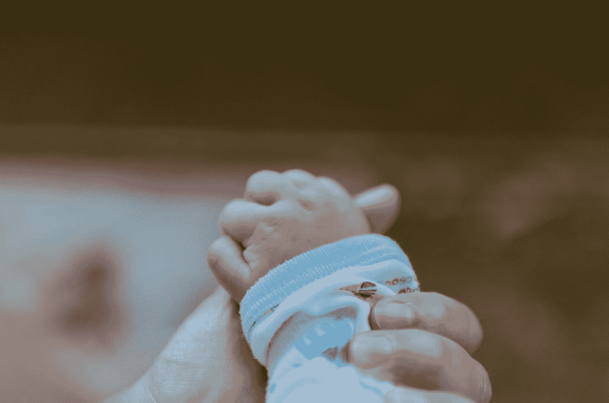

# 怎么知道自己是家长？

> 原文：<https://medium.datadriveninvestor.com/how-do-you-know-you-are-a-parent-53f5ad197af4?source=collection_archive---------24----------------------->

## 而且不，绝对不是当你发现即将上任的老板的时候。

Photo by [bady abbas](https://unsplash.com/@bady?utm_source=medium&utm_medium=referral) on [Unsplash](https://unsplash.com?utm_source=medium&utm_medium=referral)

你看，我们大多数人认为当我们得到 HCG 测试的第二条线时，我们知道将要发生的一切。但是你猜怎么着？你不知道那时你将面临什么。一点也没有。

我仍然坐在那里嘲笑我们还没有孩子的朋友，不停地讲述他们和孩子在一起有多好的故事，以及他们什么时候会有孩子，事情会变得很容易，因为他们都知道…你知道，从照看孩子…

也许我应该把他们说的那些废话录下来。当失眠、肠绞痛、长牙、生长痛开始时，把它发给他们，你现在已经明白要点了。

当我们把我们的小家伙带回家时，她已经两周大了。她是早产儿，在适应外面的世界时有些问题，所以那段时间她必须呆在 NICU。回家的第一个晚上，她展示了自己的本色，并决定肌肤相亲是她睡觉的唯一方式，也就是每次 30 分钟，因为绞痛对她的大时间产生了影响。是啊，那很有趣。大约三天后，当她睡着的时候，我们发现自己像白痴一样盯着她，就像一些神奇的鹰一样，不管生活会给她带来什么，都能保证她的安全。那是我们第一次觉得自己是真正的父母，而不是假装的，除非你让它变得友善。

 [## 良好的生活是习惯的形成|数据驱动的投资者

### 过度思考是过度紧张。仅仅几个简单的习惯就会在一天中产生巨大的影响。那是…

www.datadriveninvestor.com](https://www.datadriveninvestor.com/2020/01/17/a-good-life-is-habit-forming/) 

分娩和怀孕是为了让你有所准备。但我发现的所有问题是，没有人告诉你它到底是什么样的。对我们来说，每个人都不停地告诉我们这有多难，或者我们的生活是如何结束的，诸如此类的事情。但是没人讲你第一次抱宝宝，或者第一次对你笑，说一句话，所有美好的东西。

现在很多人拒绝要孩子，似乎是因为这是一份没有报酬的工作。多可悲啊？

如果你不想要，那是你的特权，到最后，它就是 F..外面的世界很可怕，我有时怀疑我们的决定是否正确。然后我看到她在学习一些新的东西，她的大脑是如何学习和理解这个世界的。这就是我需要认识到的，我不会有任何其他方式。这个世界因为有她而变得更加美好，我的生活充满了财富。

为人父母就是当你知道你只是他们的向导，无论这个世界变得多么可怕，你只需要让他们明白他们会永远有你在身边，即使你不在身边。

这是一项艰难的工作，最艰难的工作。你没有休息时间，甚至午餐和睡眠时间都没有。但是那些说薪水不够值得的人…嗯，我不敢苟同。首先，你需要意识到你是一个家长，这时候你就会明白。

请注意，这不是每个人都能做的工作。我们不应该评判那些选择不做这份工作的人。我父亲绝对不是当父母的料，是的，我很感激我的存在。但不是因为他给我的负担和创伤。所以对于那些选择不要孩子的人，我要说..谢谢你！我尊重你。我宁愿身边有像你这样的人，而不是那些有孩子并虐待他们的人。

你的优先事项改变了，你学会了在有人看着你的时候撒尿，你创作了歌曲，你可以在一天的任何时候背诵任何儿歌。你会对睡眠和时间又爱又恨。因为你会意识到时间过得太快，而时间会变得更快。

# 如何做一个好家长？

一些事情是非常基本的，但有时我们会忘记它们。生活阻碍了我们。

*导向支撑*

*让孩子独立*

*记住，孩子们总是在看，他们就像海绵一样*

*不要吝啬*

*每天告诉你的孩子你爱他们*

*犯错时承认并道歉*

*看看他需要什么*

*知道他们在做什么，和谁在一起*

*教他们成为好人*

*说和听*

希望它能帮助你培养有爱心的人。你度过了困难时期，没有大喊大叫，也没有崩溃。

为人父母可以来自于抚养孩子，即使你生了孩子或者没生。收养，照顾，生育，这些都能引领你走上为人父母的道路。

我发现爱和尊重是一个好父母真正需要的东西。不要忘记，不大叫的育儿方式是可能的，即使在你不相信它的日子里，你已经达到并通过了它。

## 访问专家视图— [订阅 DDI 英特尔](https://datadriveninvestor.com/ddi-intel)