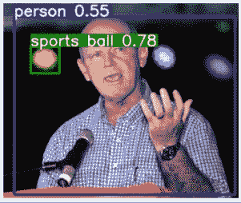
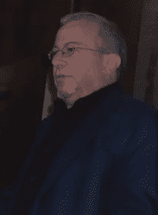

# 你是怎么用 Yolo 检测物体的？

> 原文：<https://medium.datadriveninvestor.com/how-do-you-use-yolo-to-detect-objects-8bb634ec7d2c?source=collection_archive---------6----------------------->

## 有史以来最简单的对象检测教程—使用 YoloV5 和 Python

[Source](https://commons.wikimedia.org/wiki/File:Alain_St._Ange,_October_2014.jpg). [Creative Commons](https://en.wikipedia.org/wiki/en:Creative_Commons) [Attribution 4.0 International](https://creativecommons.org/licenses/by/4.0/deed.en). Adaptations by author.

在本文中，我将给出开始使用 YoloV5 进行对象检测的步骤。对象检测的目标是在图像上的对象上绘制包围盒。YoloV5 是完成这项工作的最佳工具之一，只需少量的工作。

YoloV5 模型已经过预训练。我们可以选择进一步训练它，但在本文中，我将展示如何开箱即用 YoloV5。

你可以在这里找到完整的笔记本****】以防你想跟随。****

# **1.安装 YoloV5**

**下面的代码块将把预先训练好的 YoloV5 模型下载到您的计算机上。**

**它还将安装所需的库和需求。**

# **2.把你的图片放在一个目录里**

**在本教程中，我使用了 6 张来自维基共享的图片，这是我手动下载的:**

********

**[Source](https://commons.wikimedia.org/wiki/File:Alex_Smith_TEDx_Speech.png). [Creative Commons](https://en.wikipedia.org/wiki/en:Creative_Commons) [Attribution-Share Alike 4.0 International](https://creativecommons.org/licenses/by-sa/4.0/deed.en).**

****

**[Source](https://commons.wikimedia.org/wiki/File:Andrei_codrescu.jpg). [Creative Commons](https://en.wikipedia.org/wiki/en:Creative_Commons) [Attribution 2.0 Generic](https://creativecommons.org/licenses/by/2.0/deed.en).**

****

**[Source](https://commons.wikimedia.org/wiki/File:Anna_Kaplan_2018.jpg). [Creative Commons](https://en.wikipedia.org/wiki/en:Creative_Commons) [Attribution-Share Alike 4.0 International](https://creativecommons.org/licenses/by-sa/4.0/deed.en).**

****

**[Source](https://commons.wikimedia.org/wiki/File:Astronaut_candidate_Jeremy_Hansen_speaks_to_a_crowd_at_Johnson_Space_Center.jpg). [Creative Commons](https://en.wikipedia.org/wiki/en:Creative_Commons) [Attribution-Share Alike 4.0 International](https://creativecommons.org/licenses/by-sa/4.0/deed.en).**

****

**[Source](https://commons.wikimedia.org/wiki/File:6_GFCA_2018_Myim_Bialik.jpg). Public Domain Image.**

****

**[Source](https://commons.wikimedia.org/wiki/File:6_GFCA_2018_Myim_Bialik.jpg). [Creative Commons](https://en.wikipedia.org/wiki/en:Creative_Commons) [Attribution-Share Alike 4.0 International](https://creativecommons.org/licenses/by-sa/4.0/deed.en).**

# **3.使用预先训练的 Yolov5 进行预测**

**由于我们使用预训练的 YoloV5 模型，因此可以直接进入预测阶段。我们可以使用下面一行预测目录中的所有图像:**

**这将在位于 *yolov5/inference/output* 的目录中生成包含原始图像和边界框的新图像。**

** [## 一瞬间学会数据科学！？数据驱动的投资者

### 在我之前的职业生涯中，我是一名训练有素的古典钢琴家。还记得那些声称你可以…

www.datadriveninvestor.com](https://www.datadriveninvestor.com/2020/07/23/learn-data-science-in-a-flash/) 

# 4.检查结果

为了检查结果，我们只需打开新生成的带注释的图像，如下所示:

# 结论

YoloV5 让物体检测的入门变得超级简单。为了适应您自己的图像并获得更好的准确性，您还可以通过重新训练来调整模型，但这将在以后的文章中讨论。*目前，感谢阅读！*

## 访问专家视图— [订阅 DDI 英特尔](https://datadriveninvestor.com/ddi-intel)**