# 决策树是如何工作的？

> 原文：<https://medium.datadriveninvestor.com/how-does-a-decision-tree-work-3b636cd94ee0?source=collection_archive---------6----------------------->

我们人类每天都在做决定，有时甚至不知道。穿哪件衬衫？茶还是咖啡？我今天带我的孩子去学校吗？希望你不必过多考虑最后一个问题。


Photo by [Zhang Kenny](https://unsplash.com/@kennyzhang29?utm_source=unsplash&utm_medium=referral&utm_content=creditCopyText) on [Unsplash](https://unsplash.com/s/photos/decision-tree?utm_source=unsplash&utm_medium=referral&utm_content=creditCopyText)

> “我喜欢把生活想象成一个又一个的决定”——乔纳·莱勒

我们没有一天不面临选择的轰炸。有些像决定戴哪顶帽子一样简单，有些像决定上哪所大学一样困难。为了形象化一个决策过程，我们来看一个过于简化的例子:我是去海滩还是呆在家里看电影？嗯，答案几乎总是取决于当天的天气。

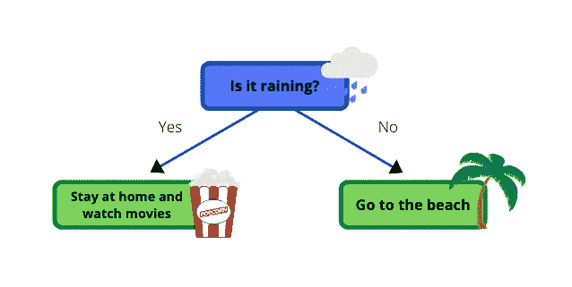

首先，你向窗外望去，查看天气。如果下雨，你就呆在家里，否则，如果不下雨，你就去海滩。一个不需要任何脑力的简单决定。

## 机器学习中的决策树

在机器学习范例中，决策树是一种预测建模工具，其应用跨越多个不同的领域。一般来说，决策树是通过一种算法方法构建的，这种算法方法根据不同的条件来识别分割数据集的方法。这是**监督学习**最广泛使用和实用的方法之一。决策树是一种用于分类和回归任务的非参数监督学习方法。目标是创建一个模型，通过学习从数据特征推断的简单决策规则来预测目标变量的值。在我们的例子中，我们想要预测我们今天要做什么，数据特征是天气，或者更具体地说是是否下雨。

[](https://www.datadriveninvestor.com/2020/02/19/cognitive-computing-a-skill-set-widely-considered-to-be-the-most-vital-manifestation-of-artificial-intelligence/) [## 认知计算——一套被广泛认为是……

### 作为它的用户，我们已经习惯了科技。这些天几乎没有什么是司空见惯的…

www.datadriveninvestor.com](https://www.datadriveninvestor.com/2020/02/19/cognitive-computing-a-skill-set-widely-considered-to-be-the-most-vital-manifestation-of-artificial-intelligence/) 

决策树是一个树状图形，节点代表我们选择属性和提出问题的位置。一旦回答了第一个问题，我们就被定向到另一个节点，根据答案向左或向右，在那里询问第二个问题。第二个问题可能没有进一步的问题，但有一个答案。在没有更多问题被询问的情况下，我们将该节点称为叶节点。这就好比一片树叶在一棵树的末端，没有别的了。

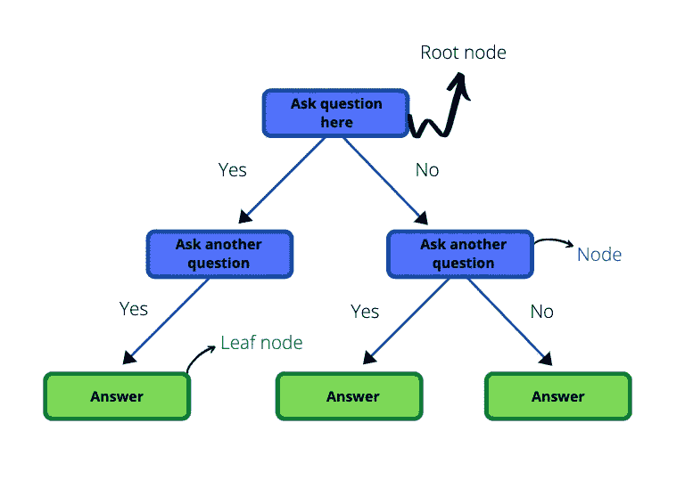

决策树通过从根节点到某个叶节点对示例进行排序来对示例进行分类，叶节点为示例提供分类。在我们之前的天气示例中，根节点是“下雨了吗？”叶节点将是“呆在家里看电影”和“去海滩”。

# E ***一个是/否决策树的例子***

让我们用一个例子来说明这一点。让我们假设我们是医生，想要预测一个病人是否患有季节性流感。流感的通常症状是咳嗽、发烧和疲劳。然而，以前的医生有一组 200 名患者，他们都输入了他们的症状和最终结果(都是/否输入)。我们可以获得这些数据，并希望利用这些数据来帮助我们预测一名新患者是否患有流感。我们会问病人同样的问题，并用这些问题来建立一个决策树。


换句话说，我们希望将上面的表格转换成决策树。但是我们如何开始呢？哪个属性应该在根节点？在我们的天气示例中，这非常简单，因为我们只有一个属性，但是这里有 3 个..

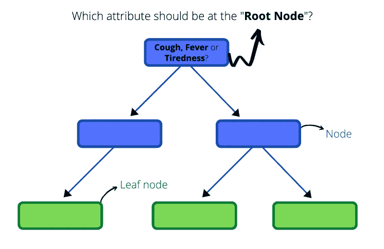

为了决定哪个属性应该在根节点，我们可以从单独查看**咳嗽**以及它预测一个人是否患有流感的能力开始。下图是一个只考虑了**咳嗽**的树。

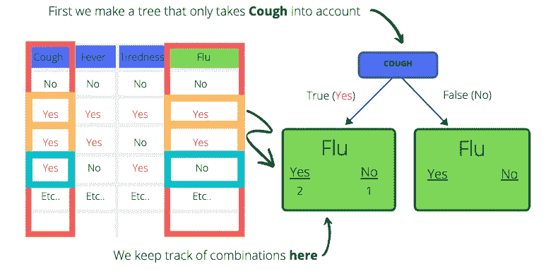

有了上面的树，我们可以**对那些说**是**和**否**患有**咳嗽**的患者进行分类。对咳嗽回答“是”的那一组，我们可以进一步分类。我们将他们分为患流感和未患流感的病人。对咳嗽说不的人也可以这样做。例如，第二个人咳嗽并且患了流感，所以我们把他们放在左边的节点中“是”下。第三个人也有咳嗽和流感，所以他们也在同一个左侧节点，并被总计。第四个人咳嗽，但是**没有患流感。此人进入左侧节点，但在“否”下。****

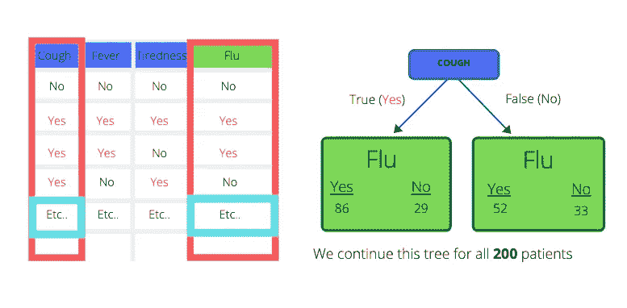

最终，我们对所有 200 名患者继续这一过程。我们这样做是为了发烧和疲劳。

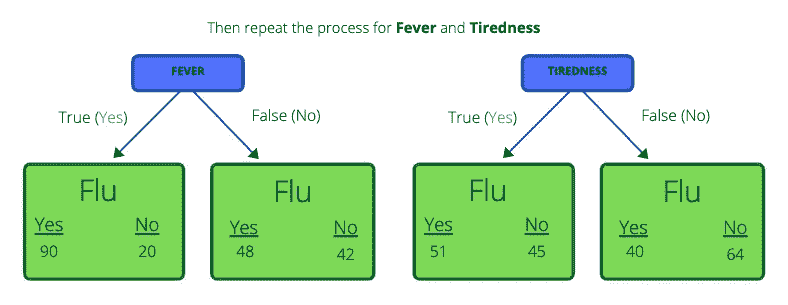

但是记住我们的第一个问题:**哪个属性应该在根节点？**到目前为止，我们已经观察了每个属性是如何将患流感和未患流感的患者区分开来的。下一步是决定哪种分离是最好的。为此，我们将看看**基尼** **杂质分数**。

基尼系数是对随机变量新实例的**错误分类**可能性的测量，前提是该新实例是根据数据集中类别标签的分布**随机分类的。基尼系数越低越好。**

## 基尼杂质公式:

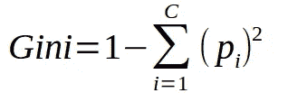

其中 *p* 是某个分类的概率 *i.*

现在我们来计算一下“咳嗽”的基尼杂质分数。

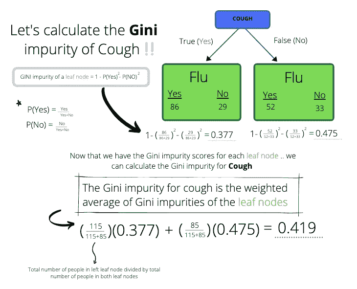

首先，我们使用上面的公式计算叶节点的基尼系数，然后使用它计算父节点的基尼系数(咳嗽)。使用加权平均方法计算父节点。“咳嗽”的基尼系数为 0.419。对“发烧”和“疲劳”应用相同的过程，我们分别得到 0.386 和 0.485 的分数。请注意，“**发烧”**的**基尼系数最低，为 0.386。换句话说，“发烧”最能区分患流感和未患流感的患者。**

> 所以我们将使用“发烧”作为根节点。

一旦我们选择“发烧”作为根节点，我们将把患者分成左右两个节点。如果我们现在关注左边的节点，我们会看到总共有 110 名患者。在这 110 名患者中，90 名患有流感，20 名没有。

> *现在我们要弄清楚如何将左侧节点中的“* ***咳嗽*** *”和“* ***疲劳*** *”这 110 位患者分开。*

我们会像以前一样继续。我们使用“咳嗽”和“疲劳”来区分这 110 名不同的患者，然后计算他们的基尼系数。具有最低分数的属性将被选择作为最好地分隔第一个左边节点的节点。

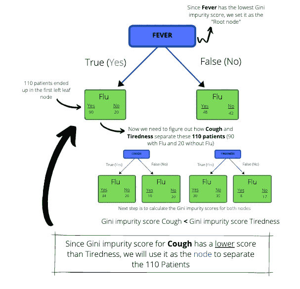

我们也可以将此过程应用于正确的节点。如果节点本身具有最低分数，那么就没有必要再分离患者，并且该节点成为叶节点。这种方法沿着树向下应用，直到我们只剩下叶节点。

最后，我们可能会得到类似这样的东西…

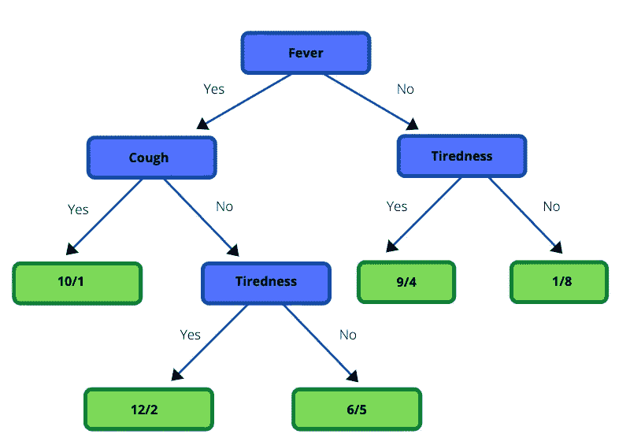

博客的目的是阐明“是”/“否”决策树背后的直觉。但是如果我们有数值呢？

## 带有数值的决策树

如果把“发烧”中的“是”/“否”答案换成实际的温度读数会怎么样？那么我们该如何编译这棵树呢？不要惊慌，这个过程和以前非常相似。首先，我们按照**升序**对属性值进行排序(从最小到最大)。然后我们计算所有相邻患者的平均值。例如，如果前两个值是 10 和 20，我们将得到这两个值的平均值(average = (10+20)/2 = 15)，并将该值插入到 10 和 20 之间。

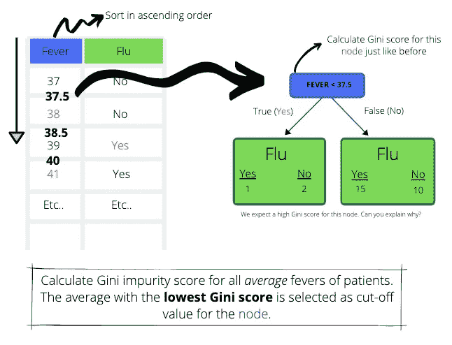

一旦我们插入了所有的平均值，我们就可以使用这些平均值来创建一个有一个根节点和两个叶节点的树。在上图中，我们选择了值**37.5**(37 和 38 的平均值)，并将其用作根节点中的属性。它提出了这样一个问题:哪些病人发烧低于 37.5 摄氏度？如果答案为是(真),则它进入左侧节点，否则它进入右侧节点。你能看到我们跟以前一样遵循同样的观念吗？完成我们的节点后，我们必须计算该节点的 Gini 杂质分数(属性为“Fever < 37.5”)。为了获得基尼系数，我们和前面做的一样:计算叶节点的基尼系数，然后使用加权平均法获得根节点的基尼系数。

对所有平均值都进行这一过程。返回**最低基尼系数分数**的平均值被选为根节点或父节点中的截止值。

# 用 Python 构建决策树

在这里，我们将快速浏览一下用 Sklearn 包在 Python 中构建决策树。


Photo by [Safar Safarov](https://unsplash.com/@codestorm?utm_source=unsplash&utm_medium=referral&utm_content=creditCopyText) on [Unsplash](https://unsplash.com/s/photos/code?utm_source=unsplash&utm_medium=referral&utm_content=creditCopyText)

**关于数据集**

我们将使用心血管疾病数据集，可从 [Kaggle](https://www.kaggle.com/sulianova/cardiovascular-disease-dataset) 下载。这个数据集有 70 000 条患者数据记录，包括 11 个特征变量和 1 个目标变量。目标变量是我们希望用决策树预测的变量。在上一节的示例中，我们将“流感”作为目标变量。在这个新的数据集中，目标变量是心血管疾病的存在或不存在。这是一个二进制值，表示 1 代表存在，0 代表不存在。

*注意*:在笔记本中，我们不清理数据。这样做的原因是博客的目的是说明如何运行决策树分类器，而不是不展示数据清理技术。正确清理数据的责任在读者身上。数据清理和准备是数据科学领域中极其重要的阶段，不容忽视。

**导入必要的库**

```
import numpy as np
import pandas as pd
from sklearn import datasets
from sklearn.model_selection import train_test_split
from sklearn.tree import DecisionTreeClassifier
from sklearn.tree import export_graphviz
from sklearn.externals.six import StringIO  
from IPython.display import Image  
import pydotplus
```

**导入数据**

```
cardio = pd.read_csv("pathname", delimiter = ";")
```

**查看数据集**

```
cardio.head()
```

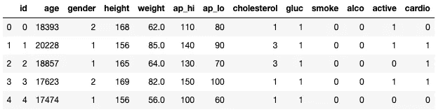

“年龄”这个变量看起来很奇怪，但它是回答者的年龄(int)。“性别”变量用代码分类；男性=2，女性= 1。其余的变量描述可以在[这里](https://www.kaggle.com/sulianova/cardiovascular-disease-dataset)找到。接下来我们必须创建我们的**特征**和**目标**变量。

**特征和目标变量**

```
# Feature variables 
X = cardio.drop('cardio', axis=1)# Target variable
y = cardio['cardio']
```

**创建训练和测试数据集**

下一步是将我们的数据分成**训练**和**测试**数据集。训练数据集用于训练/创建我们的决策树。然后在我们的测试数据集上测试决策树，看看它的表现如何。我们使用 Sklearn.model_selection 中的 train_test_split 函数来实现这一点。

```
# Create the training and test sets
X_train, X_test, y_train, y_test = train_test_split(X, y, test_size=0.2, random_state=123)
```

**实例化决策树分类器**

这里我们实例化决策树分类器并设置参数。所有的参数都在[这里](https://scikit-learn.org/stable/modules/generated/sklearn.tree.DecisionTreeClassifier.htm)详细说明。我们将只讨论其中的几个:

1) **判据:{"gini "，" entropy"}，default="gini":** 衡量拆分质量的函数。支持的标准是基尼杂质的“基尼”和信息增益的“熵”。

2) **max_depth: int，default=None:** 树的最大深度。如果没有，则扩展节点，直到所有叶子都是纯的，或者直到所有叶子包含少于 min_samples_split 样本。

3) **max_features: int，float 或{"auto "，" sqrt "，" log2"}，default=None:** 寻找最佳拆分时要考虑的特性数。

当我们实例化我们的分类器时，我们将选择 max_depth 为 4，并使用基尼标准。max_depth 太低可能会导致树过于简单。

```
# Instantiate the classifier: clf
clf = DecisionTreeClassifier(max_depth=4, criterion="gini")
```

**使分类器适合训练集**

```
clf.fit(X_train, y_train)
```

当运行上面的代码时，我们得到如下所示的输出..

```
DecisionTreeClassifier(ccp_alpha=0.0, class_weight=None,          **criterion='gini'**, **max_depth=4**, max_features=None, max_leaf_nodes=None, min_impurity_decrease=0.0, min_impurity_split=None, min_samples_leaf=1, min_samples_split=2,
min_weight_fraction_leaf=0.0, presort='deprecated', random_state=None, splitter='best')
```

**预测测试集的目标变量:y_pred**

```
y_pred = clf.predict(X_test)
```

**计算测试集上预测的准确性**

准确度可以定义为正确分类实例的百分比。

```
accuracy = float(np.sum(y_pred==y_test))/y_test.shape[0]
print("accuracy:", accuracy)
```

> 我们得到的精度为 0.7303

> “不伟大，也不可怕”——迪亚特洛夫同志

决策树能够以 0.7303 的准确度预测目标变量(心血管疾病的存在)。这不是一个完美的分数，但它明显优于抛硬币(0.50 的准确度)。为了提高这个分数，我们可以使用网格搜索来微调我们的参数或预处理我们的数据。网格搜索迭代地遍历每个参数，并根据一些评估度量返回导致最佳模型拟合的参数。

**可视化决策树**

```
dot_data = StringIO()export_graphviz(clf, out_file=dot_data,  
                filled=True, rounded=True,
                special_characters=True, feature_names = X.columns,class_names=['0','1'])
graph = pydotplus.graph_from_dot_data(dot_data.getvalue())  
graph.write_png('cardio.png')
Image(graph.create_png())
```

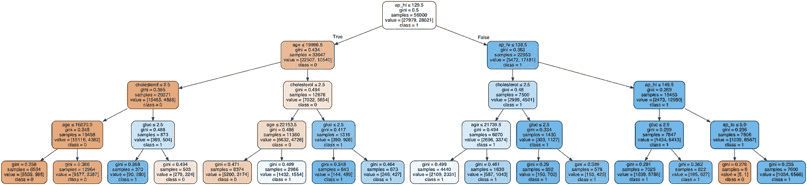

# 结论

决策树非常容易解释和可视化。它们在捕捉非线性模式方面也做得很好，并且它们不需要像其他一些机器学习算法那样多的数据预处理。然而，尽管决策树很好，但它们也有缺点。数据的微小变化会导致决策树结构的巨大变化，从而导致不稳定。此外，与其他算法相比，决策树有时在计算方面要复杂得多。我们经常看到其他算法可以用同样的数据达到更高的准确率，所以要谨慎使用。

这一节的笔记本可以在我的 [GitHub](https://github.com/lukazambuca/Projects/blob/master/Decision_Tree.ipynb) 里找到。

*参考文献*

[与乔希·施塔默的访谈](https://www.youtube.com/watch?v=7VeUPuFGJHk)

[](https://www.hackerearth.com/practice/machine-learning/machine-learning-algorithms/ml-decision-tree/tutorial/) [## 决策树教程和笔记|机器学习|黑客地球

### 决策树分析是一种通用的、预测性的建模工具，可以应用于许多不同的领域

www.hackerearth.com](https://www.hackerearth.com/practice/machine-learning/machine-learning-algorithms/ml-decision-tree/tutorial/)