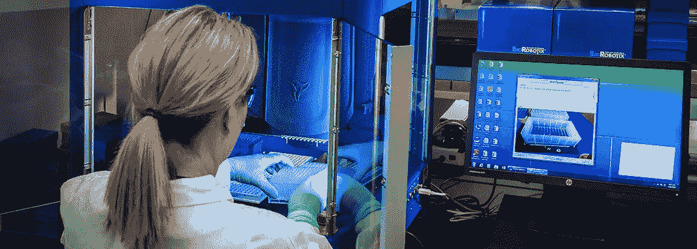
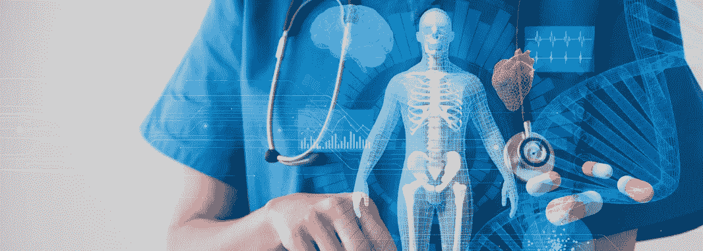
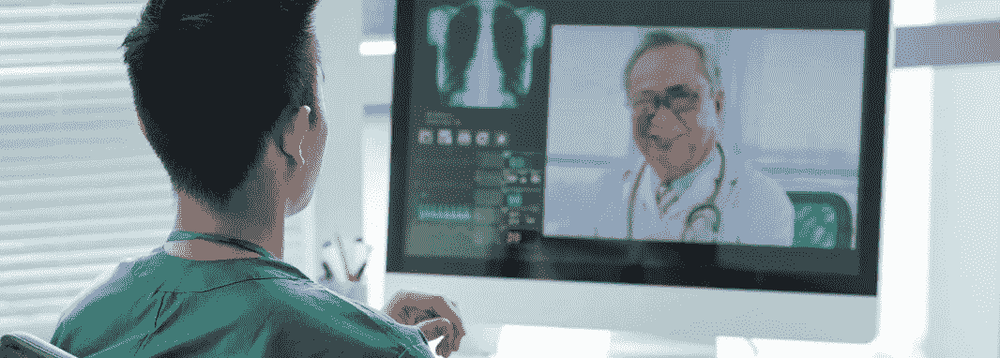

# 医疗保健中的人工智能如何改变其未来？

> 原文：<https://medium.datadriveninvestor.com/how-does-ai-in-healthcare-transform-its-future-ffb455077721?source=collection_archive---------13----------------------->

我正在改变这一切，让事情变得更简单。它改变了我们互动、消费信息、获取商品和服务的方式。它做人类做的事情，但更**高效、快速、成本更低**。怎么会？让我们弄清楚大局。

人工智能，缩写为 AI，不是一种技术，而是计算机科学一个分支的总称。这个分支致力于能够执行类似人类任务的复杂算法和软件:**语音和文本识别、数据分析、学习、解决问题。**

通过对复杂数据及其循环模式识别的分析，[人工智能技术](https://www.zfort.com/ai-development)可以在没有人类直接输入的情况下得出近似结论。

人工智能是一个相当广阔的领域。随着该领域的发展，出现了几种类型的人工智能。人工智能的主要应用是机器学习、深度学习、自然语言处理、图像处理和语音识别。

人工智能可以用于各种行业，人工智能颠覆的时机已经成熟。医疗保健生态系统也不例外。**人工智能通过来自各种数据库的结构化患者数据的可用性以及这些数据分析技术的快速发展来推动医疗保健。**

 [## 大笔资金和尖端技术:人工智能/人工智能投资将如何革新医疗保健…

### 在过去几年人工智能(AI)和机器学习(ML)的显著发展中…

www.datadriveninvestor.com](https://www.datadriveninvestor.com/2018/03/22/big-money-and-cutting-edge-technology-how-investment-in-ai-ml-will-revolutionize-the-healthcare-industry/) 

**借助人工智能创新技术，医生可以做出更精确的诊断**并通过更好的预测改进治疗计划。此外，人工智能越来越多地应用于药物开发、患者监测和护理。由于人工智能能够处理不断增长的详细患者数据数据库，整个医疗保健行业正在转向预防而非反应层面。在这里，我们研究了最近的进展，以回答这个问题:医疗保健中的人工智能有哪些例子？

# 人工智能医学分析

I 来自 MRI 机器、CT 扫描仪和 X 射线的图像可能包含大量复杂的数据，对人类来说，评估这些数据既困难又耗时。这并不奇怪——这是专家训练有素的眼睛，做出诊断非常依赖它。鉴于疾病的许多不同类型和亚型以及各种生物标记和基因组数据形式的新数据的雪崩，这对医生来说正成为一项越来越困难的任务。

在这里，利用人工智能和机器学习的新兴能力可能会有所帮助。[基于人工智能的医疗保健方法](https://www.zfort.com/ai-development)使研究人员能够看到**人类眼睛可能漏掉的东西**。人工智能设备可以扫描图像到单个像素，提供精确的分析。

另一方面，如今许多诊断过程仍然依赖于通过活检获得的物理组织样本。这个过程有风险，包括潜在的感染。核磁共振成像仪、CT 扫描仪和 x 射线捕捉到的放射图像可以提供**对人体内部运作的非侵入性观察**。专家预测，人工智能将使下一代放射设备成为可能，这些设备足够可靠和详细，在某些情况下可以取代对组织标本的需要。为了实现非常接近的配准，应该知道任何给定像素的地面实况。

这项研究的成功可能会让临床医生对肿瘤作为一个整体的表现有更准确的理解，而不是将治疗决定建立在一小部分恶性肿瘤的特性上。研究人员还可以更好地确定癌症的侵袭性，并更恰当地进行针对性治疗。

也就是说，人工智能正在帮助实现**“虚拟活检”**并推进放射组学的创新领域，该领域专注于利用基于图像的算法来表征肿瘤的表型和遗传特性。

# 人工智能诊断

T 如今，当**诊断错误导致大约** [**10%的患者死亡**](http://www.nationalacademies.org/hmd/~/media/Files/Report%20Files/2015/Improving-Diagnosis/DiagnosticError_ReportBrief.pdf) 时，医疗保健人工智能正在医疗诊断的发展中发挥不可或缺的作用。

对这种服务的需求超过了专家的供给。对此进行管理是医疗保健部门的一项重要任务。此外，诊断专家和医生需要一套新的工具来处理越来越多的医疗数据。为了提供这个新的工具集，我们需要利用人工智能的力量来开发新的解决方案。

目前，人工智能在医疗诊断中的应用处于早期采用阶段。尽管如此，它们仍有可能影响医疗系统解决诊断问题的方式，以及人们实时跟踪自身健康变化的可能性。医疗保健的机器学习，加上计算机处理的改进，逐渐有助于各种专业诊断的准确性和效率。例如，**人工智能可以收集和分析从多个来源收集的患者数据，如健身追踪器和家庭监视器**，并使医生能够以没有人工智能的时间和资源不允许的方式监控患者的健康。

> 结合人工智能的消费可穿戴设备的普及还被应用于**监督心脏病**，使医生能够在更早的可治疗阶段发现潜在的威胁生命的事件。

肿瘤学研究人员正在使用深度学习来教授算法，以便在与合格医生相当的水平上识别恶性组织。斯坦福大学的研究人员训练了一种人工智能算法，使用 13 万张代表疾病的图像来检测皮肤癌或黑色素瘤。

人工智能的使用使得乳房 x 光片的检查和翻译速度提高了 30 倍，准确率达到了 99 %,减少了不必要的活检。

许多企业正在考虑将[大数据](https://en.wikipedia.org/wiki/Big_data)融入医疗保健行业的可能性。微软、IBM、谷歌和英特尔等大公司为医疗保健领域的人工智能应用做出了贡献，整合了从 EHR、成像、患者生成、传感器和其他形式的数据中收集的大数据。

最近，IBM 的 Watson(一个能够结合机器学习和 NLP 能力回答问题的系统)展示了对精准医疗，特别是癌症诊断和治疗的关注。谷歌还与医疗服务网络合作，从大数据中建立预测模式，以警告临床医生高风险状况，如败血症和心力衰竭。

各种公司正在使用具有自然语言处理能力的人工智能聊天机器人来识别报告症状中的模式，并形成潜在的诊断，预防疾病，或提出建议。例如，一个应用程序可以回答某人描述的类似流感的症状，建议去药店购买药物。如果用户描述了更严重的症状，该应用程序可能会建议拨打急救电话或去医院。

科技公司和初创公司也在努力解决同样的问题——诊断似乎是初创公司的重点领域之一。最突出的例子如下。“Kheiron Medical”开发了深度学习软件，用于在乳房 x 光片中检测乳腺癌。“医疗服务”是一种实时医疗咨询服务，能够访问和存储他们的电子病历。“预测医疗技术|使用重症监护室数据来发现可能会心脏病发作的患者。

# 人工智能中的远程医疗

病人不必离开温暖的家去看医生。远程医疗软件开发**模拟医生和患者之间面对面的互动**。

此外，人工智能应用程序可以通过使用移动设备和云技术[接收分析——指尖在智能手机上按一下](https://spectrum.ieee.org/the-human-os/biomedical/devices/measure-your-blood-pressure-using-just-your-phone)就会返回一个人的血压。

远程医疗可以存储和分析所有患者数据，预测进一步的变化。他们可以**就身体缺少哪种营养元素，一个人是否需要更多的体育锻炼或睡眠给出建议**。例如，“Lemonaid Health”等创业公司利用人工智能在医疗保健领域的研究成果来筛选和评估患者，以便医生可以做出诊断，并从远程位置开出任何药物。

远程医疗也有助于医生的便利。一般来说，医生会花大约一半的工作时间在办公桌前填写电子病历。医学中即将到来的人工智能进步将**减轻这一负担，并使 EHR 检索更容易**。聊天界面可以收集患者数据并以可立即检索的方式存储。

人工智能技术改善了世界各地医学专家之间的合作。通过利用彼此的见解和发现，医生将更有效地工作。

# 新药创造

药物开发是一个漫长、复杂、昂贵的过程，具有高度的不确定性。一种药物治疗从研究实验室到病人身上大约需要 12 年，一家公司要花费大约 3 . 6 亿美元。

药物的研究和发现是人工智能在医疗保健领域的最新应用之一，旨在**缩短新药上市时间并降低其成本**。

基于数据和高级分析，人工智能技术支持对实验室实验结果的预测。结合临床开发，AI 将减少临床试验的数量和研究的持续时间。它的吸引力很简单——使用不同类型的人工智能，计算机系统可以提出并处理不同的分子。然后，人工智能系统可以将结果与各种参数进行比较，并比人类更快地获得最有希望的化合物，从而降低成本。

人工智能还能够通过科学研究和患者数据进行挖掘，并帮助重新调整旧药物的用途。

# 对抗和预防病毒

正如新药化合物的创造一样，人工智能系统可以**预测新病毒的出现**。基于对现有病毒的分析，医疗保健中的 AI 可以分析蛋白质链，并模拟所有可能的分裂和修改。

可以训练神经网络来实时预测传染病的传播。除此之外，人工智能算法可以识别**预防措施如何才能产生最显著的效果**。

研究人员竭尽全力预测下一次爆发。从全球范围内收集的大量病毒数据也应该用于训练人工智能算法，以预测动物中的哪些感染可能会转移到人类，以便我们可以在转移之前阻止它们。

# 人工智能外科

成像、导航和外科机器人改变了手术实践。人工智能应用为手术过程带来了**精确性、鲁棒性、安全性和自动化**。

人工智能机器人能够高精度地控制其运动的轨迹、强度和速度，不仅可以帮助外科医生，而且**可以提高人眼的精确度**，并对每个位置和运动提供更多控制。机器人手术缓解了医生的疲劳，使微创手术成为可能。也就是说，人工智能可以延长生命，延长患者生存的边界。

# 人工神经修复术

神经假体是通过电刺激增强神经系统的人工装置，以补偿缺乏的运动技能、认知、视觉、听觉、交流或感觉技能。一些例子是**脑机接口(BCIs)、脊髓刺激器(SCS)** 、心脏起搏器等。

虽然全球上肢假肢**的价值预计到 2025 年**将超过 23 亿美元，但它们的灵活性还不够。为了提高控制水平并给用户真正的自主权，研究人员将神经工程与机器人和人工智能相结合，以半自动方式实现部分电机功率的“共享控制”。**新的脑机接口**和仿生手**提供对用户动作的完全控制**。由深度学习方法驱动，机器人手可以在 400 毫秒内做出反应。

# 人工智能支持的医学世界传播

训练有素的医疗服务提供者的短缺严重限制了全球发展中国家获得拯救生命的医疗服务。

医学中的人工智能可以通过接管一些通常分配给人类的诊断职责来帮助缓解这个问题。

例如， **AI 成像工具可以筛查胸部** x 光是否患有结核病，显示出足够的准确性水平。这种能力可以通过低资源地区的提供者可用的应用程序来部署，从而减少现场对训练有素的诊断放射科医师的需求。

# 人工智能重症监护

重症监护室的医生需要分析大量复杂的数据，以做出关乎生命的决策。医疗保健中的人工智能允许中介利用他们在提供治疗方面的经验。医疗保健领域常规接收的大数据和机器学习**确保更好的严重程度评分、临床决策和整体更大的个性化护理**。

例如，脓毒症往往直到晚期才被发现——人工智能系统快速分析许多变量来**预测脓毒症和死亡率**。对心电图数据进行深度学习分析，在 ICU 患者中连续测量，可以立即检测到变化。

# 自拍诊断

你有没有想过手机可以变成一个医疗保健人工智能工具？

我们的手机产生的图像可以被人工智能算法分析。这些照片被广泛应用于**皮肤病学、眼科，甚至被用作识别儿童发育疾病的工具。**

几乎每个行业的主导者都开始在他们的设备中内置人工智能软件，因为我们每天产生超过 250 万兆兆字节的数据。手机可以使用不同类型的人工智能数据来提供更个性化、更快、更智能的服务。

同样，在医学中利用人工智能对发展中地区也很有用，有助于解决医疗专家短缺或偏远地区的问题。

# 医疗保健人工智能公司

正如本文前面提到的，许多公司巨头已经建立了医疗保健领域的人工智能项目。提供认知计算能力系统的先驱， [**IBM 的沃森**](https://www.ibm.com/watson) **健康计划**，已经在纪念斯隆-凯特琳癌症中心与 Anthem 一起研究肺癌的治疗。

这个人工智能系统使用云计算，收集大量数据，并对其进行分析。它被用作**医生在诊断中的全面顾问**。利用关于症状的数据、其他细节，如家族史、正在接受的治疗、疾病持续时间、以前的治疗以及来自测试、同行评审研究和临床研究的其他发现，Watson's health **为每个潜在客户提供不同的治疗方案**,并给出置信度评级。

IBM Watson 的认知计算服务还提供与任何应用程序的集成，并通过 Watson API 和开放的多云平台得到其现有服务**的协助。**

屈臣氏健康公司还与 CVS 健康公司合作治疗慢性疾病，与强生公司合作在科学研究的基础上发现新药。

医学中的人工智能也得到微软癌症研究的大力支持，该研究旨在对患者的免疫细胞进行编程，以识别并杀死白血病细胞。微软研究人员认为，这种重新编程生物学的能力具有巨大的潜力，可以改变我们生产一切的方式。

反过来，**医疗保健领域的谷歌人工智能**正在重建有助于检测、诊断和治疗的数据基础设施。在医疗保健领域应用人工智能，该公司正在跨许多不同的分支机构开展工作，这些分支机构尚未紧密结合在一起。除此之外，谷歌还为新冠肺炎信息的传播做出了重大贡献，并提供了 8 亿美元的冠状病毒应对包。

# 总结

医学中的人工智能启发我去创新。它为新的人工智能创业公司的发展提供了肥沃的土壤。我们看到的例子表明，从诊断到治疗和持续健康维护，人工智能应用成为整个患者旅程中医疗保健挑战解决方案的支柱。现在，当考虑到**采用人工智能技术**时，您可以做出明智的决定。与人工智能领域的专家一起构建你的项目。

*最初发表于*[*【https://www.zfort.com】*](https://www.zfort.com/blog/ai-in-healthcare)*。*