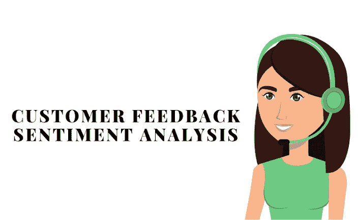
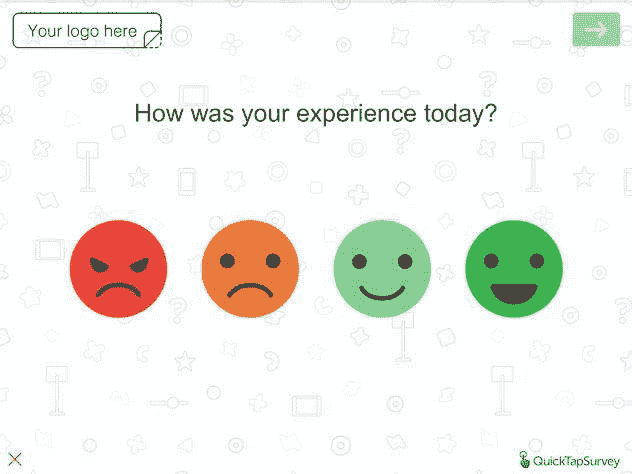
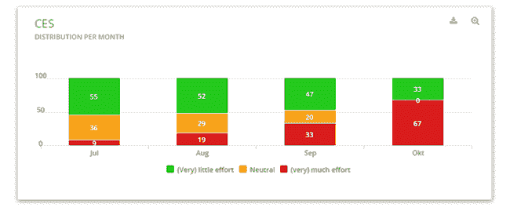
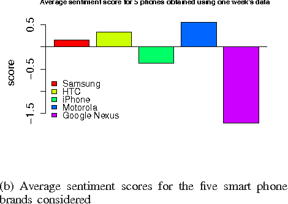
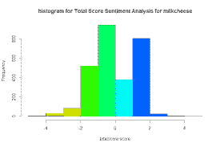
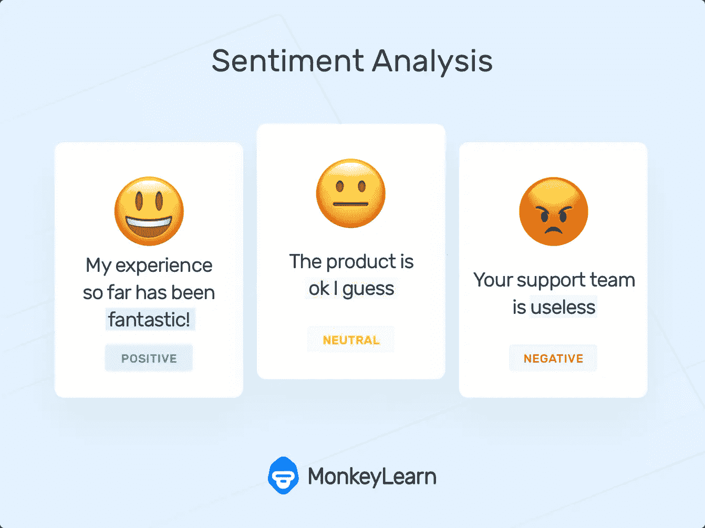

# 客户反馈情绪分析在搜索营销中是如何工作的？

> 原文：<https://medium.datadriveninvestor.com/how-does-customer-feedback-sentiment-analysis-work-in-search-marketing-82809296db?source=collection_archive---------0----------------------->

当谈到了解客户反馈时，情绪分析正成为任何企业的可行工具。例如，情感分析算法正被用来理解客户反馈调查中的用户反馈，该调查包含开放式问题和回答。

是什么让情感分析比其他类型的分析更有价值？由于自然语言处理(NLP)的进步，数据分析师可以通过他们的自然语言将客户反馈分为正面或负面。借助捕捉客户反馈情绪分析的正确媒介，产品营销公司可以更深入地了解客户意见，提高销售额和收入。

尽管它很先进，但大多数数字营销公司并没有意识到客户反馈和情感分析在搜索营销(简称“搜索引擎营销”)中的价值。在接下来的几节中，我们将讨论为什么分析客户反馈很重要，以及用户反馈分析在搜索营销中的价值。

# 什么是客户反馈？

以顾客评论的形式，顾客反馈可以在搜索营销中发挥至关重要的作用。例如，用户生成的内容(由客户发布)可能是其他用户广泛信任的真实内容来源。

以下是客户反馈在搜索营销中发挥作用的一些方式:

## 为你的企业创造 SEO 价值。

像谷歌这样的流行搜索引擎喜欢用户生成的内容(或 UGC ),并给拥有大量 UGC 的网站更高的排名。有 ugc 的网站被搜索引擎评为更真实可信。

 [## 金融中的机器学习|数据驱动的投资者

### 在我们讲述一些机器学习金融应用之前，我们先来了解一下什么是机器学习。机器…

www.datadriveninvestor.com](https://www.datadriveninvestor.com/2019/02/08/machine-learning-in-finance/) 

因此，客户评论可以成为一种有效的搜索营销工具，可以提高有机搜索排名，鼓励更多的用户点击，甚至增加转化率。

## 提高业务透明度

在线调查期间，客户在与任何品牌互动之前都会不断寻找证据。客户评论提高了业务透明度，从而提高了对你的业务的在线信任度。客户反馈可以作为第三方验证工具，建立用户对你的品牌和在线促销的信任。

透明度也可以推动更高的转化率。这方面的一个例子是对 Just Mortgage Brokers 的案例研究，他们通过在其网站上添加客户评论，将转化率提高了 57% 。

## 区分你的品牌地位。

有效的数字营销就是建立网站内容，吸引你的受众，并促使他们更深入地参与你的业务。客户评论或证明可以将你的 B2B 或 B2C 业务与竞争对手区分开来，帮助你的品牌脱颖而出。

接下来，我们将学习情绪或情感分析在营销中的作用，以及如何将其用于分析客户反馈。

# 使用情感分析来分析客户反馈

简而言之，情感分析是一个算法驱动的过程，可以将用户反馈分为积极、消极或中性。情感分析算法可以访问大型单词字典，每个单词都有正面或负面的情感(或者都没有)。

基于用户反馈中包括的单词和相关联的情感，情感分析方法为它们分配情感得分。因此，正面反馈会得到较高的情感分数，而负面反馈会得到较低的分数。

这是一个用户反馈仪表板的例子。

根据情绪得分，数据分析师可以通过以下任何方法分析客户反馈:

## 计算平均情感分数

平均情绪得分是总体客户反馈的良好指标。高平均分表示积极响应，意味着积极情绪在响应中占主要份额。另一方面，一个低(或负)分数表明很大程度上是负面反馈。

## 测量情感直方图

情感直方图直观地展示了您的情感分数是如何分布的。直方图显示了大多数情感分数聚集的点。例如，在上面的插图中，直方图显示用户没有做出极其积极(或消极)的反应。这由极少数极高(和极低)的情绪分数来表示。

## 开发单词云

虽然情感得分可以指示正面或负面的反馈，但词云可以帮助分析用于传达用户情感的实际词。开发词汇云有助于理解反馈主题或回复中讨论的话题。例如，通常传达积极反馈的词包括“好”、“值得信赖”、“创新”和“棒极了”

接下来，我们将看看如何使用人工智能(AI)和机器学习(ML)等技术实现情感分析。

# 使用人工智能和最大似然的情感分析

实施情感分析以获得更好的客户服务是一个很好的想法，但在执行中非常具有挑战性。即使采用了自然语言处理(NLP)，情感分析工具也无法检测出充满讽刺的用户评论。例如，考虑以下用户评论:

“这是一个好看的购物袋。我发现它非常有用，不到一个月，它就值得我携带所有的当地杂货。”

随着“好看”、“有用”和“有价值”这些词的使用，它很可能被归类为“积极的”反馈。由于充斥着如此明显的“讽刺”评论，你的情感报告肯定是不准确的。

然而，解决方案在于采用像 AI 和 ML 这样的技术，这些技术可以准确地对广泛的数据源进行情感分析。基于机器学习的工具可以轻松地从用户评论和反馈中提取一系列情绪，从而实现更好的客户服务并提高业务投资回报率。

以下是 AI 和 ML 工具用于检测基于文本的用户评论中讽刺的典型过程:

1.  导入讽刺评论的数据集

第一步是导入包含数百万讽刺评论的数据集。对于数百万行，每个数据集记录通常包含以下属性:

*   标签
*   评论
*   作者
*   子编辑
*   得分
*   起伏不定
*   日期
*   已创建 _utc
*   家长 _ 评论

对于情感分析，只有“标签”和“评论”属性是重要的。“标签”标记为 0(对于任何讽刺性评论)或 1(对于非讽刺性评论)。“comment”属性包含用户评论的文本。

1.  在以表格格式捕获这个数据集之后，下一步是将分析数据输入到人工智能引擎中。这可以使用以下任何一种技术来完成:

## 使用 TF/IDF

术语频率/逆文档频率的简称，该技术测量数据集中的记录总数除以特定术语在数据集中出现的次数。例如，N 元语法级别的 TF/IDF 分数，用于衡量 N 个术语的总和。

使用这种技术，您可以使用“label”作为目标列，按照 70:30 的比例分割数据集。此外，删除所有其他数据集列，只保留最终数据集中的“comment”列。

## 使用 TensorFlow CNN

作为卷积神经网络的简称，CNN 技术依赖于基于机器学习技术的张量流数据模型。这个 ML-powered 模型是使用主题造型手法从收集的数据集中识别单词组(也称为主题)而生成的。

使用 TensorFlow，人工智能工具可以处理更大量的文本，并利用可用数据建立高效的模型。

# 结论

通过这篇文章，我们讨论了客户反馈和情感分析在搜索营销中的价值。尽管执行起来很复杂，但搜索营销中的情感分析是处理您生成的客户反馈数据的最佳方式。感谢像[人工智能](https://www.countants.com/blogs/importance-of-artificial-intelligence-in-customer-service/?utm_medium=social&utm_source=Medium&utm_campaign=traffic)和[机器学习](https://www.countants.com/blogs/leveraging-machine-learning-in-text-to-speech-tools-and-applications/?utm_medium=social&utm_source=Medium&utm_campaign=traffic)这样的技术，情感分析的准确性在今天是绝对可能的。

凭借其在人工智能和人工智能方面的专业技能，Countants 是一家数据分析公司，准备提供情感分析方面的最佳解决方案。Countants 可以成为您在[数据分析](https://www.countants.com/blogs/why-data-analysis-for-small-e-commerce-businesses-is-best-outsourced/?utm_medium=social&utm_source=Medium&utm_campaign=traffic)和商业智能方面寻求效率的企业的一站式解决方案提供商。

如果您正在从宝贵的客户反馈数据中寻求业务优势，请访问我们的[网站](https://www.countants.com/?utm_medium=social&utm_source=Medium&utm_campaign=traffic)或[立即致电我们](https://www.countants.com/contact-us/?utm_medium=social&utm_source=Medium&utm_campaign=traffic)。