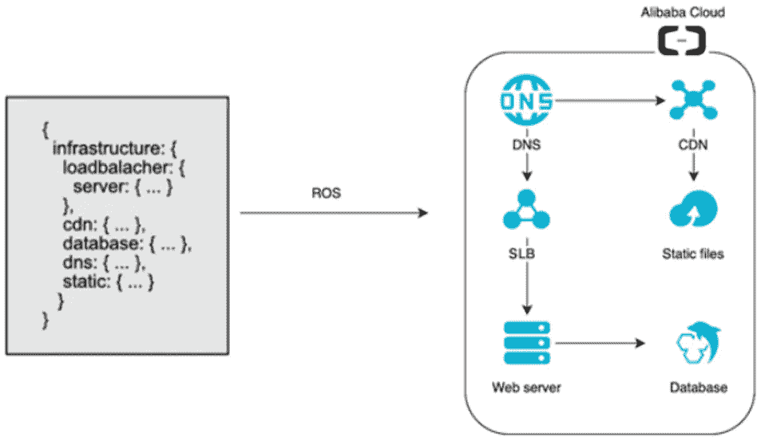
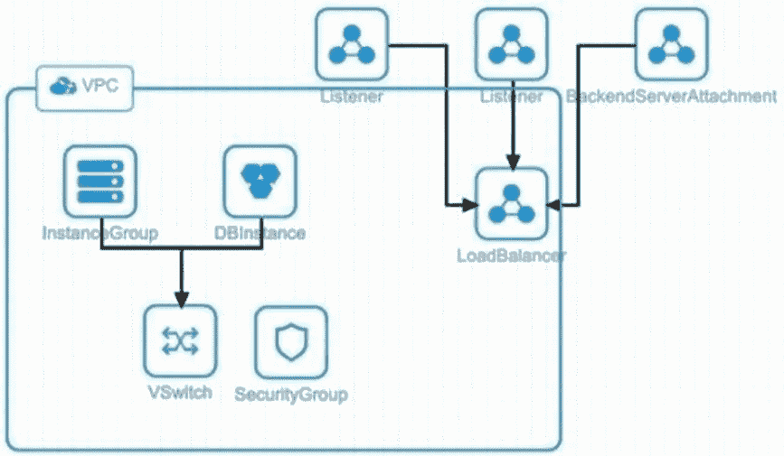
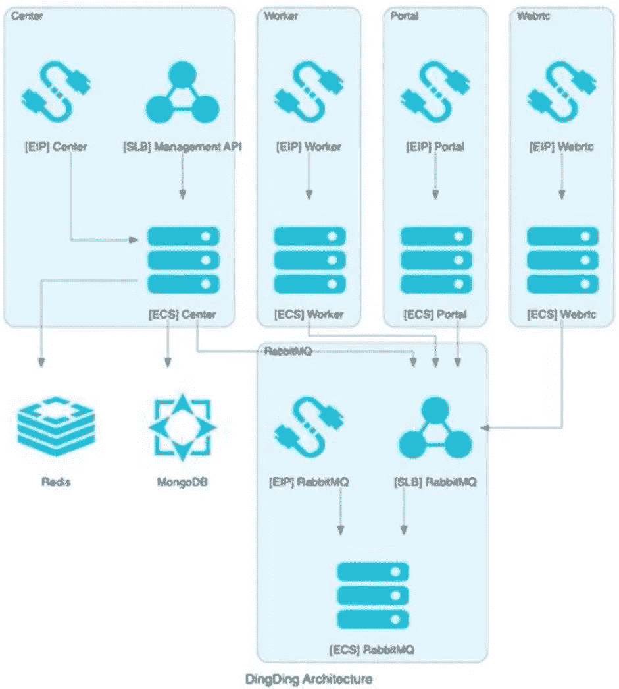

# 在新冠肺炎病毒爆发期间，DingTalk 如何使用 ROS 应对流量高峰？

> 原文：<https://medium.datadriveninvestor.com/how-does-dingtalk-cope-with-traffic-spikes-during-the-covid-19-outbreak-using-ros-31e1ae8ae4e5?source=collection_archive---------17----------------------->

由 ECS 团队完成。

DingTalk 是阿里巴巴集团推出的面向企业的即时通讯软件，向企业用户提供在线组织、在线交流、在线协作、在线商务、在线生态系统等功能。DingTalk 已经服务了超过 1000 万企业客户，最近还扩展到教育市场，提供丰富的远程课堂解决方案。到目前为止，DingTalk 拥有超过 2 亿用户，是中国最大的移动办公应用。2020 年 2 月 5 日，DingTalk 在苹果的 App Store 中排名免费应用№1。其底层计算资源由阿里云计算提供。

# 最近疫情爆发带来的新挑战

由于最近冠状病毒爆发导致的旅行限制，世界各地对在线教育和在线办公应用的需求不断增长，尤其是在 Mainland China。许多企业首选的在线办公软件 DingTalk 的用户流量激增，尤其是对视频会议和直播有需求的用户。为了响应中国教育部门关于坚持在实体课堂之外学习的号召，DingTalk 为老师们提供了免费试听的线上课堂。

丁谈的流量激增带来了资源规模扩大的技术挑战。当中小学生在网上发泄对 DingTalk 表现的愤怒，同时开玩笑说要给 DingTalk 一颗星的五星评级时，DingTalk 陷入了困境。在网民的负面意见中，一条发人深省的评论出现在互联网上:

自 1 月 28 日以来，来自视听会议和直播的访问流量成倍增长。在云上开发的 DingTalk 是阿里云最初努力资源规模化的目标，以卓越的体验满足在家办公和学习的用户需求。那么，DingTalk 是如何做到这一点的呢？

 [## 云让犹豫不决的职业生涯规划者变得简单:基础|数据驱动的投资者

### 尽管 IT 在当今的商业中扮演着重要的角色，但许多 IT 求职者都不愿意从事云计算职业…

www.datadriveninvestor.com](https://www.datadriveninvestor.com/2020/03/11/cloud-made-simple-for-undecided-career-change-planners-the-fundamentals/) 

# 大规模扩张的两大挑战:效率和资源供应

# 手动扩展的挑战:效率低

紧迫的最后期限。DingTalk 技术团队必须在短短几天内解决流量激增的问题。自 1 月 29 日以来，DingTalk 团队一直致力于阿里云的规模扩张。截至 2 月 2 日，资源仅扩大了几倍，从最初的 20，000 个 vcpu 增加到 30，000 个 vcpu，严重不足以满足业务需求。

复杂的购买和配置程序。与单个集群的[弹性计算服务](https://www.alibabacloud.com/product/ecs?spm=a2c41.14153179.0.0) (ECS)不同，DingTalk 的系统架构包含了多种资源，包括[服务器负载均衡器](https://www.alibabacloud.com/product/server-load-balancer?spm=a2c41.14153179.0.0) (SLB)、用于 MongoDB 的[ApsaraDB](https://www.alibabacloud.com/product/apsaradb-for-mongodb?spm=a2c41.14153179.0.0)、用于 Redis 的[ApsaraDB](https://www.alibabacloud.com/product/apsaradb-for-redis?spm=a2c41.14153179.0.0)以及弹性 IP (EIP)。这些资源需要单独购买，它们之间的关系需要手动配置。

手动部署效率低下，错误率高。DingTalk 拥有庞大的用户群。手动部署一个集群大约需要 1 个小时，一次只能同时运行 3 到 4 个集群。部署过程需要许多配置步骤，这很容易出错。

复杂部署。集群服务功能是自我封闭的，可以无限制地扩展，但这会增加部署的复杂性。鼎谈的放大项目涉及 8 个地区和 16 个区。传统部署方法可能会降低纵向扩展效率，并增加大型群集管理的复杂性。为了让数以亿计的员工和学生能够在家工作和学习，DingTalk 团队需要在短时间内扩展近 1000 个集群。管理一千个资源的关系是困难的，更不用说超过一百万的情况了。

在手动部署模式下容错能力差，故障排除困难。不同集群之间经常会出现配置差异。例如，一个集群使用端口 300 作为 SLB 监听端口，而另一个集群出于相同目的使用端口 3000。这使得故障排除变得困难。

DingTalk 团队还面临着创建和操作大规模集群的巨大技术挑战。

# 通过 ROS 快速自动部署

在 2 月 2 日流量高峰出现之前，DingTalk 使用阿里云[资源协调服务](https://www.alibabacloud.com/product/ros?spm=a2c41.14153179.0.0) (ROS)来提高集群部署效率，实现快速集群扩展。ROS 在短短 2 小时内帮助 DingTalk 部署了超过 10000 个 ECS 实例，创下了阿里云快速规模化的新纪录。

# ROS 是什么？

[阿里云 ROS](https://www.alibabacloud.com/product/ros?spm=a2c41.14153179.0.0) 是一个编排服务，帮助你自动创建、更新、删除云资源。ROS 使用堆栈(一种逻辑集合)来集中管理分组的云资源。对于阿里云来说，栈就是一组阿里云资源。ROS 允许您以资源栈的形式创建、删除和克隆云资源。通过在 DevOps 实践中使用 ROS，您可以轻松地克隆开发、测试和生产环境，并整体迁移和扩展应用程序。

# 基础设施作为代码

ROS 是阿里云提供的基础设施即代码(IaC)解决方案，快速实现 IaC 作为 DevOps 的关键组件。

# 全面管理的自动化服务

ROS 是一项完全托管的服务，不需要您购买任何资源来使用 ROS，这样您就可以专注于资源模板中定义的业务云资源。托管自动化加速了创建对应于多个堆栈的多个项目的过程。

# 可重复部署

您可以使用相同的模板为开发、测试和生产环境部署资源。您可以为不同的环境设置不同的参数值。例如，您可以将测试环境中的 ECS 实例数量设置为 2，将生产环境中的 ECS 实例数量设置为 20。您还可以使用相同的模板将资源部署到多个地区。这提高了多区域部署的效率。

# 标准化部署

实际上，不同环境中的细微差异通常会导致复杂的管理和高昂的成本，延长故障排除时间，并干扰您的正常业务运营。通过使用 ROS 进行重复部署，您可以标准化部署环境，最小化不同环境之间的差异，并将环境配置设置到模板中。类似于代码管理的严格管理过程可以确保标准化的部署实践。

# 统一的身份验证、安全性和审计

与其他同类产品相比，阿里云的原生 IaC 服务 ROS 提供了与其他阿里云服务的更好集成。与[资源访问管理](https://www.alibabacloud.com/product/ram?spm=a2c41.14153179.0.0) (RAM)的集成提供了统一的认证，无需建立单独的用户认证系统。所有云产品上的操作都是通过 API 调用的。这样，您可以使用 ActionTrail 来检查所有的& M 操作，包括那些在 ROS 上的操作。

# ROS 如何为 DingTalk 实现向上扩展？

# 定义资源模板

ROS 帮助 DingTalk 在阿里云快速创建描述所需资源(如 ECS 实例、数据库实例)的模板，以定义 DingTalk 的集群架构。ROS 提供了一个可视化编辑器，用于通过拖放来创建模板。创建模板后，ROS 自动创建和配置模板描述的资源来实现 IaC。

# 解析和运行模板

当收到栈创建请求时，ROS 在创建栈之前解析模板。解析包括语法检查、参数验证和依赖性分析。

依赖性分析旨在出于两个目的分析资源之间的依赖性:

*   确保资源创建的正确性。如果资源 A 依赖于资源 B，那么资源 B 在资源 A 之前创建。
*   提供并行创建功能。没有依赖关系的资源可以并行创建。

模板解析后，ROS 根据依赖关系中的角色逐个创建资源，类似于状态机机制。

资源模板可以快速重复部署，尤其是在多地区和多区域的情况下。这样减少了环境之间的差异，规范了部署过程和结果，减少了环境差异带来的系统问题。

# 摘要

阿里云[资源编排服务](https://www.alibabacloud.com/product/ros?spm=a2c41.14153179.0.0) (ROS)帮助 DingTalk 以渐进和快速的方式扩大和部署了 10 万个 ECS 实例，效率提高了 100 倍，创下了阿里云的记录。

目前，ROS 平均每分钟可以扩展一个集群，每天可以扩展超过一百万个 vCPUs。回收和释放数百万资源是一个巨大的工程。ROS 提供了一键销毁功能，自动回收集群中的所有资源，避免了麻烦的操作和遗漏。

弹性是云计算的最大优势，支持提供全民受益的便捷服务。作为阿里云原生的自动编排和部署服务，ROS 最大限度地发挥了云计算的弹性，为 DingTalk 提供了强大的支持，使其成为最受欢迎和最精简的在线交流平台。

*在继续与全球爆发的冠状病毒作战的同时，阿里云将发挥自己的作用，并尽一切努力帮助其他人与冠状病毒作战。点击*[*https://www . Alibaba cloud . com/campaign/supports-your-business-anytime*](https://www.alibabacloud.com/campaign/supports-your-business-anytime?spm=a2c41.14153179.0.0)了解我们如何支持您的业务连续性

# 原始来源:

 [## 在新冠肺炎爆发期间，DingTalk 如何使用 ROS 应对流量高峰？

### 阿里巴巴 Clouder 2020 年 3 月 11 日 11,591 DingTalk 是阿里巴巴推出的面向企业的即时通讯软件…

www.alibabacloud.com](https://www.alibabacloud.com/blog/595963?spm=a2c41.14153179.0.0)