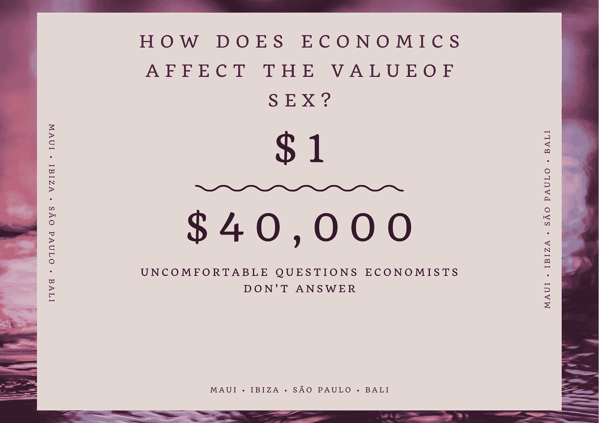

# 经济学是如何影响性的收益和可用性的？

> 原文：<https://medium.datadriveninvestor.com/how-does-economics-affect-the-profitability-and-availability-of-sex-9d6e8615cae1?source=collection_archive---------3----------------------->

## 经济学家不会为你掩盖的更令人不安的分析

## 本周，我和一位资本主义经济学家大吵了一架，现在还没缓过来。通常我会满足于经济辩论中的“不可调和的分歧”条款，但这种特殊的口头争论如此令人恼火，我决定以分析的形式扩展它。我发现，保守的经济学家常常对模糊成丑闻、淫秽、令人不快和道德问题的经济学领域感到不安。让你高兴的是，我不是很保守。所以，在进一步研究之后，让我们来解决这个问题:

## 经济条件和制度如何影响性产业？

上周，我读了一篇非常有趣的人种学文章，作者是现代资本主义德国的一位颇为乖张的人。在书中，他抱怨道，在社会主义制度下，女性更难被收买发生性关系。你不能用礼物或外出聚餐的方式来购买她们，因为她们拥有与男性同等水平的可消耗资本。也就是说，如果他们想要巧克力或玫瑰，他们不需要蛤蟆想吃天鹅肉。现在，我不是一个读了一篇评论文章就高兴地开始唱《国际歌》的人，但是这让我思考。在不同的经济条件下，我们的性行为会发生什么变化，进而性产业的利润和范围会发生什么变化？

让我们明确一点:我在这里不是要否决或促进任何一种经济体系。我是第一个承认在社会主义政权下对女性的许多卑鄙和阴暗的行为的人，这些阴影从 1945 年[入侵柏林](http://www.bbc.co.uk/history/ww2peopleswar/stories/36/a3009836.shtml)一直延伸到[贝利亚在莫斯科的玫瑰园的可怕秘密。我也不是一个对资本主义吸血鬼小心翼翼的人，他们通过骇人听闻的剥削和贿赂来满足年轻女性的绝望和梦想。正如我那位神经质的共和党朋友很快就指责我的后一种担忧一样，所有的制度都包含了关于女性的同意和自由的恐怖故事。对此我说:太好了。从经济的角度来看，这是一个多么好的理由来更仔细、客观地研究它们。](https://www.telegraph.co.uk/news/worldnews/europe/russia/1450145/Stalins-depraved-executioner-still-has-grip-on-Moscow.html)

 [## 为什么包容性财富指数比 GDP 更能衡量社会进步？|数据驱动…

### 你不需要成为一个经济奇才或金融大师就能知道 GDP 的定义。即使你从未拿过 ECON 奖…

www.datadriveninvestor.com](https://www.datadriveninvestor.com/2019/03/08/why-inclusive-wealth-index-is-a-better-measure-of-societal-progress-than-gdp/) 

所以，让我们从一个简单的问题开始。 [*做爱要多少钱？*](https://www.havocscope.com/black-market-prices/prostitution-prices/)

如同任何形式的劳动，或者更愤世嫉俗地说，交换一样，这是一个供求和稀缺的问题。推动和拉动任何事物价格的因素有很多:但让我们把性作为一个特定的因素来贯穿。如果你在市场上与许多其他性工作者竞争，性的价格通常会更低。这也是你的市场*可以*花费多少的问题:在一些地区，比如印度，性花费可以低至 1 美元。在戛纳，你可能会被收取高达 40000 美元一晚的费用(有钱人、游艇、赌博，不用我多说)。作为一名性工作者，你的价值也有一个特别丑陋的稀有度:在澳大利亚，一名白人性工作者的平均价值为 300 美元，而一名亚洲性工作者的平均价值为 150 美元。此外，还有一系列狂热地改变性交成本的恋物癖:支配、幻想和非常具体的身体特征再次显著地改变了性工作的经济回报。

围绕人口贩卖还有一个非常非常不愉快的现实。不幸的是，许多妇女并没有选择从事性工作:而且许多人无法从她们的劳动中获得资本。2490 万人----八倍于威尔士人口----仅 2016 年就有 480 万妇女和儿童----在某种形式的性交易中遭受剥削。其中许多是来自贫困地区的团伙在蓝领劳动力的承诺下进行的，如清洁或儿童保育，并被剥削到更富裕的经济体，以支付更高的性价格。如果你没看过[活娃娃](https://www.amazon.co.uk/Living-Dolls-Return-Natasha-Walter/dp/1844087093)，顺便去看看。这是对资本主义“以性牟利”问题的精彩探索。因此，也许我们不应该问性成本，而应该问:性能赚多少钱？这在不同的经济模型中是如何表达的？

让我们快速看一下性产业能赚多少钱(现在我们只看几个大的例子，否则对于一篇中型文章来说就太数学化了)从事性工作与他们所在地区的经济意识形态的关系。在这里，你会得到一些非常有趣的数据。中国，一个所谓的共产主义国家，每年在性上花费 730 亿美元，有 500 万性工作者。然而，美国，毫无歉意的资本主义，花费 146 亿美元，有 100 万性工作者。粗略按人口调整后，美国在性方面的支出大约少了 20%。为什么会这样呢？当然，随着市场的自由，美国的富人会更自由、更广泛地为性消费吗？

呃，很遗憾事情没那么简单。由于合法性、文件以及关键的人们会承认什么，数字是模糊的。还有巨大的文化和人口矢量:独生子女政策，对自由参与性快感的女性的羞辱，以及性伴侣的可用性。罗宾·邓巴在这个问题上做了一些非常有趣的[研究](https://www.amazon.co.uk/Many-Friends-Does-Person-Need/dp/0571253431)，如果你对当你的男性数量远远多于女性时会发生什么感兴趣的话(谢谢，糟糕的社会规划。)

好吧，你说。让我们关注那些我们有更准确数据的国家:性工作合法的国家。对于一个信奉基督教的国家来说，德国已经将卖淫合法化，并且每年在性上花费 180 亿美元，这有点不可思议。在这里做爱，按照妓院的统一价格，每小时要花 65 美元。比你预期的要少？嗯，这和他们合法化的邻居荷兰非常相似，荷兰每小时收费 68 美元。这远远低于他们在北京挣 100 到 400 美元的中国同行。那为什么呢？好吧，这又回到了稀缺问题:在你们的文化中，有多少女性参与性行为？他们能自由操作到什么程度？避免后果(法律上或社会上)的代价是什么？生活费是多少？房租，水电煤气，或者税收的价格是多少？

可悲的是，这也成为一个相当复杂的人类学混乱，但我们可以看到，在女性性工作者的同意和尊严的争论中，这不是简单的“资本主义坏，社会主义好”。荷兰人和德国人会坦率地指出他们国家对性交易和生存性交易的担忧，更不用说性工作者面临的虐待和歧视，就像他们的共产主义和地下资本主义邻居会告诉你的那样。

那么我的结论是什么？

经济体系是一个载体:但只是其中之一。人口统计、文化、法律和政治因素都会影响性工作在一个系统中的经济表现。我们很容易避免讨论这个在很大程度上属于非法的领域:但它确实存在，对它的过分拘谨阻止了我们真正了解是什么导致了人口贩卖，是什么推动女性从事性工作，以及什么可能是可行的系统，无论你对它的道德态度如何。

最终，我们都需要停止眩晕，开始关注我们作为经济学家应该关注的问题:研究如何理解交换和贸易，以便更好地了解如何建设更好的社会。