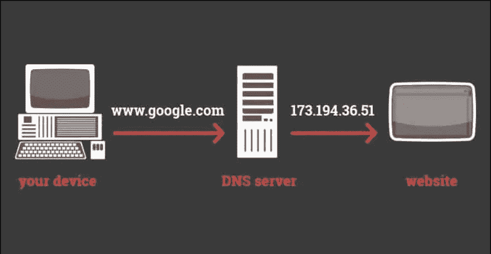
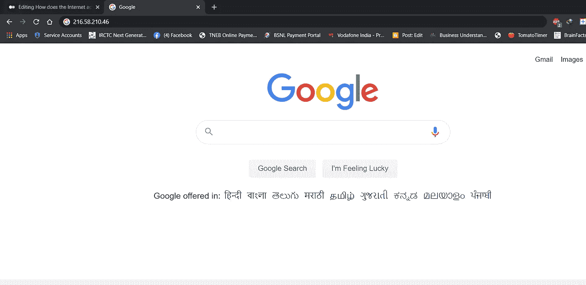
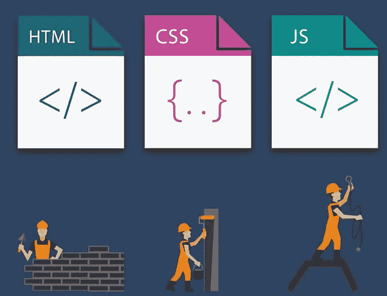
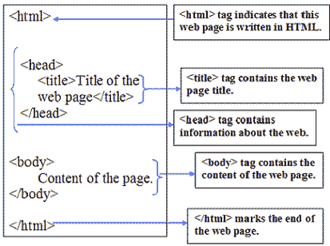

# 互联网实际上是如何工作的？

> 原文：<https://medium.datadriveninvestor.com/how-does-the-internet-actually-work-c623a0c7214a?source=collection_archive---------2----------------------->

## 让我们来看看互联网和网站实际上是如何工作的！

Image from unsplash.com

互联网是我们每天都在使用的东西，然而许多人并没有意识到后台发生了什么。因此，在我们开始开发供人们通过互联网访问的网站和网络应用程序之前，了解互联网的基本原理非常重要。所以不多说了，让我们开始吧！

很多人认为它是一个超级复杂的概念，难以理解。但实际上，这还不是全部。互联网真的很简单，其实就是一根很长的线，这根线把不同的电脑连接起来！因此，如果你有一台在印度的计算机和另一台在澳大利亚的计算机，它们可以通过这根巨大的电线相互通信和传输数据。

Image from imgflip.com

现在，如果这些连接到互联网的计算机有一个非常特殊的工作呢？如果他们必须全天候在线，随时为您提供您所请求的所有数据和文件，那该怎么办？我们称这些计算机为**服务器**，用户用来访问互联网的计算机被称为**客户端**！

Image from ithareonsoft.ware

你可以把网络服务器想象成一个 24/7 开放的巨大图书馆，你可以在一天中的任何时间进入那里，请求任何你想访问的网站。但是，如果你认真想想，即使你有一个大的图书馆能够存储所有的数据，难道我们很难找到存储在里面的数据吗？是啊！这意味着世界上所有的数据都不能存储在一台服务器上。那我们现在怎么办？

Image from imgflip.com

好吧，让我们假设你坐在家里的电脑上，键入 google.com**，在幕后发生的事情是，你的浏览器将向你的互联网服务提供商发送一条信息。**互联网服务提供商(ISP)是向个人和组织**提供互联网连接和服务的公司，如 Hathway、ACT、AT & amp、Comcast 等。因此，当我们在 google.com 输入时，我们的浏览器会向您的 ISP 发送一条信息，然后 ISP 会将这条信息转发给一个叫做 DNS 服务器的东西。 **DNS 服务器基本上就像一本电话簿，它会在其数据库中查找我们试图访问的网站的确切 IP 地址。**每台连接到互联网的计算机都有一个 **IP 地址**，它就像您计算机的邮政地址，以便在通过互联网传输文件或通信时，可以轻松找到每台计算机。一旦 DNS 服务器找到 IP 地址，它就把它发送回你的浏览器。**

****

**所以现在你知道在哪里可以找到 [**谷歌主页**](http://google.com) 的确切地址了。因此，接下来发生的事情是，你将通过你的互联网服务提供商向那个地址的计算机发送一个直接请求，这个消息将通过所谓的**互联网骨干**传递。当然，位于该地址的计算机是**谷歌服务器**，在这个服务器上，有我需要的所有类型的文件，以便能够查看我请求的网站(google.com)。现在，互联网骨干网并不是一些聪明的程序的某种类比，它是互联网的真正骨干网，由庞大杂乱的电线组成，连接着世界上所有的互联网用户。这些巨大的电缆大部分在水下，通过这些电缆导航我们的数据，我们得到的只是一个 IP 地址。最后，我们请求的网站显示在我们的浏览器中，所有这一切都发生在几毫秒内！现在打开你的浏览器，输入 216.58.210.46，然后按回车键，就可以看到谷歌主页通过互联网呈现在你面前。**

****

# ****网站是如何运作的？****

**所以，现在我们知道了互联网是如何工作的，是时候探索网站实际上是如何工作的了！**

****

**现在，为了访问一个网页，我们都知道你需要一个浏览器，对吗？它可以是 Chrome、Firefox 等等，但是之前我们已经讨论过服务器如何用我们需要的文件和数据来响应我们的请求。现在，您从服务器接收的数据通常由三种类型的文件组成: **HTML、CSS 和 JavaScript** ，您很可能已经遇到过这些术语，因为它们非常常见，并且是查看网页不可或缺的一部分。但是它们到底是做什么的，为什么会有这么多不同类型的文件呢？为什么我们不能只有一个文件？每个文件都有自己的工作。**

****

**HTML 基本上是用来建立你的网站结构的，你可以添加任何你想要的东西，来定义你的网页结构，虽然它们可能在视觉上不吸引人，但它是任何网页的基础。现在第二种类型的文件是 **CSS** 文件，这些文件负责设计你的网站。当你加入 CSS 时，它允许你指定你想要的网站外观。现在，最后的组件是 **Javascript** 代码。这是允许你的网站实际做事情或有行为的代码。它最终会让你的网站正常运行。**

****

**至此，我们已经大致了解了互联网和网站的实际运作方式。另一篇文章再见，在那之前保重:)**

**[GitHub](https://github.com/ritchiepulikottil)**

**[领英](https://www.linkedin.com/in/ritchie-pulikottil-6876341aa)**

**[推特](https://twitter.com/itsritchie1005)**

**[Instagram](https://instagram.com/ritchiepulikottil)**