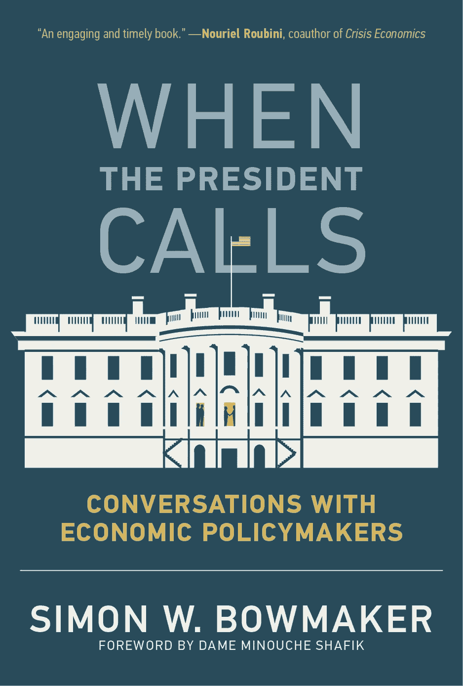

# 经济学家如何在吉米·卡特的领导下建立一个秘密政策小组

> 原文：<https://medium.datadriveninvestor.com/how-economics-chiefs-set-up-a-secret-policy-group-under-jimmy-carter-d5438fea60f4?source=collection_archive---------17----------------------->

MIT Press

美国总统吉米·卡特把他的经济顾问逼疯了，以至于他们不得不成立一个秘密政策委员会。

这只是一本详述白宫经济学大师过去 50 年经历的书中的离奇故事之一。

NYU 大学教授西蒙·鲍梅克所著的《当总统打电话来时:与经济政策制定者的对话》一书，揭示了行政部门内部的工作方式。它包括对几十位过去的经济巨头的广泛采访，包括艾伦·格林斯潘、保罗·沃克尔、奥斯坦·古尔斯比、珍妮特·耶伦、罗伯特·鲁宾和汉克·保尔森。

Bowmaker 的工作所揭示的东西和你从国会山期待的任何东西一样离奇，即使是现在。

# 卡特的混乱

以吉米·卡特总统的政府为例，在他的领导下，美国经历了两位数的通货膨胀和居高不下的失业率。

他的前顾问说，卡特对经济缺乏了解，他没有决策能力，以及一个自制的拜占庭式官僚机构，加剧了经济萎靡。虽然卡特可以背诵事实和数字，但这并没有转化为有助于制定好政策的工作知识。

1977 年至 1979 年担任美国财政部长的迈克尔·布卢门撒尔(Michael Blumenthal)说，“总统对经济如何运行没有真正的了解，尤其是经济内部的相互关系。”。

布卢门撒尔说，卡特想帮助应对 20 世纪 70 年代美元的贬值，但他不明白提高最低工资会引发另一场美元挤兑。

 [## 为什么包容性财富指数比 GDP 更能衡量社会进步？|数据驱动…

### 你不需要成为一个经济奇才或金融大师就能知道 GDP 的定义。即使你从未拿过 ECON 奖…

www.datadriveninvestor.com](https://www.datadriveninvestor.com/2019/03/08/why-inclusive-wealth-index-is-a-better-measure-of-societal-progress-than-gdp/) 

布卢门撒尔说:“这是卡特永远也想不明白的一种困境。”。换句话说，卡特无法处理不可避免的交易。

从 1977 年到 1981 年担任经济顾问委员会主席的查尔斯·舒尔茨说，决策官僚的疯狂也加剧了卡特对经济学的缺乏。

卡特做出了太多的承诺，让人们加入他的经济政策委员会。结果是二十多人出席了第二次会议。就连卡特也对自己创造的东西感到震惊。

“总统走进来，大吃一惊，”舒尔茨说。

“我们告诉他，他必须做点什么，所以我们成立了一个执行委员会，”他说。“不幸的是，这也变得太大了。”

所以最后，舒尔茨和他恼怒的同事们采取了一些戏剧性的行动。他们在行政部门内部建立了一个秘密组织。

“最后，我们中的三四个人决定成立一个秘密委员会，叫做 X 委员会，从事经济政策方面的工作，”舒尔茨透露。

不清楚参与者是否告诉了总统他们在做什么。

卡特政府并不是唯一一个事情变得奇怪的政府。

# 奥巴马的团队如何差点让克莱斯勒死掉

在 2008-2009 年金融危机期间，奥巴马总统的至少两名顾问建议让汽车制造商克莱斯勒破产，同时拯救通用汽车。这一时期也恰逢华尔街灾难性的混乱和对多家银行的大规模救助。

问题最终归结为两家汽车制造商是否能得救，还是只有一家。两位顾问想让克莱斯勒走投无路。

2008 年至 2011 年担任经济顾问委员会成员的奥斯坦·古尔斯比说，“我最直言不讳地表示，这两者都有风险。”。

在他看来，问题在于政府是否有足够的现金来拯救这两家陷入困境的公司。如果现金被零零碎碎地分发出去，这两家公司可能会和它们的许多供应商一起倒闭。

然而，如果救助计划更有针对性，那么一家公司将有更好的机会成功。

古尔斯比不是唯一持保留意见的人。

“奥斯坦·古尔斯比和我都支持救助通用汽车，而不是克莱斯勒，”艾伦·克鲁格(Alan Krueger)说，他曾在 2009 年至 2013 年担任不同职务。

对克莱斯勒来说幸运的是，奥巴马否决了他们的建议，拯救了两家公司。

也许令人惊讶的是，克鲁格和古尔斯比现在都认为这是正确的决定。"

“回想起来，我认为他(奥巴马)做出了正确的决定。奥斯坦和我都错了，我们已经就此写了一篇论文，”克鲁格说。

Bowmaker 的书也充满了其他有趣的故事和白宫内部的生活趣闻。这包括各种顾问互相谩骂。

如果你想了解白宫经济会议的内幕，这本书正适合你。

这是一个故事的编辑版本，于 2019 年 11 月 29 日首次发表在 Forbes.com 上。