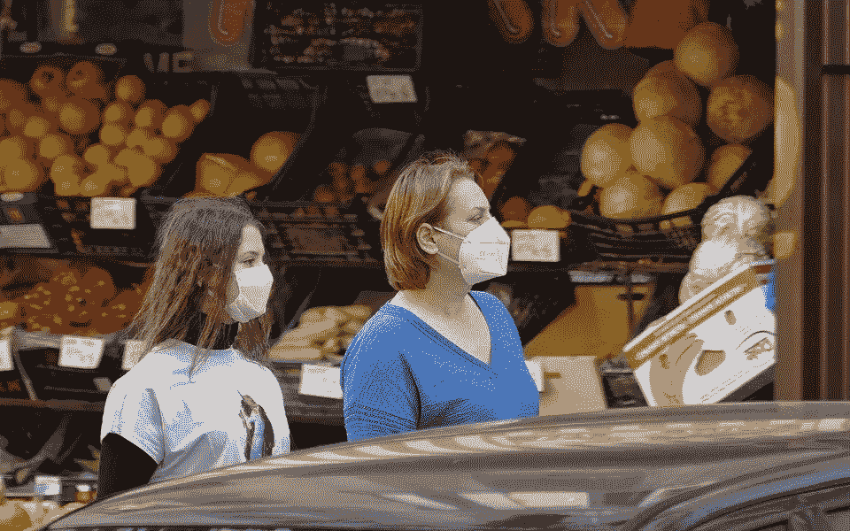

# 新冠肺炎追踪应用程序在欧洲能有多有效？

> 原文：<https://medium.datadriveninvestor.com/how-effective-can-covid-19-track-and-trace-apps-be-in-europe-3b3d0baf784b?source=collection_archive---------9----------------------->

上周，英国政府宣布，跟踪和追踪应用程序 NHSx 将于 6 月初在英国范围内推出。该应用程序被描述为跟踪和遏制新冠肺炎患者并阻止传染病传播的有效方法。韩国等国家早在 2 月份新冠肺炎病例首次出现上升时就实施了检测、追踪和遏制方法，这种方法被广泛认为是应对疾病传播的最佳和最有效的方法。

 [## 大数据颠覆了我们所知的信贷应用|数据驱动的投资者

### 融合是金融领域的最新流行词，由于支付和贷款之间的关系，我们现在…

www.datadriveninvestor.com](https://www.datadriveninvestor.com/2020/03/19/big-data-disrupts-credit-applications-as-we-know-them/) 

虽然它在韩国很有效，但越来越多的人怀疑它是否会在英国和其他主要欧洲国家产生同样的影响。专家表示，这些特定的应用程序只是更广泛的新冠肺炎战略的一部分——更大机器中的一个重要齿轮——如果围绕测试、遏制和加强社交距离的更广泛战略不强大，它们就不会有效。不仅如此，还存在对公民隐私和数据的真实担忧，这些将通过应用程序共享。

Deeph Chana 是英国政府关于如何在危机中使用技术的前顾问，现在是帝国理工学院商学院的教授和伦敦帝国理工学院安全科学与技术研究所的联合主任，他认为韩国在如何接触追踪和检测感染者方面树立了一个好榜样，但英国政府在实施自己的应用程序方面过于缓慢。“开发一个应用程序相对容易，我们从 1 月份就有能力这样做，但这只是解决方案的一部分。Chana 教授说:“如果没有物理能力进行我们需要的大范围测试，部署这个应用程序就没有意义，英国的情况就是如此。”“我们还需要了解这款应用程序如何适应应对新冠肺炎的更广泛战略，并在该应用程序向人们发出可能的警报后采取非常明确的干预措施——目前在这方面没有明确的信息或共识。”

伦敦政治经济学院管理系信息系统副教授埃德加·惠特利(Edgar Whitley)表示，很明显，该应用程序必须成为更广泛战略的一部分，但即使是跟踪和追踪也不能仅仅通过一个应用程序来完成，他最近撰写了一份关于技术如何帮助英国摆脱封锁的报告。惠特利教授说:“在实践中，这个应用程序需要辅之以有效的人类接触追踪。这意味着个人手动和实际接触并追踪谁与谁有过接触。”

人们不仅担心这款应用在更广泛的战略中的地位，以及这种更广泛的战略是否足够有效，还担心是否会有大量的人下载这款应用。惠特利教授表示，“随着越来越多的人下载、安装和使用该应用程序，联系人追踪应用程序的有效性会增加，但怀特岛目前的下载量似乎只有 40%左右。科学模型表明，英国需要 80%的智能手机用户(或 60%的人口)的使用水平。即使是最受欢迎的应用，如 WhatsApp，也没有达到这 80%的渗透率水平。”

这也是查纳教授明确表达的担忧，他说“人们只是下载应用程序是不够的，人们必须持续使用它才能有效”。查纳教授认为，为什么该应用可能没有必要的下载数量，为什么许多人会担心该应用的可信度以及他们的数据将如何被使用，一个关键原因是因为创建它的人缺乏透明度。

Chana 教授说,“这款应用从一开始就声称是开源的，但直到最近才是这样。一般公众仍然不知道什么数据将需要输入到应用程序中，这些数据将如何保存，它将用于什么，谁参与了应用程序的创建。这种从一开始就缺乏透明度的做法导致了对该应用的信任下降，担忧增加。关于这些应用程序集中保存数据的问题仍存在广泛争议，就连苹果(Apple)和谷歌(Google)这样的大型科技公司也开发了类似的应用程序，它们意识到，为了在自己的软件中获得尽可能多的公众信任，它们必须去中心化。

虽然欧洲许多国家应对新冠肺炎的方法不同，但其他欧洲大国希望创建和实现类似 NHSx 的跟踪和追踪应用程序。然而，在其他欧洲国家，英国公民对数据共享的有效性、隐私和伦理的担忧也是最重要的。

例如，在德国，联邦政府目前正在与德国电信和 SAP 公司合作开发一款应用程序，调查显示只有 40-50%的智能手机用户愿意使用这款应用程序，这一数字远低于英国。然而，ESMT 柏林数字社会研究所副主任马丁·沙尔布吕赫(Martin Schallbruch)表示，“即使很少使用这款应用也有积极的影响，因为任何形式的接触追踪都有助于识别感染链，防止未来的感染。”他此前曾长期担任德国联邦政府负责 IT、数字社会和网络安全的高级政府官员

Schallbruch 说“有两个因素对于应用程序的广泛接受和使用非常重要:首先，非常容易使用，其次，对应用程序发行商的高度信任。如果人们担心应用程序中的数据会发生什么，特别是如果他们自己被感染了，他们就会避免使用它。”

而在法国，政府也在寻求实现一个跟踪和追踪应用程序，普通公众也担心隐私和应用程序数据的使用。里昂商学院(emlyon business school)人工智能价值创造研究中心(Research Center on Artificial Intelligence in Value Creation)主任玛格丽塔·帕加尼(Margherita Pagani)教授一直在研究韩国、新加坡和中国的跟踪和追踪应用程序，他表示，“应用程序必须满足隐私、安全和数据控制方面的特定标准”，并引用欧盟发布的联系人追踪应用程序指南作为确保这一点的方法。帕加尼教授说:“这些要求规定，应用程序应该是自愿的，得到国家卫生当局的批准，保护用户隐私，并且应该在不再需要时立即拆除，这很重要。”。

根据帕加尼教授的说法，该应用程序的使用必须与法国应对新冠肺炎的更广泛战略相一致，他说，“接触者追踪是一种有助于限制病毒传播的宝贵工具，但当然这应该辅之以其他与健康干预更相关的措施。该应用程序只是一个工具，提供一种措施，试图限制传染病传播的风险。”

专家明确指出，该应用程序不能替代其他更重要、更有效的新冠肺炎政策。为了对解决整个欧洲的感染传播产生积极影响，必须有明确的干预措施和协议，以应对在接到你可能与受感染的人接触的警报后接下来发生的情况。另外一个关键是应用程序的下载和使用，对政府及其意图的高度信任也很重要，这可能因国家而异，很难保证。

Schallbruch 说，“与宵禁和接触限制相比，追踪应用程序是一种远不那么激烈的预防感染的方式。关于隐私的讨论是合法的，但它们不得妨碍这一有用的工具”。

因此，也许一个应用程序是我们回归某种常态的最现实的方式，然而，只有当它有效、得到公众的全力支持，最重要的是，辅之以至关重要的测试和遏制政策，才能实现这一点。