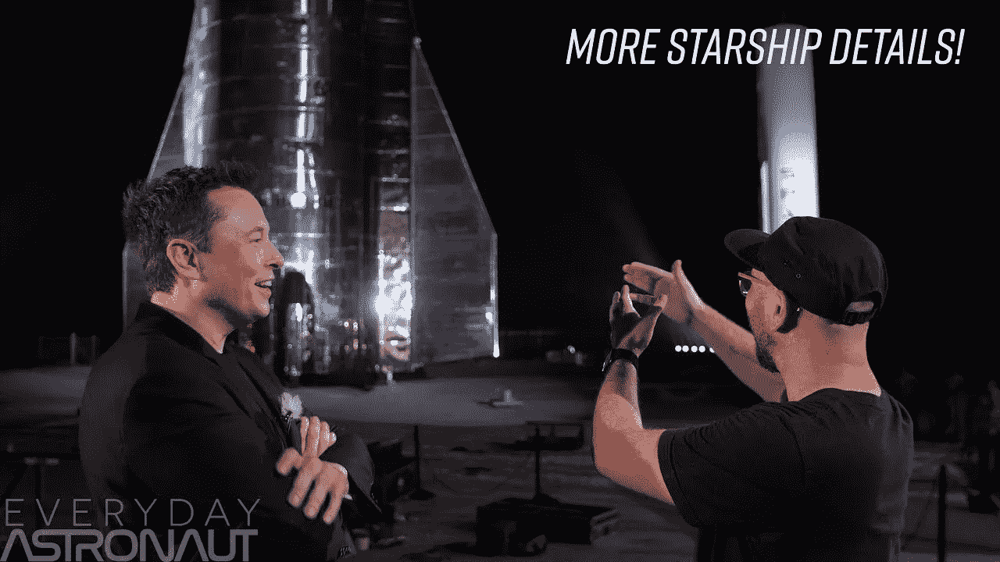
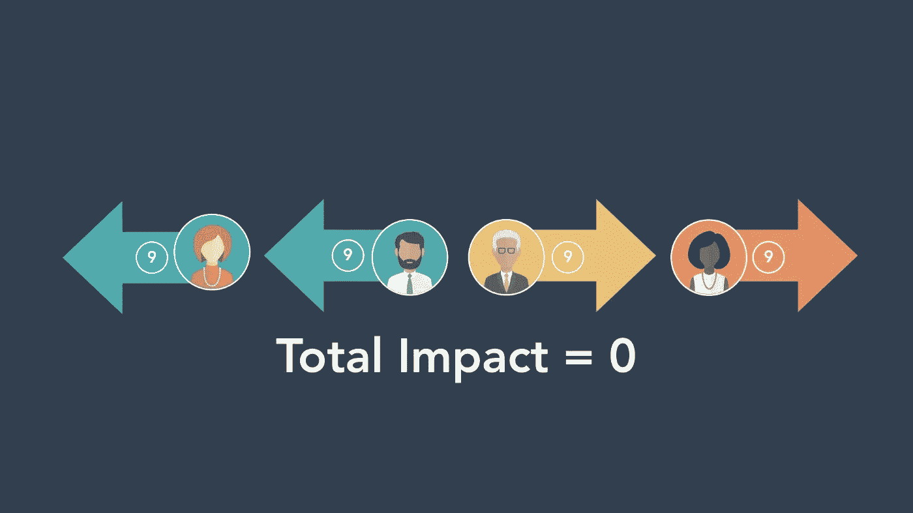
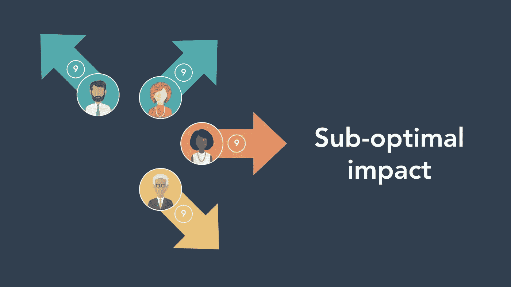
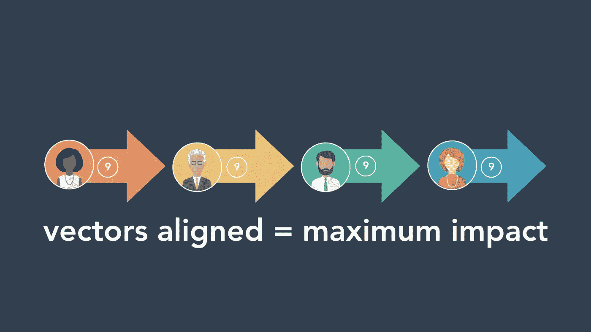
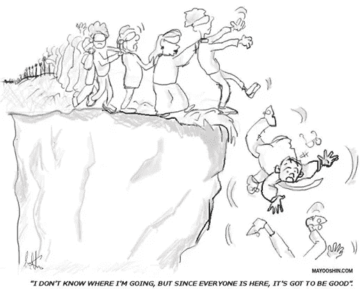

# 高效领导者如何引领创新

> 原文：<https://medium.datadriveninvestor.com/how-effective-leaders-spearhead-innovation-631873da9d90?source=collection_archive---------2----------------------->

## 每位领导者都能从埃隆·马斯克身上学到的 3 课。

[Credit](https://www.youtube.com/watch?v=cIQ36Kt7UVg)

“一个月前我在这里……就在栅栏那边。你有一根管子和一根尖头管子。现在你得到了这个！”蒂姆·多德指着已经完成的[号星舰](https://www.space.com/spacex-starship-new-stainless-steel-alloy.html)原型大声说道。“你是怎么做到的？难道只是你的意志？”

“我学到了很多关于如何让事情进展得更快的经验，我已经把这些经验传授给了 SpaceX 的团队，”埃隆·马斯克[以他典型的烦躁、十几岁男孩的语气回应](https://www.youtube.com/watch?v=cIQ36Kt7UVg)。

这种情况并不是 SpaceX 独有的。这在埃隆的所有公司都很常见。

例如，特斯拉的团队在八周内从构思到推出看起来像赤陶瓦的太阳能电池板[！](https://thinkgrowth.org/tell-your-company-story-like-tesla-b10c815b9124)

SpaceX 开始制造可重复使用的火箭，当时整个社区都说这是不可能的。

特斯拉制造超级酷的电动汽车。

Hyperloop One 基于特斯拉和 SpaceX 联合团队发布的开源设计。

就好像埃隆的每家公司都有推进器一样(没有双关语)。

自满不再是任何企业都负担得起的奢侈品。为了在竞争中保护自己，企业必须创新以创造更好的产品、商业模式和客户体验。

 [## 领导力。赢得|数据驱动型投资者需要更广阔的视角

### 不管他们愿不愿意，领导者都是快速运转的机器中的齿轮，这就要求他们夹住自己的爪子…

www.datadriveninvestor.com](https://www.datadriveninvestor.com/2020/02/07/leadership-it-takes-a-wider-perspective-to-win/) 

许多公司在规模小而混乱的时候动作很快。但是随着他们的成长，官僚主义让他们慢如蜗牛。

那么，埃隆的公司是如何以不断突破创新障碍的速度前进的呢？

这里有三个哲学，以及领导者如何在自己的公司中应用它们。

## 1.对齐向量

> 你公司的每个人都是媒介。你的进度由所有矢量的和决定。

在代数中，向量是一个有大小和方向的量。两个或更多矢量的和给出了*结果*矢量。

埃隆将每个人等同于一个向量，其大小基于她的能力和承诺，方向是她前进的道路。(他以计算的形式看待每个人，包括他自己的孩子。)把它们加起来，你就可以预测你的公司会有多大的进步。

伊隆首先把这个概念介绍给了 T2，然后他又把这个概念介绍给了 HubSpot 的员工。每个人都非常喜欢它，以至于它成了他们日常词汇的一部分。

Dharmesh 解释了三种*人作为载体*的场景:

**a .空向量**

拿四个同等大小的人来说。其中两个向一个方向拉，而另外两个向相反的方向拉。你会得到一个空向量。

在这个场景中，尽管每个人都有同等的能力和承诺，但是团队因为联盟(方向)而没有取得任何进展。

**b .次优向量**

在这里，人们朝着相同的方向前进(除了那些总是站出来的少数人，而且不是出于正确的原因。)

合成向量基本上大于零，但是影响仍然不是最佳的。

**c .对齐向量**

这是一个完美的场景。当所有人都朝着一个统一的目标前进时，你就能以最快的速度执行，从而取得最大的进步。

[Images credit](https://thinkgrowth.org/what-elon-musk-taught-me-about-growing-a-business-c2c173f5bff3)

作为一个领导者，你可以让你的员工向任何方向前进，微观管理每一个动作，或者引导他们向特定的方向前进。

把你的团队想象成[一条河](https://www.strategy-business.com/blog/Liberate-Your-Team-with-Clearer-Processes)。

当河岸变得脆弱时，水就在陆地上扩散，几乎没有力量。同样，当你的员工缺乏指导时，他们的影响力也很低。

当河流有水闸来控制水量时，它就变得有限制性了。在这样的组织中，领导者微观管理每一步。系统爬行是因为管理永远跟不上异常和重新划分优先级。

但是一条河岸坚固的河流会朝着一个特定的方向强劲地流动。这样的人把他们的注意力和精力放在团队和组织中，在统一的方向上创造最大的影响。

根据 Dharmesh，下列载体需要比对:

1.  让员工与组织的目标保持一致。
2.  整合团队(产品、营销、销售、服务等。)与组织的目标。
3.  将组织的目标*与客户的需求*结合起来。

你甚至不需要重组你的组织来使事情进展得更快。你可以和你已经有的人一起做。

> 假设你必须保持其他一切不变——没有新员工，没有现有员工技能的“升级”,没有额外的资金。即使这样，你仍然可以通过更好地调整你的向量来提高你的进度和成功水平。— [达尔梅什·沙阿](https://medium.com/u/d5d49189c3e7?source=post_page-----631873da9d90--------------------------------)

## 2.第一性原理思维

> 我们通过类比推理来度过一生，这实质上意味着复制其他人所做的事情并稍加改变。

对大多数企业来说，*其他人*意味着竞争，他们花很多时间去模仿或超越。结果是每个产品都相似，顾客开始使用[价格作为选择的标准](https://medium.com/swlh/low-price-is-never-your-startups-usp-7b8daa6c209)。

根据埃隆的说法，这是类比推理。个人或实体默认像其他人一样思考。这种人坚持先前的假设和信念，遵循过时的“最佳实践”，即使他们很聪明，也会做出糟糕的决定。

与之截然相反的是基本原则思维。它将事情分解成基本的、无可争议的事实，挑战假设，帮助你挖掘复杂问题的巧妙解决方案。

这种方法是典型的埃隆·马斯克。

例如，当埃隆开始寻求将第一枚火箭送上火星时，他发现火箭的成本是天文数字——高达 6500 万美元。这让他重新定义了挑战。

> “所以我说，好吧，让我们来看看第一个原则。火箭是由什么制成的？航空级铝合金，加上一些钛、铜和碳纤维。然后我问，那些材料在商品市场上有什么价值？事实证明，火箭的材料成本大约是正常价格的百分之二。

马斯克没有购买火箭，而是决定购买原材料，雇佣出色的工程师来制造火箭。于是，SpaceX 诞生了。几年内，它将发射火箭的价格降低了 10 倍，但仍有利润。

不过，大多数时候，你不必深入到这样的分子水平。你可以简单地深入两三个层次，把事实拼凑起来，发现简单而有效的解决方案。

第一原则思维帮助你打破从众心理，站在盒子的边缘思考。它让人们头脑清晰，并让他们朝着一个目标前进。

这也迫使反对者要么用事实来支持他们的怀疑，要么别无选择，只能做出承诺。

当人们理解了目标的*为什么*、*什么*以及*如何*时，就更容易更快地前进。

## 3.从错误中学习

> 如果有人能解释如何让这个设计变得更好，我会说，“谢谢你这么棒的礼物。”

在与蒂姆·多德的采访中，埃隆解释了为什么他更喜欢星际飞船的甲烷发动机，而不是传统的全流式燃烧塞式发动机。

当多德问及这是否意味着一艘星舰永远不会使用全流量塞式燃烧发动机时，埃隆表示，如果有人能向他们展示塞式发动机如何能够提供更好的结果，SpaceX 将会转换。

埃隆并不回避承认他没有所有的答案，有时他是错的。

但是许多领导人经常感到有压力去做这件事。他们试图知道所有的答案，总是正确的，并在所有的事情之上。

这种压力让他们陷入[沉没成本谬误](https://time.com/5347133/sunk-cost-fallacy-decisions/)，人们继续追求一个选项，因为他们投入了时间、金钱、努力或一些资源。

他们坚持拙劣的设计和无能的人。他们尝试[优化无用的流程](https://content-sutra.com/blog/process/)而不是消除它们。他们相信他们的产品正是顾客想要的，尽管顾客明确表示事实恰恰相反。

这种心理陷阱源于各种固有的偏见。比如想从沉没的投资中获取一些回报。或者[害怕人们的判断](https://www.linkedin.com/pulse/how-make-progress-when-you-feel-stuck-vishal-kataria)如果他们承认错误。还是因为已知的魔鬼比未知的天使好。(至少解决反复出现的问题让他们保持在自己的舒适区。)

但是创新不会发生在舒适区。永远不会。

> 失败和发明是不可分割的双胞胎。要发明，就要实验，如果你事先知道会成功，那就不是实验。—杰夫·贝索斯

每一个创新的公司都重视快速决策，并从错误中吸取教训，这也让环境变得更有趣。

在 2016 年致股东的信中，贝佐斯概述了亚马逊如何快速决策:

> 许多决定是可逆的，双向的。这些决策可以使用轻量级流程。对于那些，你错了又怎么样？
> 
> 第二，大多数决策可能需要你希望拥有的大约 70%的信息。如果你等了 90%……你可能很慢……如果你擅长纠正错误，犯错的代价可能比你想象的要低，而慢肯定代价高昂。
> 
> 第三，使用短语“不同意并承诺”这个短语会节省很多时间。如果你对某个特定的方向有信念，即使没有达成共识，说“看，我知道我们在这一点上有分歧，但你能和我赌一把吗？不同意就犯？”
> 
> 这不是一种方法。如果你是老板，你也应该这样做。

当领导者避免承认自己的错误时，他们的下属也会效仿。这导致了停滞。新的决定和行动被无限期推迟。虽然它在短期内节省了资源，但从长期来看，它被证明是极其昂贵的。

相比之下，将错误视为创新垫脚石的领导者建立了一种文化，人们通过合作从自己和他人的错误中学习。

例如，如果无人驾驶火箭在起飞时爆炸，NASA 的一些部门负责人会鼓掌，这样每个人都知道他们的部门已经尝试过但失败了，但至少尝试过。

另一个有趣的实践在 [Basecamp](https://basecamp.com/) 得到遵循，在那里，如果一个项目需要超过两周的时间，从事这个项目的人会用一双新鲜的眼睛去看一看，以确保他们不会误入歧途。

从错误中学习，即使这意味着放弃你投入时间和精力的事情。

# 总结

在摩托艇时代用桨，希望生存，是徒劳的。

让人们朝着更大的目标前进，运用首要原则发现创新的解决方案，鼓励犯错。你不会只有一艘坚固的摩托艇；你也会在建造它的过程中获得极大的乐趣。

完成一件事，继续下一件事。这就是你如何建立足够的动力让事情进展得更快。

*最初出现在* [*内容经*](https://content-sutra.com/) *博客上。*