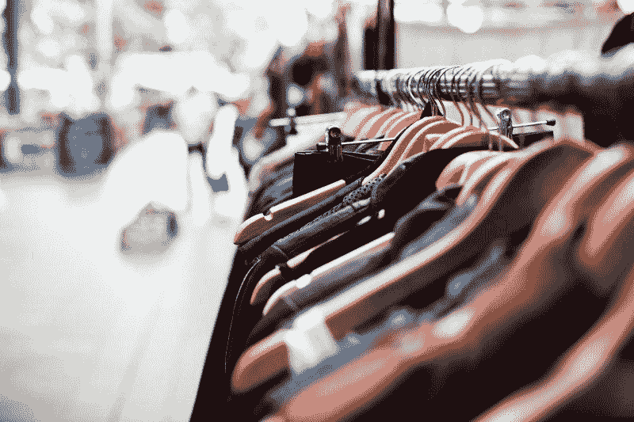
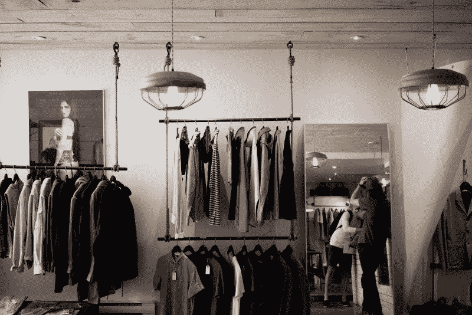
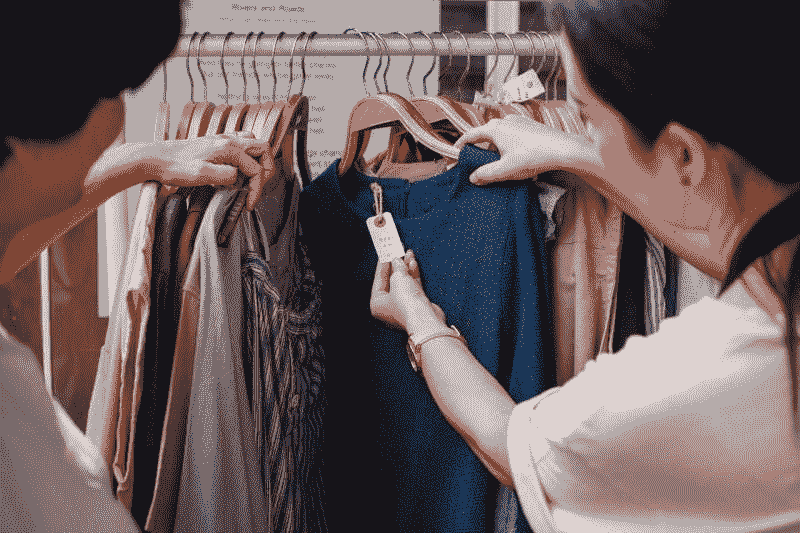
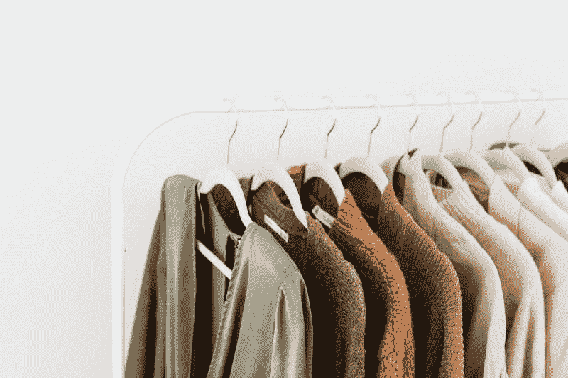
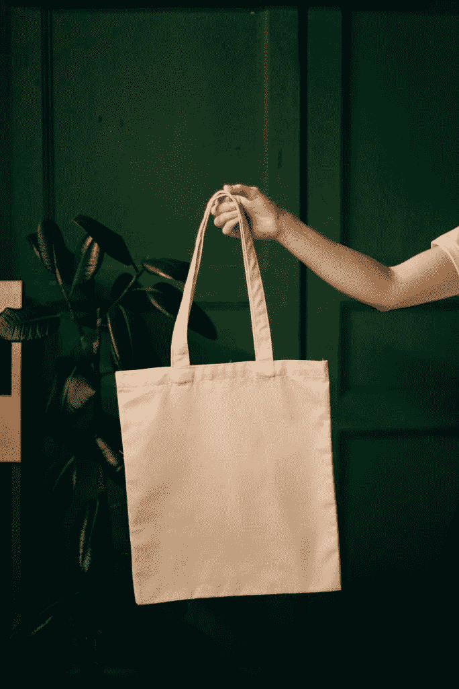
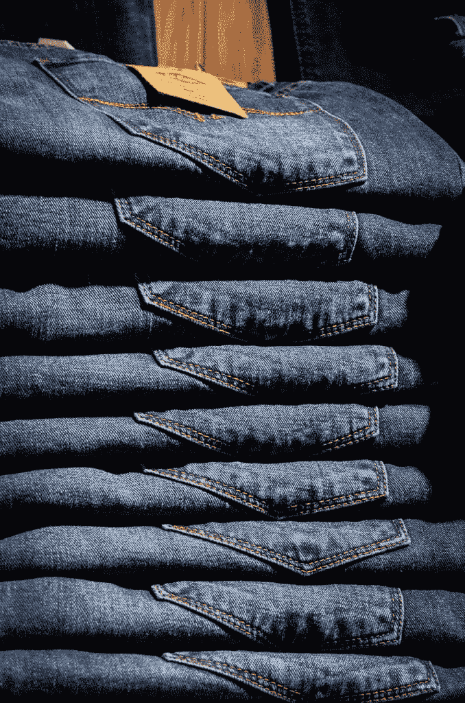

# 梅西百货(M)能死多快？—市场疯人院

> 原文：<https://medium.datadriveninvestor.com/how-fast-can-macys-m-die-market-mad-house-11bd5512db47?source=collection_archive---------6----------------------->

梅西百货公司和百货公司正在我们眼前消亡。据*今日美国*报道，这个零售传奇计划在未来三年内关闭 125 家店铺，并裁员 2000 人。

我认为**梅西百货**将会关闭更多的商店，削减更多的工作岗位，因为首席执行官杰夫·吉尼特说他想在 2022 年底之前削减 21 亿美元的开支。《今日美国》估计计划中的关闭将节省 15 亿美元。

因此，梅西百货需要从预算中再削减 6 亿美元。我认为这意味着更多的工作岗位和百货商店将会消失。

# 梅西百货崩溃了

梅西百货(Macy's)正在迅速崩溃。2020 年，梅西股价从 1 月 2 日的 16.52 美元跌至 11 月 20 日的 9.05 美元。梅西公司的股价在 2020 年 1 月 8 日达到了 18.10 美元的高点。

2020 年，梅西百货已经经历了连续四个季度的收入增长下降和收入崩溃。Stockrow 估计，在截至 2020 年 1 月 31 日的季度中，梅西的收入增长下降了 1.35%。截至 2020 年 4 月 30 日[季度，收入增长加速至 44.54%，截至 2020 年 7 月 31 日](https://stockrow.com/M/financials/income/quarterly)季度为-34.87%。

梅西百货的季度收入从 2020 年 1 月 31 日的 85.77 亿美元下降到 2020 年 7 月 31 日的 31.48 亿美元。2020 年 1 月 31 日，梅西百货的营业收入为 5.6 亿美元。

梅西百货报告 2020 年 4 月 30 日季度运营亏损-41.19 亿美元，2020 年 7 月 31 日季度运营亏损降至-6.31 亿美元。我看不出梅西百货如何能在运营亏损如此之大的情况下继续营业。

然而，梅西百货确实报告了 2020 年 1 月 31 日的季度毛利为 33.1 亿美元。季度毛利在 2020 年 4 月 30 日降至 6.47 亿美元，在 2020 年 7 月 31 日升至 10.09 亿美元。

# 梅西百货能产生多少现金？

然而，**梅西百货公司(纽约证券交易所代码:M)** 通过它的商店经营一些现金。截至 2020 年 1 月 31 日，梅西百货的季度运营现金流为 14.36 亿美元。

季度运营现金流在 2020 年 4 月 30 日降至-1.64 亿美元，在 2020 年 7 月 31 日降至 1.57 亿美元。2020 年，梅西百货的期末现金流从 1 月 31 日的 3.8 亿美元，到 4 月 30 日的 16.02 亿美元，再到 1 月 31 日的-2 亿美元。

不幸的是，梅西百货不得不借 11.48 亿美元来维持运营。为了解释这一点，梅西百货报告了 2020 年 4 月 30 日的季度融资现金流为 11.48 亿美元。2020 年 7 月 31 日，该季度运营现金流降至-1.98 亿美元。

# 梅西百货失去价值

**梅西百货(M)**2020 年已经失去价值。截至 2020 年 1 月 31 日，梅西百货的总资产为 211.72 亿美元。总资产在 2020 年 4 月 30 日降至 185.81 亿美元，在 2020 年 7 月 31 日降至 176.14 亿美元。

我猜价值的下降来自梅西百货即将关闭的商店。然而，我不得不怀疑，没有购物者的空荡荡的百货商店能有什么价值？我怀疑这些商店的唯一价值是作为房地产。

折扣店；如[**【TJX】**](https://marketmadhouse.com/will-the-tjx-companies-survive-coronavirus/)的 TJX 公司就可以收购其中的一些店铺。但是，折扣店只能吸纳那些空店中的一小部分。此外，TJX 等公司因冠状病毒而面临客流量崩溃。因此，TJX 可以少开店。

# 一个死了的百货公司怎么办？

因此，死亡百货商店的唯一潜在用途可能是作为在线零售商和幽灵厨房的履行中心。《快公司》指出，亚马逊(Amazon)正在探索一项[计划，将死气沉沉的百货商店转变为当地或区域的履行中心。](https://www.fastcompany.com/90538376/amazon-may-turn-dying-department-stores-into-its-own-fulfillment-centers)

另一种可能是把死气沉沉的百货公司改造成幽灵厨房。一个[幽灵厨房](https://www.eater.com/21540765/ghost-kitchens-virtual-restaurants-covid-19-industry-impact)是一个商业厨房，只做送餐服务。希望“幽灵厨房”能为像 GrubHub(纽约证券交易所代码:GRUB) 这样的送货服务准备饭菜。

不幸的是，还不清楚对幽灵厨房和小型履行中心的需求会有多少。因此，我预测他们将拆除许多死去的百货商店，为停车场、公寓或大型商店腾出空间。

一个问题是，空的大箱子库存可能成为履行中心或幽灵厨房的更好地点。令人不安的是，我认为美国可能很快就会充满死气沉沉的百货商店和空空如也的大箱子。

# 梅西百货会成为房地产投资信托基金吗？

这给梅西百货公司制造了一个难题，它以不同的名字经营着大约 834 家商店，包括布鲁明戴尔。我认为梅西百货的一个未来是作为房地产投资信托基金(REIT ),管理空荡荡的百货公司。

值得注意的是，埃迪·兰伯特已经在西尔斯用他的名不副实的[**Seritage Growth Properties(纽约证券交易所代码:SRG)**](https://marketmadhouse.com/seritage-growth-properties-worst-reit-america/) REIT 尝试过了。Seritage 的目的是处理空的西尔斯和凯马特商店。

可以预见的是，Seritage 在 2020 年遭受了损失。Seritage 的股价从 2020 年 1 月 2 日的 39.21 美元跌至 2020 年 11 月 18 日的 15.96 美元。此外，Seritage (SRG)报告 2020 年 9 月 30 日的季度运营亏损为-2178 万美元，毛利为 1307 万美元。

我认为 Seritage 表明梅西的房地产投资信托基金将会亏损。我预测 Seritage 很快会倒闭并被清算。因此，梅西最大的资产；它的商店可能一文不值。

 [## 零售末日才刚刚开始|数据驱动的投资者

### 几天前，我开着车去处理一些小事，这些小事在过去一周左右的时间里越积越多。它…

www.datadriveninvestor.com](https://www.datadriveninvestor.com/2020/08/25/the-retail-apocalypse-is-only-just-beginning/) 

# 欢迎来到未来

梅西百货(纽约证券交易所代码:M) 可能很快就会消亡，因为冠状病毒已经将五年或十年的历史压缩到了一年。

解释一下，**亚马逊(AMZN)** 和**沃尔玛(WMT)** 已经厮杀传统百货一段时间了。然而，百货商店经营者认为，在零售业末日到来之前，他们已经盈利四五年了。

现在，不到一年的时间，零售业的末日已经来临。数百家商店和数以万计的工作岗位正在我们眼前消亡。

更糟糕的是，唯一的解决方案执行者；如 Gennette，已经关闭表现不佳的商店，并希望冠状病毒很快结束。这不是解决办法，因为它不能解决真正的问题。相反，它把清算推迟到 Gennette 退休之后。

# 为什么梅西百货会倒闭

我认为如果冠状病毒疫情继续的话，明年梅西百货可能会倒闭。此外，我不认为疫苗能拯救梅西百货，原因有二。

首先，我认为生产、分发和注射疫苗需要几个月的时间。因此，在接下来的几个月里，梅西百货的商店将会空无一人，继续赔钱。

第二，即使购物再次变得安全，梅西百货的大部分购物者也不会回来。顾客会问，“当我可以呆在家里玩堡垒之夜或者和我的孩子在一起的时候，我为什么要花四个小时在购物中心购物？我可以在亚马逊上 10 分钟内完成所有购物。”

# 冠状病毒是如何杀死梅西百货的

一个更大的问题是，喜欢实体店的老年购物者正在死去或退休。具体来说，婴儿潮死亡时钟估计每天大约有 5004 名美国婴儿潮一代死亡。婴儿潮是指 1946 年至 1964 年间出生的人。

另外，冠状病毒正在加速婴儿潮一代的死亡。美国疾病控制和预防中心(CDC)计算，大多数死于冠状病毒的人都在 55 岁以上。

详细来说，CDC 估计在 2020 年 11 月 18 日之前，55 岁以上的美国人有 152，075 人死于冠状病毒。相比之下，在 2020 年 11 月 18 日之前，只有 71909 名 55 岁以下的美国人死于冠状病毒。请注意，这些数字是我的计算。

# 梅西百货将成为冠状病毒的牺牲品

婴儿潮一代死了，美国的千禧一代；1980 年以后出生的人和 1964 年以后出生的 x 一代人组成了中产阶级。千禧一代和 x 一代更喜欢亚马逊而不是部门。

梅西百货面临的另一个威胁是在家办公。在家工作的人不需要高跟鞋、连衣裙、领带和衬衫。因此，远程员工去百货商店购物的理由更少了。

斯坦福大学经济学家 Nicholas Bloom 估计【2020 年 6 月 42%的美国人在家工作。即使这些人中有一半回到办公室，也有 21%的美国人不再需要去百货商店购物。

我断定梅西的未来是暗淡的。如果梅西百货能撑到 2022 年，我会很惊讶。梅西百货将成为冠状病毒的牺牲品。

*原载于 2020 年 11 月 20 日 https://marketmadhouse.com***。**

***访问专家视图—** [**订阅 DDI 英特尔**](https://datadriveninvestor.com/ddi-intel)*