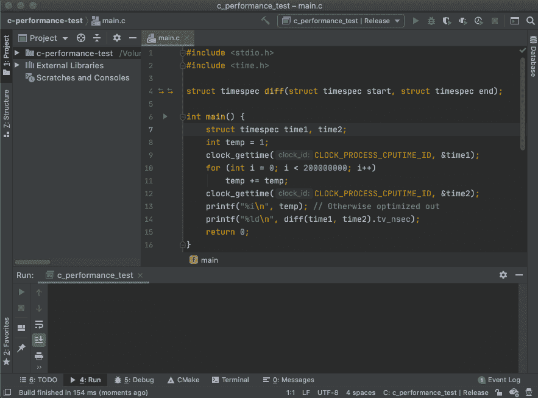
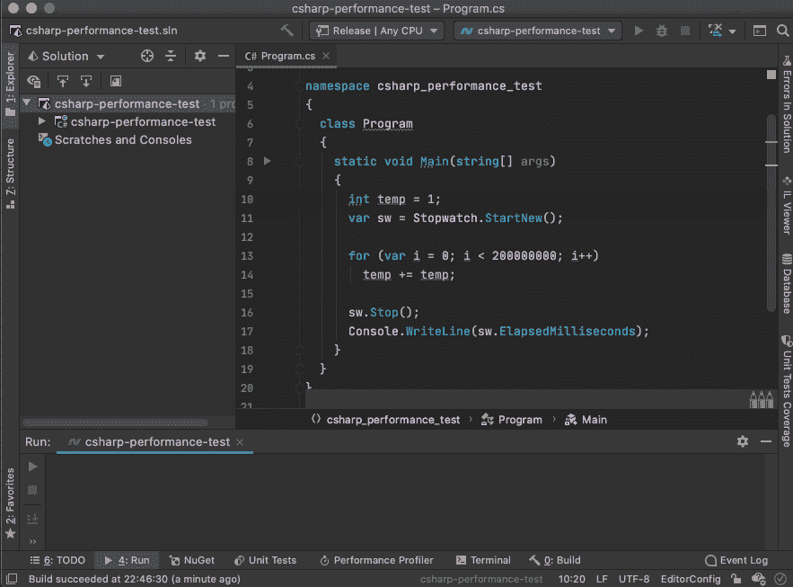
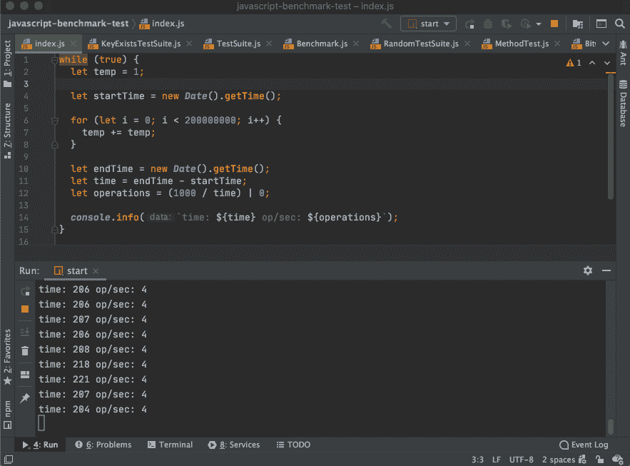
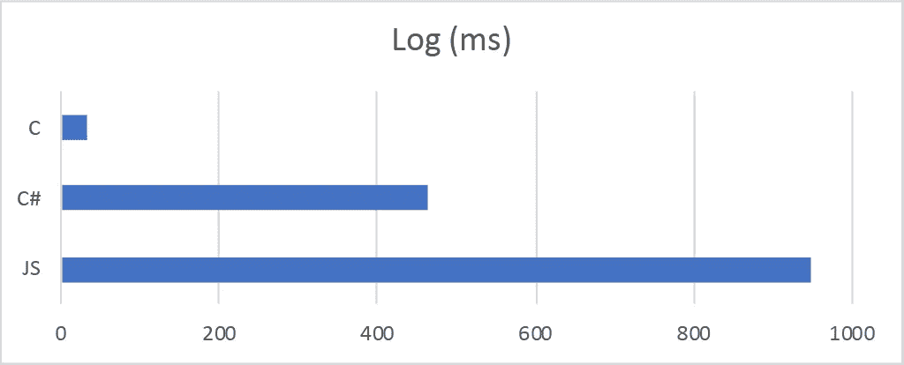
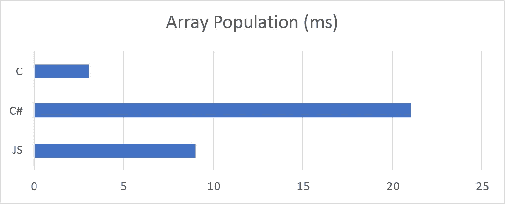
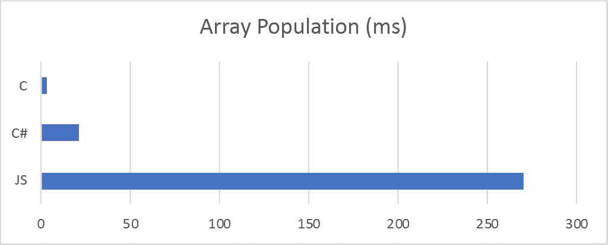
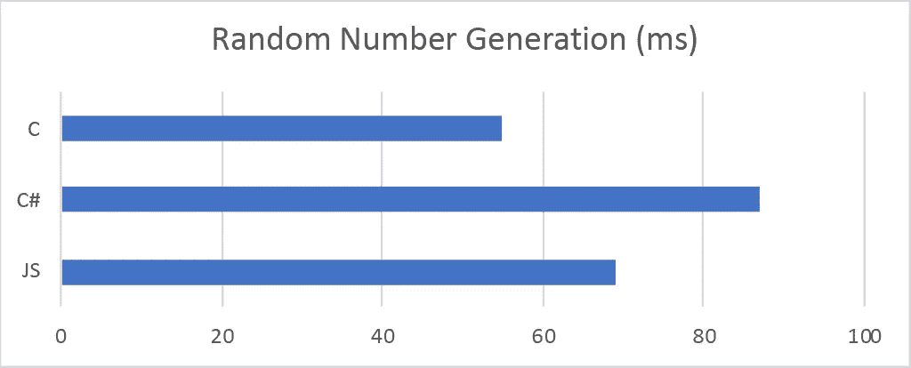
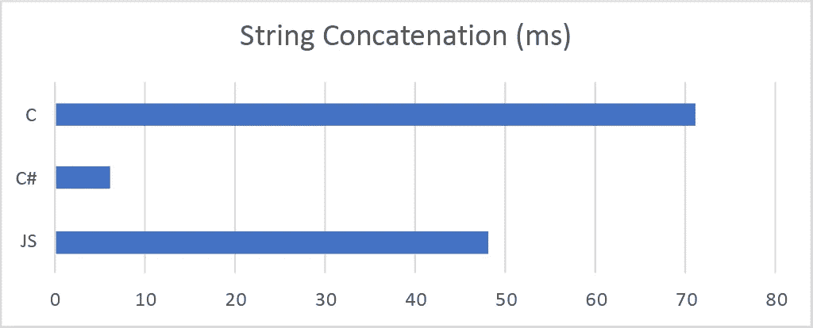
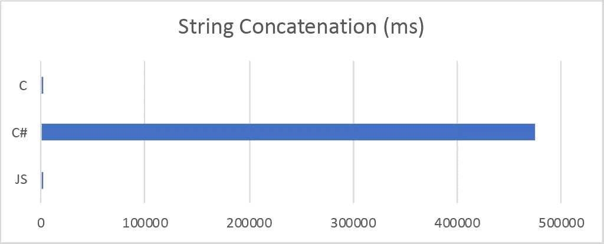
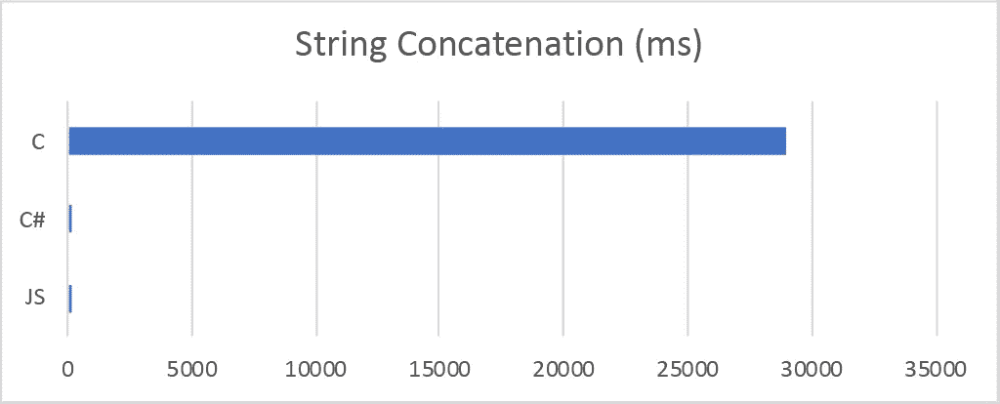

# JavaScript 到 C 或 C#有多快？

> 原文：<https://medium.datadriveninvestor.com/how-fast-is-javascript-to-c-or-c-29d104f4f255?source=collection_archive---------0----------------------->


Photo by [Hafidh Satyanto](https://unsplash.com/@hafidhsatyanto?utm_source=medium&utm_medium=referral) on [Unsplash](https://unsplash.com?utm_source=medium&utm_medium=referral)

性能关键型应用应该选择哪种技术？节点是如何。NET 核心，或者说电子相对于原生应用？

不同的语言和运行时在各自的领域中具有不同的优势；所以，苹果和橘子真的…

同样，不同的代码段在性能方面的转换也很有趣。

所有测试都在 MacBook Pro 15 英寸 2018、2.2 GHz 6 核英特尔酷睿 i7–8750h 和 macOS Catalina 上运行。

## 加法赋值运算符

首先，使用下面的代码段，用简单的算术将 JavaScript、C 和 C#与 2 亿个加法赋值运算符进行比较:

```
// C
int temp = 1;
for (int i = 0; i < 200000000; i++)
    temp += temp;// C#
int temp = 1;
for (var i = 0; i < 200000000; i++)
  temp += temp;// JavaScript
let temp = 1;
for (let i = 0; i < 200000000; i++)
  temp += temp;
```

对于 C，我将使用 CLion 执行 C11 发布版本:



CLion execution resulting in 6,219,000 nanoseconds

对于 C#，我将使用骑士执行。NET Core 3.1.301 发布版本:



Rider execution resulting in 109 milliseconds

对于 JavaScript，我将使用在 Node v14.8.0 中执行的 IntelliJ IDEA:



IntelliJ IDEA execution resulting in ~476 milliseconds

结果:


Time in milliseconds, lower is better

*   C: 6.219 毫秒，每秒大约 160
*   C#: 109 毫秒，大约 9 秒
*   JS: 202 毫秒，大约每秒 5 秒

## 对数

对于更复杂的数学运算，使用以下代码段将 JavaScript、C 和 C#与 1 亿个对数进行比较:

```
// C
double n;
for (int i = 0; i < 100000000; i++)
    n = log(i);// C#
double n;
for (var i = 0; i < 100000000; i++)
  n = Math.Log(i);// JavaScript
let ret;
for (let i = 0; i < 100000000; i++)
  n = Math.log(i);
```

结果:



Time in milliseconds, lower is better

*   C: 33.563 毫秒，大约每秒 30 秒
*   C#: 465 毫秒，大约每秒 2 秒
*   JS: 947 毫秒，大约每秒 1 秒

## 阵列总体

使用以下代码段比较 JavaScript、C 和 C#与 1000 万数组赋值:

```
// C
int a[10000000];
for (int i = 0; i < 10000000; i++)
    a[i] = i;// C#
int[] a = new int[10000000];
for (var i = 0; i < 10000000; i++)
  a[i] = i;// JavaScript
let a = new Array(10000000);
for (let i = 0; i < 10000000; i++)
  a[i] = i;
```

结果:



Time in milliseconds, lower is better

*   C: 3.081 毫秒，每秒大约 325 秒
*   C#: 21 毫秒，大约 47 秒
*   JS: 9 毫秒，大约 111 秒

请注意，以正确的大小初始化 JavaScript 数组至关重要；否则，依赖阵列增长会带来巨大的成本。

如果在没有初始数组大小的情况下重写 JavaScript 代码:

```
// JavaScript
let a = [];
for (let i = 0; i < 10000000; i++)
  a[i] = i;
```

结果:



Time in milliseconds, lower is better

*   JS(未优化):270 毫秒，大约每秒 4 次

## 随机数生成

使用以下代码段比较 JavaScript、C 和 C#与 1000 万个随机数的生成:

```
// C
srand(time(0));
for (int i = 0; i < 10000000; i++)
    rand();// C#
var rand = new Random();
for (var i = 0; i < 10000000; i++)
  rand.Next();// JavaScript
for (let i = 0; i < 10000000; i++)
  Math.random();
```

结果:



Time in milliseconds, lower is better

*   C: 54.738 毫秒，大约 18 秒
*   C#: 87 毫秒，大约 12 秒
*   JS: 69 毫秒，大约 15 秒

## 串并置

使用以下代码段比较 JavaScript、C 和 C#与一百万个字符串的连接:

```
// C
char* result = NULL;
size_t resultSize = 0;
FILE* stream = open_memstream(&result, &resultSize);
for (int i = 0; i < 1000000; i++)
    fprintf(stream, "ab", i, i);
fclose(stream);
free(result);// C#
StringBuilder str = new StringBuilder();
for (var i = 0; i < 1000000; i++)
  str.Append("ab");// JavaScript
let str = '';
for (let i = 0; i < 1000000; i++)
  str += 'ab';
```

结果:



Time in milliseconds, lower is better

*   C: 71.243 毫秒，大约 14 秒
*   C#: 6 毫秒，大约每秒 166 次
*   JS: 48 毫秒，大约每秒 21 秒

C#有许多字符串连接操作，如`+=`操作符、`Concat`、`Join`、`Format`或插值，但以上利用了`StringBuilder`来获得最高性能。

如果我们用 JavaScript 示例中的`+=`操作符替换它:

```
// C#
string str = "";
for (var i = 0; i < 1000000; i++)
  str += "ab";
```

结果:



Time in milliseconds, lower is better

*   C#(未优化):7.9 分钟

c 也需要优化，因为使用`strcat`也很慢:

```
// C
char *str1;
str1 = malloc(1000001*2*sizeof(char));
char *str2 = "ab";
for (int i = 0; i < 1000000; i++)
    strcat(str1, str2);
```



Time in milliseconds, lower is better

*   c(未优化):29 秒

## 结论

这个薄的横截面没有反映真实世界的例子，这里可以考虑进一步的优化。

考虑到最初的 JIT 编译时间损失、并行并发能力或编译器自动应用的优化的成熟度，甚至性能速度的概念也是有争议的。

这五个例子集中在数学和记忆管理上，同时揭示了实现中的思想如何极大地影响结果。

看到像 JavaScript 这样的现代引擎逐渐接近本地性能也是令人兴奋的。

**进入专家视角—** [**订阅 DDI 英特尔**](https://datadriveninvestor.com/ddi-intel)