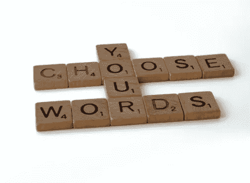

# 框架如何影响我们的决策能力

> 原文：<https://medium.datadriveninvestor.com/how-framing-affects-our-ability-to-make-decisions-a3045910e4a8?source=collection_archive---------16----------------------->

不是你说什么，而是你怎么说。

Photo by Brett Jordan of [Unsplash](https://www.wix.com/dashboard/f2c19c2d-435a-4b5e-a5f8-914461c4ffac/social-posts/composer)

心理学领域的专家将这种技巧称为“框架”法国人会说，*“C ' est le ton qui fait la musique，”*翻译过来就是*“重要的不是你说什么，而是你怎么说。换言之，作为人类，我们对同样的情况会做出不同的反应，这取决于它们是如何呈现的。*

## 一鸟在手胜过双鸟在林

20 世纪 80 年代，卡尼曼和特沃斯基进行了一项调查，提出了两种流行病控制策略。参与者被告知六百人的生命危在旦夕。每个选项都是这样提出的:

*“选项 A 拯救两百条生命。”*

选项 B 提供了 33%的机会让所有 600 人幸存，66%的机会没有人幸存

虽然这两个选项都提供了 200 名幸存者的可能性，但大多数参与者选择了选项 a。

 [## 商务沟通不畅是网络安全问题的 5 个原因|数据驱动型投资者

### 沟通是商业的命脉。没有协作就不会有想法，没有合作就不会有交易

www.datadriveninvestor.com](https://www.datadriveninvestor.com/2020/09/01/5-reasons-why-poor-business-communication-is-a-cybersecurity-issue/) 

## **重构两个选项会如何改变结果？**

这两个选项都以下列方式重新构建:

*“选项 A 杀四百人。”*

选项 B 提供了 33%的无人死亡的可能性和 66%的 600 人全部死亡的可能性

这一次，只有一小部分参与者选择了 A，而大多数人选择了 b。

根据每个问题的表述方式，参与者的决定会发生变化。

 [## 公司如何利用对比效应来智胜他们的顾客

### 以及以后如何避免。

medium.com](https://medium.com/the-innovation/how-companies-are-using-the-contrast-effect-to-outsmart-their-customers-80bd20fae4ff) 

## **食品行业的重组**

我们大多数人都可以参与到杂货店购物的活动中，那些经常吃肉的人可能会认为第二个实验特别有关系。当研究人员向一组人展示两种肉类时，他们将这两种选择定位为:

*选项 A:“99%无脂肪”*

*选项 B:“1%脂肪”*

然后他们被要求选择他们认为更健康的食物。当考虑每一个的意义时，你会很快意识到两者的脂肪含量完全相同；然而，由于*框架*，大多数受访者选择了第一个选项。

 [## 邻近建议会让你远离你想要的生活吗？

### 它是什么？它是如何让你实现人生目标的？

medium.com](https://medium.com/age-of-awareness/is-proximity-advice-keeping-you-from-the-life-you-want-c02bf8326f86) 

接下来的发现更加令人惊讶:同样的参与者有两个选择:

*选项 A:“98%无脂肪”*

*选项 B:“1%脂肪”*

尽管脂肪含量较高，大多数受访者还是选择了第一种。

## **上光**

“上光”是一种流行的框架类型。根据其规则，股价下跌成为“修正”，而过高的收购价格被称为“商誉”。在每一门管理课程中，一个问题都会神奇地转化为“机遇”或“挑战”一个被解雇的人现在被认为是在“重新评估他的职业生涯”。一次成功的紧急迫降，例如在哈德逊河，被庆祝为“航空的胜利”。一个企业家刚刚被列入“30 岁以下 30 人”名单，却没有裁员、偷工减料或虐待为他或她工作的员工。

许多人记得史蒂夫·乔布斯，因为他在苹果公司的成功和创新。很少有人知道他让员工极其努力地工作，并创造了一个充满冲突的工作环境。最突出的冲突是他和苹果公司首席执行官之间的冲突，最终导致他被公司解雇。很少有人知道这些额外的细节，因为乔布斯(和其他几个人)在去世前与世界分享这个故事时，重新构建了这个故事。他分享说，苹果董事会解雇他的决定是发生在他身上最好的事情之一。他以此为契机，成为一名更好的商人和创造者。

 [## 被解雇是发生在我身上最好的事情

### 重要的不是生活给了你什么，而是你选择用它来做什么。

medium.com](https://medium.com/this-shall-be-our-story/getting-fired-was-the-best-thing-to-ever-happen-to-me-c8948798f68) 

## **考虑一下这个**

那些积极参与金融交易的人，下次有机会的时候，应该考虑从不同的角度看这本小册子。在查看感兴趣的金融产品(例如交易所交易基金)的说明书时，请注意产品表现趋势上显示的选定年份。通常情况下，他们会回到足够远的地方，以允许最好的向上曲线出现。这是另一个框架的例子。

## **取景的正面用途**

框架经常被用来作为一种重新训练消极心态的方法，以更少的努力更积极地思考。例如，如果一名高中生因为没能加入他们参加的运动队而感到沮丧，治疗师可能会建议他们列出所有他们本可以花在练习或比赛上的时间可以做的事情。例如，他们的下午是自由的，他们的星期六上午是开放的，他们可以和他们的朋友在一起，否则他们可能无法这样做。

 [## 5 个奇怪的问题会帮助你找到你的目标

### 如果你感觉被卡住了，问自己这些独特而发人深省的问题。

medium.com](https://medium.com/swlh/5-strange-questions-that-will-help-you-find-your-purpose-d4b882fa9d22) 

另一个例子可能是(也许是最容易理解的)一段关系的结束。许多人最初会感到悲伤、失望，甚至愤怒。当通过积极的重构实践过滤后，现在的分裂意味着你有更多的时间留给自己，也许是学到了一课，以及结识新朋友的机会。

要意识到，无论你交流什么，都包含着某种*框架*的元素，而且每一个事实——即使是从你信任的朋友那里听到的——都会受到这种影响。

## 获得专家视图— [订阅 DDI 英特尔](https://datadriveninvestor.com/ddi-intel)