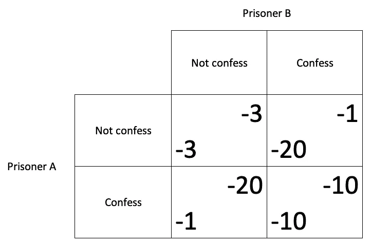
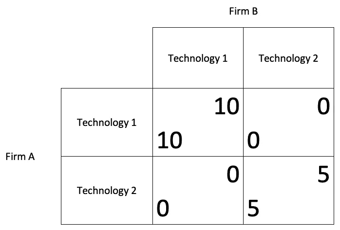

# 博弈论如何影响商业

> 原文：<https://medium.datadriveninvestor.com/how-game-theory-impact-on-businesses-2213a46f0317?source=collection_archive---------18----------------------->

博弈论？还是不知道是什么？不，这不是网飞发布的新系列。你肯定应该开始阅读这方面的内容，因为它可以帮助你的业务。博弈论广泛应用于经济学、政治学或社会学等领域，在战略和谈判中发挥着重要作用。如果你是企业的所有者，或者作为经理参与公司的决策，你肯定会遇到需要很好的计划和预测的情况。我的企业下一步要做什么？我如何与我的主要供应商谈判？我们如何为客户创造价值？我们将如何实现我们的目标？

虽然看起来有点怪，但博弈论是应用数学中研究情境(或游戏)的一个领域。这些情况往往需要采用**策略**来解决。战略一词源于希腊语 *strategos* ，指的是“领导军队的艺术”。由于其好战的词源，我们经常对“战略”一词有负面的刻板印象。然而，领导一支军队并带领它走向胜利需要一套**战略决策**，这就是最一般形式的含义，战略是获得我们想要的结果的行动计划，让我们看一个例子。

 [## 将爱好展示变成赚钱机器|数据驱动的投资者

### 这是造梦者奥斯卡·冈萨雷斯响应号召的地方。他是一名独立的在家工作的顾问，担任…

www.datadriveninvestor.com](https://www.datadriveninvestor.com/2020/02/14/turn-hobby-showcase-into-money-maker/) 

想象一下，今晚你想在你最喜欢的电视频道上看这部电影。你认为没问题，你只需要打开电视，选择想要的频道，然后坐在沙发上。那很简单！但是事情发生了:一个你很久没见的老朋友打电话给你，想出去叙叙旧。假设你想见你的朋友，情况就完全不一样了。一方面，你可以呆在家里看电影，但也许你的朋友会失望。另一方面，你可以和你的朋友出去，但是你会错过电影。现在，你必须建立一个更详细的策略。一个有效的解决办法是早点去见你的朋友，然后准时回家去看电视电影。这样，两个人都开心。问题解决了。

想想这个更复杂的情况:你和你的伴侣住在一起。你们两个都存了一些钱，你期待着为客厅买一个台球桌。然而，你的伴侣想买一只漂亮的小狗。你负担不起两种选择的成本，所以，假设你不想睡在沙发上，你必须制定一个策略。在这种情况下，你应该考虑到你想要一张台球桌的愿望和你的伴侣想要一只金毛小狗的愿望，但你也应该考虑到这段关系对你们两人的重要性。此外，你必须考虑到你的伴侣不愿意在客厅放一张台球桌，以及你想带小狗去散步的小小愿望。欢迎来到相互依赖的场景。

我们谈论**战略相互依赖**，其中个人采取的行动和获得的结果都取决于第三方行动者将采取的行动。换句话说，无论你选择什么行动，这些活动的结果不仅仅取决于你想要什么。由于作为一种情况的一部分的个人之间的这种高度依赖性和许多变量，需要采取一种复杂的策略。

# 不同类型的游戏

一旦我们理解了博弈论的基本概念，让我们根据以下规则将它们分为两大类:**同时行动**和**连续行动博弈**。顾名思义，在第一个游戏中，所有玩家同时采取行动，在第二个游戏中，玩家轮流采取行动。我们应该提到**静态游戏**，这是顺序移动游戏的一个子类型，在这种游戏中，玩家不知道其余玩家的行动，直到他们已经玩过。

我们也可以根据游戏玩的次数对游戏进行分类。我们有**一次性游戏**，游戏只玩一次，还有**重复游戏**，游戏不止玩一次。

# 合作还是不合作？

让我们探索广为人知的囚徒困境来理解一个游戏是如何运作的。囚徒困境是同时行动博弈的一个特例。想象以下情况:

两个人实施抢劫，但无法逃脱，警察抓住了他们。警察把他们带到不同的审讯室，这两个人之间没有任何交流。警方向他们提供了同样的协议，内容如下:

*   如果你不承认犯罪，而你的伴侣承认，你将被判 20 年监禁，你的伴侣将被判 1 年监禁。
*   如果你承认犯罪，而你的伴侣不承认，你将被判 1 年，你的伴侣将被判 20 年。
*   如果你们都承认犯罪，你和你的搭档将各被判 10 年。
*   但是，如果你们两个都不承认罪行，我们没有足够的证据，所以你们两个都将被判三年徒刑。

我们可以用一个矩阵来表示这四个选项:

The prisoner’s dilemma matrix

这个游戏让我们证明，即使最诱人的提议可能是两个囚犯都不坦白(这将是这个游戏的最佳解决方案，因为每个人只需要 3 年，总共 6 年)，两个囚犯中的任何一个都可能会背叛他们的搭档，以将他们的刑期降低到 1 年。但是，如果两个犯人遵循相同的逻辑推理，就会导致一个博弈均衡的情况，叫做**纳什均衡**，即使这不是最优解(各取 10 年，总刑期 20 年)。

# 实现协调

让我们来看看同时行动博弈的另一个场景，但这一次，我们将关注一个更现实的情况。有两家公司，A 和 B，必须在两种技术 1 和 2 之间做出选择，并采用所选的技术。他们必须同时独立地做这件事。技术 1 比技术 2 好，所以我们假设第一个的收益是 10，而第二个的收益是 5。我们还将假设以下语句:

*   如果两家公司选择相同的技术，他们都会得到相同的回报。
*   如果公司选择不同的技术，因为他们不兼容，他们将得到零收益，明白他们不兼容，他们不能，例如，交换文件。

这次来看看游戏矩阵:

Pareto Coordination Game matrix

在这种情况下，公司能做什么？让我们检查一下可能的解决方案:

*   公司 A 的最佳策略是选择与公司 b 相同的技术。
*   同样的肯定也适用于公司 b。
*   有两种均衡情况(纳什均衡):如果两家公司都选择技术 1(总收益为 20)和如果两家公司都选择技术 2(总收益为 10)。
*   与囚徒困境不同，除了单方面选择对双方都最好的方案之外，没有任何激励鼓励任何公司选择另一个方案。

囚徒困境和帕累托博弈只是两个简单的博弈例子，可以应用于我们在公司中接触到的大量日常情况。在这种情况下，我们必须考虑我的公司可以采取的最佳行动方案，并尝试预测其他参与者的行动，进行战略性思考。我应该合作还是竞争？我应该创造价值还是需求价值？对方会违背我们的约定吗？我是只向这位客户销售一次还是多次？如果答案不止一次，我能浪费这段时间去长期成功吗？虽然这个故事只是一个简单的介绍，但是在很多情况下，博弈论可以帮助我们制定更好的策略。

如果你喜欢这个关于博弈论的故事，并且想读另一个，请鼓掌！