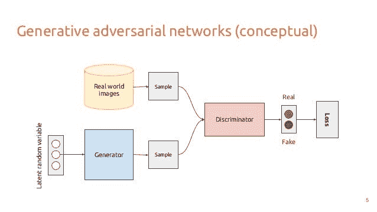
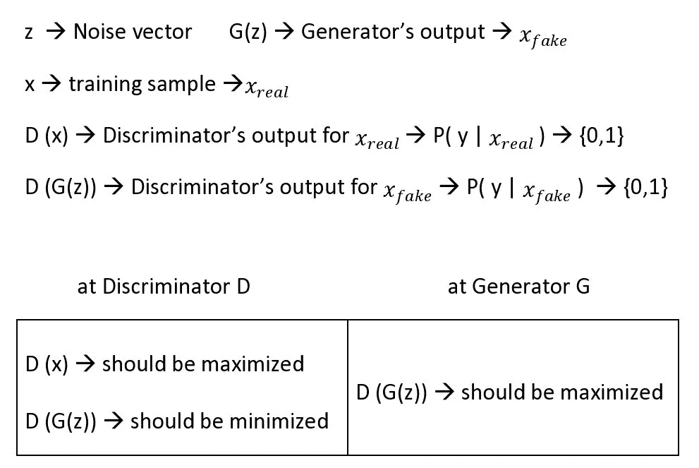
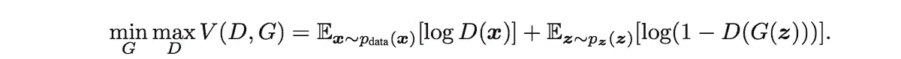
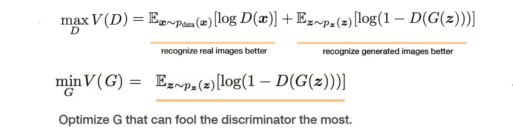

# 生成性对抗网络如何工作

> 原文：<https://medium.datadriveninvestor.com/how-generative-adversial-network-works-3ddce0062b9?source=collection_archive---------2----------------------->

生成对抗网络(GANs)据说是深度学习领域最大的发明之一。最近，面部老化应用程序变得非常受欢迎，它使用 GAN 的一种变体作为底层算法。此外，GANs 在将低分辨率图像转换为高分辨率图像方面变得非常有用。在这篇文章中，我们将看到一个基本的生成对抗网络的构建模块。

## GANs 的架构:

每个 GAN 有两个基本元件，即发生器和鉴别器。这两个网络可以是任何深度学习网络，如人工神经网络、卷积神经网络、长短期记忆(LSTM)。鉴别器应该在网络的末端有一个分类器。

(Schematic Diagram Of A Basic GAN Architecture)

上图总结了基本 GAN 的工作原理。正如我们所看到的，生成器将随机值作为输入，并产生一个输出，期望它在鉴别器看来是真实的。另一方面，鉴别器从真实图像集和鉴别器生成的图像中获取输入，并试图以正确的方式对它们进行分类，即应该能够区分哪个是真实的，哪个是伪造的。

# 外行人理解甘的方式:

gan 的发生器被期望创建看起来像真实图像的图像。然而，生成器不知道真实图像是什么样子的。因此，它接受来自鉴别器的反馈(*因为它知道或声称知道真实图像)*关于如何调整参数以使其看起来真实。同时，鉴别器试图识别鉴别器产生的图像，降低其成为真实图像的概率，同时增加正确分类真实图像的概率。这种受博弈论启发的竞争性学习让这两个网络变得更加强大。

 [## 修复摄影|数据驱动的投资者

### 汤姆·津伯洛夫在转向摄影之前曾在南加州大学学习音乐。作为一个…

www.datadriveninvestor.com](https://www.datadriveninvestor.com/2019/03/22/fixing-photography/) 

## 数学含义:

假设 z 是一个噪声矢量，作为发生器的输入。在这种情况下，G(z)将是发电机的输出。此外，x 是训练样本的集合，在这种情况下，D(x)是真实训练样本的鉴别器概率。类似地，D(G(z))是鉴别器的输出，它是生成的图像即伪图像的概率值。

最大化 D(G(z))与最小化 1-D(G(z))相同。我们还可以看到，鉴频器部分有两种损耗，因为它有两种输入:来自发生器的输出和实数据样本。所以损失要计算两次。因此，鉴频器的总损耗是真实数据和虚假数据造成的两个损耗之和。计算损耗后，我们可以进行所需的反向传播并调整参数。

上面的等式显示 V 是一个值函数，让我们调整 D 和 g 的参数。

当我们对 V 和 G 都应用 V 函数时

因此，通过上述操作，鉴别器和发生器都变得更强，以完成它们所需的任务(*，如为发生器欺骗鉴别器，为鉴别器辨别真假图像*

在下一篇文章中，我们将看到 GAN 的一些很酷的应用，并从头开始构建 GAN。