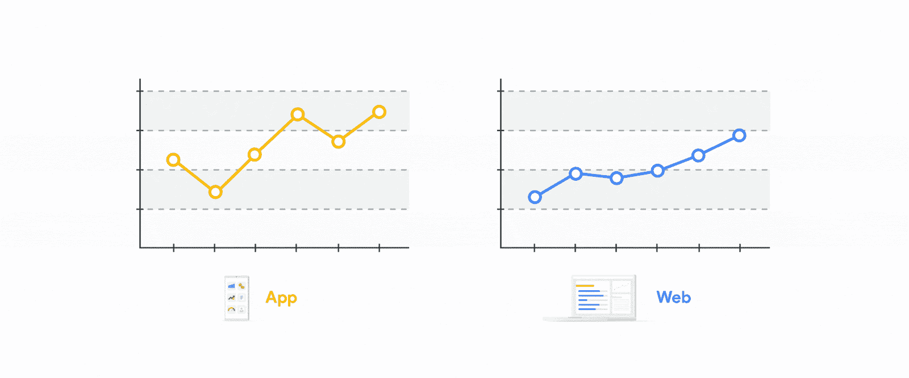
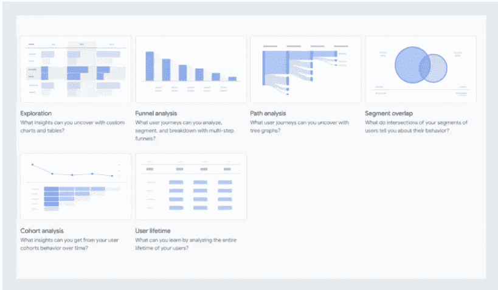

# Google Analytics 4 如何帮助您做出更明智的决策，为什么您现在需要它

> 原文：<https://medium.datadriveninvestor.com/how-google-analytics-4-helps-you-make-smarter-decisions-and-why-do-you-need-it-now-fb7f8a149ab7?source=collection_archive---------13----------------------->

自从谷歌宣布推出 Google Analytics 4 以来，数据分析界就分成了两派——支持立即迁移的人和不支持的人。

我听说许多公司试图更好地了解这些变化将如何影响他们，但主要是，他们问是否应该现在迁移到谷歌分析 4？

**这里有个剧透:**

简单的回答是肯定的。

最长的答案是:这很复杂(总是如此……)

是的——因为谷歌分析 4 是未来，不管你喜不喜欢，就像任何其他场景一样，那些早进入的人将拥有优势。

但同样重要的是，一些高级功能(仅在 360 版本中可用，定价为 15 万美元/年)现在对免费的 Google Analytics 4 用户开放——它们是真正的游戏规则改变者！尤其是对营销团队而言。

这很复杂——谷歌分析 4 还没有准备好完全取代通用分析。它仍然有问题，不支持一些基本功能(别担心，它们在路线图上)。

所以目前我给你的最好建议是两者都用。

继续使用你的通用谷歌分析，同时开始尝试谷歌分析 4 ( [阅读更多](https://www.cardinalpath.com/blog/implementing-google-analytics-4-on-your-website)关于如何以最小的努力做到这一点)。

现在，让我们深入研究一下我提到的那些改变游戏规则的 Google Analytics 特性。

# 𝗖𝘂𝘀𝘁𝗼𝗺𝗲𝗿-𝗰𝗲𝗻𝘁𝗿𝗶𝗰𝗱𝗮𝘁𝗮——这是一个完整的用户之旅

新的事件和基于用户的跟踪允许您从各种设备和接触点收集数据，并将它们整合到一个视图中。

这基本上意味着，即使用户使用不同的平台(移动网络到移动应用)或不同的设备(网络到移动)，他们也可以被识别和报告为同一用户。如果到目前为止，公司必须分别跟踪他们的网络和移动应用程序数据，品牌现在不仅可以并排分析应用程序和网络性能；他们还可以使用多种识别技术:设备、内部用户 ID，甚至谷歌信号，以获得 web 和应用程序性能的统一视图。

为什么这如此重要？营销团队现在可以分析跨平台和跨设备的完整用户旅程，并了解哪些渠道和活动显示最高的 roa 和 LTV。

*苹果的 iOS 14 和 IDFA 贬值将影响这一能力，毫无疑问，但那是另一篇文章的内容。

Source: Google

# 不再有聚合数据。使用 BigQuery 访问用户级数据

许多人没有提到这项新功能的革命性，但在我看来，这是尽快开始使用谷歌分析 4 的首要原因。

以前只有 360 功能，谷歌分析 4 现在支持免费账户的原始数据导出到大查询。

到目前为止，免费的谷歌分析用户只能访问聚合数据，不能在单用户层面分析或使用数据和信号。

原始数据导出改变了这一点。

[Google Analytics 大查询导出方案](https://support.google.com/analytics/answer/7029846?hl=en)包括每个用户的唯一 ID(默认 GA CID)以及您的内部 UID(如果捕获并发送给 Google Analytics 的话)。

现在，您可以更好地控制您的数据，这是一件大事！

用户级原始数据允许品牌创建高级分析和研究，构建定制归因模型，并丰富来自营销平台或内部数据库等其他来源的数据。

用户级的原始数据可用性也为品牌打开了一个非常渴望的功能的大门，直到现在，这种功能只保留给最大和最先进的品牌。它将人工智能驱动的预测集成到他们的工作流程中。

这种智能模型的集成可以通过利用用户级预测模型进行 LTV 评估和普遍获得优化，使品牌能够提升其普遍获得和增长能力。

(如果你想阅读更多关于预测 LTV 优化的内容，我谨建议以我写的这篇[文章](https://idofrido.medium.com/predictive-ltv-ua-optimization-what-does-it-mean-and-why-will-it-soon-not-be-just-a-big-brand-7d8ba25fe1b3)作为起点。)

大查询集成支持命中级数据导出。这可以实时完成，也可以作为日常批处理来完成。集成很容易，不需要任何深入的技术知识(了解如何设置您的大型查询集成[这里](https://support.google.com/analytics/answer/9358801?hl=en))。

# 第一次看到跨设备的 YouTube 参与，更好地集成到谷歌的营销产品中

Google Analytics 与其营销平台的整合一直为营销者提供有意义的见解，但并非没有限制。

虽然营销平台上的转换和目标是跨用户旅程计算和呈现的(使用 Google signals)，但 Google Analytics 的报告并不匹配相同的能力，因为以 cookie 为中心的处理和建模(与作为独立用户的 each _ga cookie 相关)。

随着跨谷歌营销产品的新的和先进的集成，应该会更容易提高您的营销投资回报率(如果您的预算中有很大一部分投资于谷歌营销平台)。

例如，与谷歌广告的更深入整合，让营销人员第一次能够创造受众，无论他们选择在哪里开展业务，都能以更相关、更有益的体验接触到他们的客户。

新的 Google Analytics 4 方法还使得真正的长期广告客户请求成为可能——更好地理解 YouTube 的性能(哇，鼓掌手的表情符号)。

因为新的分析可以同时测量应用程序和网络交互，所以它可以在报告中包括来自 YouTube 参与视图的转换，这些视图发生在应用程序中和网络上。看到 YouTube 视频浏览量的转化以及谷歌和非谷歌付费渠道、有机渠道、社交和电子邮件的转化，有助于品牌了解营销努力的综合影响。

*苹果 OS 14 和 IDFA 折旧无疑也将影响这一能力，但即使不是适用于所有用户，这仍将有助于多点触摸的归属。

# 触手可及的强大分析功能。在新的分析中心回答您的问题

新的分析中心是定制报告和分析的中心，很可能成为分析师最喜欢的功能。Google Analytics 4 现在向所有用户提供了这一功能，它还提供了新的、有洞察力的分析类型。

**漏斗分析**允许你通过多达 10 个步骤的流程来可视化进展和放弃。营销人员现在可以建立漏斗，轻松检测来自不同渠道或活动的下降，并为只需一次点击(嗯，可能两三次点击)就从漏斗中下降的用户创造受众

**细分重叠**帮助您更好地了解不同用户细分之间的重叠。营销团队可以了解有多少用户通过不同的设备与他们的品牌互动，或者有多少用户通过多种渠道到达他们的网站(以及哪些渠道可以很好地转换)。

**Exploration** 让您能够快速创建定制报告，使用拖放界面添加和删除维度、指标、细分和过滤器。分析师现在可以从他们的数据中寻找前所未有的答案。

# 是时候开始你的谷歌分析 4 之旅了吗？

有更多的新功能和特点值得调整到谷歌分析 4。我现在不会详述它们，但它们值得一提:改进的 UI、内置于产品和报告中的 ML 洞察力、更好的数据控制(用户选择退出)和更快的性能(使用 Google Analytics 的人通常知道这有多重要)。

这听起来可能太完美了，但相信我，它不是。如前所述，仍然有一些未解决的错误和缺失的功能(如过滤器和视图)。但正如他们所说，熟能生巧——我们都应该开始练习我们的谷歌分析 4 技能。

如果你想分享你自己的谷歌分析 4 体验，询问一个特定的功能，或者如果你需要帮助你的用户用谷歌分析 4 LTV 建模，请随时联系。