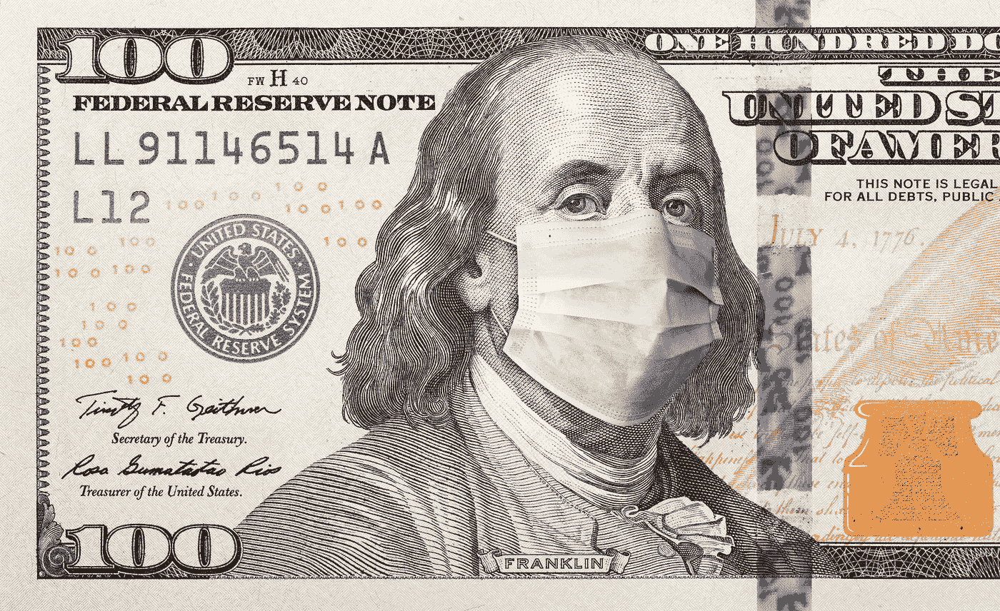
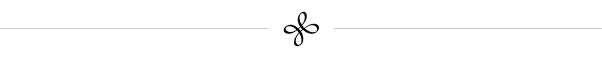

# 政府应该如何应对即将到来的衰退

> 原文：<https://medium.datadriveninvestor.com/how-governments-should-respond-to-the-coming-recession-a7ff162d3c2f?source=collection_archive---------1----------------------->

## 与宏观经济学家斯科特·萨姆纳的一次重要谈话

> 当人类和国家耗尽所有其他资源时，他们会明智地行动。
> 
> —阿巴·埃班

今天，我们听到政府计划分发资金，提供税收减免，以及其他超过万亿美元的救市计划。欧洲和亚洲正在考虑他们的选择，目标是使我们的世界经济恢复正常。这些努力大多会让人感觉良好，但不会真正有帮助。

复苏可能会很快开始，也可能需要数年时间，而且非常乏力。我们必须现在就要求货币政策改革，把经济复苏掌握在自己手中。

 [## 经济就是包容人|数据驱动的投资者

### 建模，数据，最重要的是，人 Tayo Oyedeji 博士在他的食谱中混合了所有这些成分，为一个…

www.datadriveninvestor.com](https://www.datadriveninvestor.com/2019/03/06/economy-is-all-about-including-people/) 

对你来说，理解货币政策为何重要可能听起来完全无关紧要，但阅读本页内容和观看这段视频与了解病毒如何传播以及我们如何阻止它一样重要。

# 第一个视频

3 月 18/19 日，我采访了斯科特·萨姆纳，我认为他是世界领先的宏观经济学家。我们就现在应该做些什么来帮助创造一个强劲的经济复苏进行了两个小时的交谈。这是一个一小时的视频，是我从与斯科特的对话中剪辑出来的。我意识到大多数人不会看一个小时的视频，但我鼓励你看，即使你不理解所有的内容，因为熟悉这些概念将有助于你与他人交谈。

# 第二个视频

这是 2020 年 5 月 15 日发表的。这是对《保健法》的更新和回顾:

# 要点总结

斯科特·萨姆纳是市场货币主义运动的创始人之一。他认为，政府应该使用货币政策，而不是财政政策，在经济过热时帮助降温，在出现某种冲击时刺激经济。我们现在正处于一种非常不寻常的冲击之中——这种冲击以后可以与大萧条相提并论。为了第一次就做对，政府应该:

1.  **向失业者、医院、医护人员和其他在抗击疾病前线的人提供紧急援助**。
2.  **确保向医疗保健、保险和其他直接参与疫情的公司提供正确的激励措施**。例如，[不要资金不足的流行病准备](https://www.vox.com/policy-and-politics/2020/3/14/21177509/coronavirus-trump-covid-19-pandemic-response)和[取消最近关键医疗用品的关税](https://www.piie.com/blogs/trade-and-investment-policy-watch/trumps-trade-policy-hampering-us-fight-against-covid-19)。
3.  不做任何形式的财政刺激。没有给所有公民寄钱，没有让人们重新工作的“计划”，没有税收抵免，没有涉及借贷的财政计划。他们也许应该从军事预算中拿出一万亿美元用于更好的用途，但这总是事实。不应该有财政刺激。
4.  **停止设定利率**。让市场来决定利率。美联储没有“失控”，不需要设定任何利率。这是一个彻底的提议，需要修复一个长期损坏的工具，这个工具从一开始就不工作。via negata——少即是多。没有准备金利息，没有联邦基金利率，没有必要的指导。
5.  **建立并公布 2%的通胀目标或(更好的)4-5%的名义 GDP 目标。**央行应该承诺创造和注入(或收回和销毁)维持长期稳定目标所需的货币。
6.  **使用一系列前瞻性指标来判断我们是否走在正确的道路上。如果经济看起来不会达到目标，增加更多的钱来确保它能达到。如果经济增长过快，撤掉资金，再次确保在 2-3 年的时间范围内达到目标。**
7.  **根据有助于实现目标的方法，构建日常买卖资产的基础设施**。没有人或委员会的决定。
8.  **继续改进方法**让世界放心，每个国家都会达到既定目标。没有人类的判断。没有政治干预。不发微博。

虽然每个国家都不同，但这种方法将比他们现在拥有的好得多。一旦他们建立了一条通往目标的道路，他们就能找到继续修复货币体系的方法。一个很好的例子就是取消完全无效的银行监管。

# 为什么这很重要

在 2008/2009 年的衰退中，几乎所有政府都做错了事情。这导致数十亿人失业，并在五年的大部分时间里没有工作。这场疫情将导致经济增长大幅放缓。我们现在能做的最重要的两件事是 1)减缓病毒的增长，和 2)加速经济的复苏。虽然有很多关于遏制与缓解、口罩、呼吸机以及如何分配医疗资源的文章，但我们需要呼吁少数政府官员改变我们运行货币系统的方式。

危机是改变需要修复的系统的最佳时机。要求对我们的疫情应对计划、我们的学校和我们的工作场所进行重大改革是正确的。改革货币政策同样重要。

你可能不理解名义 GDP 水平目标。但是你要明白这对你的未来有多重要。设定名义 GDP 水平目标将让每个人在安全的情况下尽快重返工作岗位。

# 了解更多信息

我写过 [**金钱**](https://medium.com/@pullnews/a-short-primer-on-money-233e8c3d6987) 的简介。

以及 [**货币政策简介**](https://medium.com/@pullnews/an-open-letter-to-the-federal-reserve-78cf9a6e5339) 。

斯科特·萨姆纳解释为什么财政刺激不起作用。

下面是 [**对 2008 年**](https://medium.com/@pullnews/understanding-the-great-financial-crisis-61bb9e1ace9b) 大衰退原因的简短解释。

大卫·贝克沃斯已经写了 [**一篇针对**](https://www.mercatus.org/system/files/beckworth-ngdp-targeting-mercatus-special-study-v1.pdf) 名义 GDP 水平的强有力的综述。

访问 [**Mercatus 中心网站**](http://www.mercatus.org) 了解更多信息。

# 你能做什么

请广而告之。请联系任何将观看此视频的政府代表。请与有影响的人分享。尽可能多地分享这个视频——让每个人都回到工作岗位和帮助每个人保持安全一样重要。

我正在着手几个新项目，以帮助加快复苏。如果你是一个投资者或者可以帮助筹集资金的人，请联系我。

接下来: [**我的社交病毒载量就是你的社交病毒载量**](https://medium.com/@pullnews/my-socioviral-load-is-your-socioviral-load-1dcf3da536b1) 。

[**大卫·西格尔**](http://dsiegel.com/) 是 DC 华盛顿州的一位连续创业者。他是[支柱项目](http://pillarproject.io/)和 [2030](http://2030.io/) 的创始人。他著有 [*【令牌手册】*](http://thetokenhandbook.com/)*[*开斯坦福*](http://www.openstanford.com/)*[*文化甲板*](http://theculturedeck.com/)*[*气候好奇*](http://climatecurious.com/)**[*气候资料之旅*](https://www.youtube.com/watch?v=bJWnMA3-sQs) 。他的全部作品都在[**dsiegel.com**](http://www.dsiegel.com/)展出。*****