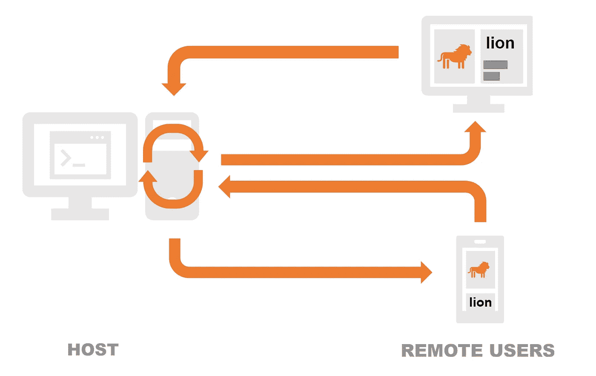
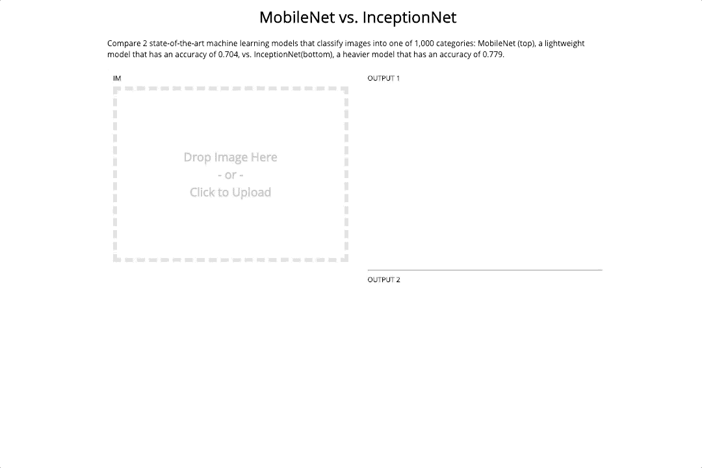

# Gradio 如何给你的机器学习团队增压

> 原文：<https://medium.datadriveninvestor.com/how-gradio-turbocharges-your-machine-learning-team-df0a8e960d05?source=collection_archive---------11----------------------->

## Gradio 的业务用例

Gradio 正在被一些世界领先的公司和机器学习团队使用，从[斯坦福以人为中心的人工智能](https://hai.stanford.edu/)到[思科人工智能](https://www.cisco.com/c/en/us/solutions/data-center/artificial-intelligence-machine-learning/index.html)。他们如何使用它，Gradio 如何加速您的机器学习(ML)团队的工作流程？在本教程中，我简要介绍了 Gradio，并概述了 3 个商业用例，其中 **Gradio 允许您在不到一个小时**内完成数周的工程工作。

**Gradio 简介**

Gradio 是一个[开源 Python 包](https://github.com/gradio-app/gradio)，它只需 3 行代码，就能围绕 ML 模型自动创建具有 GUI 的全功能 web 应用。借助 Gradio 的界面，非 ML 用户可以使用模型进行预测，而无需直接从浏览器编写任何代码。这使得任何人都可以在任何地方给出反馈和测试 ML 模型！

Gradio lets users test machine learning models without writing code, or requiring any specialized software or hardware

例如，在这里用 Gradio 尝试一个最先进的姿态估计模型:[https://www.gradio.app/hub/hub-openpose](https://www.gradio.app/hub/hub-openpose)

那么企业如何才能充分利用 Gradio 的工具呢？这里是我们看到的三个用例。

## **用例 1:来自领域专家的即时反馈**

作为机器学习开发人员，我们经常创建模型来预测专业领域，如医学或金融。当我们建立模型时，我们**寻求领域专家的反馈**以确保模型对数据的全部分布做出合理的预测。

Kexin Huang from Harvard uses Gradio to build interfaces where his collaborators can test drug-target interaction prediction models

在一家领先的公共生物技术公司，高级机器学习工程师认识到 Gradio 在加速这种反馈方面的潜力。在使用 Gradio 之前，机器学习工程师和化学家会定期进行冗长的 Zoom 通话，讨论模型正确预测哪些分子是有毒的，哪些分子被错误标记。

该公司意识到 **Gradio 将允许 ML 开发人员轻松创建 GUI** ，团队中的化学家可以使用该 GUI 与模型进行交互，并即时标记异常预测，而不是安排每周视频会议，并在几个月的时间内收集迭代反馈。

(顺便说一下，这个用例是 Gradio 背后的原始动机，它是一个简化 ML 研究人员和放射科医生之间的学术合作的工具。这导致了几本[的同行评议刊物](https://www.nature.com/articles/s41746-019-0216-8)以格拉迪欧为主角。)

## **用例 2:简化工程师-产品沟通**

机器学习系统的设计，特别是使用哪些功能作为输入和输出，不仅仅是 ML 团队的工程师做出的决定。通常，产品团队会根据客户访谈提供反馈。为了提供这种反馈，产品团队需要以一种无需编写代码就可以使用的方式访问模型。

Areeba Abid, a software engineer on Google’s Android SDK team, sees the value in using Gradio for internal demos and product decisions.

ML 工程师通常会花大量时间创建演示和组装系统来收集反馈。与其重新发明轮子，不如使用 Gradio 现成的 ui。

正如谷歌 Android SDK 团队的软件工程师 Areeba Abid 指出的那样，Gradio 可以节省团队与产品经理一起评估机器学习模型的大量时间。同样，思科人工智能总监 Mohamed El-Geish 正在他的团队中使用 Gradio，以节省他们为产品决策创建演示的工作量。正如他所说:

> “Gradio 现在是我们 ML 演示的重要组成部分。只需几分钟，就能让演示变得栩栩如生。”
> —默罕默德·艾尔·盖什(Mohamed El-Geish)，思科人工智能总监

## **用例 3:创建客户&销售演示**

Gradio 对于*外部*演示和*内部*演示一样有用。无论你是一家为企业客户制作演示的咨询公司，还是一家为最终客户开发应用程序的应用机器学习公司，你都可以通过创建 GUI 来帮助完成销售，让你的客户立即看到你的模型的价值。Gradio 让你的 ML 开发者在不到一分钟的时间内创建这个演示，而不是花费几个月的时间雇佣一个前端工程师和一个部署工程师。

您还可以创建比较模型的 GUI，就像上面的图像识别模型一样。您可以利用这一点来展示您的模型之间的主要差异，或者展示您的模型如何优于竞争对手，并完成销售！

如果你有兴趣尝试 Gradio，只需访问[https://github.com/gradio-app/gradio](https://github.com/gradio-app/gradio)看看开源库。或通过 team@gradio.app 联系我们。