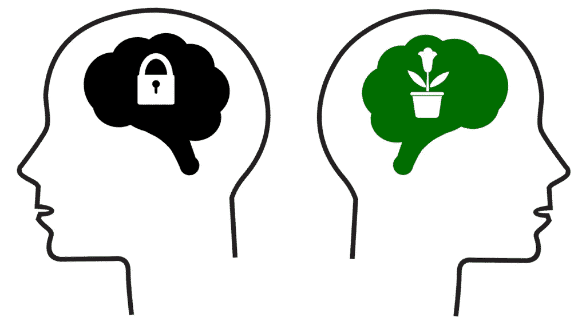
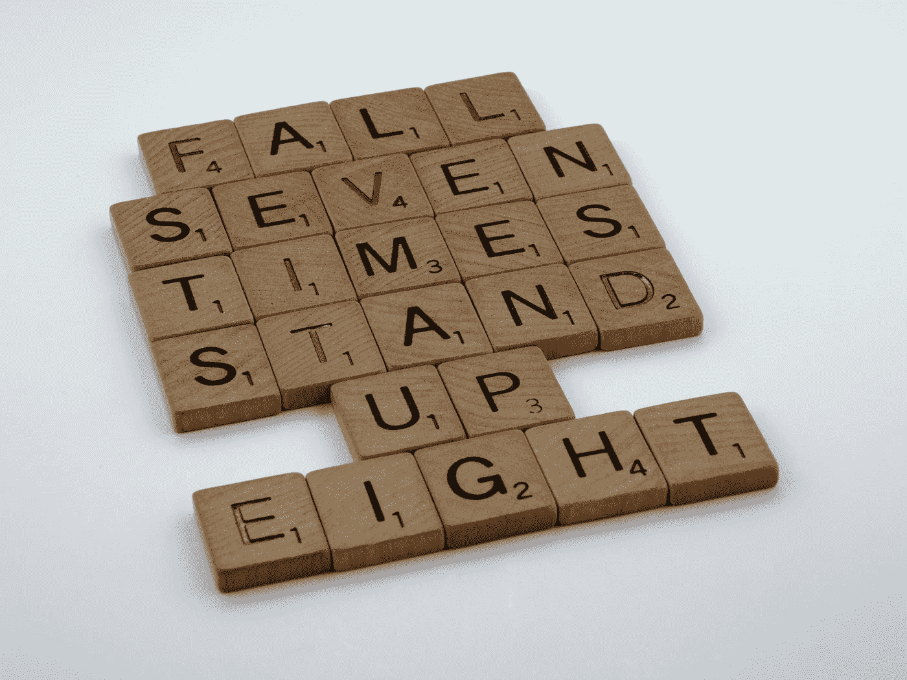

# 成长心态和弹性如何推动成功

> 原文：<https://medium.datadriveninvestor.com/how-growth-mindset-and-resilience-drives-success-737a73cc76fb?source=collection_archive---------31----------------------->

## 生活中有光明也有黑暗——这是失败和成功的相似之处。因此，你已经在一个黑暗、令人不寒而栗的隧道中持续旅行了相当长的一段时间，时间可能太长而无法计数——有一天你到达了它的尽头，并将开始另一段通往生命之光的旅程——成功。

Photo by [Aaron Burden](https://unsplash.com/@aaronburden?utm_source=medium&utm_medium=referral) on [Unsplash](https://unsplash.com?utm_source=medium&utm_medium=referral)

我们对成功的定义可能不同于其他人，我们的成功可能因一个人如何在生活中获得成功的策略而异——我们经常认为职业突破和高薪是成功的决定因素。

虽然职业经历是一个难题，但当我们在这些领域蓬勃发展时，有些事情也可以算作成功:浪漫的关系、慈善事业、家庭、科学创新、充实的生活、身体目标、健康的爱人等等。

然而，通往成功的道路没有捷径——决心、耐心和努力工作的精确结合可能是成功的燃料，但也有简单的成分，但需要强大的意志和激情才能到达成功的顶峰。

# 强化你的思想

心态和弹性在一个人的成功中起着至关重要的作用，它们对生活的所有领域都起着促进作用——将**成长心态和弹性**结合起来可以帮助你培养成功的强大力量。

有两种[类型的心态](https://www.verywellmind.com/what-is-a-mindset-2795025) : **成长心态和固定心态**。

[Growth and Fixed Mindset](https://chinkeetan.com/2018/04/29/grasya-chinkee-tan-wealth-coach/fixed-mindset-vs-growth-mindset-e1501793591122-1024x568/)

心态固定的人认为[智力](https://www.verywellmind.com/theories-of-intelligence-2795035)和天赋是与生俱来的，是固定的，在特征上是可以互换的。另一方面，那些有成长心态的人认为这些能力是可以开发和学习的——可以通过努力工作和承诺来练习。

菲律宾生活教练和财富管理专家 Chinkee Tan 认为心态对一个人的全面成功和发展起着至关重要的作用。积极思考，你的情绪和行动也会积极起来。引自他的博客，[改变你的心态。](https://chinkeetan.com/2019/11/27/mindset-chinkee-tan-wealth-coach/)

> 有成长心态的人相信他们能控制自己的生活，但是那些有固定心态的人相信事情不在他们的控制之下。

## **你能做些什么来培养成长心态？**

不要破坏你的努力——永远相信，无论你的步伐有多慢，你都在不断前进。知道你的行动很重要，通过决心、努力工作和承诺，最好的结果就在你面前。

**生活在积极的环境中**——消极一定不是你成长的一部分。让你周围的人成为你学习的对象，并在你的旅程中激励你，学习他们的最佳实践，从他们的失败中吸取教训，以及他们的心态如何在整个过程中影响他们的行动。

**将失败视为成长的机会**——具有成长心态的人从不承认失败是一种缺陷，它可能会扰乱计划，但不会扰乱目标。反思这些失败，并看到尝试改变游戏规则的机会。

Photo by [kylie De Guia](https://unsplash.com/@captured_deguia?utm_source=medium&utm_medium=referral) on [Unsplash](https://unsplash.com?utm_source=medium&utm_medium=referral)

另一方面，Resilienc 指的是一个人从逆境中反弹的能力，这是一个人能够继续前进并忍受所有苦难的特征——然而，这是一场精神和情感韧性的比赛。

> 具有高度弹性的人有能力控制自己的命运，有信心取得成功，并致力于完成他们开始的事情。

## 如何培养复原力？

**管理你的情绪**——不要压抑你的情绪，承认你正在感受它们。专注于识别这些情绪是什么导致它们浮出水面，并专注于健康和适当的方式来处理它们。

承认你是独一无二的——你对待逆境的方式与其他人不同。作为社会人，我们都有一个共同点——为生存而斗争，我们对某些挑战的集体方法和观点是不同的。

**寻求社会支持** —倾听他人是一个人恢复能力的关键因素。值得注意的是，大多数情感强大的人都有强大的社会支持，这些支持可以是我们的家人、朋友、同事和/或关系。另一方面，正念，制定现实的计划并付诸行动，成为一个好的沟通者，对自己的能力持有积极的看法，也可以增强我们在危难时的应变能力。

Photo by [Brett Jordan](https://unsplash.com/@brett_jordan?utm_source=medium&utm_medium=referral) on [Unsplash](https://unsplash.com?utm_source=medium&utm_medium=referral)

> 弹性是我们的心理力量，你需要利用它的力量来克服困难。

我们在生活中会遇到一些我们无法控制的事情，但是不管情况有多糟糕，关注你能做什么而不是你不能做什么。利用你的能力，采取切实的措施来改善现状。没有人有相同的成功标准，通过观察成功人士的习惯，我们可以从中学习策略。

CONNECT WITH ME: [Joshua Romero](https://www.linkedin.com/in/joshua-p-romero-clssyb-136494170/)