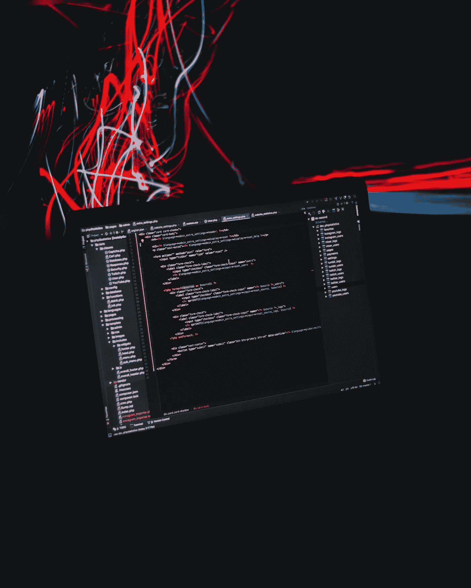
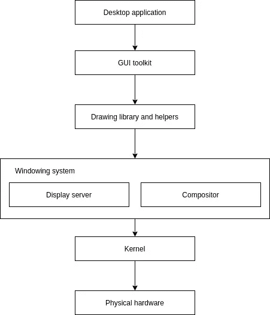

# GUI 应用程序如何在内部工作

> 原文：<https://medium.datadriveninvestor.com/how-gui-applications-work-internally-4a7d1d5de793?source=collection_archive---------11----------------------->

## 也许，你创建了数百个桌面应用程序。有没有想过内件？

Photo by [AltumCode](https://unsplash.com/@altumcode?utm_source=unsplash&utm_medium=referral&utm_content=creditCopyText) on [Unsplash](https://unsplash.com/s/photos/programming?utm_source=unsplash&utm_medium=referral&utm_content=creditCopyText).

如今，桌面应用程序开发很简单。之前，我们写了很多代码来创建每个标准的 GUI 元素，比如按钮、复选框、单选按钮、列表框等等。此后，在 GUI 设计工具的帮助下，我们无需编写一行代码就能制作桌面应用程序的图形部分。现在，我们可以通过使用 web 开发技能，使用混合应用程序开发框架来构建更时尚的桌面应用程序。

假设您正在使用 Visual Studio 或 Netbeans 等现代 IDE 开发桌面应用程序。当然，我们只知道我们正在使用一些用特定语言编写的 GUI 库。例如，如果您正在使用 Visual Studio，您已经知道有底层。基于. NET 的图形用户界面库模块。让我们按照从上到下的顺序来检查此后会发生什么，通常不考虑操作系统的类型。

# 小部件工具包

这是 GUI 应用程序开发人员可用的最顶层 API。一个通用的 GUI 工具包提供了各种各样的标准 UI 元素，比如按钮、列表框、复选框、单选按钮等。每个标准 GUI 组件都有可定制的属性来调整可见的特性，还有事件来处理用户交互。小部件 API 可以提供一组布局来处理每个图形元素的定位。例如，GTK 小部件工具包有盒子、网格、堆栈、固定等容器。

大多数现代 GUI 工具包都是作为跨平台库扩展的:GTK、TK、Qt 等。然而，也有特定于平台的工具包实现:Windows API、Windows Forms 和 Cocoa。一些 GUI 工具包带有设计工具，可以自动生成与 UI 相关的源代码。例如，Qt Designer 软件会自动为 Qt UI 工具包生成源代码。

# 绘图库和助手

每个标准 GUI 元素都有不同的视图和行为。因此，它们的实现是不同的。然而，每个组件最终都会在屏幕上呈现一些形状和文本。每个元素都是用不同的形状构成的，就像化学化合物是由分子组成的一样。图形用户界面工具包在内部使用图形库来构建标准的图形用户界面元素。

这些图形库能够在屏幕上绘制各种形状和文本。操作系统中的通用图形库通常在窗口结构内绘制元素。因此，输出目标被设置为当前操作系统的默认显示服务器。例如，Linux 平台上的 X.org 服务器。这些输出将使用显示服务器的客户端库实例(如 Xlib)发送。此外，还有一些用于国际化、加载资源和可访问性的助手模块。

 [## 技术成瘾-是真的吗？数据驱动的投资者

### 通知铃声响起。你很想检查一下。你拿起手机检查了一下。“哇...再来一个喜欢的…

www.datadriveninvestor.com](https://www.datadriveninvestor.com/2020/12/16/technology-addiction-is-it-real/) 

# 显示服务器和合成器

显示服务器负责协调客户机请求和操作系统内核。如果它从客户端收到关于图形元素的数据，它将使用合成器将这些图形转换成可以通过内核呈现的图像。另一方面，如果用户通过鼠标或键盘等输入设备进行操作时发生了事件，它将通过内核捕获该事件。此后，事件将被发送到相关的客户端。最后，GUI 工具包将为接收到的事件触发编程的动作。

每个流行操作系统的显示服务器列表:

*   X11 窗口系统上的 Linux—X.org 服务器。
*   macOS —石英合成器
*   Windows —桌面窗口管理器(DWM)

几乎所有操作系统都可以同时运行多个应用程序。因此，每个应用程序模块都被分成一个独立的部分，称为窗口。显示服务器与管理每个应用程序窗口的窗口管理器密切合作。此外，一些操作系统如 macOS 和 Windows 将合成器和显示服务器合并成一个窗口系统。但是 Unix 和类 Unix 系统有两个独立的模块，分别用于显示服务器和合成器。

# 物理硬件

显示服务器将与内核通信，内核在设备驱动程序的帮助下直接与物理硬件一起工作。例如，X.org 服务器将使用 DRM 和 KMS 内核模块向实际硬件发送显示数据。另一方面，evdev(事件设备)内核模块将从输入设备向 X.org 服务器发送事件。

# 摘要

电脑就像洋葱。如果我们剥离一次，就会有另一层被剥离。同样，从桌面应用程序到物理硬件，反之亦然，都有几个抽象层。整个呼叫流程可以通过下图来描述。

How a GUI application is rendered, the diagram was created by the author.

## 访问专家视图— [订阅 DDI 英特尔](https://datadriveninvestor.com/ddi-intel)