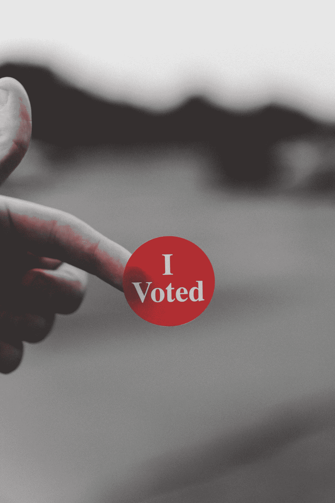

# 根据数学，我是如何意外地投票给特朗普的

> 原文：<https://medium.datadriveninvestor.com/how-i-accidentally-voted-for-trump-according-to-the-data-e30af10506c3?source=collection_archive---------9----------------------->

你如何从我的错误中吸取教训，并将学到的经验应用到你的日常个人和工作生活中。

Photo by [Parker Johnson](https://unsplash.com/@pkripperprivate?utm_source=medium&utm_medium=referral) on [Unsplash](https://unsplash.com?utm_source=medium&utm_medium=referral)

注意:这篇文章的目标不是说服你倾向于任何政治派别，而是我如何得出我的投票结论，更重要的是，我的结论是如何错误的。

> “世界上没有什么比真正的无知和认真的愚蠢更危险的了”——马丁·路德·金博士。

基恩博士的话让我更加难过。😢

# **年轻不再**

2016 年是我告诉自己要更认真对待政治的一年。不再是一个无知的婴儿。奥巴马总统的日子即将结束，是时候让我掌握控制权，明白我的选择是什么，它们代表什么。

初选结束后，有两个候选人。唐纳德·特朗普和希拉里·克林顿，我认为他们都是彻头彻尾的灾难。在初选期间，我观看和聆听了两党的辩论，只有一位候选人真正引起了我的共鸣，因为他看起来真的像一个真实的人，那就是伯尼·桑德斯。👴

自 20 世纪 60 年代初以来，桑德斯一直在为少数族裔的权利而斗争。我恳求你了解他在芝加哥大学[静坐](https://en.wikipedia.org/wiki/University_of_Chicago_sit-ins)中的努力。

 [## 保护主义、政治和经济动荡|数据驱动的投资者

### 美国股市昨日出现 400 多点的大幅反转，为未来的事情发出了警告信号。市场…

www.datadriveninvestor.com](https://www.datadriveninvestor.com/2018/06/28/protectionism-politics-economic-turmoil/) 

但是，这篇文章不是关于伯尼的成就。我只想说，伯尼已经赢得了我的心。以至于我甚至从哥伦布开车到匹兹堡加入了一群伯尼的支持者，并试图让当地人登记投票。

选民登记见鬼去吧，伯尼输掉了民主党初选，这让我有两个选择。至少我是这样认为的…

# 无关的选择

即使在克林顿赢得民主党初选后，我也在寻找支持伯尼和他的事业的方法。我很快发现我可以写在选票上，一个人不需要**在选票上**来为他们投票。

我下定决心，在选举日，我会写下我对伯尼的投票，并保持我对这个我认为会成为国家好领导人的人的忠诚。这就是为什么这是愚蠢的，这都是由于一种叫做*的不相关选择*。

不相关的选择是迄今为止最不受欢迎的选择。

举个例子:假设你走进一家商店，看到两件你喜欢的衬衫，一件是由知名品牌的优质材料制成的，价值 50 美元(衬衫 A)，另一件是由不太知名品牌的普通材料制成的，价值 25 美元(衬衫 B)。你的选择受几个个人变量的影响，所以你最终可能会选择其中的一个。如果随机抽取一部分人(50%对价格敏感，50%对品牌敏感)去实体店做同样的选择，我们很可能会平分。

我们来看看能否毁掉这次分裂。我们还要加上第三种选择，一件价格 75 美元的知名品牌的优质衬衫(衬衫 C)。衬衫 A 比 C 好，因为它更便宜。衬衫 B 比 C 好，因为它便宜得多。衬衫 C 很像 A，只是 A 更便宜。这会让人们更仔细地比较 A 和 C，选择 A 而不是 B。A、B 和 C 之间的分割现在可能分别如下所示:60/30/10。

有趣的是，当我们得到一个明显更差的第三个选项时，我们会把它和最相似的第一个选项进行比较。

那么，这和 2016 年大选有什么关系呢？相当一部分事实上。我们有一个不相关的替代者，名叫加里·约翰逊。在很多摇摆州，特朗普足以让选民将他和特朗普进行比较，从而让选票偏向特朗普。约翰逊和特朗普跟其他人一样都是疯子。如果你不相信我，看看这个片段:

Man, do I love me some sweet Stephen Colbert

尽管约翰逊在许多州以自由党人或独立党人的身份参选，但众所周知他是新墨西哥州州长，而他也是共和党候选人。

很多选民不喜欢在特朗普和克林顿之间做出选择，但在约翰逊看来，第三种选择，特朗普作为更具统治力和领导力的共和党人似乎是更好的选择，有可能让他以微弱优势赢得许多摇摆州的支持。你可以看到很多状态在这里是多么的接近。在这些州中，你会发现约翰逊在很多州都落后于第三名。

那么，我对伯尼·桑德斯的投票是如何帮助唐纳德·特朗普的呢？**我成了不相干替代方案的大本营。**每个摇摆州的选票如此接近时，不相干替代方案的影响要大得多。我支持一项事业，它将导致一位我永远不会想要的总统的胜利。根本不投票可能更好，因为我不会对不相关的备选方案作出贡献。事实上，桑德斯甚至都不在选票上，所以我本想投赞成票，但却把它浪费在了支持两位保守派人士的比较上。我没有支持一个能够真正参与竞争的政党，而是支持一个帮助把选票从一个阵营抽到另一个阵营的政党。

伯尼·桑德斯似乎已经明白了这个事实。[2016 年正式为希拉里背书](https://www.cnn.com/2016/07/11/politics/hillary-clinton-bernie-sanders/index.html)。我认为这个事实是对失败的承认，而不是逃避未来灾难的呐喊。💣

# 我们学到了什么？

抛开政治不谈，我从这次经历中获得了什么？实际上，我把我学到的东西应用到了我个人和职业生活的很多地方。以下是一些例子，告诉你如何利用我真诚的无知为自己赢得未来:

1.  这就是为什么 [A/B 测试](https://www.optimizely.com/optimization-glossary/ab-testing/)不叫 A/B/C 测试的原因。你比较你认为的两个最佳选择。如果有第三种选择，你只在最初的 A/B 测试后才考虑它。
2.  当雇佣一个职位的候选人时，试着通过删除你可能用来比较候选人的无关信息来消除偏见。如果两个候选人去了哈佛，另一个去了普林斯顿，你可以排除教育因素，而不是倾向于比较两个哈佛毕业生。
3.  在做出任何选择之前，确保你不仅了解如何做出选择的机制，还了解围绕它的心理和社会影响。这将有助于你在不明显的时候做出最好的选择。

最重要的是，我鼓励你们所有人不断了解这个世界和你们周围的人。如果集体智慧要求我们作为一个群体而不是个人做出更好的选择，那么不言而喻，如果我们每个人都进一步提高我们的智力，我们作为一个集体只会做出更好的决定。为了证明这一点，我在下面做了一个简单的两个问题的调查，我邀请你参加。我将在二月底作为文章更新分享结果。

要了解更多关于不相关的选择和其他易于理解的数学概念，我推荐阅读乔丹·艾伦伯格的书。(*不是附属链接，我只是真的很喜欢这本书*)

 [## 乔丹·埃伦伯格

### 企鹅出版社 2014 年 5 月 29 日出版我们在学校里学到的数学看起来像是一套枯燥的规则，制定…

www.jordanellenberg.com](https://www.jordanellenberg.com/how-not-to-be-wrong/) 

## 快乐学习！📚