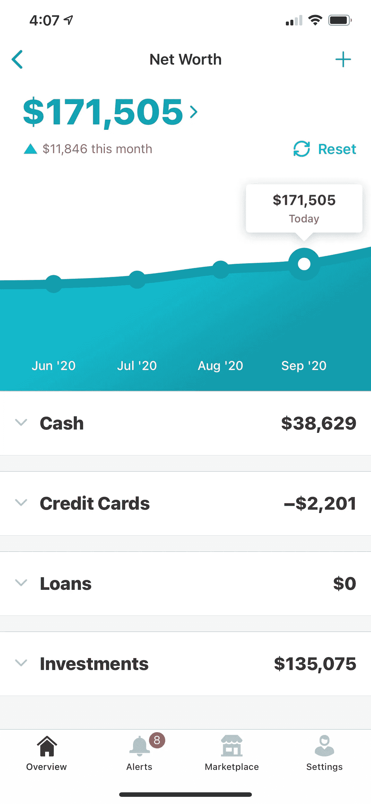
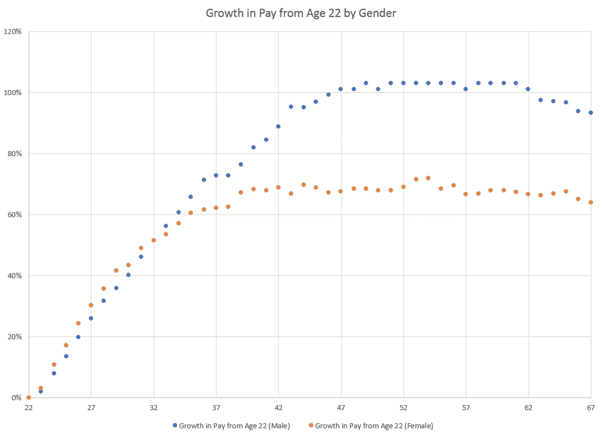

# 我如何在 23 岁时积累了 17 万美元的净资产

> 原文：<https://medium.datadriveninvestor.com/how-i-built-170k-net-worth-at-age-23-25205558909b?source=collection_archive---------5----------------------->

Photo by [Austin Distel](https://unsplash.com/@austindistel?utm_source=medium&utm_medium=referral) on [Unsplash](https://unsplash.com?utm_source=medium&utm_medium=referral)

一个 23 岁的人的平均净资产是-33，984 美元。是的…那是一个负数。然而，由于学生贷款，应届毕业生的净资产为负并不令人惊讶。

那么，在平均 23 岁的人净资产为负的情况下，我是怎么走到这一步的呢？

不，我没有副业。我没有多种收入来源。我不是每天都吃米饭和豆子，我仍然可以去旅游和有自己的爱好。

以下是我做的事情。

## 职业发展还是副业？

这不是秘密。建立净资产最有效的方法是赚很多钱。

多种收入来源肯定是被推荐的，但是首先最大化你的主要收入来源更重要。

在大学毕业前，我试图通过建立一份强大的简历和磨练面试技巧来做到这一点。

我尽我所能去填补简历中可怕的空白。我加入了相关的俱乐部，担任相关课程的导师，最重要的是为暑期安排实习。

带着行业经验毕业让我与大多数同龄人不同。

我大学一毕业就找到了一份高薪工作，年薪约为 13.5 万美元。该收入包括基本工资、股票期权和奖金。

 [## 如何在不牺牲孩子或财务的情况下安全理智地离婚|数据驱动…

### 在美国，七月是以孩子为中心的离婚月。作为 cdfaⓡ的专业人士，我可以向你保证，从长远来看…

www.datadriveninvestor.com](https://www.datadriveninvestor.com/2020/07/28/how-to-divorce-safely-and-sanely-without-sacrificing-your-children-or-your-finances/) 

总之，这是我唯一的收入来源，也将是我未来几年的重点。

我可以花一些时间在副业上，但是经过一些——不可否认是粗糙的——研究和计算，这可能不值得。

从 PayScale 的数据来看，工资增长在你 20 多岁时增长最快，在你 30 多岁时开始趋于平稳。

假设我遵循同样的轨迹，我可以预计我的工资在未来四年内将增加 33，000 美元左右。我不确定我是否有足够的能力开始一个副业，在同样的时间内带来同样多的收入。

当然，技术上来说我可以两者兼得。但是，我不想因为另一次时间浪费而危及我的职业发展。

当我觉得自己的职业生涯已经“达到极限”的时候，也许我会考虑做一个副业。

## 尽早投资，并(主要)负责任地投资

如上所述，我在毕业前有过多次实习，赚了一大笔钱。当我毕业时，我通过实习和其他工作攒下了大约 3 万美元。

我做的第一件事就是买我不需要的垃圾。

我做的第二件事是开投资账户，把剩下的钱投资出去。

我开了一个罗斯个人退休帐户，每年都把它提至最大。我的罗斯个人退休帐户投资于目标日期基金。

大学毕业找到工作后，我得到了一个 401k 账户，我也把它取出来，并投资了一只目标日期基金。

当然，我也开了一个 Robinhood 账户，因为那是现在最酷的东西。在我的罗宾汉账户中，我有健康的股息股票、成长型股票和冲动型 YOLO 期权。

随着复合增长和持续贡献，我的投资账户目前价值约 135，000 美元。

## 出生彩票

我这个年纪的人，因为助学贷款，大部分都是负净值。这自然会削弱他们的净资产。此外，每月付款阻碍了他们增加收入的能力。

我有幸毕业时没有学生贷款。

奖学金和赢得出生彩票的结合让这一切成为可能。我靠奖学金上了大学，但离全额奖学金还差得很远。我的父母在经济上足够稳定，能够承担差额并支持我读完大学。

没有每月的债务还款让我的预算有了很大的喘息空间。这是让我有爱好，旅游，经常在外面吃饭的原因。

在所有费用之后，我仍然可以轻松地最大化我的罗斯个人退休帐户和 401k。它也允许我转一些钱到我的罗宾汉帐户。

我知道大多数人都不够幸运，毕业时没有学生贷款。为此，我将永远感谢我的特权，感激我的父母。

# 外卖食品

我认为这里最重要的是不要用迪克衡量净资产。

当你浏览[盲人](https://www.teamblind.com/)网站，看到 22 岁的年轻人拥有 30 万美元的净资产时，你很容易自我感觉不好。

这些类型的人——包括我在内——很可能在出生时就已经领先了。我的父母为我提供了正确的资源，让我选择一条好的职业道路，毕业时不再负债。

我的教养，而不是我的才能，让我实现了我的净资产。

## 获得专家观点— [订阅 DDI 英特尔](https://datadriveninvestor.com/ddi-intel)