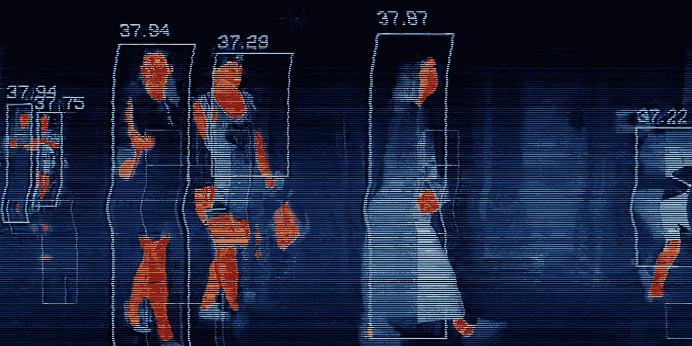
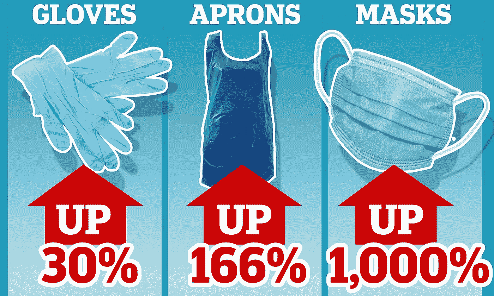
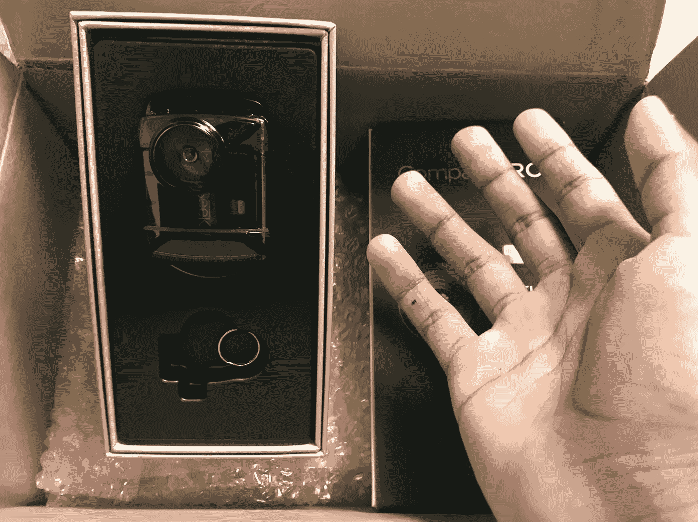
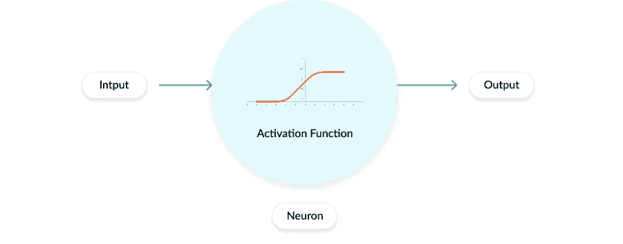

# 我如何使用 CNN 建立一个新冠肺炎热检测系统

> 原文：<https://medium.datadriveninvestor.com/how-i-built-a-covid-19-fever-detection-system-using-cnns-cf9463721796?source=collection_archive---------3----------------------->

亲爱的你，

好吧，新冠肺炎疫情爆发已经四个多月了，看起来情况终于开始好转了。每个人都开始了解病毒是如何传播的，练习社交距离，洗一次手——这次不要忘记肥皂。我敢说，“曲线”看起来就像是**变平了。**

而且，全世界都加入到预防冠状病毒传播的单一焦点中来，这绝对是件了不起的事情。毕竟，这是当前最紧迫的问题。但是，那里**可能只是地平线下更可怕的东西。**

调查显示，在 ***之间，77——89%的人已经自我隔离****【1】。作为一个社会，我们仍然可以做得更好，但是想象一下，当人们看到疫情正在失去它曾经拥有的指数增长，以及基本上每个人都在等待机会走出去过他们的**“正常”生活时，这个统计数字会下降得多快。***

*如果发生这种情况，事情看起来不会太好。假设这种病毒不是季节性的(但愿如此)，即使我们开发了有效的疫苗，如果我们不继续合作直到它被完全根除，这种疾病也可能持续下去，而且每个人都很重要。*

**

*We’ve really blown up the PPE industry — just look at those markups*

*我们在口罩、手套和眼镜上花了这么多钱，使得个人防护装备市场的价值暴涨。但现在，我们应该为第二波浪潮做准备，这一次，我们将不得不在监控方面投入比以往更多的资金，像新冠肺炎应用**这样简单的东西是不够的。**我们需要一个更大更好的系统，同时还要简单易用。*

*监控病毒；然而，实际上**比你想象的要简单得多。**为了在没有测试的情况下监测任何疾病，你需要跟踪它特有的症状。对于新冠肺炎来说，这通常是一种狂热[3]，人们一直试图用几乎所有可以想象的方式来追踪他们——从无人机到激光枪，以及介于两者之间的一切[4]。但是，这些方法中没有一个是可以获得的或者便宜的。*

*这就是为什么我决定建立一种廉价、可行的方法来检测发烧，让人们和机构在新冠肺炎期间保持安全。下面是我如何设法做到的。*

# *(相当简单的)硬件方面*

*如果我们要检测发烧，那么我们必须能够检测热量，因为这就是发烧的本质——体温
**37°C 或更高，**，我们最好的办法是通过一个叫做热成像的过程。*

*你很可能在新冠肺炎第一次出现之前就听说过它，那是因为它非常有用，而且有着极其广泛的应用。通过热成像，我们正试图检测红外波发射。这是一个长期的过程，但它基本上意味着我们试图定位几乎只在物体受热时产生的高能光粒子的浓度。*

*不幸的是，即使这整个系统应该是相对便宜的，但仍然很难获得能够满足项目的可负担性和可访问性要求的热感相机。幸运的是，我找到了一家名为 Seek Thermal 的公司，该公司生产的热感相机价格适中，可以挂在你的手机上，精确度与真相机差不多。*

*因此，我最终抓住机会，问公司是否愿意向我提供他们的 Seek 紧凑型相机，以便我可以开发这个项目，他们慷慨地接受了。一周后，我从加州圣巴巴拉收到一批货，里面有两台最先进的移动热感相机:*

**

*Me marveling at the awesome thermal imaging hardware I just received*

***** *快速声明:我没有得到 Seek 的赞助——他们非常好心地选择将这些相机运过来，但我要提到的关于 Seek 的一切都是我对它们的真实看法******

*无论如何，剩下的过程很简单——拆箱(我最喜欢的部分),把相机插到你手机的充电端口，然后设置应用程序——就这样。如果你手边有相机，请随意尝试应用程序上的所有功能，并按照本教程**进行操作！***

*现在，开始令人兴奋的事情——建立一个模型！*

# *建立我的第一个(有用的)CNN*

*你没看错。这不是一个将对 MNIST 数字进行分类的模型——我们已经从那个模型升级到解决更大的问题。你准备好了吗？*

*那么，让我们开始吧！*

*但是在我们建立模型之前，我们需要一个数据集。不过不要担心，你可以借用我在这里收集的一个，也可以访问最终的模型:*

* [## 发烧-谷歌驱动

### 一个冷的热图像分类数据集

drive.google.com](https://drive.google.com/drive/folders/1xFf2rEWbSEWO_0dCK08bAV5QW6hm0YyG?usp=sharing)  [## 谷歌联合实验室

### 编辑描述

colab.research.google.com](https://colab.research.google.com/drive/1MEMELWdDOT6EP51sOnrJ7jDJ0HjP1bRj) 

我通过拍摄健康人(包括我)以及发烧的人(不一定是新冠肺炎阳性)的热胶片来收集这个数据集。然后，我将这总共七分钟的镜头分割成 1745 帧。jpg 图片——697 帧发烧视频，1048 帧健康视频。但是，在我链接的数据集中，我已经为你做了。

现在，继续开发卷积神经网络(CNN ),最终将对我们的热镜头进行分类。对于那些不知道 CNN 是什么的人，让我给你一个**速成班:**

> CNN 允许你拍摄一幅图像，将它转换成一个数字数组，然后将它的值相乘得到一个最终的类(例如，0 代表健康，1 代表发烧)。随着时间的推移，CNN 会调整数组所乘以的这些值，以最小化一些预定义的损失(不准确性)并最大化准确性。

嗯，希望这能消除一些疑问，因为我们将直接进入**编码 CNN 的本质。对于本教程，我将在 Google Colab 环境中使用 Python，你可以在这里查看最终项目。因为我使用了 Google Colab，所以我也使用了他们的“挂载 Google Drive”功能，你可以从你的驱动器中访问文件。**

我强烈推荐对 Colab 使用它，但是只要你知道它的文件路径，你就成功了。无论如何，要开始整个模型开发过程，我们需要导入我们的**依赖项:**

我们通过了第一步，将转换后的图像的像素值附加(附加)到一个**空白数据数组**上，我们将把它输入 CNN。在这个项目中，这是通过创建**两个“for loops”**来实现的——每个 for loops 都包含我们数据集中“Healthy”和“Fever”文件夹的内容:

更详细地说，我们正在创建两个空白数组(x_data 和 y_data ),它们最终将成为我们的数据集和类。然后我们将**遍历目录中的每个 jpg 文件，**用一个名为 Pillow 的图像操作库调整它们的大小。最后，我们将把这些图像的像素值(RGB)转换成一个数组，将其附加到 **x_data，**并将数据的类附加到 **y_data。**

当谈到追加类时，我的意思是创建一个数组，数组中的项数与你的类数相同，初始化**1 表示该类为真，**或 **0 表示该类为假。**这个模型分析了两个类别——“发烧”和“健康”，因此我们在类别数组中有两个项目。

另一方面，如果你试图从 0 到 9 对数字图像进行分类，那么你需要 10 个数字。我们这样做是为了让我们的类数组是模型可以读取的格式，这被称为 **one-hot 编码。**

在这个模型中，我使用了**([' health '，' Fever])的格式，**意味着' Fever '类的内容将被分配一个([0，1])，而' health '类将与([1，0])类成对出现。一旦完成，我们可以通过打印出我们已经初始化了“Fever”类来做一些系统检查。现在我们完成了，我们可以重复“健康”的循环:

同样，这与我们对“发烧”目录运行的前一个循环是相同的过程——我实际上是 CTRL+C，CTRL+V'd 它！但是请记住，在运行这个新的“for 循环”之前，需要更改目录位置，需要将类数组**转换为([1，0])、**，并且需要使用之前安装的 **Numpy 库**将 x_data 和 y_data 变量转换为数组。

如果你一直坚持到现在，那么给自己一个鼓励吧！你已经开发了一个成熟的热量分类系统。让我们继续创建我们的**模型的架构！**

我知道在整篇文章中我已经说过很多次了，但是对于这一部分，我强烈建议您使用**来处理**中的数字——尤其是如果您是初学者的话。这样做有助于你**更好地了解你正在创建的 CNN 发生了什么**——当你试图创建新的 CNN 时，这真的很有价值:

> 在定义 CNN 的架构时，唯一要记住的两件事是了解层放置的典型顺序，以及你正在创建的层的“形状”。

就像你按照意大利面、肉和酱的特定顺序将千层面分层一样，现在，你需要记住的是 CNN 有一个基本的分层顺序，如下所示:

***Conv2D，汇集，…，Conv2D，汇集，展平，密集，…，输出密集***

可以把卷积想象成一组乘数，通过“扫过”我们制作的图像阵列来相乘。可以将池化看作是从“卷积”数据中提取重要特性，以最小化计算能力的使用。你可以**尽可能多地重复这个系列，**然后进入第二个周期。扁平化实质上是将我们的数据转换成下面的密集层可以理解的数组。

密集(全连接)层与 Conv2D 非常相似，它们能够通过将输入值乘以学习值并添加学习偏差来转换输入数据。当您注意到 Dense 没有使用任何**激活函数、**使其无法很好地模拟非线性数据时，以及 Conv2D 如何使用线性过滤器对数据进行**扫描时，唯一的区别就出现了，而 Dense 使用的是保持不变的线性运算/权重:**

> **同样，你可以添加任意多的密集层，但是要确保**完成的层的形状与你有多少个类的形状相同**——因为我们有两个类，那么我们输出的密集层的形状就是两个。**

**最后，确保所有的激活参数都指向“relu”函数——除了输出层，它应该是**“soft max”。激活函数应该用另外一篇文章来解释，但是你可以把 softmax 看作是把我们的输出转换成可读概率的东西****

****

**The structure of a common activation function called “sigmoid”**

**第二条规则是将第一个和最后一个图层的输入形状设置为与数据的形状兼容。只要你这样做了，**你就可以在 CNN 的中间“隐藏层”使用几乎所有其他参数**。因此，翻译成代码后，该模型的体系结构如下所示:**

**在本期节目中，你可能已经注意到了一些你以前从未见过的事情——辍学。为了让事情简单明了，我试着用一句话来解释:我们的数据集被分成训练和验证子集，退出会使我们网络中的某些神经元失活。通过这样做，我们可以防止 CNN 学习过于适合我们训练集的参数，以便我们的模型可以更好地概括数据。当我们的模型被定义时，我们使用方便的 **model.summary()函数**来更好地理解它的结构:**

****

**我们走吧！既然模型已经初始化，我们可以**开始训练它**——我们所要做的就是编译它，通过指定参数，比如模型使用什么算法来纠正它的错误(优化函数)，模型如何测量错误(损失)，以及它如何测量模型的准确性。下面是我们如何做到这一点的一个例子:**

**就是这样！我们已经声明，我们的模型将使用我们之前创建的 **x_data 和 y_data 变量**进行拟合(训练),并且我们的 CNN 将一次使用 32 个图像的批次进行训练，其中 90%的数据用于训练，另外 10%用于测试。让我们运行这段代码，看看 CNN 在我们的数据集上表现如何:**

****

**对于一个用不到 50 行代码构建的模型来说， **96%** 的准确性一点也不差，尤其是考虑到我们几乎没有任何过度拟合，因为我们的模型在训练和验证数据集中达到了**类似的准确性**。这表明我们的模型在概括数据方面做得很好，足以在验证时保持其准确性。惊人的工作，有线电视新闻网！**

**在我结束之前，我想感谢所有一路上帮助过我的人。感谢 **Seek** 慷慨地将他们的硬件运送到地球的另一边，这样我就可以开发这个项目，也感谢我的人工智能爱好者/天才朋友 **Vansh Sethi，**他刚好是《走向数据科学》的作者！没有你我不可能走到这一步。**

**当然，这只是开始！这个模型有如此大的潜力，特别是有助于防止新冠肺炎病毒的未来传播，但在此之前，还需要做很多工作，比如将其实现到一个应用程序中，并赋予模型实时分类的功能。**

**不管怎样，作为一个社会，我们需要一个更有效的武器库来监控疾病。不仅有助于阻止冠状病毒的传播，也有助于应对我们未来可能面临的任何疫情。发烧检测只是**在监测疾病的更大画面**中的一小部分，希望你看到人工智能、热成像和无数其他新兴技术如何发挥作用来帮助实现这一点:**

> **“底线是疫情将继续发生。世界在不断变化，据我们所知，新冠肺炎可能不是世界末日。我们必须考虑的唯一问题是，我们是否为它们做好了准备。”**

***感谢阅读，并保持安全，***

**阿尔扬。**

# **参考资料:**

**[1] Kirzinger，a .，Hamel，l .，muana，c .，Kearney，a .，& Brodie，M. (2020 年 4 月 24 日)。KFF 健康跟踪民意调查——2020 年 4 月下旬:冠状病毒、社会距离和接触追踪——方法论。**

**[2] Technavio。(2020 年 5 月 8 日)。新冠肺炎影响和恢复分析。检索自[https://www.businesswire.com/news/home/
20200508005519/en/新冠肺炎-影响-恢复-分析-个人防护设备](https://www.businesswire.com/news/home/20200508005519/en/COVID-19-Impact-Recovery-Analysis-Personal-Protective-Equipment)**

**[3]加拿大公共卫生局。(2020 年 4 月 24 日)。加拿大政府。检索自[https://www . Canada . ca/en/public-health/services/diseases/2019-novel-coronavirus-infection/symptomics . html](https://www.canada.ca/en/public-health/services/diseases/2019-novel-coronavirus-infection/symptoms.html)**

**[4]多梅尔，L. (2020 年 3 月 26 日)。能够探测发烧的疫情无人驾驶飞机将会飞向天空。检索自[https://www . digital trends . com/cool-tech/Dragan fly-无人机-探测-新冠肺炎/](https://www.digitaltrends.com/cool-tech/draganfly-drones-detecting-covid-19/)**

# **图像制作者名单:**

**https://www.g4s.com/en-rs/content-pages/fever-screening**

**[https://www . daily mail . co . uk/news/article-8175049/Firms-ramp-prices-coronavirus-PPE-gear-1-000 . html](https://www.dailymail.co.uk/news/article-8175049/Firms-ramp-prices-coronavirus-PPE-gear-1-000.html)**

**[https://missing link . ai/guides/convolutionary-neural-networks/convolutionary-neural-network-tutorial-basic-advanced/](https://missinglink.ai/guides/convolutional-neural-networks/convolutional-neural-network-tutorial-basic-advanced/)**

**[https://missing link . ai/guides/neural-network-concepts/7-types-neural-network-activation-functions-right/](https://missinglink.ai/guides/neural-network-concepts/7-types-neural-network-activation-functions-right/)***