# 我如何为我的一个 ML 项目构建前端

> 原文：<https://medium.datadriveninvestor.com/how-i-built-a-front-end-for-one-of-my-ml-projects-19396c07b821?source=collection_archive---------3----------------------->

## 可行吗？是的。优雅且 Python 友好？绝对的。简单得可笑？我不这么认为。

不久前，我还在做一个推荐系统项目。这是一项具有挑战性的任务，但我喜欢挑战，所以我决定不仅要让我的项目从数学的角度来看令人印象深刻，还要让我的推荐系统对用户友好。我需要一个前端。

由于我对软件工程师使用的所有这些令人印象深刻的编程语言没有任何经验，我需要一些对 Python 更友好的语言，而不是试图在不到一周的时间内掌握 Javascript。我看过一些指导人们在 React 上构建应用程序的出版物，但对于一个有抱负的数据科学家来说，在短时间内学习它似乎太复杂了。在花了一些时间研究这个话题后，我决定用[破折号](https://dash.plotly.com/)来构建我的应用程序。

## 引擎盖下是什么

在我开始讨论构建 Dash 应用程序的实际过程之前，让我花一点时间来谈一谈幕后是什么。目标是创建一个护肤推荐系统。就像网飞和 Spotify 向用户推荐电影和音乐一样，销售化妆品的公司也可以向客户推荐护肤品。旁注:我没有使用任何关于化妆的信息，因为还有很多需要考虑的。如果护肤品可以通过化学成分来判断，那么化妆品也有颜色属性。这是一个完全不同的故事。

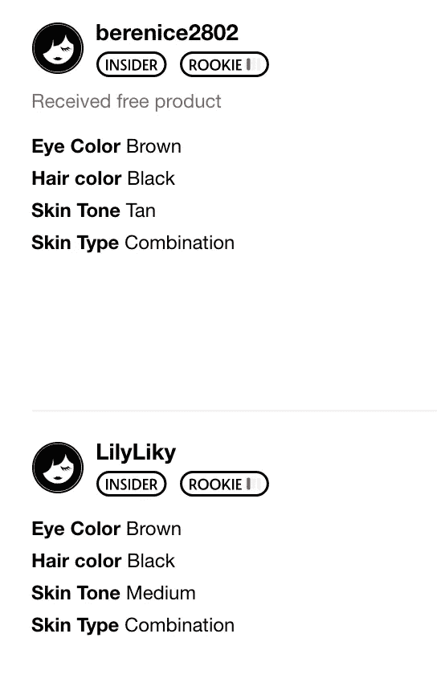

我刮到了 Sephora.com 的 T2，获得了 17000 条用户评论和 1400 种护肤品的评价。除了一些常规信息，如用户评级、用户名、产品的平均评级和成分列表，我还获得了一些我称之为用户特征信息的东西:他们的皮肤类型、肤色、头发颜色、眼睛颜色。我已经使用这些信息建立了一个基准推荐器，它将这些特征作为输入，搜索具有相似外貌的人，并给出这些客户的顶级产品列表。

我的第二个推荐者使用了基于内容的方法。它会计算护肤品化学成分的相似度，并给出与你输入的化学成分最相似的护肤品名称。例如，如果您正在寻找更便宜的替代品，这将非常方便！

第三个推荐器使用协同过滤方法。我在做的时候考虑到了市场部可能的需求。该系统需要一个唯一的用户 id 号，并给出他们可能喜欢的产品列表。

## 我想从应用程序中得到什么

除了背景上一些漂亮的图片之外，我需要连接三样东西来协同工作:用户输入(交互性)、我的实际模型(预先训练和腌制)以及输出。

总而言之，我只需要创建六个下拉菜单(四个用于第一个推荐者，另外两个各一个)，让人们选择他们的功能或他们喜欢的产品或用户 id，指定这个输入到哪个模型，并给出由该模型计算的输出。

此外，对于第一个推荐者，我希望输出是一个表:带有超链接的产品名称，这样用户可以直接进入 Sephora 的网站，从推荐列表中购买一些东西，以及该产品的平均评级。第二个也应该提供成分表。

## 不那么明显的细节

你可能已经猜到了，我已经成功地构建了应用程序！现在我想分享一下我是怎么做到的。首先，不要被那些鼓舞人心的断言所迷惑，Dash 让构建 web 应用程序变得简单得可笑，即使对于那些没有编程经验的人来说也是如此！’。这不是真的。可行吗？是的。优雅且 Python 友好？绝对的。简单得可笑？我不这么认为。

首先要记住的是(笑我吧，但我并不清楚)，你的应用程序是你电脑上的一个**文件夹**！这个应用程序需要**知道的一切**都是一个 **app.py** 文件，你可以使用任何你通常使用的文本编辑器编写，我使用的是 **Atom** 。不，你不能为此使用 Jupyter 笔记本，我知道我们都喜欢 Jupyter，但这次不行。app 所有的东西**都要用**，比如图片、泡妞等。必须在**相同的**文件夹中。

你需要知道的第二件事是如何**打开你的应用**。如果你出于任何原因不想部署它(如果你想，请转到 [Heroku](https://dashboard.heroku.com/apps) )，这里是你如何看做什么:打开终端，cd 到你的应用程序目录(cd my_app)，一旦你在那里，使用 **python app.py** 命令启动应用程序。终端将思考一秒钟，然后，如果一切正常，它将显示以下内容:

复制 [http://127.0.0.1:8050/](http://127.0.0.1:8050/) 并粘贴到您的浏览器中。找到了，你的应用！

## 该应用程序

让我们看看 app.py 文件，它必须包含应用程序需要知道的一切。首先，您导入它需要使用的所有工具，就像您通常在开始一个项目时所做的那样。前三个——dash、dcc 和 html——将广泛用于构建应用程序。然后我们需要阅读。csv 文件，并将它赋给 df 变量——从现在开始它将引用这个变量。

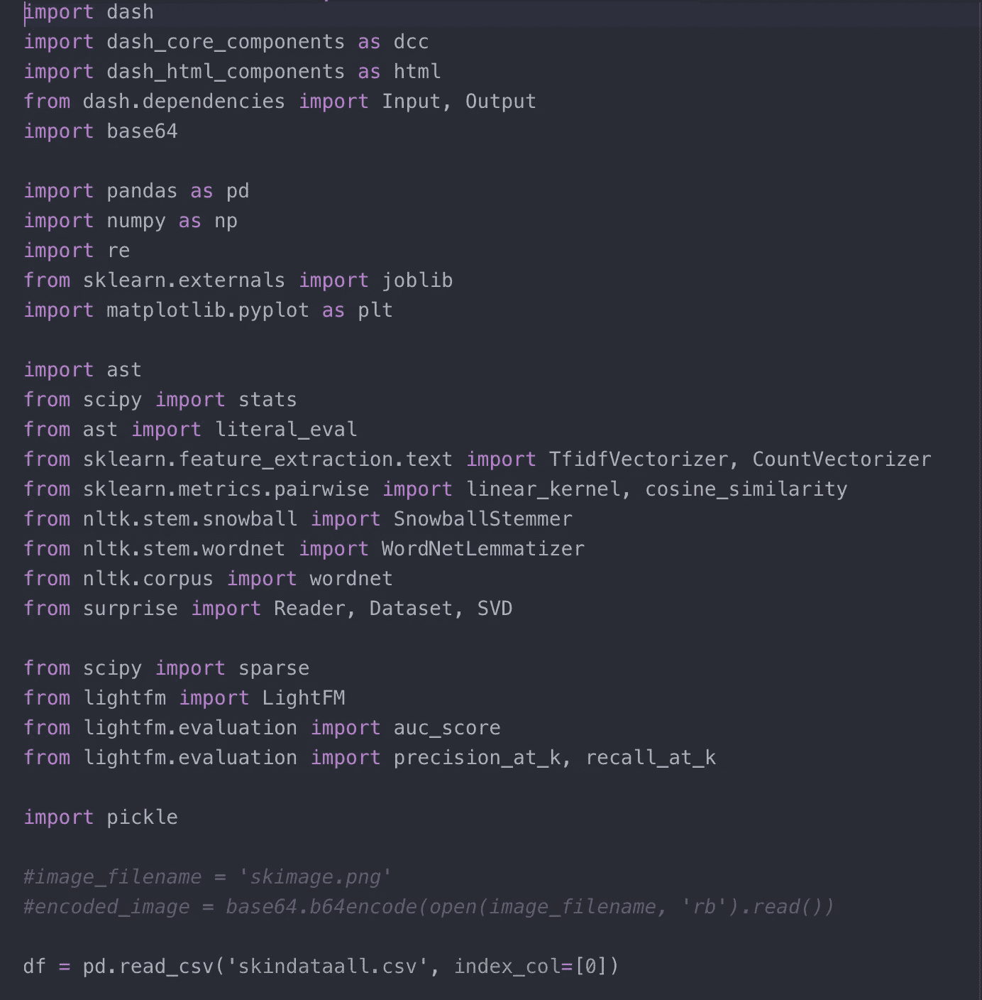

你需要知道的下一点信息是这个应用程序(这个。py 文件)大致可以分为**两部分**:app**长什么样**和它**做什么**。这个 **app.layout** 位代码负责**看起来如何**。它正下方的那个， **@app.callback** 负责它**做**的事情。

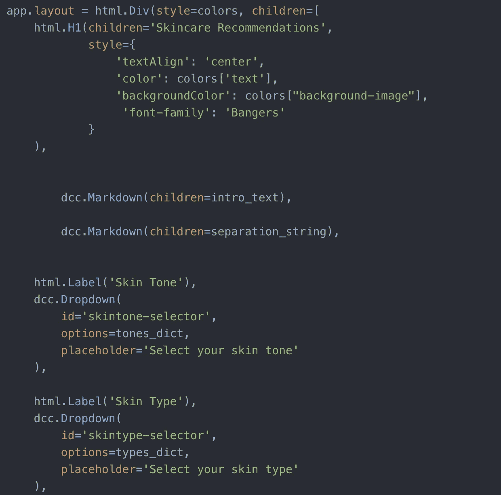

What it looks like

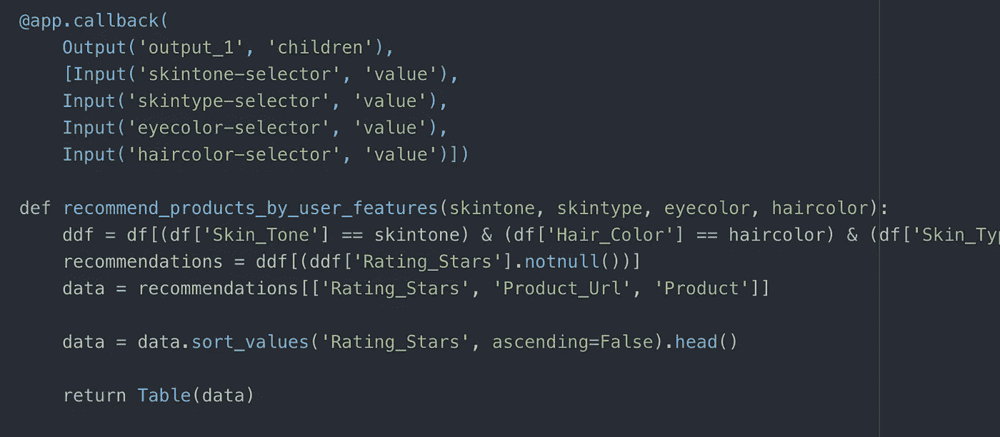

What it does

另一个重要的细节:Dash 不会返回一个 **pandas dataframe** 作为输出，它必须被转换！我从 Dash [文档页面](https://dashr.plotly.com/)中获取了以下函数(在我构建这个应用程序时，它对我帮助很大，我强烈推荐它)。它将数据框转换成一种 Dash 友好的格式。

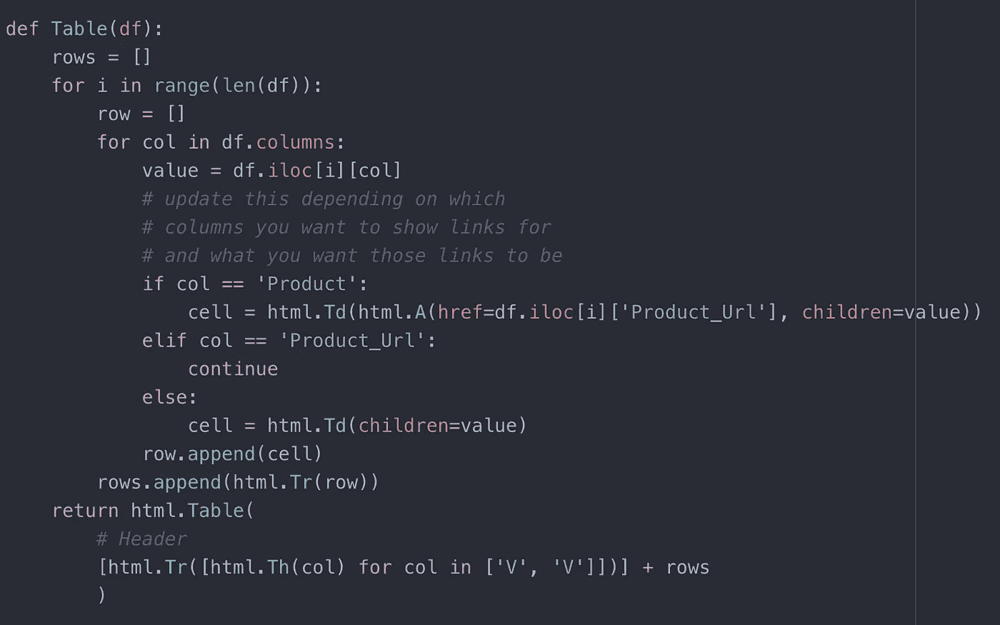

另一个有趣的观察:当你创建下拉菜单时，输入必须是特定的格式，一个字典列表！以下代码创建了这个列表:

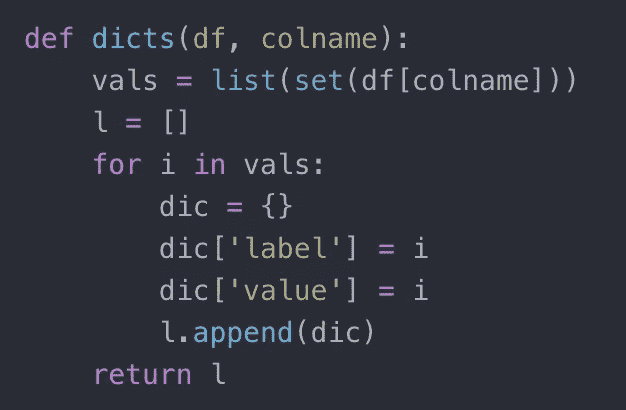

函数的输出可以通过以下方式分配给变量:

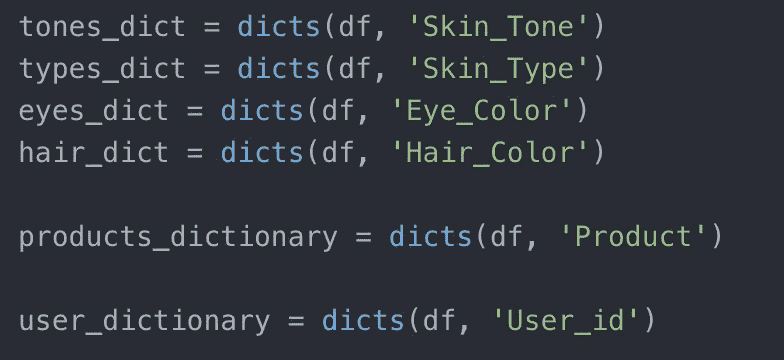

所以后来，当我们在 **app.layout** 位代码中指定应用布局时(记住，这是应用**看起来的样子**，我们可以引用那个变量。

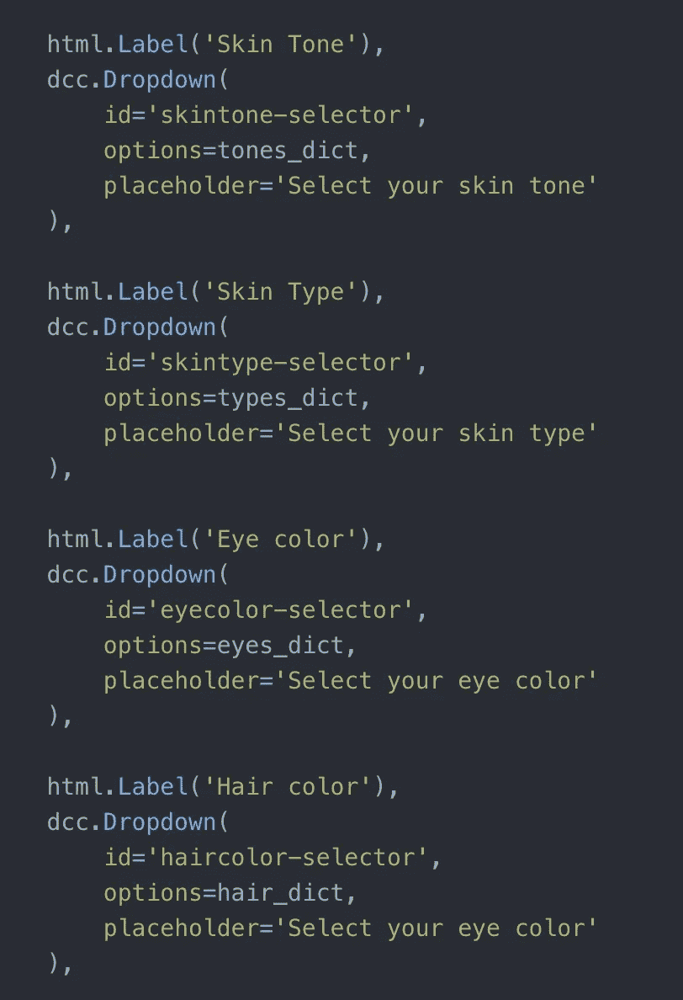

其余的函数只是您的模型用来进行计算的普通 python 函数。

最后，下面两行允许您实时编辑您的应用程序。每次您进行更改并刷新包含您的应用程序的页面时，都会显示这些更改。

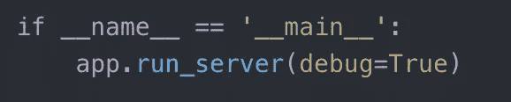

## 结果

看看我得到了什么！

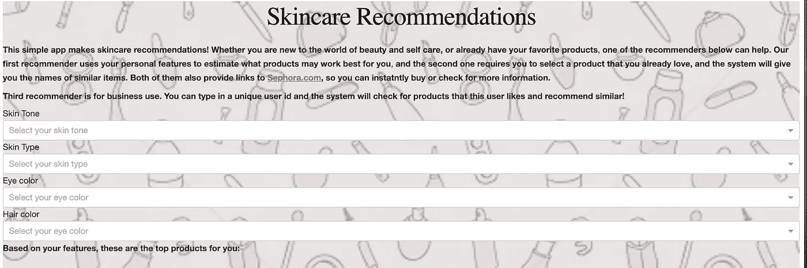

First recommender with placeholders

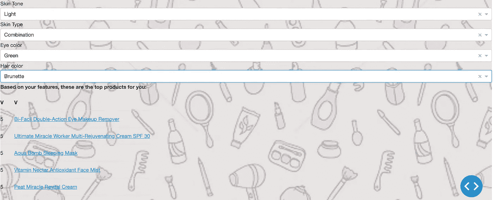

First recommender with output

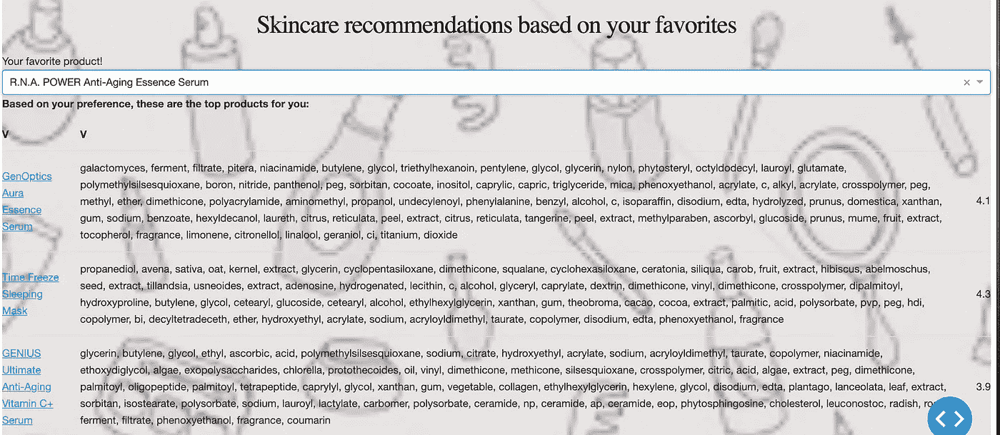

Content-based recommender

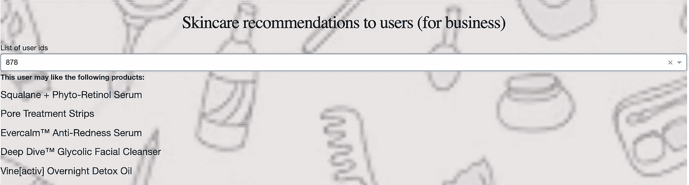

Recommendations to users

随意复制[我的回购](https://github.com/agorina91/final_project)，阅读 [Dash 文档](https://dash.plotly.com/)，并使用应用程序！