# 我如何建立一个神经网络，用 Robinhood 的免费行为、基本面和技术数据来预测股票价格

> 原文：<https://medium.datadriveninvestor.com/how-i-built-a-neural-network-to-predict-stock-prices-with-free-behavioral-fundamental-and-d64ab03db3d?source=collection_archive---------3----------------------->

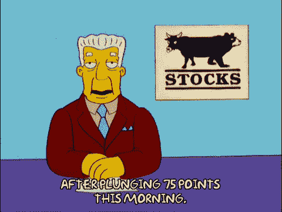

在这疯狂的一年开始时，我决定回到活跃的交易中。作为一名黑天鹅信徒，我以前接受过被动投资，并选择将我的认知能量投入到看似不那么混乱的领域。

然而这一次(不是我第一次尝试这样做)。我决定探索市场波动的行为方面。我看到了基本面和市值之间的明显脱钩，罗宾汉投资者的出现进一步混淆了长期以来被摒弃的理性行为者的概念。

当我探索公开可用的 Fintech APIs 时，我甚至购买了像 Intrinio 上的宏观经济事件 API 这样的廉价 API(下图为每月 5 美元)。我决定只使用来自我实际经纪公司的免费数据……罗宾汉(是的，我是那些无可救药的非理性投资者之一，因此有这个动机)。

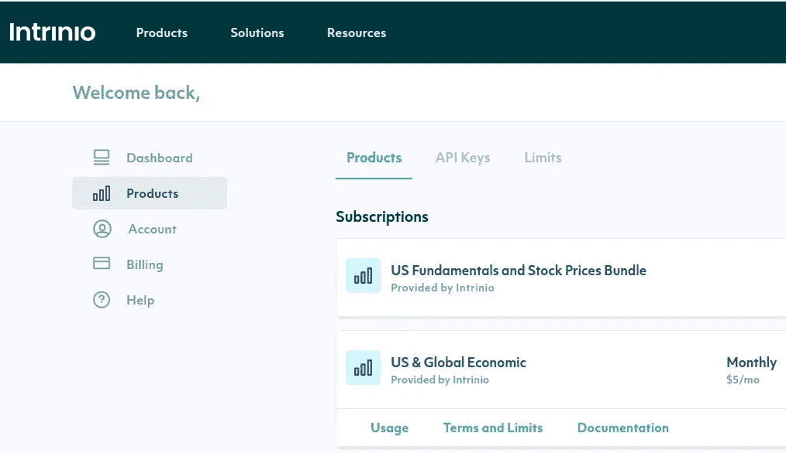

Intrinio has a great collection of reasonably priced financial APIs

此外，我只使用开源库和公开可用的 SaaS 产品，后者都附带(或以前附带)了大量的免费层:

*   [robin-stocks](http://www.robin-stocks.com/) —用于与 Robinhood API 交互
*   AWS 理解—用于情感分析和主题提取
*   diff bot——用于人工智能支持的文章和元数据提取

因为缺乏包括我所寻求的广泛行为数据的历史数据集。我知道我唯一的选择是建造它，这注定要花一点时间。以下是对数据集以及我如何收集它的描述。

# 数据和数据库结构

我用 4 个表保持了简单的数据库结构(在 SQLAlchemy 中用 4 个类表示):

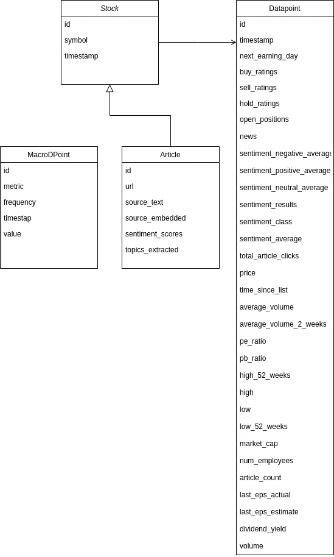

收集的数据可分为 4 类:

1.  行为的
2.  基本要素
3.  技术的
4.  宏观经济

以下分类将集中在前 3 个类别(因为宏观经济数据主要是从 Intrinio 收集的，而不是具体的股票)。我还列出了用于检索每个指标的函数和步骤摘要。

# 行为数据

*   **为 Robinhood 用户开立股票头寸。**通过下面的 get popularity 方法获得([robin hood API 不再返回这个指标](https://fortune.com/2020/08/10/robinhood-popularity-data-robintrack-stock-market-trading-tracker/))。

`self.robin.sdk.stocks.get_popularity(symbol)`

*   **可用于库存的商品数量。** *假设:*对一只股票感兴趣程度的信号。

`self.robin.sdk.stocks.get_news(symbol`)

*   **关于一只股票的文章被点击的总次数**(从用于拉文章的同一个调用中提取)。*假设:*对一只股票感兴趣程度的信号。

`self.robin.sdk.stocks.get_news(symbol)`

*   **当日某股票消息的平均情绪** *。*这一步包括几个步骤:

1.  使用 get_news()获取当天某只股票的所有文章

2.循环遍历每篇文章，并使用 Diffbot 提取其文本。如果达到 Diffbot 自由层限制，我将默认使用 Robinhood 返回的文章摘要:

`[api.diffbot.com/v3/article](http://api.diffbot.com/v3/article)`

3.使用 Amazon understand 处理文本或摘要

4.发布每只股票的过程和平均结果，并将情绪和 NLP 分析数据保存在数据库中

*   **每天对每只股票的分析师评级(买入、卖出和持有评级的计数)**。*假设:*专业分析师对股票前景的集体共识。

`self.robin.get_ratings(symbol)['summary']`

*   **股票上市以来的时间——秒**。*假设:*允许模型学习任何与时间和可用性偏差相关的模式(例如:新品牌或首次公开募股比旧品牌表现更好)

`r.get_instruments_by_symbols(symbol)`

*   **到下一个收益日的时间——以秒为单位**

`r.stocks.get_earnings(symbol, info=None)`

# 收益和基本面

大多数被跟踪的基本面由`self.robin.get_fundamentals(symbol)`返回，它们包括:

*   股息收益率
*   市值
*   员工总数
*   市盈率
*   铅比率
*   每股收益估计
*   上次实际每股收益
*   上次每股收益估计

当前和最近的估计和实际每股收益可以通过以下方式获得:

`r.stocks.get_earnings(symbol, info=None)`

# 技术数据

我使用的大多数技术数据都是通过以下函数获得的:

`r.stocks.get_earnings(symbol, info=None)`

*   当前价格
*   历史最低点
*   空前的高
*   52 周高点
*   52 周低点
*   第 2 周
*   第 52 周

# **简单用户界面**

我使用 Retool(一个创建内部应用程序的流行平台)为我的数据库创建了一个简单的 UI。UI 允许我查看和排序在特定日期收集的针对特定股票的指标。我可以运行一个查询来查看在某一天负面情绪最高的股票。

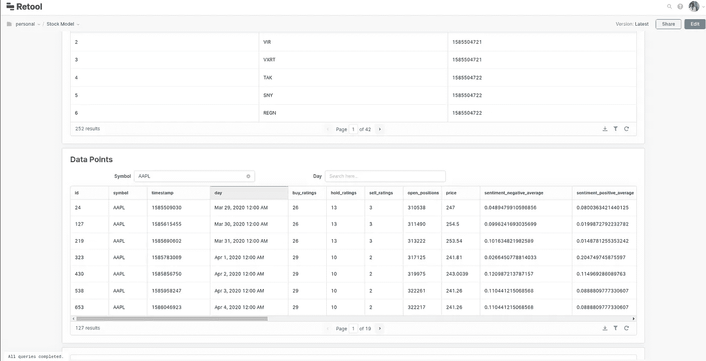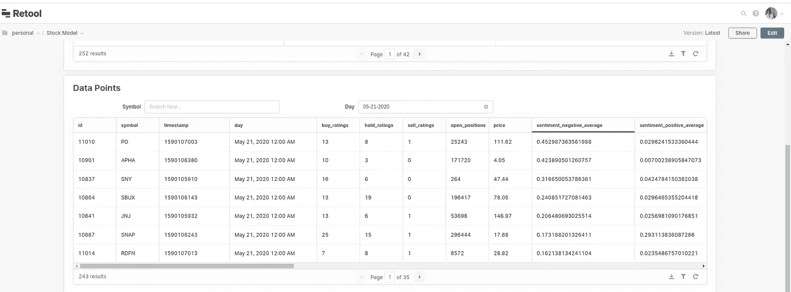

# 工作流程(汇总)

我的流由一系列每日 CRON 作业组成，这些作业在每个交易日的延长交易时间结束时自动触发。这个过程始于从 Robinhood 中提取我所追踪的股票，并将其与我的数据库同步。然后，它收集上面详述的所有指标，包括提取文章和分析情感。它最终将所有提取的信息存储在我的数据库中。

以下是该过程的步骤和组成部分的摘要:

*   数据收集服务器:一个简单的 AWS Lightsail 实例就足够了
*   **DB:** 类似地，我在 AWS Lightsail 上创建了一个 Postgres DB 实例
*   **股票世界:**在 Robinhood 上创建了一个列表来存放我的股票世界。我每天都给它添加股票，直到我达到 250 只股票。
*   **自动化&过程:**这些包括保持我的数据库与我的 Robinhood 列表同步的脚本，在每个交易日为我的世界收集所需数据的过程，分析和后处理数据的程序，以及执行持续学习和自动化实验的程序。
*   **UI:** 一个简单的 UI，允许我浏览收集的数据并轻松导出。

当我今年早些时候从事这个项目时，robin-stocks 库无法从 Robinhood 中提取新的列表(这需要对库进行简单的添加):

```
def get_list_by_id(self, lid):
        url = "https://api.robinhood.com/midlands/lists/items/?list_id=%s" % lid
        data = self.sdk.helper.request_get(url)
        print(len(data['results']))
        return data
```

除了几个小问题，这个过程自今年 3 月以来的每个交易日都在忠实运行。

# 制定学习问题

从纯卷积到递归，从单点到序列预测。有无数种方法来阐明学习问题。另一个架构决策是为整个宇宙创建一个模型，为每个行业创建一个带有子模型的集合，还是为每个股票创建一个模型。我后来的实验证明，创建一个模型的辅助学习，和一个系综的共识力量几乎总是胜过后者(为每只股票创建一个模型)。对于这个例子，为了简单起见，我将向你展示如何为每只股票训练一个循环模型，一个 GRU(门控循环单元)。

在这个例子中，我将学习问题公式化为 5x23 到 P 的 n+1。您使用一个 5 天的序列，每个包含 23 个变量(总共 115 个点)，来预测一个值(第二天收盘时的价格)。本例的输入数据包括买入、持有和卖出评级。股票的未平仓头寸和成交量。价格以及今年和未来 52 周的最高价和最低价。积极、消极和中性情绪得分。市盈率和股息率。市值、上市以来的时间、下一次盈利前的时间、上一次每股收益估计值和上一次实际每股收益。

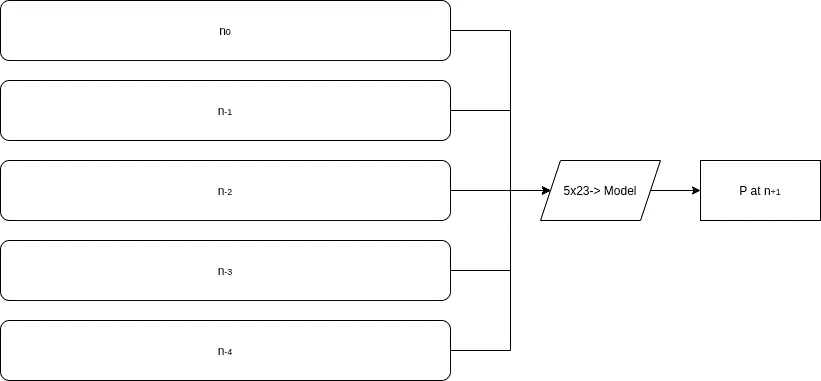

Input sequence (5x23) to predict a single point (P at n+1)

## 数据预处理

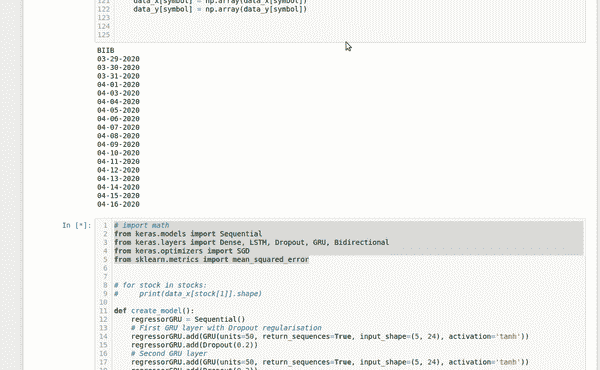

Constructing the training sequences by walking forward and looking back

该过程简单地一天一天地往前走，每天回头看看是否存在形成序列的 **n** 个点，当满足条件时，该序列被添加到数据集。

通过将每个指标除以其数据库最大值，得到一个介于 0 和 1 之间的值，从而对每个指标进行标准化。下面的示例图片还显示了向每个序列添加一个变换的股票符号，这是创建一个模型的最简单方法之一，该模型为每个类学习不同的模式。

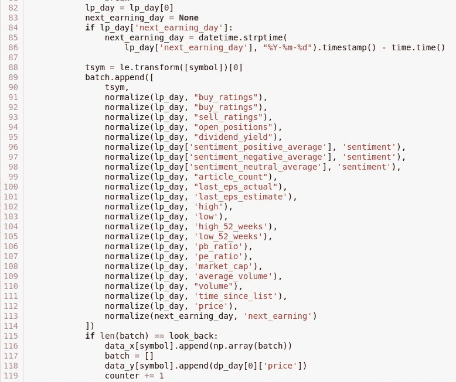

normalizing data and including the transformed symbol in the input

# 模特培训

模型代码极其简单(下图)，每层都由相同数量的节点组成。使用平均绝对误差损失。尽管是 PyTorch 的狂热爱好者。我在这个例子中使用 Keras 和 TF 只是因为它的流行和它的直接 RNN 实现。我选择的建筑是一个门控循环单元(GRU)。GRU 是相对较新的 RNN 架构，是神经网络的子集，非常适合处理基于时间和序列的数据。

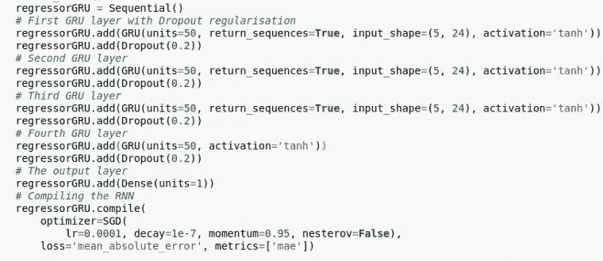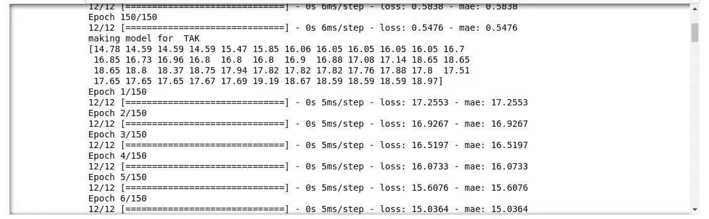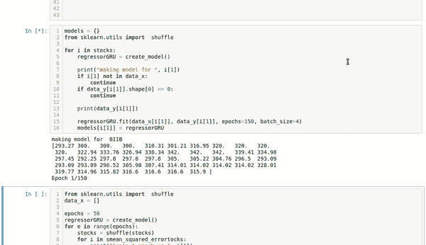

**呼唤你的模特**

一旦你的模特完成训练。你可以简单地通过构造一个相同格式的序列来调用它们，预测明天的价格。

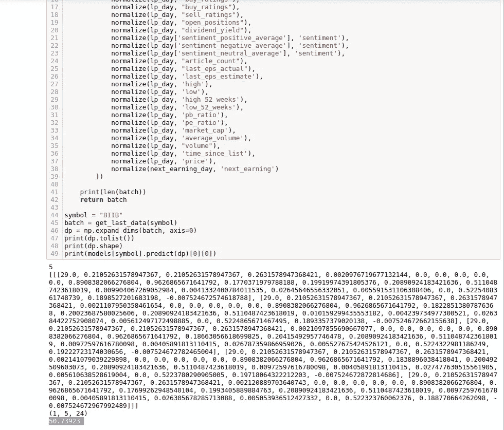

# 接下来呢？

在以后的文章中，我将描述我是如何制定学习问题来帮助我有效地交易短期期权的。我将重点介绍最成功的实验和达到的错误率，你可以构建学习问题的几种方法，以及我为每种方法推荐的模型设计。

# 你如何改善这一点？

尝试您可以添加的任何数据。监控 Twilio 和 Snowflake 等专注于开发人员的公司的公共 Github 数据。增加秘密市场或监控商品价格，以检测*逃向安全*信号或原材料成本波动。

内扎雷·查夫尼

CTO @ Trueface.ai

 [## 内扎雷·查夫尼

### 企业家、软件工程师和狂热的制造者。

chafni.com](https://chafni.com)