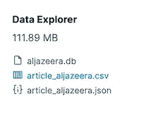

# 我如何收集超过 5000 篇文章的阿拉伯语数据集？

> 原文：<https://medium.datadriveninvestor.com/how-i-collected-an-arabic-dataset-of-more-than-5000-articles-7f5de65e8ca2?source=collection_archive---------18----------------------->

Screenshot from kaggle.com

自然语言处理(NLP)是研究最多的机器学习领域之一。近年来已经取得了很大的进展，这使得该领域在几个领域中进入大规模使用。如今，NLP 广泛应用于社交网络、搜索引擎、翻译工具、聊天助手和许多其他情况。

然而，不同语言的进度和结果是不同的。大多数机器学习模型优先处理英语，而放弃其他语言，特别是阿拉伯语。造成这种情况的主要原因是缺乏数据集。因此，我将在本文中介绍的所有数据集都很有趣。因此，我创建了一个数据集，收集了来自半岛电视台网站的+5000 篇阿拉伯语新闻文章。

该数据集可在 Kaggle 上通过以下链接获得:[https://www . ka ggle . com/arhouati/Arabic-news-articles-from-al jazeeranet](https://www.kaggle.com/arhouati/arabic-news-articles-from-aljazeeranet)

首先，我需要定义从每篇文章中提取哪些信息。经过简单的分析，我决定收集以下信息:

*   出版日期
*   标题
*   描述
*   环
*   内容
*   图像
*   参考
*   标签

这是一个来自半岛电视台的网页的例子，有各种各样的信息。

Taged screenshot from Aljazeera.net website

在下一节中，我将一步一步地详细介绍我是如何创建数据集的。

# 1.获取 URL

获取所有文章 URL 的一种可能性是应用网络爬虫技术。但是，我决定使用一个更简单的方法，通过 RSS 提要。这种方法很容易实现，但有一些主要的不便之处。首先，我们将只获得较新的文章，其次，我们的脚本必须运行很长时间才能获得更多的数据。

因此，我创建了一个 python 类来获取文章:

这个类使用两个主要库:

*   “urllib.request.urlopen”以获取 RSS 源的内容
*   “xmltodict”解析 RSS 提要并获取项目

# 2.数据收集

除了文章的 URL 之外，RSS 提要还提供了更多的信息，如发表日期、标题、描述和链接。为了收集其余的信息，我们需要从 URL 中检索页面，并浏览 HTML 代码以准确提取缺失的信息。为此，我们使用了最强大的 python 库进行 HTML 解析:“BeautifulSoup”。

BeautifulSoup 有一个非常好的方法叫做“选择”。这种方法使得使用 CSS 选择获取任何 HTML 标签成为可能，这对于任何 web 开发人员来说都是非常自然的。然而，对目标 HTML 的任何更新，例如，添加新的 CSS 类或更改旧类的名称，都会误导元素的选择

因此，我们实现了下面的类:
-调用 RSS Feed 类从 Aljazeera RSS Feed 中获取条目
-对于每个条目，获取 HTML 页面，解析它并检索缺失的信息。

# 3.数据清理

虽然数据是可用的并且结构良好，因为它来自严格认可的新闻网站，但是仍然有必要应用包括以下任务的清理步骤:删除空格、删除拉丁字符，并且特别要确保它确实是阿拉伯语。

这是用于清理数据的类，也可从以下位置获得:

# 结论

为了获得超过 5000 篇文章，我在 GCP 环境下运行了 5 个月的脚本。数据集有三种格式:CSV、Json 和*。SQLite 数据库的 db。

我希望这个数据集能帮助你探索更多关于阿拉伯语的机器学习和 NLP 模型。在 Kaggle 上可以通过以下链接获得:[https://www . ka ggle . com/arhouati/Arabic-news-articles-from-al jazeeranet](https://www.kaggle.com/arhouati/arabic-news-articles-from-aljazeeranet)

对于下一步，我将在以后的文章中解释我如何使用这个数据集来实现和训练一个应用于阿拉伯文本的摘要模型。